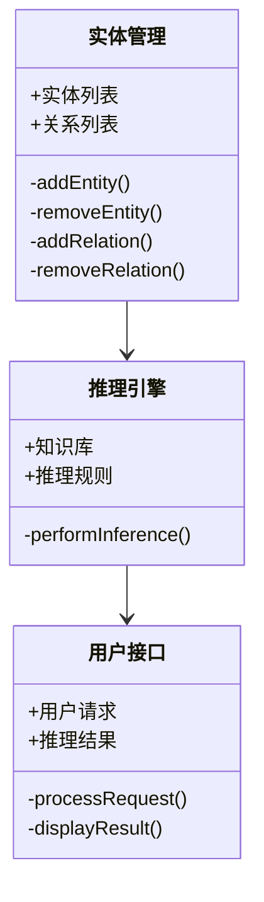
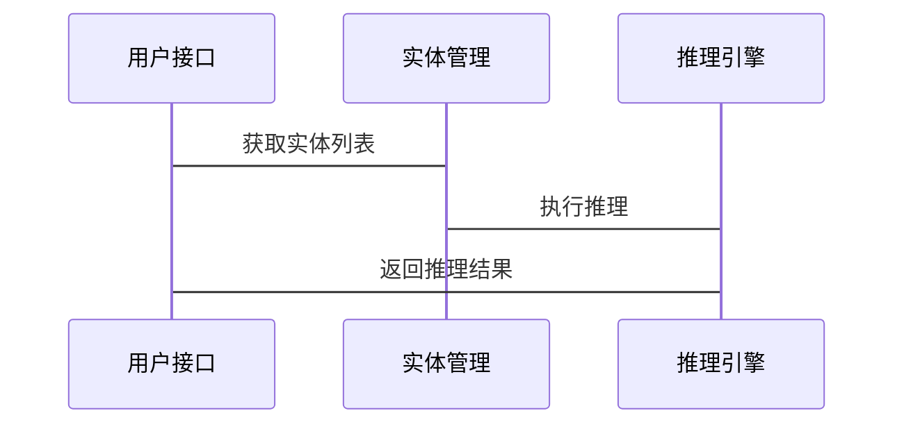

                 


# 基于知识图谱的AI Agent推理系统

## 关键词：
- 知识图谱
- AI Agent
- 推理系统
- 系统架构
- 项目实战

## 摘要：
本文将详细介绍基于知识图谱的AI Agent推理系统的构建与应用。首先，我们将介绍知识图谱和AI Agent的基本概念，并探讨它们的结合方式。接着，我们将深入分析知识图谱的构建与表示方法，以及AI Agent的推理机制。然后，我们将通过实际案例展示如何利用知识图谱增强AI Agent的推理能力，并详细讲解系统的架构设计与实现。最后，我们将总结本文的主要内容，并展望未来的发展方向。

---

# 第1章: 知识图谱与AI Agent概述

## 1.1 知识图谱的基本概念

### 1.1.1 知识图谱的定义
知识图谱是一种以图结构形式表示知识的语义网络，由实体和关系组成，能够描述现实世界中的概念及其关系。


### 1.1.2 知识图谱的构建过程
知识图谱的构建过程包括数据收集与预处理、实体识别与抽取、关系抽取与构建等步骤。

### 1.1.3 知识图谱的表示方法
知识图谱的表示方法有多种，包括符号逻辑表示、向量空间表示和表示学习等。

## 1.2 AI Agent的基本概念

### 1.2.1 AI Agent的定义
AI Agent是一种能够感知环境、自主决策并执行任务的智能体。

### 1.2.2 AI Agent的核心功能
AI Agent的核心功能包括感知、推理、决策和执行。

### 1.2.3 AI Agent的分类与应用场景
AI Agent可以分为简单反射型、基于模型型、目标驱动型和实用驱动型。应用场景包括智能助手、推荐系统、自动驾驶等。

## 1.3 知识图谱与AI Agent的结合

### 1.3.1 知识图谱在AI Agent中的作用
知识图谱为AI Agent提供了丰富的背景知识，帮助其进行推理和决策。

### 1.3.2 AI Agent如何利用知识图谱进行推理
AI Agent通过在知识图谱中进行图遍历、规则推理等方法，利用知识图谱中的实体和关系进行推理。

### 1.3.3 知识图谱与AI Agent结合的优势
知识图谱与AI Agent结合可以提升推理的准确性和效率，增强系统的智能性。

## 1.4 本章小结
本章介绍了知识图谱和AI Agent的基本概念，并探讨了它们的结合方式及其优势。

---

# 第2章: 知识图谱的构建与表示

## 2.1 知识图谱的构建流程

### 2.1.1 数据收集与预处理
数据来源包括结构化数据、非结构化数据和半结构化数据。预处理步骤包括数据清洗、数据归一化等。

### 2.1.2 实体识别与抽取
实体识别是通过自然语言处理技术从文本中提取实体，例如人名、地名等。

### 2.1.3 关系抽取与构建
关系抽取是通过模式匹配或学习模型从文本中抽取关系，并构建知识图谱的边。

## 2.2 知识图谱的表示方法

### 2.2.1 基于符号逻辑的表示方法
符号逻辑表示通过谓词逻辑描述知识，例如“人(x) ∧ 喜欢(x, y) → 喜欢(y, x)”。

### 2.2.2 基于向量空间的表示方法
向量空间表示将实体和关系表示为向量，例如Word2Vec或GloVe模型。

### 2.2.3 知识图谱的表示学习
表示学习通过深度学习模型（如TransE、TransH）学习实体和关系的向量表示。

## 2.3 知识图谱的存储与管理

### 2.3.1 知识图谱的存储方式
知识图谱可以存储在关系型数据库、NoSQL数据库或图数据库中。

### 2.3.2 知识图谱的数据库选择
常用的知识图谱数据库包括Neo4j、RDF4J和Blazegraph等。

### 2.3.3 知识图谱的查询与检索
知识图谱的查询语言主要有SPARQL和RDF查询语言。

## 2.4 本章小结
本章详细讲解了知识图谱的构建流程、表示方法和存储管理。

---

# 第3章: AI Agent的推理机制

## 3.1 推理的基本概念

### 3.1.1 推理的定义与分类
推理是基于已有的知识和事实，推导出新的结论的过程。常见的推理类型包括演绎推理、归纳推理和类比推理。

### 3.1.2 推理的逻辑基础
推理的逻辑基础包括命题逻辑和谓词逻辑。

### 3.1.3 推理的数学模型
推理的数学模型可以通过逻辑公式表示，例如命题逻辑中的蕴含关系。

## 3.2 基于知识图谱的推理算法

### 3.2.1 基于规则的推理算法
基于规则的推理算法通过预定义的规则进行推理，例如专家系统中的规则推理。

### 3.2.2 基于图遍历的推理算法
基于图遍历的推理算法通过遍历知识图谱中的节点和边进行推理，例如深度优先搜索和广度优先搜索。

### 3.2.3 基于向量的推理算法
基于向量的推理算法通过向量空间中的运算进行推理，例如向量加法和相似度计算。

## 3.3 推理算法的实现与优化

### 3.3.1 推理算法的实现步骤
推理算法的实现步骤包括知识图谱的构建、推理规则的定义、推理过程的执行和结果的验证。

### 3.3.2 推理算法的优化方法
推理算法的优化方法包括剪枝技术、缓存优化和并行计算等。

### 3.3.3 推理算法的评估指标
推理算法的评估指标包括准确率、召回率、F1值和推理时间等。

## 3.4 本章小结
本章详细讲解了推理的基本概念、基于知识图谱的推理算法及其实现与优化方法。

---

# 第4章: 知识图谱与AI Agent的结合应用

## 4.1 知识图谱在AI Agent中的应用领域

### 4.1.1 智能问答系统
智能问答系统通过知识图谱提供准确的知识回答。

### 4.1.2 推荐系统
推荐系统利用知识图谱中的关联关系进行个性化推荐。

### 4.1.3 自然语言处理
自然语言处理通过知识图谱提供语义理解支持。

## 4.2 AI Agent在知识图谱中的推理案例

### 4.2.1 医疗领域
AI Agent通过医疗知识图谱进行疾病诊断和治疗方案推荐。

### 4.2.2 金融领域
AI Agent通过金融知识图谱进行风险评估和投资决策。

### 4.2.3 教育领域
AI Agent通过教育知识图谱进行个性化学习推荐。

## 4.3 本章小结
本章通过实际案例展示了知识图谱在AI Agent中的应用，并分析了不同领域的具体应用场景。

---

# 第5章: 系统分析与架构设计方案

## 5.1 问题场景介绍
本章将介绍一个基于知识图谱的AI Agent推理系统的实际应用场景，例如智能客服系统。

## 5.2 系统功能设计

### 5.2.1 领域模型设计


### 5.2.2 系统架构设计


### 5.2.3 系统接口设计
系统接口设计包括API接口定义和接口调用流程。

### 5.2.4 系统交互设计


## 5.3 本章小结
本章详细分析了系统的架构设计和功能设计，为后续的实现提供了理论基础。

---

# 第6章: 项目实战——基于知识图谱的AI Agent推理系统实现

## 6.1 环境安装与配置

### 6.1.1 知识图谱数据库的选择与安装
选择Neo4j作为知识图谱数据库，并进行安装和配置。

### 6.1.2 AI Agent框架的选择与配置
选择Rasa框架作为AI Agent的实现框架，并进行安装和配置。

## 6.2 系统核心实现

### 6.2.1 知识图谱的构建与存储
使用Python编写脚本，将数据加载到Neo4j数据库中。

```python
from neo4j import GraphDatabase

def create_entity(tx, entity_name):
    tx.run("CREATE (a:Entity {name: $name})", name=entity_name)

with driver.session() as session:
    session.write_transaction(create_entity, "Person")
```

### 6.2.2 推理算法的实现与优化
实现基于规则的推理算法，并进行性能优化。

```python
def perform_inference(rules, knowledge_base):
    # 实现推理逻辑
    pass
```

### 6.2.3 用户接口的实现
实现用户接口，接收用户输入并返回推理结果。

```python
def process_request(request):
    # 实现请求处理逻辑
    pass
```

## 6.3 项目小结
本章通过具体的项目实战，展示了如何实现基于知识图谱的AI Agent推理系统。

---

# 第7章: 总结与展望

## 7.1 本章总结
总结本文的主要内容，包括知识图谱的构建与表示、AI Agent的推理机制、系统的架构设计和项目实战等。

## 7.2 未来展望
展望未来的发展方向，包括更复杂的推理算法、多模态知识图谱、分布式AI Agent等。

---

# 参考文献

（此处列出相关文献和资源）

---

通过以上目录大纲，我们可以看到《基于知识图谱的AI Agent推理系统》这本书将从理论到实践，全面讲解基于知识图谱的AI Agent推理系统的构建与应用。

