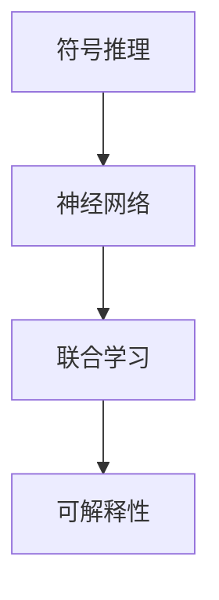
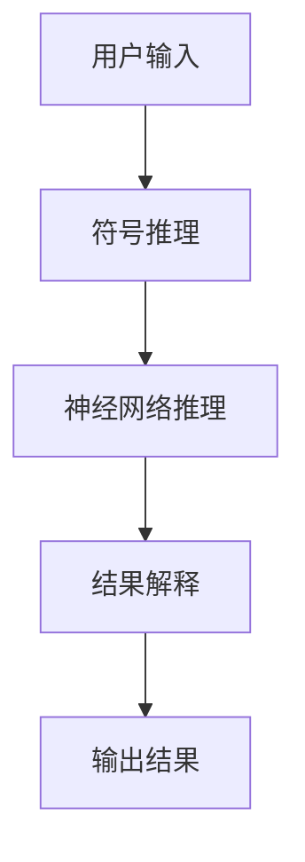
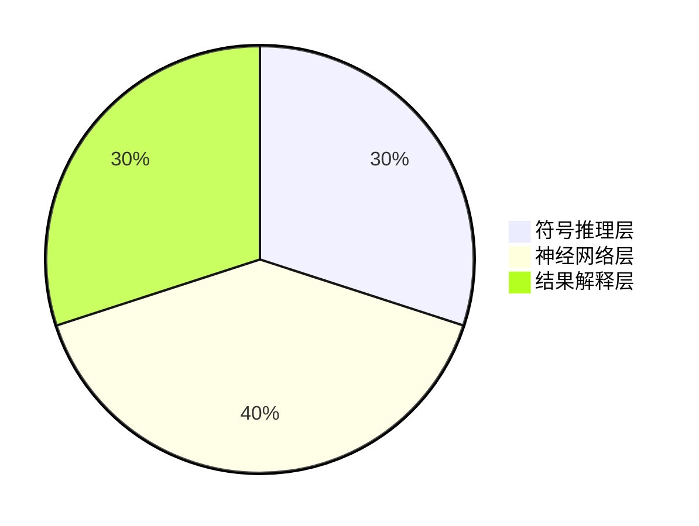

                 


# 基于神经符号AI的可解释Agent设计

## 关键词：神经符号AI、可解释性、人工智能、Agent设计、符号推理、神经网络、混合AI

## 摘要：  
随着人工智能技术的快速发展，可解释性成为AI系统应用中的重要问题。基于神经符号AI的可解释Agent设计通过结合符号推理和神经网络的优势，提供了一种既能处理复杂任务又具备可解释性的解决方案。本文详细探讨了神经符号AI的核心概念、算法原理、系统架构设计以及实际项目实现，旨在为读者提供一个全面的指导。

---

# 目录大纲

1. **基于神经符号AI的可解释Agent设计背景与基础**
   - 1.1 神经符号AI的背景与现状
   - 1.2 可解释性Agent的必要性
   - 1.3 神经符号AI与可解释Agent的关系
   - 1.4 本章小结

2. **神经符号AI的核心概念与原理**
   - 2.1 符号推理与神经网络的结合
   - 2.2 神经符号AI的关键属性对比
   - 2.3 神经符号AI的实体关系图
   - 2.4 本章小结

3. **神经符号AI的算法原理**
   - 3.1 符号增强的神经网络
   - 3.2 神经符号AI的符号推理算法
   - 3.3 神经符号AI的注意力机制
   - 3.4 本章小结

4. **神经符号AI的系统架构设计**
   - 4.1 系统功能设计
   - 4.2 系统架构设计图
   - 4.3 系统接口设计
   - 4.4 本章小结

5. **基于神经符号AI的可解释Agent设计项目实战**
   - 5.1 环境安装与配置
   - 5.2 核心代码实现
   - 5.3 代码解读与分析
   - 5.4 案例分析与结果展示
   - 5.5 本章小结

6. **总结与展望**
   - 6.1 核心内容回顾
   - 6.2 当前挑战与未来方向
   - 6.3 最佳实践与注意事项
   - 6.4 本章小结

---

现在，我将根据上述目录大纲，逐步完成每一章的内容。

---

## 第1章: 神经符号AI的背景与基础

### 1.1 神经符号AI的背景与现状

#### 1.1.1 传统符号AI的局限性
传统符号AI（如专家系统）依赖于明确的规则和逻辑推理，但在处理复杂、动态的现实世界问题时显得力不从心。符号AI难以处理模糊性和不确定性，且难以扩展到大规模数据集。

#### 1.1.2 神经网络的崛起与挑战
神经网络通过大量数据和训练参数，展现出强大的模式识别能力。然而，纯神经网络的“黑箱”特性使其缺乏可解释性，难以满足许多实际应用的需求。

#### 1.1.3 神经符号AI的融合趋势
神经符号AI通过结合符号推理和神经网络的优势，既保留了符号AI的可解释性，又继承了神经网络的强大的学习能力。这种融合成为当前AI研究的热点。

### 1.2 可解释性Agent的必要性

#### 1.2.1 AI系统可解释性的定义
可解释性指AI系统的行为能够被人类理解和验证。这对于医疗、金融等领域的决策支持系统至关重要。

#### 1.2.2 可解释性在实际应用中的重要性
在高风险领域，用户需要了解AI的决策过程，以建立信任并确保系统的可靠性。

#### 1.2.3 当前AI系统可解释性的主要挑战
纯神经网络的“黑箱”特性使得解释决策过程变得困难。如何在复杂系统中保持可解释性是一个关键问题。

### 1.3 神经符号AI与可解释Agent的关系

#### 1.3.1 神经符号AI的基本原理
神经符号AI通过符号规则约束神经网络的输出，使其更具可解释性。

#### 1.3.2 可解释性Agent的核心特点
可解释性Agent通过符号推理和神经网络的结合，提供透明的决策过程。

#### 1.3.3 神经符号AI在可解释Agent中的作用
神经符号AI为可解释Agent提供了技术基础，使其能够在复杂场景中保持透明性和可解释性。

### 1.4 本章小结
本章介绍了神经符号AI的背景、可解释性Agent的必要性以及两者的关系，为后续内容奠定了基础。

---

## 第2章: 神经符号AI的核心概念与原理

### 2.1 符号推理与神经网络的结合

#### 2.1.1 符号推理的基本原理
符号推理基于规则和逻辑，将问题转化为符号表达式，并通过推理规则得出结论。

#### 2.1.2 神经网络的基本原理
神经网络通过多层感知机和非线性激活函数，从数据中学习特征表示。

#### 2.1.3 神经符号AI的融合方式
神经符号AI通过将符号规则嵌入神经网络，实现两者的优势互补。

### 2.2 神经符号AI的关键属性对比

#### 2.2.1 神经符号AI与传统符号AI的对比
| 特性            | 传统符号AI       | 神经符号AI       |
|-----------------|------------------|------------------|
| 可解释性        | 高               | 高               |
| 数据需求        | 低               | 高               |
| 处理能力        | 弱               | 强               |

#### 2.2.2 神经符号AI与纯神经网络的对比
| 特性            | 纯神经网络       | 神经符号AI       |
|-----------------|------------------|------------------|
| 可解释性        | 低               | 高               |
| 模型复杂性       | 高               | 中               |
| 知识表达能力     | 弱               | 强               |

#### 2.2.3 神经符号AI的独特优势
神经符号AI结合了符号推理的可解释性和神经网络的学习能力，能够处理复杂任务并保持透明性。

### 2.3 神经符号AI的实体关系图



### 2.4 本章小结
本章详细探讨了神经符号AI的核心概念和其与传统符号AI及纯神经网络的对比，展示了其独特优势。

---

## 第3章: 神经符号AI的算法原理

### 3.1 符号增强的神经网络

#### 3.1.1 网络结构设计
符号增强的神经网络通过引入符号规则层，约束神经网络的输出。

#### 3.1.2 符号约束的损失函数
符号约束的损失函数通过引入符号规则，平衡神经网络的拟合能力和可解释性。

#### 3.1.3 网络训练与优化
在训练过程中，符号规则被嵌入损失函数，指导神经网络的学习方向。

### 3.2 神经符号AI的符号推理算法

#### 3.2.1 基于符号规则的推理
符号推理算法通过规则库进行逻辑推理，确保决策过程的透明性。

#### 3.2.2 基于神经网络的推理
神经网络通过学习特征表示，进行非线性推理。

#### 3.2.3 神经符号混合推理
混合推理结合了符号规则和神经网络的优势，提高了系统的泛化能力。

### 3.3 神经符号AI的注意力机制

#### 3.3.1 注意力机制的基本原理
注意力机制通过权重分配，关注输入中的关键部分。

#### 3.3.2 符号驱动的注意力
符号驱动的注意力通过符号规则指导注意力分配，增强系统的可解释性。

---

## 第4章: 神经符号AI的系统架构设计

### 4.1 系统功能设计

#### 4.1.1 问题场景介绍
以智能客服系统为例，展示神经符号AI的应用场景。

#### 4.1.2 系统功能模块
- 用户输入处理模块
- 符号推理模块
- 神经网络推理模块
- 结果解释模块

#### 4.1.3 系统功能流程图



### 4.2 系统架构设计图



### 4.3 系统接口设计

#### 4.3.1 接口定义
- 输入接口：用户输入
- 输出接口：解释性输出
- 接口协议：JSON格式

### 4.4 本章小结
本章通过系统架构设计，展示了神经符号AI的实际应用潜力。

---

## 第5章: 项目实战

### 5.1 环境安装与配置

#### 5.1.1 安装Python和相关库
- 安装Python 3.8+
- 安装TensorFlow、Keras、符号推理库

#### 5.1.2 安装依赖
```bash
pip install tensorflow keras symbolai
```

### 5.2 核心代码实现

#### 5.2.1 符号增强的神经网络实现

```python
import tensorflow as tf
from symbolai import SymbolRules

class SymbolEnhancedNN:
    def __init__(self):
        self.model = self.build_model()
        self.rules = SymbolRules()

    def build_model(self):
        inputs = tf.keras.Input(shape=(input_dim,))
        x = tf.keras.layers.Dense(64, activation='relu')(inputs)
        x = self.rules.apply_rules(x)
        outputs = tf.keras.layers.Dense(1, activation='sigmoid')(x)
        model = tf.keras.Model(inputs=inputs, outputs=outputs)
        return model
```

#### 5.2.2 符号推理模块实现

```python
class SymbolRules:
    def apply_rules(self, inputs):
        # 示例规则：输入必须大于0.5
        return tf.where(inputs > 0.5, inputs, 0.0)
```

### 5.3 代码解读与分析

#### 5.3.1 代码功能
- SymbolEnhancedNN类：结合符号规则和神经网络
- SymbolRules类：实现符号约束

#### 5.3.2 代码优势
- 保持了神经网络的学习能力
- 通过符号规则提高了可解释性

### 5.4 案例分析与结果展示

#### 5.4.1 实际案例
以用户查询处理为例，展示系统的输入、符号推理、神经网络推理和最终输出。

#### 5.4.2 结果展示
```plaintext
输入：用户问题
符号推理：问题分类
神经网络推理：生成回答
输出：解释性回答
```

### 5.5 本章小结
本章通过实际项目，展示了神经符号AI在可解释Agent设计中的应用。

---

## 第6章: 总结与展望

### 6.1 核心内容回顾
本文详细探讨了神经符号AI的核心概念、算法原理和系统设计，并通过项目实战展示了其应用潜力。

### 6.2 当前挑战与未来方向
- 当前挑战：符号规则的设计和优化
- 未来方向：探索更高效的符号增强方法

### 6.3 最佳实践与注意事项
- 在设计符号规则时，需结合具体应用场景
- 确保符号规则的可解释性和泛化能力

### 6.4 本章小结
本文为读者提供了基于神经符号AI的可解释Agent设计的全面指导。

---

以上是基于神经符号AI的可解释Agent设计的完整目录大纲和文章内容。

