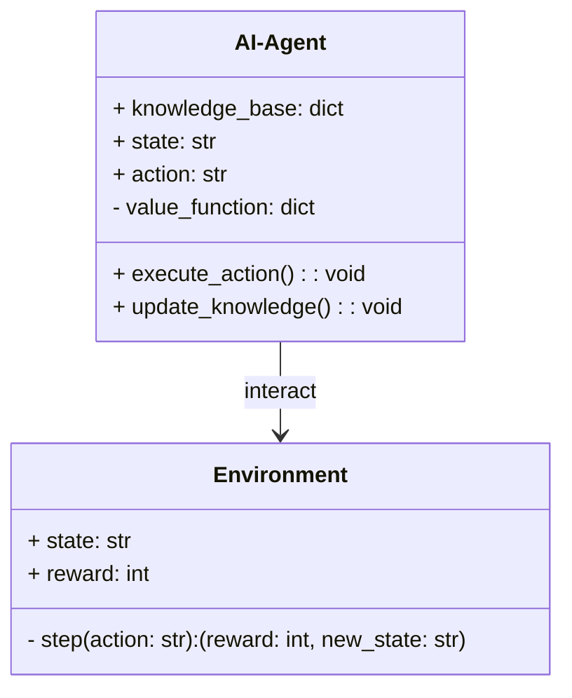
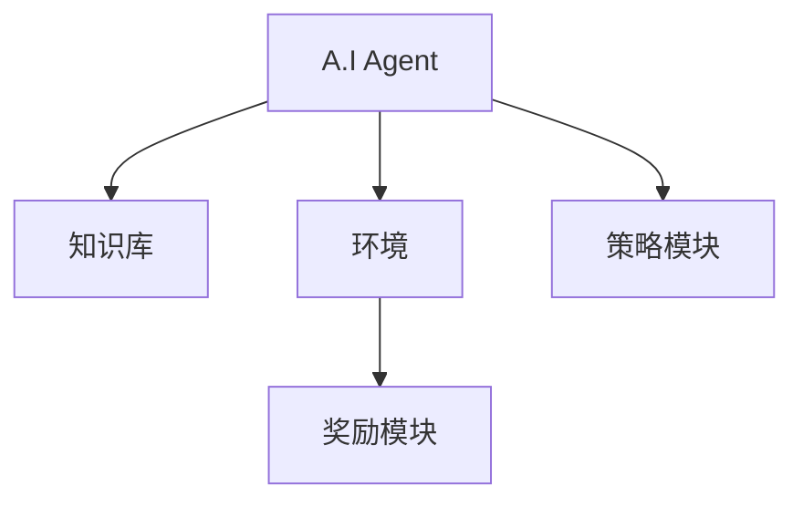

                 


# 基于课程学习的AI Agent能力渐进提升

> **关键词**: 课程学习, AI Agent, 能力提升, 知识点结构化, 任务分解, 强化学习, 系统设计

> **摘要**: 本文详细探讨了基于课程学习的AI Agent能力渐进提升方法。通过课程学习的系统性、结构化特征，结合AI Agent的核心能力，提出了一种通过知识点结构化、任务分解与层次化学习提升AI Agent能力的方法。文章从课程学习的原理、AI Agent能力提升策略、算法实现、系统设计与项目实战等多个维度展开分析，提供了丰富的理论支持与实践指导。

---

## 第一章：课程学习与AI Agent概述

### 1.1 课程学习的基本概念

课程学习是一种系统性、结构化的学习方法，旨在通过逐步递进的知识点传授，帮助学习者掌握复杂任务的能力。其核心在于将知识分解为可管理的模块，并通过层次化的学习路径，引导学习者从基础到高级逐步掌握。

**课程学习的特点**：
- 系统性：知识点按照逻辑顺序排列，形成完整的知识体系。
- 结构化：知识点之间具有明确的关联性，便于理解和应用。
- 递进性：从简单到复杂，逐步提升学习者的知识掌握程度。

**课程学习与传统学习的区别**：
| 特性 | 课程学习 | 传统学习 |
|------|----------|----------|
| 知识组织 | 结构化、系统化 | 非结构化、随机化 |
| 学习目标 | 明确且递进 | 目标模糊 |
| 学习效率 | 高 | 低 |

### 1.2 AI Agent的基本概念

**AI Agent的定义**：
AI Agent（智能体）是指能够感知环境、自主决策并执行任务的智能系统。它具备以下核心能力：
- 感知能力：通过传感器或数据输入获取环境信息。
- 决策能力：基于知识库或算法做出决策。
- 执行能力：通过动作或输出执行决策。

**AI Agent的类型**：
1. **简单反射型AI Agent**：基于简单的规则做出反应。
2. **基于模型的反应型AI Agent**：利用环境模型进行决策。
3. **目标驱动型AI Agent**：根据目标选择最优行动。
4. **实用驱动型AI Agent**：通过效用函数优化决策。

**AI Agent的应用场景**：
- 自动驾驶：路径规划、障碍物识别。
- 智能助手：语音交互、任务管理。
- 智能客服：问题解答、用户支持。

### 1.3 课程学习在AI Agent中的作用

**课程学习如何提升AI Agent能力**：
- 通过结构化的知识点传授，帮助AI Agent逐步掌握复杂任务。
- 任务分解与层次化学习，降低学习难度，提升学习效率。
- 知识点的关联性分析，增强AI Agent的知识融会贯通能力。

**课程学习与AI Agent能力的关系**：
课程学习为AI Agent提供了一种系统性的知识获取方式，使其能够通过渐进式学习逐步提升能力。这种渐进式学习方式特别适合需要处理复杂任务的AI Agent。

---

## 第二章：课程学习的原理与方法

### 2.1 课程学习的核心原理

**教学设计理论**：
课程学习基于教学设计理论，强调教学目标、教学内容、教学策略的有机统一。教学设计需要考虑学习者的认知特点，制定合理的教学策略。

**知识点的结构化表示**：
知识点的结构化是课程学习的核心，通常采用树状结构或图状结构表示知识点之间的关系。

**学习者模型**：
学习者模型用于描述学习者的知识水平、学习风格和学习目标，以便个性化教学策略的制定。

### 2.2 课程学习的关键要素

**任务分解与知识点划分**：
任务分解是将复杂任务分解为多个子任务，每个子任务对应特定的知识点。

**知识点的层次化结构**：
知识点的层次化结构帮助学习者逐步掌握知识。例如，数学课程可以按照从基础算术到高等代数的层次化结构进行设计。

**学习目标的设定**：
学习目标需要明确具体，例如“掌握基本的编程语法”比“学习编程”更具可操作性。

### 2.3 课程学习的实施步骤

**步骤1：确定学习目标**
- 明确学习者需要掌握的知识点。
- 设定短期和长期学习目标。

**步骤2：设计课程结构**
- 根据知识点的层次化结构设计课程内容。
- 确定课程的起始点和终点。

**步骤3：实施与评估**
- 通过测试、反馈等方式评估学习效果。
- 根据评估结果调整课程内容。

---

## 第三章：基于课程学习的AI Agent能力提升策略

### 3.1 知识点的结构化与AI Agent的学习

**知识点的结构化表示**：
知识点的结构化表示帮助AI Agent理解知识之间的关联性。例如，数学知识可以表示为一个树状结构，根节点为“数学”，子节点为“代数”、“几何”，每个子节点下又包含具体的知识点。

**AI Agent的知识获取与存储**：
AI Agent需要通过多种方式获取知识，例如从数据库中提取、从外部数据源抓取等。知识存储需要考虑知识的层次化结构和关联性。

**知识点之间的关联性分析**：
通过关联性分析，AI Agent能够理解不同知识点之间的联系，从而更好地进行知识整合与应用。

### 3.2 任务分解与AI Agent的能力扩展

**任务分解的基本原则**：
任务分解需要遵循以下原则：
1. **可分解性**：任务可以分解为多个子任务。
2. **独立性**：子任务之间相对独立。
3. **渐进性**：子任务的难度逐步递增。

**AI Agent的任务执行流程**：
1. **任务分解**：将复杂任务分解为多个子任务。
2. **子任务处理**：逐一解决每个子任务。
3. **结果整合**：将子任务的结果整合为最终答案。

### 3.3 基于层次化学习的AI Agent能力提升

**层次化学习的基本原理**：
层次化学习将知识分为多个层次，从基础到高级逐步学习。例如，编程学习可以从变量、函数开始，逐步学习数据结构、算法等高级内容。

**层次化学习的优势**：
- 降低学习难度，使学习者能够逐步掌握知识。
- 便于知识点的整合与应用。

---

## 第四章：算法原理

### 4.1 强化学习算法

**强化学习的定义**：
强化学习是一种通过试错机制学习策略的方法。AI Agent通过与环境交互，学习如何做出最优决策。

**强化学习的数学模型**：
$$ V(s) = \max_{a} [ r(s,a) + \gamma V(s') ] $$
其中：
- \( V(s) \)：状态 \( s \) 的价值函数。
- \( r(s,a) \)：在状态 \( s \) 下采取动作 \( a \) 的奖励。
- \( \gamma \)：折扣因子，表示未来奖励的权重。
- \( s' \)：采取动作 \( a \) 后的新状态。

**强化学习的实现步骤**：
1. **环境初始化**：设置初始状态。
2. **动作选择**：根据当前策略选择动作。
3. **环境反馈**：获得奖励和新状态。
4. **策略更新**：更新价值函数或策略。
5. **重复步骤**：直到达到终止条件。

**强化学习的Python代码示例**：
```python
import numpy as np

# 定义环境
class Environment:
    def __init__(self):
        self.state = 0

    def step(self, action):
        # 根据动作更新状态并返回奖励和新状态
        if action == 1:
            self.state += 1
            reward = 1
        else:
            self.state -= 1
            reward = -1
        return reward, self.state

# 初始化
env = Environment()
state = 0
learning_rate = 0.1
gamma = 0.9

# 初始化价值函数
value_function = np.zeros(5)  # 假设状态空间为0-4

# 强化学习过程
for episode in range(100):
    current_state = 0
    while current_state < 4:
        # 选择动作
        action = 1 if np.random.random() > 0.5 else 0
        # 与环境交互
        reward, next_state = env.step(action)
        # 更新价值函数
        value_function[current_state] += learning_rate * (reward + gamma * value_function[next_state] - value_function[current_state])
        current_state = next_state
```

---

## 第五章：系统分析与架构设计

### 5.1 问题场景介绍

假设我们正在开发一个AI Agent，用于自动化处理客服任务。AI Agent需要通过课程学习逐步掌握从基础的客户信息查询到复杂的投诉处理能力。

### 5.2 系统功能设计

**领域模型（Mermaid类图）**：


### 5.3 系统架构设计

**系统架构图（Mermaid架构图）**：


---

## 第六章：项目实战

### 6.1 环境安装

需要安装以下工具和库：
- Python 3.8+
- numpy
- matplotlib
- gym库

### 6.2 核心实现源代码

```python
import gym
import numpy as np

# 定义AI Agent
class AI_Agent:
    def __init__(self, env):
        self.env = env
        self.value_function = np.zeros(env.observation_space.n)

    def take_action(self, state):
        # 随机选择动作
        return self.env.action_space.sample()

    def update_value_function(self, reward, next_state):
        # 更新价值函数
        self.value_function[state] += learning_rate * (reward + gamma * self.value_function[next_state] - self.value_function[state])

# 初始化环境
env = gym.make('CartPole-v0')

# 初始化参数
learning_rate = 0.1
gamma = 0.99

# 初始化AI Agent
agent = AI_Agent(env)

# 训练过程
for episode in range(100):
    state = env.reset()
    while True:
        action = agent.take_action(state)
        next_state, reward, done, _ = env.step(action)
        agent.update_value_function(reward, next_state)
        if done:
            break
```

### 6.3 代码应用解读与分析

上述代码实现了一个简单的强化学习算法，用于训练AI Agent在CartPole环境中保持平衡。通过不断迭代，AI Agent能够逐步掌握平衡杆的任务。

---

## 第七章：总结与展望

### 7.1 本章总结

本文详细探讨了基于课程学习的AI Agent能力提升方法，从课程学习的原理、AI Agent的核心能力、算法实现到系统设计与项目实战，提供了全面的理论支持与实践指导。通过课程学习的系统性与结构化特点，结合AI Agent的感知、决策与执行能力，提出了一种有效的能力提升策略。

### 7.2 未来展望

未来的研究可以进一步探索课程学习与深度学习的结合，例如通过生成式AI技术自动生成课程内容，或通过元学习提升AI Agent的自适应能力。此外，如何将课程学习应用于更复杂的AI Agent任务，如多智能体协作、自适应学习等，也是值得深入研究的方向。

---

**注意事项**：
- 在实际应用中，需要根据具体任务调整课程设计和算法参数。
- 确保数据的多样性和合理性，避免过拟合。
- 定期评估AI Agent的能力，并根据反馈进行优化。

**拓展阅读**：
- 《强化学习：算法与应用》
- 《课程学习与知识图谱构建》
- 《AI Agent在智能系统中的应用》

