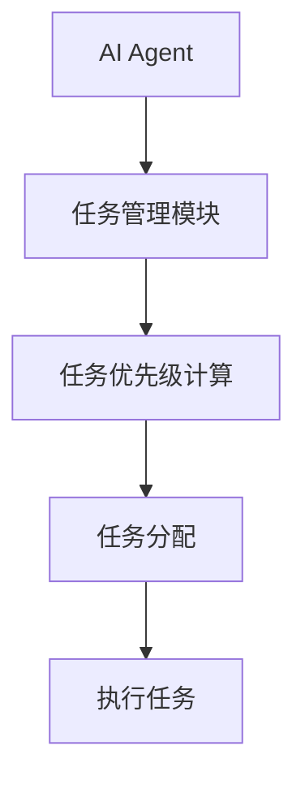
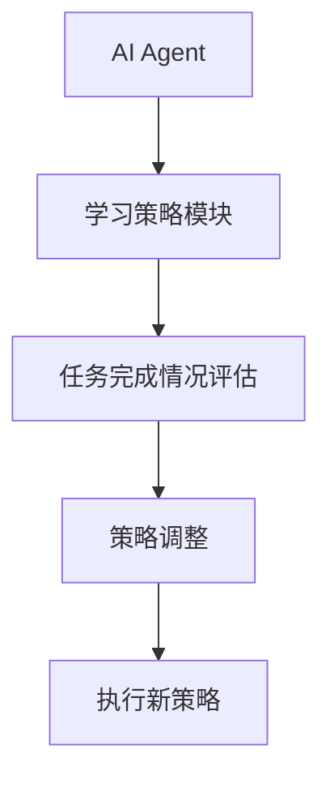
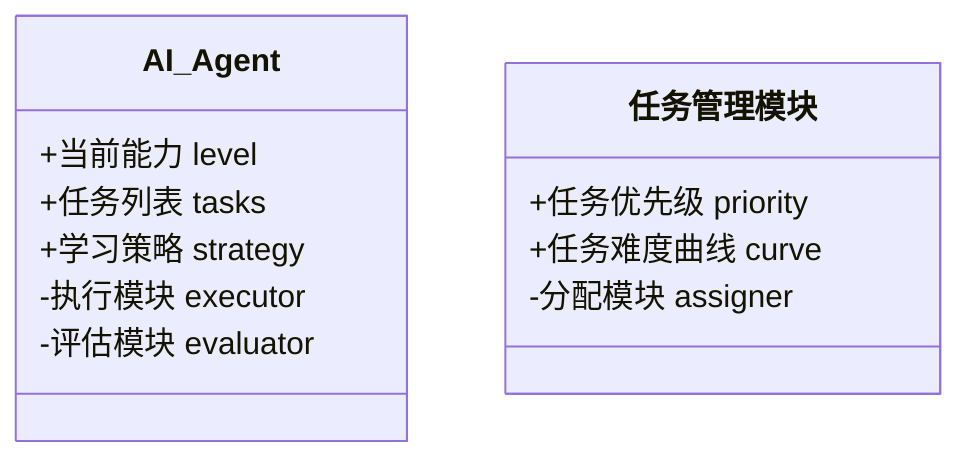
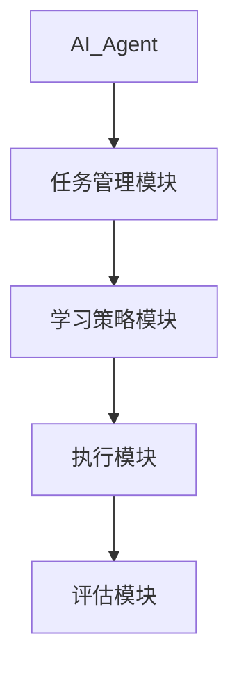

                 


# 基于课程学习的AI Agent能力进阶

## 关键词：课程学习，AI Agent，能力进阶，算法原理，系统架构，项目实战

## 摘要

本文详细探讨了基于课程学习的AI Agent能力提升方法，从课程学习的基本概念到AI Agent的核心机制，从系统架构设计到项目实战，全面解析了如何通过课程学习优化AI Agent的学习路径和能力进阶。文章结合理论分析和实践案例，深入浅出地展示了课程学习在AI Agent中的应用，为AI开发者和研究人员提供了系统的指导和参考。

---

## 第一部分：课程学习与AI Agent基础

### 第1章：课程学习与AI Agent概述

#### 1.1 背景介绍

课程学习是一种通过逐步增加任务难度来优化学习效果的方法，广泛应用于教育、机器学习等领域。AI Agent（人工智能代理）是一种能够感知环境、执行任务并自主决策的智能体。结合课程学习与AI Agent，可以通过动态调整任务难度和学习策略，显著提升AI Agent的学习效率和执行能力。

**核心概念说明**：
- **课程学习**：通过设计任务难度递增的课程，引导学习者逐步掌握复杂知识或技能。
- **AI Agent**：具有感知、决策和执行能力的智能体，能够在复杂环境中完成特定任务。
- **结合点**：课程学习为AI Agent提供了一个系统化的学习路径，AI Agent则通过执行任务实现课程目标。

**问题背景**：
传统AI Agent学习方式存在任务难度固定、学习效率低下的问题。通过课程学习的动态调整，可以优化AI Agent的学习路径，使其更快、更高效地掌握复杂任务。

**问题解决**：
通过课程学习，AI Agent能够逐步适应更复杂的任务，提升其在动态环境中的适应能力和执行效率。

**边界与外延**：
- **边界**：课程学习的边界在于任务难度的设计和AI Agent的学习能力。
- **外延**：课程学习可以应用于教育、医疗、机器人等领域，扩展AI Agent的应用场景。

**概念结构与核心要素**：
- **任务难度**：课程学习的核心要素，决定了学习的路径和节奏。
- **学习策略**：AI Agent的学习方法和调整机制，直接影响学习效果。
- **课程曲线**：任务难度递增的数学模型，指导AI Agent的学习过程。

#### 1.2 课程学习与AI Agent的核心要素

| 核心要素 | 描述 | 示例 |
|----------|------|------|
| 任务难度 | 任务的复杂程度，从简单到复杂递增 | 初级任务：图像分类；高级任务：目标检测 |
| 学习策略 | AI Agent的学习方法和调整机制 | 监督学习、强化学习、迁移学习 |
| 课程曲线 | 任务难度递增的数学模型 | 对数函数、线性函数、指数函数 |

#### 1.3 课程学习与AI Agent的结合

通过课程学习，AI Agent能够逐步掌握复杂任务。例如，在自然语言处理任务中，AI Agent可以先从简单的文本分类开始，逐步学习到复杂的文本摘要和生成任务。

---

### 第2章：课程学习的基本原理

#### 2.1 课程学习的核心机制

课程学习通过动态调整任务难度，优化学习效果。其核心机制包括任务分配、任务难度度量和学习速率调整。

**任务分配**：根据AI Agent当前的能力水平，分配适当难度的任务。

**任务难度度量**：通过数学模型量化任务难度，例如使用对数函数衡量任务的复杂度。

**学习速率调整**：根据任务完成情况动态调整学习速率，确保学习过程的稳定性。

#### 2.2 课程学习的数学模型

**任务难度度量公式**：
$$ d_i = \log(\frac{i}{N}) $$
其中，$i$为当前任务编号，$N$为总任务数。

**课程曲线设计**：
课程曲线是任务难度的函数，通常采用对数或指数函数，确保任务难度逐步递增。

---

## 第二部分：基于课程学习的AI Agent核心机制

### 第3章：课程学习在AI Agent任务分配中的应用

#### 3.1 动态任务分配机制

AI Agent通过动态任务分配机制，根据当前能力和环境反馈调整任务优先级。

**算法流程图**：


#### 3.2 任务优先级计算

任务优先级计算基于任务难度和AI Agent的能力水平。

**公式**：
$$ priority_i = \frac{1}{1 + e^{-d_i}} $$
其中，$d_i$为任务难度。

---

### 第4章：课程学习与AI Agent学习策略的优化

#### 4.1 动态学习策略设计

AI Agent根据任务完成情况调整学习策略，例如从监督学习切换到强化学习。

**算法流程图**：


#### 4.2 学习速率的自适应调整

学习速率根据任务难度和完成情况动态调整，确保学习过程的稳定性。

**公式**：
$$ \eta_i = \frac{1}{1 + \alpha \cdot i} $$
其中，$\alpha$为调整系数，$i$为当前任务编号。

---

## 第三部分：系统架构与实现方案

### 第5章：系统架构设计

#### 5.1 系统功能设计

**领域模型**：


#### 5.2 系统架构设计

**系统架构图**：


---

## 第四部分：项目实战

### 第6章：智能客服助手的实现

#### 6.1 项目背景

智能客服助手需要通过课程学习逐步掌握复杂的客户咨询任务。

#### 6.2 系统实现

**代码实现**：
```python
import numpy as np

class AIAssistant:
    def __init__(self):
        self.level = 1
        self.tasks = []

    def assign_task(self, task_list):
        # 根据当前能力分配任务
        for task in task_list:
            if self.level > task.difficulty:
                self.tasks.append(task)

    def execute_task(self, task):
        # 执行任务并评估
        result = self.model.predict(task.input)
        self.evaluate(result, task.output)
        self.level_up()

    def evaluate(self, prediction, ground_truth):
        # 评估任务完成情况
        accuracy = np.mean(prediction == ground_truth)
        if accuracy > 0.8:
            self.level += 1

    def level_up(self):
        # 提升能力水平
        pass
```

---

## 第五部分：总结与展望

### 第7章：总结与展望

课程学习为AI Agent的能力提升提供了系统化的路径。通过动态调整任务难度和学习策略，AI Agent能够更高效地掌握复杂任务。

**最佳实践**：
- 定期评估任务完成情况，动态调整学习策略。
- 使用多种学习算法结合，提升学习效果。

**小结**：
课程学习与AI Agent的结合是当前AI研究的热点方向，未来的研究可以进一步探索多模态学习和自适应课程设计。

---

以上是《基于课程学习的AI Agent能力进阶》的完整目录大纲和部分详细内容。通过系统化的学习路径和动态调整的学习策略，AI Agent的能力将得到显著提升，为更复杂的任务提供支持。

