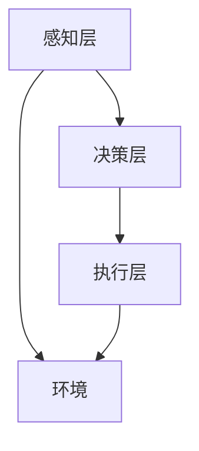
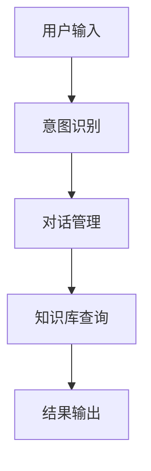

                 

# 基于课程学习的AI Agent能力阶梯式提升

---

## 关键词

- 人工智能（AI）
- 课程学习（Curriculum Learning）
- AI Agent
- 强化学习（Reinforcement Learning）
- 系统架构设计

---

## 摘要

基于课程学习的AI Agent能力阶梯式提升是一种通过系统化、渐进式学习策略来提升AI Agent能力的方法。本文将从课程学习的基本概念出发，逐步探讨其在AI Agent训练中的应用，结合数学模型、系统架构设计和实际案例分析，详细解读如何通过课程学习实现AI Agent能力的阶梯式提升。文章内容涵盖课程学习的理论基础、算法实现、系统设计、项目实战以及未来展望，旨在为读者提供一个全面且深入的技术指南。

---

## 第一部分: 引言

### 第1章: 课程学习与AI Agent概述

#### 1.1 课程学习的基本概念

课程学习（Curriculum Learning）是一种机器学习方法，通过逐步增加任务的难度，引导模型逐步掌握从简单到复杂的技能。其核心思想是将复杂的问题分解为多个子问题，并按一定顺序进行训练，从而降低学习难度，提高学习效率。

#### 1.2 AI Agent的基本概念与功能

AI Agent（人工智能代理）是一种能够感知环境、自主决策并执行任务的智能实体。AI Agent的核心功能包括感知、推理、决策和执行。通过课程学习，AI Agent能够逐步提升其在复杂环境中的适应能力和决策能力。

#### 1.3 课程学习与AI Agent的结合

课程学习与AI Agent的结合，主要体现在通过逐步增加任务的复杂度，帮助AI Agent逐步掌握从简单到复杂的任务。例如，在游戏AI的训练中，可以通过从简单的规则游戏开始，逐步引入更复杂的策略和对手行为，帮助AI Agent逐步提升其游戏水平。

---

## 第二部分: 课程学习的原理与数学模型

### 第2章: 课程学习的核心机制

#### 2.1 课程学习的基本原理

课程学习的核心思想是通过逐步增加任务的难度，帮助模型逐步掌握复杂的任务。具体来说，课程学习可以看作是一种“引导式”学习，通过设计合理的任务序列，引导模型逐步提升其能力。

#### 2.2 课程学习与强化学习的结合

强化学习（Reinforcement Learning）是一种通过试错机制来优化决策模型的机器学习方法。将课程学习与强化学习结合，可以通过逐步增加任务的难度，帮助强化学习模型逐步提升其决策能力。

#### 2.3 课程学习的数学模型

课程学习的数学模型可以表示为一种分阶段的优化问题。具体来说，假设任务序列由简单到复杂排列，模型在每个阶段的目标是最优化当前阶段的任务，逐步提升其能力。

例如，在强化学习中，可以将课程学习的数学模型表示为：

$$
J(\theta) = \sum_{t=1}^{T} \gamma^{t-1} r(s_t, a_t)
$$

其中，$\theta$ 是模型参数，$r(s_t, a_t)$ 是在状态 $s_t$ 下执行动作 $a_t$ 的奖励，$\gamma$ 是折扣因子，$T$ 是任务的总阶段数。

---

## 第三部分: AI Agent的系统架构设计

### 第3章: AI Agent的系统架构

#### 3.1 AI Agent的系统组成

AI Agent的系统架构通常包括感知层、决策层和执行层。感知层负责收集环境信息，决策层负责制定决策策略，执行层负责执行决策并输出结果。

#### 3.2 课程学习在系统架构中的应用

课程学习可以通过设计合理的任务序列，帮助AI Agent逐步提升其感知、决策和执行能力。例如，在自然语言处理任务中，可以通过从简单的句子理解逐步过渡到复杂文本分析，帮助模型逐步提升其语言理解能力。

#### 3.3 系统架构的Mermaid图

以下是AI Agent的系统架构Mermaid图：

---

## 第四部分: 项目实战

### 第4章: 智能客服AI Agent的课程学习训练

#### 4.1 项目背景与目标

智能客服AI Agent的目标是通过自然语言处理技术，帮助用户解决常见问题。为了提升AI Agent的对话能力，可以通过课程学习的方法，逐步训练其从简单的问题理解到复杂的对话管理能力。

#### 4.2 系统功能设计

系统功能设计包括用户输入处理、意图识别、对话管理、知识库查询和结果输出。

#### 4.3 系统架构设计

以下是系统架构的Mermaid图：

---

## 第五部分: 高级主题与未来展望

### 第5章: 课程学习的优化与扩展

#### 5.1 课程学习的优化方法

课程学习的优化方法包括任务序列的设计、奖励机制的调整以及模型参数的优化。例如，可以通过动态调整任务的难度，帮助模型逐步提升其能力。

#### 5.2 课程学习的扩展应用

课程学习的扩展应用包括多智能体协作、人机协作以及边缘计算中的应用。例如，在多智能体协作中，可以通过课程学习帮助各个智能体逐步提升其协作能力。

#### 5.3 课程学习的未来展望

课程学习的未来展望包括与元学习（Meta-Learning）的结合、在边缘计算中的应用，以及在复杂环境中的应用。通过这些研究，课程学习有望在更多领域中发挥重要作用。

---

## 第六部分: 总结与展望

### 第6章: 课程学习在AI Agent中的总结

#### 6.1 课程学习的核心思想

课程学习的核心思想是通过逐步增加任务的难度，帮助模型逐步掌握复杂的任务。这一思想在AI Agent的训练中具有重要的应用价值。

#### 6.2 课程学习的未来研究方向

课程学习的未来研究方向包括与元学习的结合、在边缘计算中的应用，以及在复杂环境中的应用。通过这些研究，课程学习有望在更多领域中发挥重要作用。

---

## 参考文献

（此处可以列出相关的学术论文、技术报告或其他参考资料）

---

通过以上目录结构，我们可以清晰地看到，文章从课程学习的基本概念出发，逐步深入探讨其在AI Agent训练中的应用，结合数学模型、系统架构设计和实际案例分析，详细解读如何通过课程学习实现AI Agent能力的阶梯式提升。

