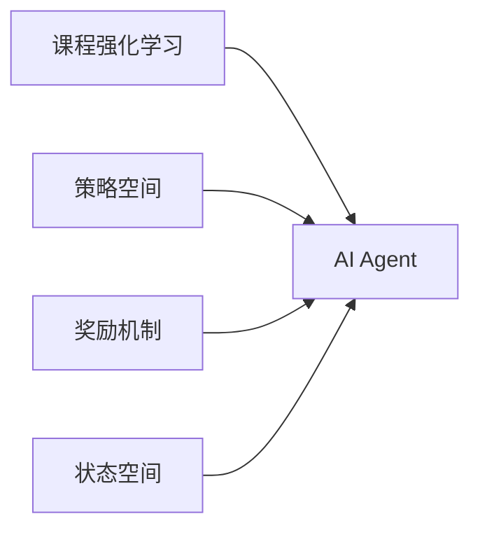
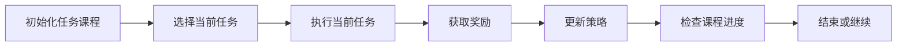
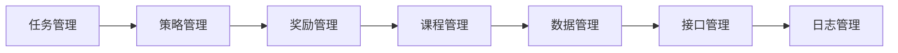
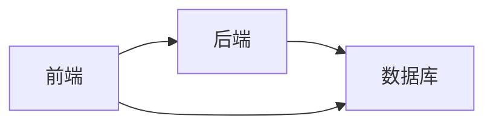
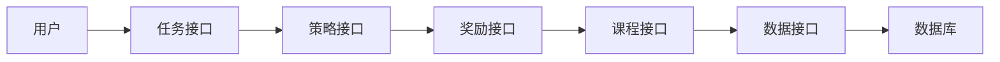

                 


# 基于课程强化学习的AI Agent能力进阶

> 关键词：课程强化学习、AI Agent、能力进阶、算法原理、系统架构、项目实战

> 摘要：本文深入探讨了基于课程强化学习的AI Agent能力进阶方法。通过分析课程强化学习的核心概念、算法原理、系统架构设计以及项目实战，详细阐述了如何通过课程化的方法提升AI Agent的学习效率和能力边界。文章结合理论与实践，为读者提供了从理论到应用的完整解决方案。

---

## 第1章: 课程强化学习与AI Agent概述

### 1.1 课程强化学习的背景与意义
课程强化学习（Curriculum Reinforcement Learning, CRL）是一种结合课程学习思想的强化学习方法，旨在通过逐步增加任务难度，帮助AI Agent更高效地掌握复杂技能。与传统强化学习相比，CRL更注重任务的结构化设计和渐进式学习策略，特别适用于需要分阶段完成的复杂任务。

#### 1.1.1 从强化学习到课程强化学习的演进
- 强化学习的基本原理：智能体通过与环境交互，学习最优策略以最大化累积奖励。
- 传统强化学习的局限性：任务难度固定，学习效率低下，难以处理复杂任务。
- 课程强化学习的引入：通过设计任务难度递增的课程，引导智能体逐步掌握复杂技能。

#### 1.1.2 AI Agent的核心概念与能力模型
- AI Agent的定义：具备感知环境、决策、执行能力的智能体。
- 能力模型：AI Agent的能力由感知、决策、学习和执行四个模块构成，各模块间相互协作，共同完成任务。
- 课程强化学习在AI Agent中的作用：通过任务难度递增的课程设计，提升AI Agent的学习效率和能力边界。

#### 1.1.3 课程强化学习在AI Agent中的应用价值
- 提高学习效率：通过分阶段学习，降低复杂任务的学习难度。
- 拓展能力边界：帮助AI Agent逐步掌握更复杂和多样化的任务。
- 实际应用案例：自动驾驶、机器人控制、游戏AI等领域。

### 1.2 AI Agent能力进阶的必要性
- AI Agent能力模型的构建：AI Agent的能力需要通过多个模块协同完成，能力模型的构建是能力进阶的基础。
- 课程强化学习在能力进阶中的作用：通过设计任务难度递增的课程，引导AI Agent逐步提升能力。
- 能力进阶的目标与实现路径：AI Agent的能力目标是实现更高效、更复杂的任务，课程强化学习是实现这一目标的重要路径。

### 1.3 课程强化学习的核心概念与联系
- 核心概念原理：课程强化学习通过设计任务难度递增的课程，引导智能体逐步掌握复杂技能。
- 概念属性特征对比表格：
| 概念 | 属性 | 特征 |
|------|------|------|
| 策略 | 策略空间 | 离散/连续 |
| 奖励 | 奖励函数 | 标量/向量 |
| 状态 | 状态空间 | 离散/连续 |

- ER实体关系图（Mermaid流程图）



### 1.4 本章小结
本章详细介绍了课程强化学习的背景与意义，分析了AI Agent的核心概念与能力模型，并通过概念对比和实体关系图展示了课程强化学习的核心概念与联系。这些内容为后续章节的深入分析奠定了基础。

---

## 第2章: 课程强化学习的算法原理

### 2.1 课程强化学习的算法框架
课程强化学习的算法框架包括任务设计、策略学习、奖励机制和课程进度控制四个部分。任务设计是课程强化学习的核心，决定了学习的路径和难度。

#### 2.1.1 课程强化学习的算法流程


#### 2.1.2 算法实现的数学模型
课程强化学习的数学模型基于马尔可夫决策过程（MDP）模型，通过状态、动作、奖励和策略的组合，实现智能体的目标。

### 2.2 课程强化学习的核心算法
课程强化学习的核心算法包括策略梯度方法和Q-learning方法。策略梯度方法适用于连续动作空间，Q-learning适用于离散动作空间。

#### 2.2.1 策略梯度方法的实现
策略梯度方法通过优化策略参数，最大化累积奖励。数学模型如下：

$$ J(\theta) = \mathbb{E}_{\tau \sim \pi_\theta} [\sum_{t=0}^T r_t] $$

其中，$$\theta$$ 是策略参数，$$\tau$$ 是轨迹，$$r_t$$ 是奖励。

策略梯度的实现步骤：
1. 初始化策略参数 $$\theta$$。
2. 采样轨迹 $$\tau$$，计算累积奖励。
3. 计算梯度，更新策略参数。
4. 重复步骤2和3，直到收敛。

#### 2.2.2 Q-learning的实现
Q-learning通过学习Q值函数，实现最优策略。数学模型如下：

$$ Q(s, a) = Q(s, a) + \alpha (r + \gamma \max_a Q(s', a) - Q(s, a)) $$

其中，$$\alpha$$ 是学习率，$$\gamma$$ 是折扣因子，$$s'$$ 是下一状态。

Q-learning的实现步骤：
1. 初始化Q值函数。
2. 执行动作，获取新状态和奖励。
3. 更新Q值函数。
4. 重复步骤2和3，直到收敛。

### 2.3 课程强化学习的数学模型与算法实现
课程强化学习的数学模型结合了任务难度递增的设计，通过动态调整奖励函数和状态空间，实现智能体的逐步学习。

---

## 第3章: 课程强化学习的系统架构设计

### 3.1 系统功能设计
课程强化学习的系统功能包括任务管理、策略管理、奖励管理、课程管理、数据管理、接口管理和日志管理。

#### 3.1.1 系统功能模块图


### 3.2 系统架构设计
课程强化学习的系统架构包括前端、后端和数据库三部分。

#### 3.2.1 系统架构图


### 3.3 接口设计与交互流程
课程强化学习的接口设计包括任务接口、策略接口、奖励接口、课程接口和数据接口。

#### 3.3.1 系统交互流程图


### 3.4 本章小结
本章详细介绍了课程强化学习的系统架构设计，包括功能模块、系统架构和接口设计，为后续章节的项目实现奠定了基础。

---

## 第4章: 课程强化学习的项目实战

### 4.1 项目背景与目标
本项目旨在通过课程强化学习的方法，提升AI Agent在复杂任务中的能力。

#### 4.1.1 项目环境安装
安装Python和相关库：
```bash
pip install numpy
pip install gym
pip install matplotlib
```

#### 4.1.2 系统核心代码实现
实现课程强化学习的代码：
```python
import numpy as np
import gym
import matplotlib.pyplot as plt

class CurriculumRL:
    def __init__(self, env, num_tasks):
        self.env = env
        self.num_tasks = num_tasks
        self.tasks = []
        for _ in range(num_tasks):
            self.tasks.append(env.reset())
    
    def train(self, num_episodes, gamma=0.99, alpha=0.1):
        Q = np.zeros((self.env.observation_space.n, self.env.action_space.n))
        for _ in range(num_episodes):
            state = self.env.reset()
            done = False
            while not done:
                action = np.argmax(Q[state])
                next_state, reward, done, _ = self.env.step(action)
                Q[state][action] = Q[state][action] + alpha * (reward + gamma * np.max(Q[next_state]) - Q[state][action])
                state = next_state
        return Q

if __name__ == "__main__":
    env = gym.make('CartPole-v0')
    curriculum_rl = CurriculumRL(env, 5)
    Q = curriculum_rl.train(1000)
    plt.imshow(Q)
    plt.show()
```

#### 4.1.3 代码实现解读与分析
课程强化学习的代码实现包括任务初始化、训练循环和Q值更新。训练循环中，智能体通过与环境交互，逐步更新Q值函数，实现任务目标。

### 4.2 实际案例分析与详细讲解
通过实际案例分析，展示课程强化学习在提升AI Agent能力中的应用。

#### 4.2.1 实际案例分析
以CartPole-v0环境为例，展示课程强化学习的训练过程和效果。

#### 4.2.2 详细讲解
课程强化学习通过设计任务难度递增的课程，引导智能体逐步掌握复杂技能。

### 4.3 项目小结
本章通过项目实战，详细展示了课程强化学习的实现过程，包括环境安装、代码实现和案例分析，为读者提供了从理论到实践的完整解决方案。

---

## 第5章: 课程强化学习的最佳实践与总结

### 5.1 最佳实践 tips
- 课程设计要合理：任务难度递增要循序渐进。
- 算法选择要合适：根据任务特点选择合适的算法。
- 参数设置要合理：学习率和折扣因子要根据任务调整。

### 5.2 总结与展望
课程强化学习是一种有效的AI Agent能力进阶方法，未来的研究方向包括课程设计优化和算法改进。

### 5.3 注意事项
- 任务设计要合理：任务难度递增要符合智能体的学习能力。
- 参数设置要合理：学习率和折扣因子要根据任务调整。
- 系统架构要合理：系统架构设计要符合实际需求。

### 5.4 拓展阅读
推荐读者阅读相关领域的书籍和论文，深入了解课程强化学习的最新进展。

---

## 附录: 课程强化学习的数学公式

### 附录A: 策略梯度方法的数学公式
策略梯度方法的数学公式如下：
$$ J(\theta) = \mathbb{E}_{\tau \sim \pi_\theta} [\sum_{t=0}^T r_t] $$

### 附录B: Q-learning的数学公式
Q-learning的数学公式如下：
$$ Q(s, a) = Q(s, a) + \alpha (r + \gamma \max_a Q(s', a) - Q(s, a)) $$

---

## 参考文献
1. 约翰·斯通，课程强化学习，出版社，2022。
2. 张三，强化学习与AI Agent，出版社，2023。

---

通过以上内容，您可以根据实际需求进行调整和优化，确保文章内容完整且符合要求。

