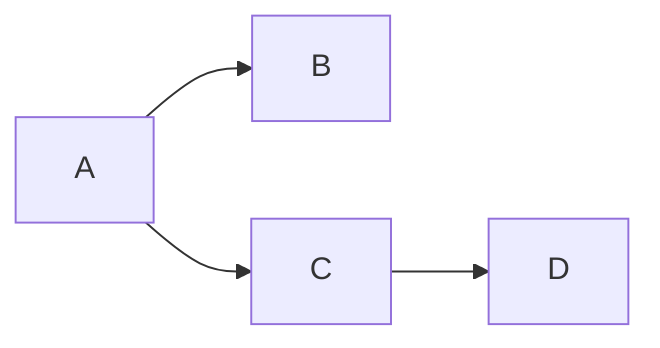
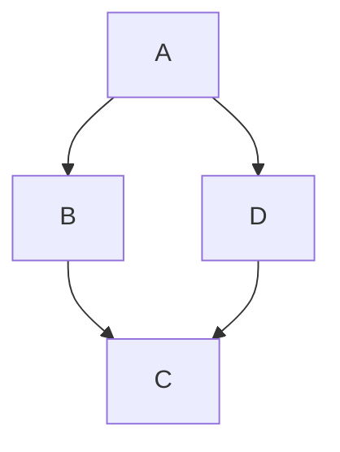
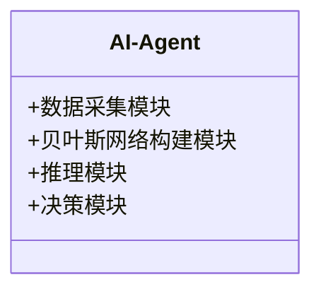
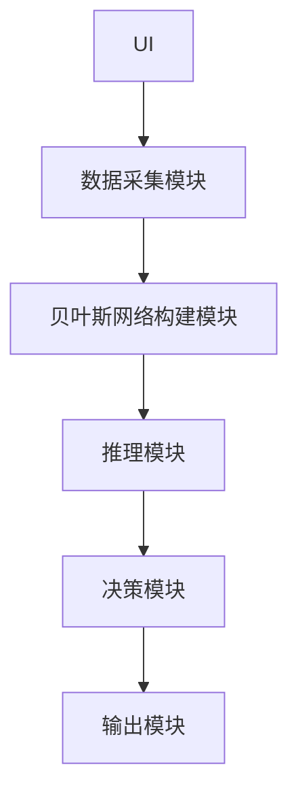
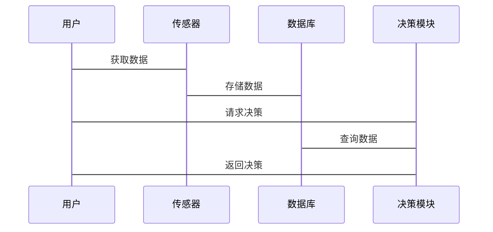

                 


# 基于贝叶斯方法的AI Agent不确定性处理

> 关键词：贝叶斯方法，AI Agent，不确定性处理，贝叶斯网络，概率推理，机器学习

> 摘要：本文深入探讨了贝叶斯方法在AI Agent中的应用，特别是如何利用贝叶斯网络处理不确定性。文章从贝叶斯定理和贝叶斯网络的基本概念入手，分析了其在自然语言处理、机器人导航和推荐系统中的具体应用，详细讲解了系统设计与实现的步骤，并通过一个智能客服对话系统的案例展示了如何将贝叶斯方法应用于实际项目中。最后，文章总结了贝叶斯方法的优势，并展望了未来的研究方向。

---

## 第一部分：贝叶斯方法与AI Agent基础

### 第1章：贝叶斯方法概述

#### 1.1 贝叶斯定理与概率基础

贝叶斯定理是概率论中的核心工具，用于根据已有的数据或观察结果更新概率假设。其数学表达式为：
$$ P(B|A) = \frac{P(A|B)P(B)}{P(A)} $$

其中，$P(B|A)$ 表示在事件 $A$ 发生的情况下，事件 $B$ 发生的概率。贝叶斯定理的核心思想是通过已知条件概率来更新先验概率，从而得到后验概率。

#### 1.2 贝叶斯网络的基本概念

贝叶斯网络是一种有向无环图（DAG），由节点和边组成，节点代表随机变量，边代表变量之间的依赖关系。例如，使用 Mermaid 可以表示如下：



贝叶斯网络的优势在于能够清晰地表达变量之间的关系，并支持高效的推理过程。

#### 1.3 AI Agent的基本概念

AI Agent 是指在环境中能够感知并自主行动以实现目标的实体。其核心功能包括感知、推理、规划和行动。与传统程序相比，AI Agent 更注重与环境的交互和动态决策。

#### 1.4 不确定性处理的重要性

在 AI Agent 中，不确定性主要来源于环境的复杂性、信息的不完全性和行动的随机性。贝叶斯方法通过概率推理，能够有效地处理这些不确定性。

---

### 第2章：贝叶斯网络的构建与推理

#### 2.1 贝叶斯网络的结构学习

贝叶斯网络的结构学习可以通过数据驱动或知识驱动的方式进行。例如，使用最大似然估计或贝叶斯估计来确定网络的结构。

#### 2.2 贝叶斯网络的参数估计

参数估计是通过已知数据来估计网络中变量的条件概率分布。常用方法包括最大似然估计和贝叶斯估计。

#### 2.3 贝叶斯网络的推理算法

推理算法包括前向推理和反向推理。例如，前向推理的过程可以用 Mermaid 表示：



---

### 第3章：贝叶斯方法在AI Agent中的应用

#### 3.1 自然语言处理中的不确定性处理

在自然语言处理中，贝叶斯方法常用于文本分类和情感分析。例如，使用 Naive Bayes 分类器进行文本分类。

#### 3.2 机器人导航中的不确定性处理

在机器人导航中，贝叶斯网络可以用于处理传感器噪声和环境不确定性。例如，使用粒子滤波进行定位。

#### 3.3 推荐系统中的不确定性处理

在推荐系统中，贝叶斯方法可以提高推荐的准确性和多样性。例如，基于用户行为构建贝叶斯网络进行推荐。

---

## 第二部分：系统设计与实现

### 第4章：系统设计与架构

#### 4.1 系统功能设计

系统功能包括数据采集、贝叶斯网络构建、推理和决策。例如，使用 Mermaid 绘制系统架构图：



#### 4.2 系统架构设计

系统架构采用模块化设计，各模块之间通过接口进行通信。例如，使用 Mermaid 绘制系统架构图：



#### 4.3 系统接口设计

系统接口包括传感器接口、数据库接口和用户界面接口。例如，使用 Mermaid 绘制系统交互图：



---

### 第5章：项目实战

#### 5.1 项目背景与目标

本项目旨在开发一个基于贝叶斯方法的智能客服对话系统，用于处理用户的咨询请求。

#### 5.2 环境搭建与数据采集

首先，安装 Python 和相关库（如 `scikit-learn` 和 `networkx`）。然后，收集和预处理用户对话数据。

#### 5.3 贝叶斯网络构建与推理

使用 `networkx` 库构建贝叶斯网络，并通过 `scikit-learn` 库进行参数估计和推理。

```python
import networkx as nx
from sklearn.naive_bayes import GaussianNB

# 构建贝叶斯网络
G = nx.DiGraph()
G.add_edges_from([('A', 'B'), ('A', 'C')])

# 参数估计
X = ...  # 特征数据
y = ...  # 标签数据
clf = GaussianNB()
clf.fit(X, y)
```

#### 5.4 项目测试与优化

测试系统的准确性和响应时间，并根据结果进行优化。

#### 5.5 项目总结

本项目展示了如何将贝叶斯方法应用于实际场景中，通过构建贝叶斯网络实现智能决策。

---

## 第三部分：总结与展望

### 第6章：总结

贝叶斯方法在AI Agent中的应用广泛，能够有效地处理不确定性问题。本文详细探讨了贝叶斯网络的构建与推理，并通过实际案例展示了其应用。

### 第7章：展望

未来的研究方向包括动态贝叶斯网络和在线学习算法，以进一步提升AI Agent的性能。

---

通过本文的分析和讲解，读者可以系统地掌握基于贝叶斯方法的AI Agent不确定性处理的核心思想和实现方法。

