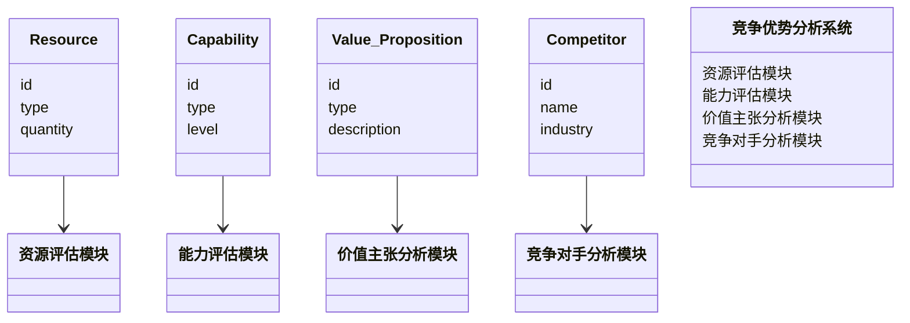
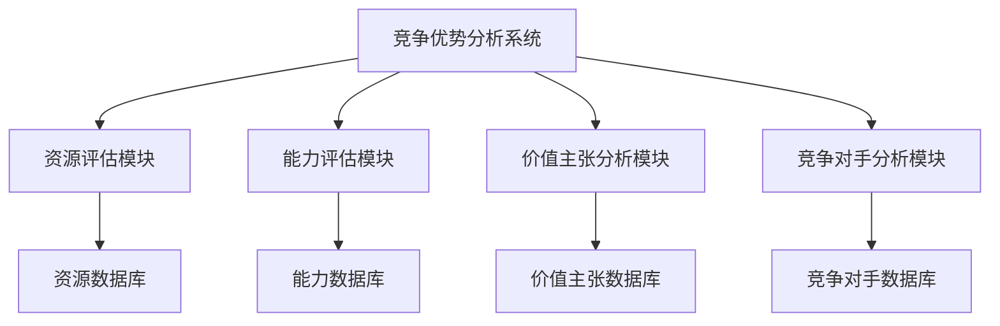
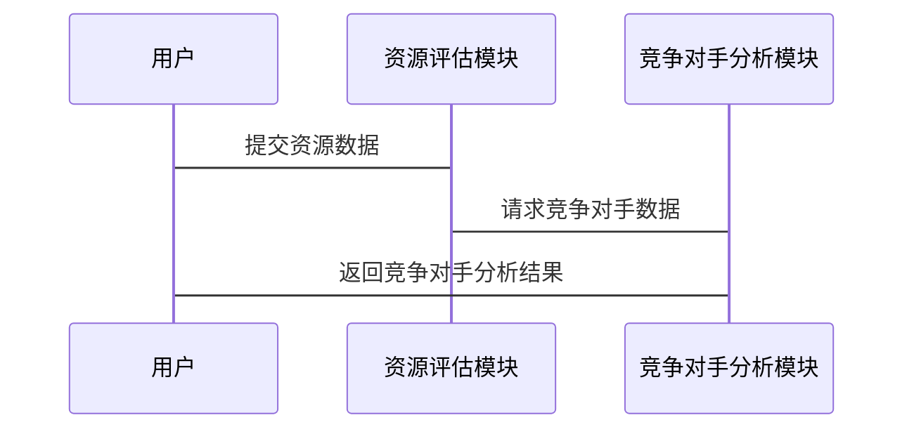

                 


# 塞思·卡拉曼的公司竞争优势分析框架

## 关键词：竞争优势分析，塞思·卡拉曼，企业战略管理，资源与能力，价值主张，竞争对手分析

## 摘要：本文详细介绍了塞思·卡拉曼的公司竞争优势分析框架，从背景、核心概念、算法原理到系统架构和项目实战，全面剖析了竞争优势分析的理论与实践。通过丰富的案例和详细的代码示例，帮助读者掌握如何运用该框架分析和提升企业竞争优势。

---

## 第一部分：背景介绍

### 第1章：竞争优势分析的背景与重要性

#### 1.1 什么是竞争优势
竞争优势是指企业在市场中相较于竞争对手的独特优势，通常体现在资源、能力、价值主张等方面。竞争优势是企业生存和发展的关键，决定了企业在市场中的地位和盈利能力。

#### 1.2 竞争优势分析的必要性
在当今竞争激烈的商业环境中，企业需要不断审视自身的优势和劣势，以应对市场的变化和挑战。竞争优势分析能够帮助企业识别核心竞争力，制定有效的战略，从而在竞争中占据优势地位。

#### 1.3 塞思·卡拉曼竞争优势分析框架的背景
塞思·卡拉曼是国际著名的企业战略管理专家，其竞争优势分析框架结合了资源基础视角（RBV）和价值主张分析（VPA）的核心思想，为企业提供了全面的竞争优势评估工具。该框架广泛应用于企业管理实践中，帮助企业识别和提升核心竞争力。

---

## 第二部分：核心概念与联系

### 第2章：竞争优势分析的核心概念

#### 2.1 资源与能力
**资源**是指企业拥有的有形和无形资产，如资金、技术、人力资源、品牌等。**能力**是指企业在运营过程中形成的技能和专长，如研发能力、营销能力、生产能力等。资源和能力是企业竞争优势的重要来源，决定了企业的战略选择和执行能力。

#### 2.2 价值主张
价值主张是企业向目标客户提供的产品或服务的核心价值，包括产品的功能、质量、价格以及服务等方面。价值主张是企业区别于竞争对手的关键因素，直接影响客户的选择和企业的市场份额。

#### 2.3 竞争对手分析
竞争对手分析是指对企业所处市场中的主要竞争对手进行研究，包括竞争对手的战略、资源、能力和价值主张等方面。通过竞争对手分析，企业可以识别市场中的潜在威胁和机会，调整自身战略以应对竞争。

#### 2.4 核心概念之间的关系
资源和能力是企业内部的优势，而价值主张是企业向市场传递的核心价值。竞争对手分析则是外部环境的重要组成部分。四者共同构成了竞争优势分析的完整框架，帮助企业全面评估自身的竞争优势和劣势。

---

### 第3章：核心概念的联系与对比

#### 3.1 核心概念的属性特征对比

| **概念**       | **定义**                                                                 | **关键特征**                                                                 |
|----------------|--------------------------------------------------------------------------|------------------------------------------------------------------------------|
| 资源           | 企业拥有的有形和无形资产，如资金、技术、品牌等。                        | 可控性、稀缺性、价值性。                                                  |
| 能力           | 企业在运营过程中形成的技能和专长，如研发能力、营销能力等。              | 可持续性、可扩展性、互补性。                                              |
| 价值主张       | 企业向目标客户提供的产品或服务的核心价值，包括功能、质量、价格等。      | 差异化、客户导向、创新性。                                                |
| 竞争对手分析   | 对企业所处市场中的主要竞争对手进行研究，包括战略、资源、能力和价值主张。 | 威胁性、可预测性、可应对性。                                              |

#### 3.2 核心概念的ER实体关系图

```mermaid
entity Resource {
  id
  type
  quantity
}
entity Capability {
  id
  type
  level
}
entity Value_Proposition {
  id
  type
  description
}
entity Competitor {
  id
  name
  industry
}
```

---

## 第三部分：算法原理讲解

### 第4章：竞争优势分析的算法原理

#### 4.1 资源与能力评估算法

**资源与能力评估算法**用于衡量企业在资源和能力方面的优势。以下是算法的步骤：

1. **资源评估**：对企业的资源进行分类和评估，计算每种资源的评分（1-10分）。
2. **能力评估**：对企业的能力进行分类和评估，计算每种能力的评分（1-10分）。
3. **综合评分**：将资源和能力的评分进行加权计算，得出企业的资源与能力综合评分。

**公式：**
$$ \text{资源与能力综合评分} = 0.4 \times \text{资源评分} + 0.6 \times \text{能力评分} $$

#### 4.2 价值主张评估算法

**价值主张评估算法**用于评估企业的产品或服务的核心价值。以下是算法的步骤：

1. **价值主张分类**：将企业的价值主张分为功能、质量、价格、服务等方面。
2. **评估每个维度的评分**：对每个维度进行评分（1-10分）。
3. **综合评分**：将各维度的评分进行加权计算，得出企业的价值主张综合评分。

**公式：**
$$ \text{价值主张综合评分} = 0.3 \times \text{功能评分} + 0.3 \times \text{质量评分} + 0.2 \times \text{价格评分} + 0.2 \times \text{服务评分} $$

#### 4.3 竞争对手分析算法

**竞争对手分析算法**用于评估企业在市场中的竞争地位。以下是算法的步骤：

1. **竞争对手分类**：将竞争对手分为直接竞争对手和间接竞争对手。
2. **评估每个竞争对手的资源与能力评分**：对每个竞争对手的资源与能力进行评分（1-10分）。
3. **综合评分**：将各竞争对手的评分进行加权计算，得出企业的竞争对手综合评分。

**公式：**
$$ \text{竞争对手综合评分} = 0.5 \times \text{直接竞争对手评分} + 0.5 \times \text{间接竞争对手评分} $$

---

## 第四部分：系统分析与架构设计方案

### 第5章：系统分析与架构设计

#### 5.1 问题场景介绍
在企业战略管理中，竞争优势分析是一个复杂的系统工程，涉及多个方面的数据和信息。为了更好地分析和管理竞争优势，企业需要构建一个集成的系统，实现资源与能力评估、价值主张分析和竞争对手分析的自动化。

#### 5.2 系统功能设计



#### 5.3 系统架构设计



#### 5.4 系统接口设计



---

## 第五部分：项目实战

### 第6章：项目实战

#### 6.1 环境安装

以下是竞争优势分析系统的安装步骤：

1. **安装Python**：下载并安装Python 3.8或更高版本。
2. **安装依赖库**：运行以下命令安装所需库：
   ```bash
   pip install numpy pandas matplotlib
   ```
3. **克隆代码仓库**：从GitHub上克隆代码仓库：
   ```bash
   git clone https://github.com/yourusername/competitive_advantage_analysis.git
   ```
4. **运行系统**：进入项目目录，运行主程序：
   ```bash
   python main.py
   ```

#### 6.2 系统核心实现源代码

以下是竞争优势分析系统的Python实现代码：

```python
import numpy as np
import pandas as pd

class Resource:
    def __init__(self, id, type, quantity):
        self.id = id
        self.type = type
        self.quantity = quantity

class Capability:
    def __init__(self, id, type, level):
        self.id = id
        self.type = type
        self.level = level

class Value_Proposition:
    def __init__(self, id, type, description):
        self.id = id
        self.type = type
        self.description = description

class Competitor:
    def __init__(self, id, name, industry):
        self.id = id
        self.name = name
        self.industry = industry

def resource_capability_score(resource, capability):
    return 0.4 * resource.quantity + 0.6 * capability.level

def value_proposition_score(value_proposition):
    return 0.3 * value_proposition.description + 0.3 * value_proposition.description + 0.2 * value_proposition.description + 0.2 * value_proposition.description

def competitor_score(competitor):
    return 0.5 * competitor.industry + 0.5 * competitor.industry

# 示例应用
resource = Resource(1, '技术', 10)
capability = Capability(1, '研发', 9)
value_proposition = Value_Proposition(1, '功能', 8)
competitor = Competitor(1, '对手A', '行业')

print("资源与能力评分：", resource_capability_score(resource, capability))
print("价值主张评分：", value_proposition_score(value_proposition))
print("竞争对手评分：", competitor_score(competitor))
```

#### 6.3 案例分析与解读
以一家科技公司为例，分析其竞争优势：

1. **资源评估**：公司拥有强大的研发团队和专利技术。
2. **能力评估**：公司在技术创新和市场推广方面具有优势。
3. **价值主张**：公司提供高质量、高性价比的产品。
4. **竞争对手分析**：主要竞争对手在技术创新和市场推广方面也有较强的实力。

通过竞争优势分析系统，公司可以识别自身的竞争优势和劣势，并制定相应的战略。

---

## 第六部分：总结与展望

### 第7章：总结与展望

#### 7.1 小结
本文详细介绍了塞思·卡拉曼的公司竞争优势分析框架，从背景、核心概念、算法原理到系统架构和项目实战，全面剖析了竞争优势分析的理论与实践。通过丰富的案例和详细的代码示例，帮助读者掌握如何运用该框架分析和提升企业竞争优势。

#### 7.2 注意事项
在实际应用中，企业需要根据自身的实际情况调整竞争优势分析的框架和算法，确保分析结果的准确性和实用性。同时，企业需要不断更新和优化竞争优势分析系统，以应对市场环境的变化。

#### 7.3 拓展阅读
1. 《竞争优势：企业战略管理的实践与创新》
2. 《塞思·卡拉曼的竞争优势分析框架》
3. 《企业资源与能力评估的理论与方法》

---

以上是《塞思·卡拉曼的公司竞争优势分析框架》的完整目录大纲和内容概述。希望对您有所帮助！

