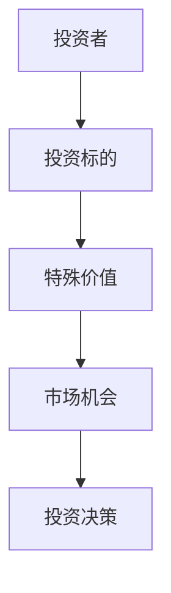
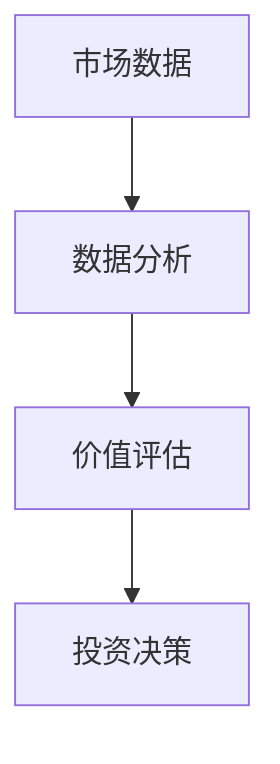
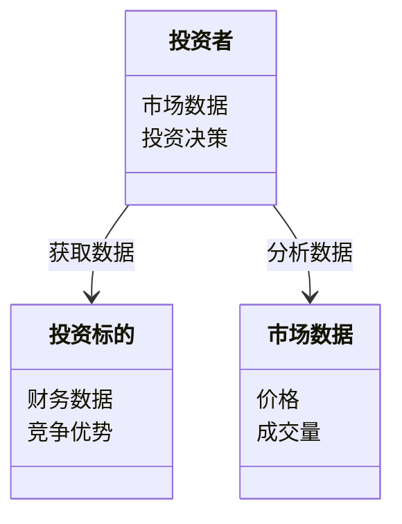
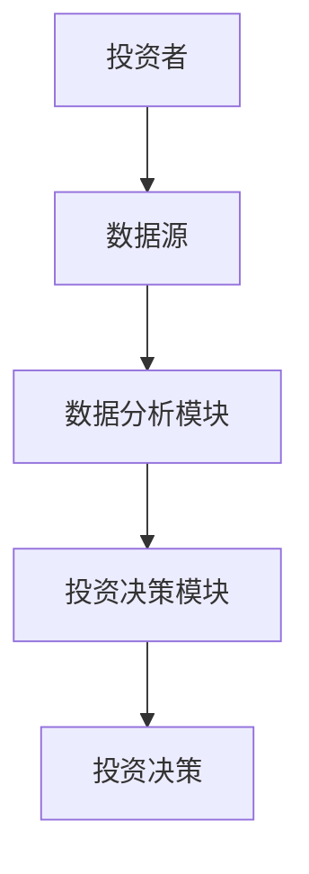
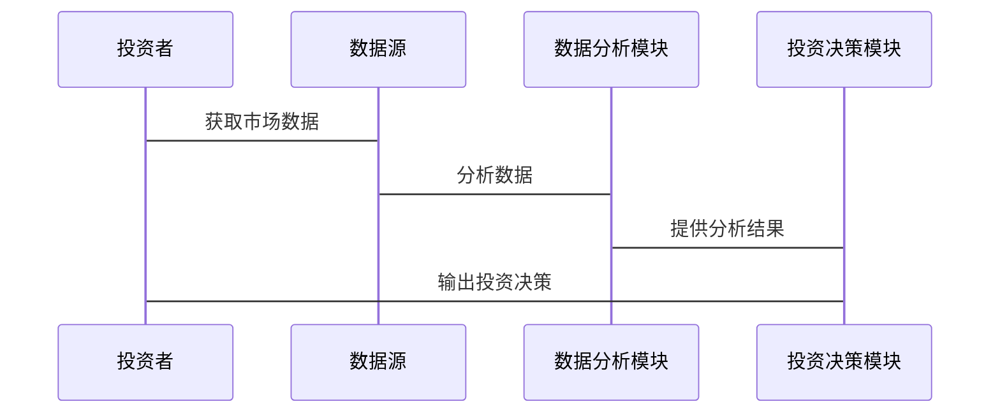

                 


# 塞思·卡拉曼的特殊情况投资

## 关键词：特殊情况投资, 投资策略, 投资模型, 投资哲学, 价值评估

## 摘要：塞思·卡拉曼是投资界的一位传奇人物，以其独特的“特殊情况投资”策略闻名。本文将深入分析卡拉曼的投资哲学、特殊情况投资的核心概念、评估模型的算法原理、系统架构设计、实际案例分析以及最佳实践，帮助读者全面理解这一投资策略。

---

## 第1章: 特殊情况投资的背景与核心概念

### 1.1 塞思·卡拉曼的生平与投资哲学

#### 1.1.1 塞思·卡拉曼的生平简介

塞思·卡拉曼（Seth Klarman）是美国著名投资经理人，出生于1956年，毕业于哈佛大学。他是投资公司Baupost Group的创始人和董事长，该机构以其在特殊情况下投资的能力而闻名。卡拉曼的投资风格以逆向投资、价值发现和严格的风险控制著称。

#### 1.1.2 卡拉曼的投资哲学与核心思想

卡拉曼的投资哲学可以总结为以下几点：
- **逆向思维**：在市场恐慌时寻找机会，买入被低估的资产。
- **安全边际**：投资时要确保有足够的安全边际，即买入价格远低于内在价值。
- **风险控制**：避免重大风险，尤其是系统性风险。
- **长期视角**：关注企业的长期价值，而非短期波动。

#### 1.1.3 卡拉曼对投资界的贡献与影响

卡拉曼通过其独特的投资策略，帮助Baupost Group在多次市场危机中成功获利，包括1987年股灾和2008年金融危机。他的投资理念影响了无数投资者，并成为许多对冲基金和机构投资者的灵感来源。

---

### 1.2 特殊情况投资的定义与背景

#### 1.2.1 什么是特殊情况投资

特殊情况投资是指在市场出现极端情况（如金融危机、经济衰退、市场崩盘等）时，寻找那些因市场恐慌而被低估的优质资产进行投资。这种投资策略通常在市场流动性枯竭、估值偏离正常水平时见效。

#### 1.2.2 特殊情况投资的市场背景

- **市场恐慌**：投资者在恐慌时会抛售资产，导致资产价格暴跌，出现低于其内在价值的交易机会。
- **流动性危机**：市场流动性不足时，某些优质资产的价格可能被压低，为特殊情况投资提供了机会。
- **经济衰退**：经济衰退期间，许多企业可能被市场抛弃，但这些企业可能具有长期价值。

#### 1.2.3 特殊情况投资的适用场景

- **市场崩盘**：如2008年金融危机期间，许多优质企业因市场抛售而价格被低估。
- **行业危机**：如某行业因政策或技术问题而出现暴跌，但某些企业可能具有长期竞争力。
- **公司困境**：如某公司因管理问题或财务困境而股价暴跌，但其核心业务仍具有价值。

---

### 1.3 特殊情况投资的核心要素

#### 1.3.1 特殊情况投资的特征分析

| 特征 | 描述 |
|------|------|
| 价格低估 | 资产价格远低于其内在价值。 |
| 市场恐慌 | 市场参与者因恐慌而抛售资产。 |
| 高质量资产 | 投资标的具有长期竞争优势和稳定现金流。 |
| 低流动性 | 市场流动性不足，导致价格被压低。 |

#### 1.3.2 投资标的的选择标准

- **基本面分析**：重点关注企业的财务状况、盈利能力、管理团队和行业地位。
- **安全边际**：确保买入价格远低于内在价值。
- **竞争优势**：选择具有长期竞争优势的企业。
- **市场情绪**：关注市场恐慌和非理性行为。

#### 1.3.3 投资决策的关键因素

- **估值**：资产价格是否低于内在价值。
- **风险**：投资标的的风险是否可控。
- **市场环境**：是否处于极端市场环境。

---

### 1.4 本章小结

#### 1.4.1 塞思·卡拉曼的核心理念

卡拉曼的核心理念是通过逆向思维和安全边际，在市场恐慌时寻找被低估的资产。

#### 1.4.2 特殊情况投资的关键要素

特殊情况投资的关键要素包括价格低估、市场恐慌、高质量资产和低流动性。

---

## 第2章: 特殊情况投资的核心概念与联系

### 2.1 特殊情况投资的核心概念

#### 2.1.1 投资标的的特殊性

特殊情况下，投资标的表现不佳，但其内在价值并未改变。卡拉曼通过分析这些资产的内在价值，寻找被市场低估的机会。

#### 2.1.2 投资机会的稀缺性

特殊情况投资的机会通常较为稀缺，因为市场恐慌时优质资产价格被压低，但数量有限。

#### 2.1.3 投资风险的可控性

通过严格的安全边际和风险控制，卡拉曼能够在市场恐慌时降低投资风险。

---

### 2.2 特殊情况投资与传统投资的对比

#### 2.2.1 投资策略的对比分析

| 投资策略 | 特殊情况投资 | 传统投资 |
|----------|--------------|----------|
| 投资时机 | 市场恐慌时 | 市场稳定时 |
| 投资目标 | 寻找低估资产 | 追求稳定收益 |
| 风险控制 | 高度注重安全边际 | 适度控制风险 |

#### 2.2.2 投资目标的差异

- **特殊情况投资**：目标是通过逆向思维寻找低估资产。
- **传统投资**：目标是通过长期持有获得稳定收益。

#### 2.2.3 投资风险的对比

- **特殊情况投资**：在市场恐慌时风险较高，但通过安全边际控制风险。
- **传统投资**：风险相对可控，但长期回报可能有限。

---

### 2.3 特殊情况投资的ER实体关系图



---

### 2.4 本章小结

#### 2.4.1 特殊情况投资的核心概念

特殊情况投资的核心概念是通过逆向思维和安全边际，在市场恐慌时寻找低估资产。

#### 2.4.2 与传统投资的主要区别

与传统投资相比，特殊情况投资更注重市场时机和安全边际，投资目标和风险控制有显著差异。

---

## 第3章: 特殊情况投资的算法原理

### 3.1 特殊情况投资的评估模型

#### 3.1.1 投资标的评估模型

卡拉曼的评估模型主要基于以下几个步骤：
1. **基本面分析**：分析企业的财务状况、盈利能力、管理团队和行业地位。
2. **内在价值计算**：通过现金流折现法等方法计算企业的内在价值。
3. **价格与价值对比**：比较市场价格与内在价值，寻找低估资产。

#### 3.1.2 投资价值的计算公式

内在价值计算公式：
$$ \text{内在价值} = \sum_{t=1}^{n} \frac{\text{现金流}_t}{(1 + r)^t} $$

其中，$r$ 是折现率，$\text{现金流}_t$ 是第 $t$ 年的现金流。

#### 3.1.3 投资风险的评估方法

- **流动性风险**：资产是否容易变现。
- **市场风险**：资产价格对市场波动的敏感性。
- **信用风险**：资产的违约风险。

---

### 3.2 投资价值评估的数学模型



---

### 3.3 投资价值计算的Python实现

```python
def calculate_intrinsic_value(market_data):
    # 市场数据处理
    # 计算现金流
    cash_flow = market_data['cash_flow']
    discount_rate = market_data['discount_rate']
    # 计算内在价值
    intrinsic_value = 0
    for t in range(len(cash_flow)):
        intrinsic_value += cash_flow[t] / (1 + discount_rate) ** t
    return intrinsic_value
```

---

### 3.4 投资价值计算的数学公式

#### 内在价值公式

$$ \text{内在价值} = \sum_{t=1}^{n} \frac{\text{现金流}_t}{(1 + r)^t} $$

其中，$r$ 是折现率，$\text{现金流}_t$ 是第 $t$ 年的现金流。

---

### 3.5 本章小结

#### 3.5.1 投资评估模型的核心步骤

投资评估模型的核心步骤包括基本面分析、内在价值计算和价格与价值对比。

#### 3.5.2 投资价值计算的关键公式

内在价值计算公式是特殊情况投资中评估资产价值的核心工具。

---

## 第4章: 特殊情况投资的系统分析与架构设计方案

### 4.1 问题场景介绍

在市场恐慌时，投资者需要快速分析市场数据，识别被低估的资产，并制定投资决策。

---

### 4.2 项目介绍

本项目旨在设计一个特殊情况投资的系统架构，帮助投资者快速分析市场数据，识别投资机会。

---

### 4.3 系统功能设计

#### 4.3.1 领域模型



---

### 4.4 系统架构设计



---

### 4.5 系统接口设计

- **数据接口**：从市场数据源获取价格、成交量等数据。
- **分析接口**：调用数据分析模块进行基本面分析和内在价值计算。
- **决策接口**：根据分析结果生成投资决策。

---

### 4.6 系统交互设计



---

## 第5章: 特殊情况投资的项目实战

### 5.1 环境安装

- **Python环境**：安装Python 3.8及以上版本。
- **数据处理库**：安装Pandas、NumPy等库。
- **可视化工具**：安装Matplotlib或Seaborn。

---

### 5.2 核心代码实现

```python
import pandas as pd
import numpy as np

def calculate_intrinsic_value(cash_flow, discount_rate):
    intrinsic_value = 0
    for t in range(len(cash_flow)):
        intrinsic_value += cash_flow[t] / (1 + discount_rate) ** t
    return intrinsic_value

# 示例数据
cash_flow = [100, 150, 200]
discount_rate = 0.1

iv = calculate_intrinsic_value(cash_flow, discount_rate)
print(f"内在价值: {iv}")
```

---

### 5.3 案例分析与详细解读

假设某企业在市场恐慌时股价暴跌至20元，其内在价值为30元。卡拉曼会判断这是一个被低估的机会，买入该资产。

---

### 5.4 项目小结

通过本项目，我们可以看到如何利用Python代码实现内在价值计算，并在实际案例中应用这一模型。

---

## 第6章: 最佳实践与总结

### 6.1 本章小结

- **投资评估模型**：内在价值计算是核心工具。
- **系统架构设计**：从数据源到投资决策的完整流程。

### 6.2 投资小结

- **逆向思维**：在市场恐慌时寻找机会。
- **安全边际**：确保买入价格低于内在价值。

### 6.3 注意事项

- **风险控制**：避免过度杠杆和集中投资。
- **市场时机**：准确判断市场恐慌时的时机。

### 6.4 拓展阅读

- 塞思·卡拉曼的著作《安全边际》。
- 其他逆向投资的经典案例分析。

---

## 第7章: 总结

塞思·卡拉曼的特殊情况投资策略通过逆向思维和安全边际，在市场恐慌时寻找被低估的资产。本文详细介绍了这一策略的核心概念、算法原理、系统架构和实际案例，帮助读者全面理解这一投资策略。

---

通过本文的学习，读者可以掌握塞思·卡拉曼的特殊情况投资策略，并在实际投资中灵活运用这些方法。

