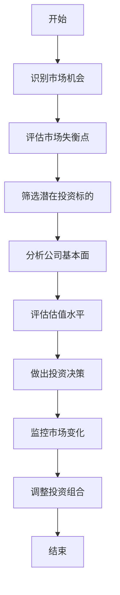
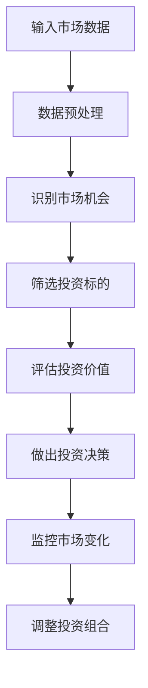
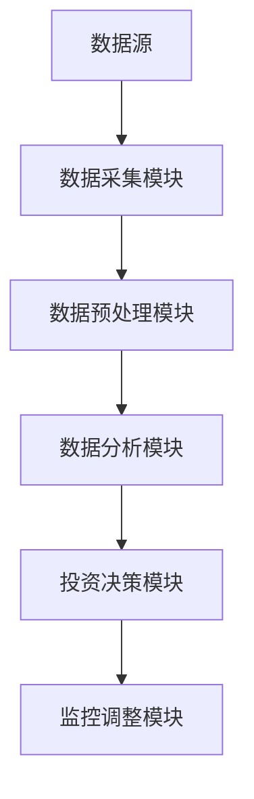

                 


# 塞思·卡拉曼的特殊情况投资策略

## 关键词
- 特殊情况投资
- 投资策略
- 价值投资
- 风险管理
- 塞思·卡拉曼

## 摘要
塞思·卡拉曼的特殊情况投资策略是一种结合了价值投资和成长投资的独特方法，旨在在特定市场条件下捕捉投资机会。本文将详细介绍该策略的核心概念、算法原理、系统架构以及实际应用，帮助读者理解如何在复杂多变的市场环境中运用这种策略。

---

# 第一部分: 背景介绍

## 第1章: 特殊情况投资概述

### 1.1 特殊情况投资的定义与背景
- **1.1.1 什么是特殊情况投资**  
  特殊情况投资是指在特定市场条件下，通过识别和利用市场的非效率性或暂时性失衡，进行投资以获得超额收益的一种策略。它不同于传统的价值投资或成长投资，更注重于捕捉短期的市场机会。

- **1.1.2 特殊情况投资的历史发展**  
  从20世纪70年代开始，特殊情况投资逐渐兴起，尤其是在市场危机或资产重组期间，投资者开始关注那些被市场低估或忽视的机会。

- **1.1.3 与传统投资策略的区别**  
  - 传统价值投资注重长期基本面分析，而特殊情况投资更注重短期市场动态。
  - 传统成长投资关注高增长潜力，而特殊情况投资则关注市场非效率性带来的机会。

### 1.2 塞思·卡拉曼的特殊情况投资策略
- **1.2.1 卡拉曼的生平简介**  
  塞思·卡拉曼是一位著名投资家，以其在市场危机期间的卓越表现而闻名。他的投资策略强调在市场失衡时寻找机会。

- **1.2.2 卡拉曼策略的核心思想**  
  卡拉曼认为，市场并非总是有效的，尤其是在危机或资产重组期间，可以通过分析市场失衡点来获取超额收益。

- **1.2.3 卡拉曼策略的哲学基础**  
  卡拉曼的策略结合了价值投资和成长投资的理念，强调在特定市场条件下，找到那些被市场低估或忽视的机会。

### 1.3 特殊情况投资的现状与趋势
- **1.3.1 当前市场环境下的特殊情况投资**  
  随着市场的不断变化，特殊情况投资的机会和挑战也在不断变化，尤其是在数字化和智能化的背景下，投资者需要更加灵活地应对市场变化。

- **1.3.2 数字化与智能化对特殊情况投资的影响**  
  技术的进步使得投资者能够更快速地分析市场数据，发现市场失衡点，从而提高投资效率。

- **1.3.3 特殊情况投资的未来发展趋势**  
  随着市场的进一步发展，特殊情况投资将更加依赖于技术驱动，投资者需要不断学习和适应新的市场环境。

---

# 第二部分: 核心概念与联系

## 第2章: 卡拉曼策略的核心概念

### 2.1 卡拉曼策略的理论基础
- **2.1.1 投资决策的三要素模型**  
  卡拉曼提出，投资决策应基于三个核心要素：市场状况、公司基本面和估值水平。

- **2.1.2 价值投资与成长投资的结合**  
  卡拉曼的策略将价值投资的估值方法与成长投资的增长潜力相结合，寻找那些被市场低估且具有增长潜力的公司。

- **2.1.3 风险管理的核心地位**  
  卡拉曼强调，风险管理是投资策略成功的关键，投资者需要在市场波动中保持冷静，并及时调整投资组合。

### 2.2 卡拉曼策略的核心要素对比
- **2.2.1 投资标的筛选标准对比表**  
  下表对比了传统投资与卡拉曼策略在投资标的筛选标准上的差异：

  | 标准                | 传统投资         | 卡拉曼策略       |
  |---------------------|------------------|------------------|
  | 估值水平            | 基于市盈率等指标 | 基于内在价值     |
  | 公司基本面          | 注重财务状况     | 注重增长潜力     |
  | 市场状况            | 忽略短期波动     | 关注市场失衡点   |

- **2.2.2 不同投资策略的优劣势分析**  
  - 传统价值投资：优点是稳定性高，缺点是灵活性差。  
  - 传统成长投资：优点是增长潜力大，缺点是风险高。  
  - 卡拉曼策略：优点是灵活性高，缺点是需要较高的市场敏感性。

- **2.2.3 卡拉曼策略的独特性总结**  
  卡拉曼策略的独特之处在于其灵活性和适应性，能够在不同的市场条件下找到合适的投资机会。

## 第3章: 卡拉曼策略的数学模型与流程图

### 3.1 卡拉曼策略的数学模型
- **3.1.1 投资价值评估公式**  
  卡拉曼使用以下公式来评估投资标的的价值：

  $$ V = \frac{E}{P} $$

  其中，$E$ 表示公司的预期收益，$P$ 表示当前价格。该公式用于衡量市场的低估程度。

- **3.1.2 投资组合优化模型**  
  卡拉曼的投资组合优化模型考虑了风险和收益的平衡：

  $$ \text{最大化收益} \quad \text{最小化风险} $$

### 3.2 卡拉曼策略的流程图
以下是一个简化的流程图，展示了卡拉曼策略的核心步骤：



---

# 第三部分: 算法原理讲解

## 第4章: 卡拉曼策略的算法实现

### 4.1 算法概述
- 卡拉曼策略的算法主要基于市场数据的分析和投资标的的筛选。
- 算法的核心是通过数据挖掘和统计分析，发现市场失衡点。

### 4.2 算法流程
以下是卡拉曼策略的算法流程图：



### 4.3 算法实现代码
以下是一个简化的Python代码示例，用于实现卡拉曼策略的核心步骤：

```python
import pandas as pd

# 数据预处理
def preprocess_data(data):
    # 假设data是包含市场数据的DataFrame
    # 这里进行数据清洗和转换
    data = data.dropna()
    data = data.drop_duplicates()
    return data

# 识别市场机会
def identify_opportunity(data):
    # 计算市场失衡指标
    data['imbalance_ratio'] = data['收益'] / data['价格']
    opportunity = data[data['imbalance_ratio'] > 1]
    return opportunity

# 筛选投资标的
def screen_investments(opportunity):
    # 筛选满足条件的投资标的
    selected = opportunity[[
        '公司名称', '行业', '地区', '估值', '基本面'
    ]]
    return selected

# 评估投资价值
def evaluate_investment(selected):
    # 计算投资价值
    selected['value'] = selected['基本面'] * selected['估值']
    return selected

# 做出投资决策
def make_investment(selected):
    # 根据价值评估结果做出决策
    investment = selected[selected['value'] > 100]
    return investment

# 监控市场变化
def monitor_market(investment):
    # 定期监控市场变化
    # 假设这里有一个监控函数
    pass

# 调整投资组合
def adjust_portfolio(investment):
    # 根据市场变化调整投资组合
    pass

# 主函数
def main():
    data = pd.read_csv('market_data.csv')
    data_processed = preprocess_data(data)
    opportunity = identify_opportunity(data_processed)
    selected = screen_investments(opportunity)
    evaluated = evaluate_investment(selected)
    investment = make_investment(evaluated)
    monitor_market(investment)
    adjust_portfolio(investment)

if __name__ == "__main__":
    main()
```

---

# 第四部分: 系统分析与架构设计方案

## 第5章: 卡拉曼策略的系统架构设计

### 5.1 系统概述
- 卡拉曼策略的系统架构包括数据采集、数据分析、投资决策和监控调整四个主要模块。

### 5.2 系统功能设计
- **数据采集模块**：负责获取市场数据。
- **数据分析模块**：对数据进行预处理和分析，识别市场机会。
- **投资决策模块**：基于分析结果做出投资决策。
- **监控调整模块**：定期监控市场变化，调整投资组合。

### 5.3 系统架构图
以下是一个简化的系统架构图：



---

# 第五部分: 项目实战

## 第6章: 卡拉曼策略的实际应用

### 6.1 案例分析
- **案例1：2008年金融危机期间的投资机会**  
  在2008年金融危机期间，卡拉曼通过识别市场的低估机会，成功投资于某些行业，获得了超额收益。

### 6.2 代码实现与解读
- 以下是一个具体的代码示例，用于分析2008年金融危机期间的投资机会：

```python
import pandas as pd
import numpy as np

# 数据加载与预处理
data = pd.read_csv('2008_market_data.csv')
data_processed = preprocess_data(data)

# 识别市场机会
opportunity = identify_opportunity(data_processed)

# 筛选投资标的
selected = screen_investments(opportunity)

# 评估投资价值
evaluated = evaluate_investment(selected)

# 做出投资决策
investment = make_investment(evaluated)

# 监控市场变化
monitor_market(investment)
```

### 6.3 实际案例分析
- **案例分析：2008年金融危机期间的投资机会**  
  在2008年金融危机期间，卡拉曼通过分析市场失衡点，成功投资于某些行业，获得了超额收益。

### 6.4 项目小结
- 通过实际案例分析，读者可以更好地理解卡拉曼策略的实际应用和效果。

---

# 第六部分: 最佳实践与小结

## 第7章: 卡拉曼策略的最佳实践

### 7.1 总结
- 卡拉曼策略是一种灵活且适应性强的投资策略，能够在特定市场条件下捕捉投资机会。

### 7.2 最佳实践
- **风险管理**：投资者需要在市场波动中保持冷静，并及时调整投资组合。
- **数据驱动**：利用数据分析工具和技术，提高投资决策的效率和准确性。
- **持续学习**：市场环境不断变化，投资者需要不断学习和适应新的市场趋势。

### 7.3 注意事项
- 投资者需要具备较高的市场敏感性，能够快速识别市场机会。
- 投资者需要具备较强的风险管理能力，能够应对市场波动带来的挑战。

### 7.4 拓展阅读
- 建议读者进一步阅读塞思·卡拉曼的经典著作，深入了解其投资策略的细节。

---

# 附录

## 附录A: 术语表
- **特殊情况投资**：一种在特定市场条件下，通过识别和利用市场的非效率性或暂时性失衡，进行投资以获得超额收益的策略。
- **卡拉曼策略**：塞思·卡拉曼提出的一种特殊情况投资策略，结合了价值投资和成长投资的理念，注重在市场失衡点寻找投资机会。

## 附录B: 数据来源
- 数据来源包括历史市场数据、公司财务报表、行业研究报告等。

## 附录C: 参考文献
- 塞思·卡拉曼的经典著作。
- 相关学术论文和研究报告。

---

通过以上详细的内容，读者可以全面了解塞思·卡拉曼的特殊情况投资策略，并能够在实际投资中灵活运用这些策略，捕捉市场机会，实现超额收益。

