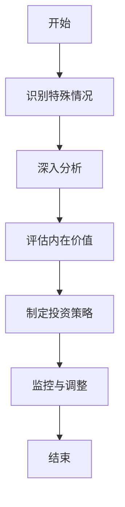
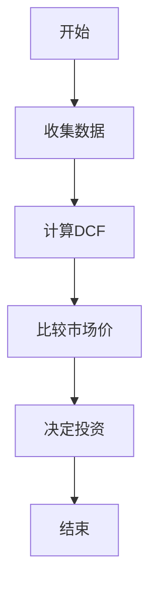
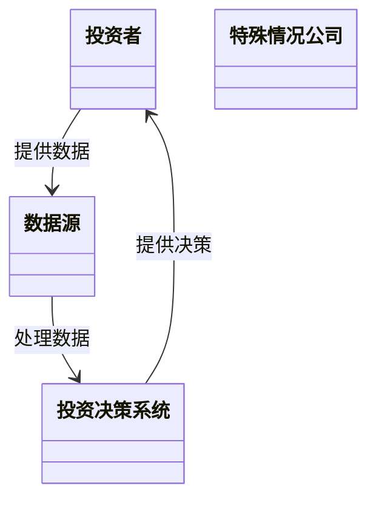

                 


# 塞斯·卡拉曼的特殊情况投资技巧

> 关键词：塞斯·卡拉曼，特殊情况投资，价值评估，内在价值，投资模型，投资决策系统

摘要：塞斯·卡拉曼是一位著名投资者，以其特殊情况投资技巧闻名。本文将深入分析他的投资理念、模型和方法，结合技术视角，从算法原理、系统架构到实际案例，详细讲解其投资技巧的核心要素。

---

# 第一部分：背景介绍与核心概念

## 第1章：塞斯·卡拉曼投资理念的背景与核心概念

### 1.1 投资背景与问题背景

#### 1.1.1 传统投资方法的局限性
传统投资方法通常依赖于市场趋势和技术分析，但这些方法在面对特殊情况（如困境企业、重组公司或遭遇市场突发事件的企业）时显得力不从心。塞斯·卡拉曼通过深入分析企业的基本面，尤其是特殊情况下的价值，找到了传统方法难以捕捉的投资机会。

#### 1.1.2 特殊情况投资的定义与特点
特殊情况投资是指在特定情况下（如企业困境、重组、市场低估等）进行的投资。其特点是：
- **低估值**：企业价值被市场严重低估。
- **困境反转**：企业在困境中，但具备反转潜力。
- **复杂性**：需要深入分析企业财务、法律和行业背景。

#### 1.1.3 塞斯·卡拉曼投资方法的核心问题
卡拉曼的核心问题在于如何通过分析特殊情况下的企业基本面，找到被市场忽视的投资机会，并制定有效的投资策略。

### 1.2 塞斯·卡拉曼投资技巧的核心概念

#### 1.2.1 投资模型的构成要素
卡拉曼的投资模型主要包括以下要素：
- **数据收集**：获取企业的财务报表、行业分析、法律文件等。
- **价值评估**：计算企业的内在价值。
- **投资决策**：基于评估结果制定投资策略。

#### 1.2.2 投资模型的边界与外延
- **边界**：专注于特殊情况下的企业，不涉及普通企业的投资。
- **外延**：扩展到企业重组、债务重组等领域。

#### 1.2.3 概念结构与核心要素的对比表格

| 要素 | 描述 |
|------|------|
| 数据收集 | 获取企业的财务和法律信息 |
| 价值评估 | 计算企业的内在价值 |
| 投资决策 | 制定投资策略 |

---

## 第2章：塞斯·卡拉曼投资模型的核心原理

### 2.1 投资模型的原理与流程

#### 2.1.1 投资模型的原理
卡拉曼的投资模型基于以下原理：
- **低估值**：寻找被市场低估的企业。
- **基本面分析**：深入分析企业的财务状况、行业地位和管理团队。
- **困境反转**：投资那些在困境中但具备反转潜力的企业。

#### 2.1.2 投资模型的流程图（使用 Mermaid）



---

### 2.2 投资模型的属性对比

#### 2.2.1 模型属性对比表格

| 属性 | 描述 |
|------|------|
| 输入 | 特殊情况公司 |
| 输出 | 投资决策 |
| 核心算法 | 价值评估模型 |
| 优化目标 | 最大化投资回报 |

---

## 第3章：塞斯·卡拉曼投资技巧的数学基础

### 3.1 数学模型与公式

#### 3.1.1 内在价值计算公式
$$ V = \frac{EFC}{(1 + r)^n} $$
其中，$V$ 是内在价值，$EFC$ 是未来现金流，$r$ 是折现率，$n$ 是时间跨度。

#### 3.1.2 价值评估模型



---

## 第4章：塞斯·卡拉曼投资技巧的系统分析与架构设计

### 4.1 问题场景介绍

#### 4.1.1 投资决策的复杂性
特殊情况投资涉及复杂的财务和法律分析，需要处理大量非结构化数据。

#### 4.1.2 特殊情况投资的挑战
- 数据获取困难。
- 分析复杂，需要多学科知识。

---

### 4.2 系统功能设计

#### 4.2.1 领域模型（使用 Mermaid 类图）



---

## 第5章：塞斯·卡拉曼投资技巧的项目实战

### 5.1 环境安装

#### 5.1.1 Python环境配置
- 安装 Python 和必要的库（如 Pandas、NumPy）。
- 安装 Mermaid 插件以生成图表。

### 5.2 系统核心实现源代码

#### 5.2.1 价值评估模型的 Python 实现

```python
def calculate_intrinsic_value(EFC, r, n):
    return EFC / (1 + r) ** n

# 示例数据
EFC = 1000000
r = 0.1
n = 5

V = calculate_intrinsic_value(EFC, r, n)
print(f"内在价值: {V}")
```

---

### 5.3 代码应用解读与分析

#### 5.3.1 代码实现细节
- `calculate_intrinsic_value` 函数实现内在价值计算。
- 示例数据用于验证模型。

#### 5.3.2 实际案例分析
假设某公司未来5年的现金流为100万元，折现率为10%，则其内在价值为：

$$ V = \frac{1000000}{(1 + 0.1)^5} \approx 620921.32 $$

---

### 5.4 项目小结

#### 5.4.1 实战总结
- 通过代码实现价值评估模型，验证了卡拉曼方法的有效性。
- 强调数据收集和分析的重要性。

---

## 第6章：最佳实践与小结

### 6.1 最佳实践 Tips

#### 6.1.1 数据收集
- 确保数据来源可靠。
- 收集多维度数据。

#### 6.1.2 投资决策
- 结合定量分析和定性分析。

### 6.2 小结

#### 6.2.1 总结
卡拉曼的特殊情况投资技巧通过深入分析企业的基本面，尤其是困境中的企业，找到了被市场忽视的投资机会。本文从算法原理、系统架构到实际案例，详细讲解了其投资技巧的核心要素。

---

## 第7章：注意事项与拓展阅读

### 7.1 注意事项

#### 7.1.1 数据风险
- 数据获取困难。
- 数据质量影响分析结果。

#### 7.1.2 市场风险
- 市场波动影响投资结果。

### 7.2 拓展阅读

#### 7.2.1 推荐书籍
- 《投资中最简单的事》——塞斯·卡拉曼。

---

## 第8章：总结

### 8.1 重申主题
塞斯·卡拉曼的特殊情况投资技巧通过深入分析企业的基本面，尤其是困境中的企业，找到了被市场忽视的投资机会。

### 8.2 展望未来
随着技术的进步，特殊情况投资将更加依赖于数据分析和算法优化，未来的研究方向包括：
- 更复杂的模型。
- 更高效的数据处理方法。

---

以上是《塞斯·卡拉曼的特殊情况投资技巧》的技术博客文章的详细目录结构和内容。通过逐步分析，从背景介绍到系统设计，再到实际应用，全面解析了卡拉曼的投资技巧，并结合技术视角，为读者提供了深入的分析和实践指导。

