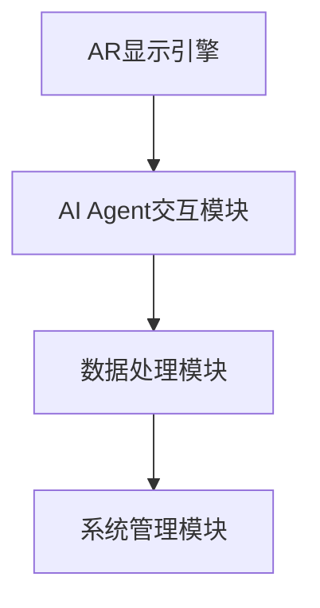
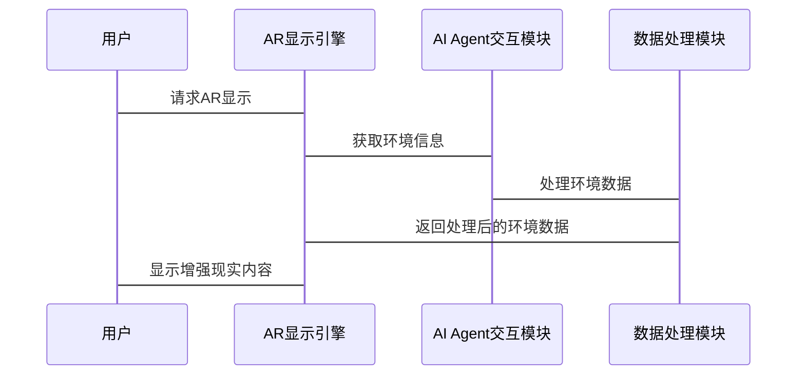

                 

# 增强现实技术与AI Agent的结合

> 关键词：增强现实, AI Agent, 技术结合, 算法协同, 应用场景

> 摘要：本文深入探讨了增强现实（AR）与人工智能代理（AI Agent）的结合，分析了它们在技术、算法和应用上的协同效应。通过详细讲解核心概念、算法原理、系统架构以及实际案例，本文旨在为读者提供一个全面的理解框架，帮助他们在实际项目中有效应用这一结合。

---

## 第1章: 增强现实技术与AI Agent的背景介绍

### 1.1 增强现实技术的基本概念
#### 1.1.1 增强现实的定义与特点
增强现实（AR）是一种将数字信息叠加在现实世界上的技术，通过计算机视觉、图形学等技术实现。其特点包括实时性、交互性、沉浸式体验和环境感知能力。

#### 1.1.2 增强现实的核心技术与应用领域
AR的核心技术包括计算机视觉、图像处理、几何变换和实时渲染。其应用领域涵盖游戏、教育、医疗、军事和工业制造等。

#### 1.1.3 增强现实的演进历程与发展趋势
AR技术起源于20世纪60年代，经历了从简单图形叠加到复杂动态交互的演进。未来，AR将更加智能化、网络化和普及化。

### 1.2 AI Agent的基本概念与特点
#### 1.2.1 AI Agent的定义与分类
AI Agent是一种能够感知环境并采取行动以实现目标的智能实体，分为简单反射型、基于模型推理型和学习型三类。

#### 1.2.2 AI Agent的核心技术与应用领域
AI Agent的核心技术包括感知、推理、学习和决策。其应用领域涵盖智能助手、自动驾驶、机器人和智能家居等。

#### 1.2.3 AI Agent的演进历程与发展趋势
AI Agent起源于专家系统，经历了从规则驱动到数据驱动的转变。未来，AI Agent将更加注重人机协作和自适应能力。

### 1.3 增强现实与AI Agent的结合背景
#### 1.3.1 增强现实与AI Agent结合的意义
通过结合AR的环境感知能力和AI Agent的智能决策能力，可以实现更智能化的增强现实应用。

#### 1.3.2 两者的结合在技术上的优势
AR为AI Agent提供丰富的环境信息，而AI Agent为AR提供智能决策支持，二者结合能够实现更复杂的任务。

#### 1.3.3 两者的结合在应用上的潜力
在教育、医疗、工业和娱乐等领域，AR与AI Agent的结合将带来更高效、更智能的应用体验。

---

## 第2章: 增强现实与AI Agent的核心概念与联系

### 2.1 增强现实的核心原理
#### 2.1.1 增强现实的实现流程
1. 感知环境：通过摄像头、传感器等获取实时环境数据。
2. 数据处理：利用计算机视觉技术进行图像识别、特征提取和几何变换。
3. 内容生成：根据环境数据生成虚拟内容。
4. 渲染与显示：将虚拟内容叠加在现实环境中并实时显示。

#### 2.1.2 增强现实的关键技术
- **计算机视觉**：图像识别、目标检测、特征匹配。
- **图形渲染**：三维建模、光照计算、实时渲染。
- **跟踪与定位**：SLAM（同步定位与地图构建）、惯性测量单元（IMU）。

#### 2.1.3 增强现实的数学模型与公式
增强现实中的几何变换矩阵：
$$
\begin{pmatrix}
x' \\
y' \\
z' \\
w'
\end{pmatrix}
= 
\begin{pmatrix}
\cos\theta & -\sin\theta & 0 & t_x \\
\sin\theta & \cos\theta & 0 & t_y \\
0 & 0 & 1 & t_z \\
0 & 0 & 0 & 1
\end{pmatrix}
\begin{pmatrix}
x \\
y \\
z \\
w
\end{pmatrix}
$$

### 2.2 AI Agent的核心原理
#### 2.2.1 AI Agent的感知与决策机制
AI Agent通过传感器或数据源获取环境信息，利用感知算法进行信息处理，然后基于推理和学习生成决策，并通过执行器采取行动。

#### 2.2.2 AI Agent的推理与学习算法
- **感知算法**：目标检测（如YOLO）、语义分割（如U-Net）。
- **决策算法**：强化学习（如Q-Learning）、决策树（如ID3）。
- **学习算法**：监督学习（如线性回归）、无监督学习（如K-means）。

#### 2.2.3 AI Agent的通信与协作机制
AI Agent通过通信协议（如MQTT、HTTP）与其他系统或Agent进行信息交换，实现协作任务。

### 2.3 增强现实与AI Agent的联系与区别
#### 2.3.1 增强现实与AI Agent的核心联系
- **信息融合**：AR通过环境感知技术为AI Agent提供丰富的上下文信息。
- **智能交互**：AI Agent通过智能决策为AR提供动态的交互体验。

#### 2.3.2 增强现实与AI Agent的主要区别
- **目标不同**：AR注重环境叠加，AI Agent注重智能决策。
- **实现方式不同**：AR依赖图形渲染和计算机视觉，AI Agent依赖感知和推理算法。

#### 2.3.3 两者的结合在技术上的协同效应
通过结合AR的环境感知能力和AI Agent的智能决策能力，可以实现更复杂、更智能的增强现实应用。

---

## 第3章: 增强现实与AI Agent的核心算法与数学模型

### 3.1 增强现实的核心算法
#### 3.1.1 增强现实中的图像处理算法
- **图像分割**：将图像分成不同区域，识别感兴趣的目标。
- **特征匹配**：通过SIFT、SURF等算法匹配图像中的关键点。
- **几何变换**：通过仿射变换将虚拟对象与现实环境对齐。

#### 3.1.2 增强现实中的几何变换算法
- **透视变换**：将二维图像映射到三维空间。
- **投影变换**：将虚拟对象投影到现实环境中。

#### 3.1.3 增强现实中的跟踪与定位算法
- **SLAM技术**：通过视觉SLAM实现实时定位和地图构建。
- **IMU融合**：结合惯性测量单元数据实现更精准的定位。

### 3.2 AI Agent的核心算法
#### 3.2.1 AI Agent中的感知算法
- **目标检测**：利用YOLO、Faster R-CNN等算法检测环境中的目标。
- **语义分割**：通过U-Net等模型分割图像中的不同区域。
- **语音识别**：通过ASR（自动语音识别）技术识别用户的语音指令。

#### 3.2.2 AI Agent中的决策算法
- **强化学习**：通过Q-Learning、Deep Q-Network（DQN）等算法实现智能决策。
- **决策树**：通过ID3、C4.5等算法构建决策树进行分类和回归。
- **贝叶斯网络**：通过概率推理进行决策。

#### 3.2.3 AI Agent中的学习与优化算法
- **监督学习**：通过线性回归、支持向量机（SVM）等算法进行分类和回归。
- **无监督学习**：通过K-means、聚类分析等算法进行数据挖掘。
- **深度学习**：通过卷积神经网络（CNN）、循环神经网络（RNN）等模型实现特征学习和模式识别。

### 3.3 增强现实与AI Agent结合的算法协同
#### 3.3.1 增强现实与AI Agent算法的协同机制
通过AR的环境感知技术获取实时环境数据，AI Agent利用这些数据进行智能决策，并将结果反馈给AR系统进行动态调整。

#### 3.3.2 两者的算法融合与优化
- **实时跟踪与定位**：结合视觉SLAM和IMU数据实现更精准的定位。
- **动态交互**：通过实时通信协议实现AR与AI Agent之间的动态交互。

#### 3.3.3 两者的算法实现案例
- **增强现实中的目标检测**：通过YOLO算法检测现实环境中的目标，并将其与虚拟对象进行交互。
- **智能决策与路径规划**：通过强化学习算法实现AI Agent在增强现实环境中的路径规划和任务执行。

---

## 第4章: 增强现实与AI Agent的系统分析与架构设计

### 4.1 问题场景介绍
- **项目介绍**：设计一个基于AR和AI Agent的智能辅助导航系统。
- **项目目标**：通过结合AR的环境感知能力和AI Agent的智能决策能力，实现用户在复杂环境中的智能导航。

### 4.2 系统功能设计
- **领域模型**：用户、环境、虚拟对象、AI Agent之间的关系。
- **系统架构**：包括AR显示引擎、AI Agent交互模块、数据处理模块和系统管理模块。

### 4.3 系统架构设计
#### 4.3.1 系统架构图

#### 4.3.2 系统接口设计
- **输入接口**：摄像头、麦克风、IMU等。
- **输出接口**：AR显示器、扬声器、执行器等。

#### 4.3.3 系统交互序列图

### 4.4 项目实战
#### 4.4.1 环境搭建
- **开发环境**：Windows或Linux操作系统。
- **开发工具**：Unity或Unreal Engine进行AR开发，Python进行AI Agent开发。
- **依赖库**：OpenCV、TensorFlow、ROS（机器人操作系统）。

#### 4.4.2 核心代码实现
- **AR显示引擎**：使用Unity或Unreal Engine实现AR显示功能。
- **AI Agent交互模块**：使用Python和TensorFlow实现目标检测、语义分割等功能。
- **数据处理模块**：使用ROS实现多传感器数据融合和任务规划。

#### 4.4.3 功能测试与优化
- **测试场景**：复杂环境下的目标检测、路径规划和动态交互。
- **性能优化**：通过优化算法和硬件配置提高系统的实时性和准确性。

### 4.5 项目小结
通过结合AR和AI Agent，可以实现更智能化的增强现实应用。项目实战部分详细展示了如何在实际中实现这一结合，并通过测试和优化提升系统的性能。

---

## 第5章: 增强现实与AI Agent结合的最佳实践

### 5.1 小结
- **核心内容回顾**：通过结合AR的环境感知能力和AI Agent的智能决策能力，可以实现更复杂、更智能的增强现实应用。
- **关键点总结**：实时跟踪与定位、动态交互、多传感器融合是实现这一结合的关键技术。

### 5.2 注意事项
- **硬件配置**：确保系统的硬件配置能够支持实时的环境感知和智能决策。
- **算法优化**：通过算法优化和硬件加速提升系统的实时性和准确性。
- **数据隐私**：在实际应用中，需要注意用户数据的隐私和安全问题。

### 5.3 拓展阅读
- **推荐书籍**：《增强现实技术入门与实践》、《人工智能代理与智能系统》。
- **推荐论文**：《基于深度学习的增强现实目标检测》、《AI Agent在增强现实中的应用研究》。

---

## 第6章: 总结与展望

### 6.1 总结
通过本文的深入探讨，我们了解了增强现实与AI Agent结合的重要性和实现方法。结合AR的环境感知能力和AI Agent的智能决策能力，可以实现更复杂、更智能的增强现实应用。

### 6.2 展望
未来，随着技术的不断发展，AR与AI Agent的结合将更加智能化、网络化和普及化。我们可以期待更多创新的应用场景和更高效的解决方案。

---

通过以上目录和内容的详细设计，读者可以系统地了解增强现实与AI Agent结合的技术背景、核心概念、算法实现和实际应用，为他们在相关领域的研究和实践提供有价值的参考。

