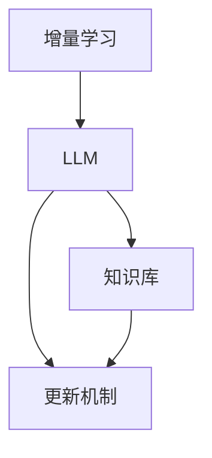
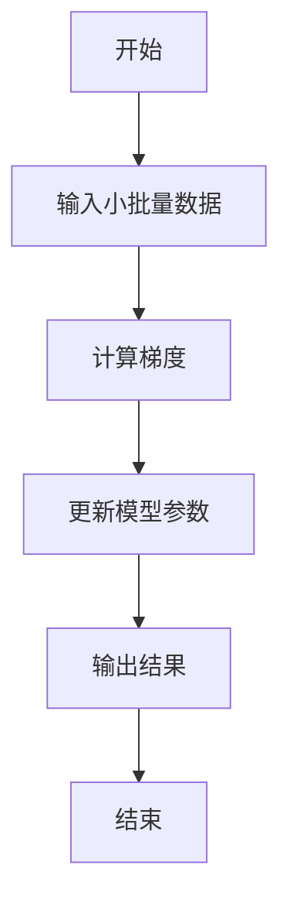
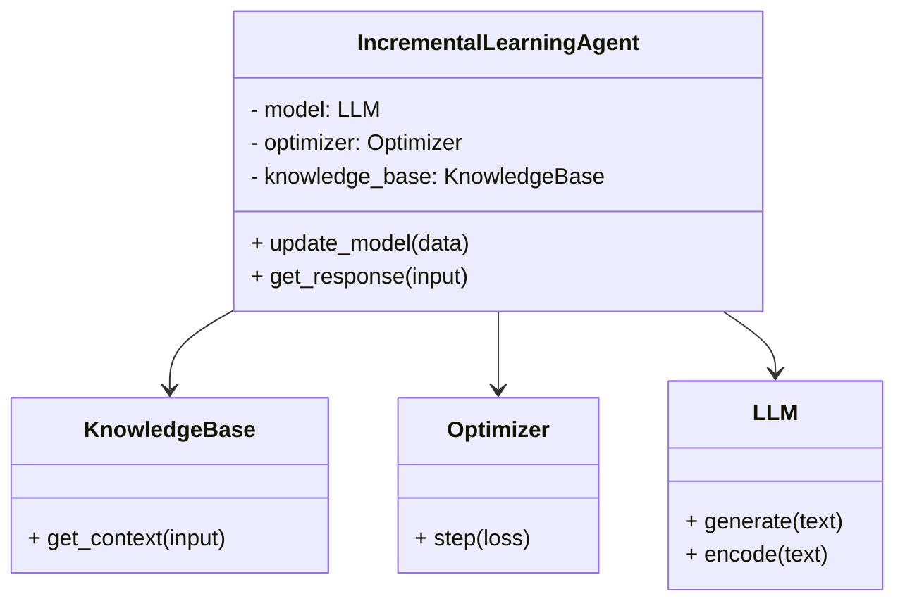
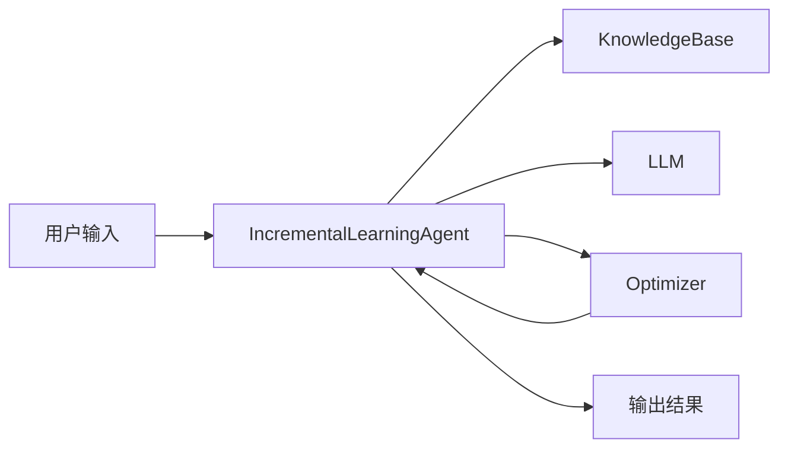
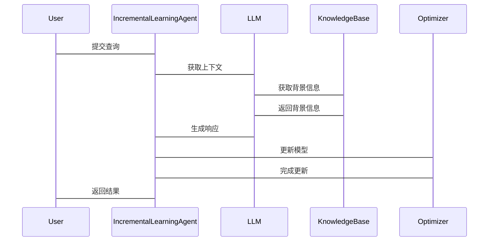

                 


# 增量学习AI Agent：LLM的持续知识更新机制

## 关键词：增量学习，AI Agent，LLM，知识更新，机器学习，深度学习

## 摘要：本文深入探讨了增量学习AI Agent在大语言模型（LLM）中的持续知识更新机制。通过分析增量学习的核心原理、算法实现、系统架构以及实际应用，详细阐述了如何通过增量学习提升LLM的实时性和灵活性，使其能够适应快速变化的知识需求。

---

## 第1章：引言

### 1.1 问题背景与目标

#### 1.1.1 当前AI Agent的知识更新挑战

在人工智能领域，AI Agent需要具备持续学习和更新知识的能力，以应对不断变化的环境和用户需求。传统的知识更新机制通常依赖于大量的训练数据和计算资源，这不仅效率低下，还难以满足实时性和灵活性的要求。

#### 1.1.2 增量学习的核心目标

增量学习是一种基于小批量数据逐步优化模型的技术，其核心目标是通过在线更新模型参数，实现知识的持续积累和进化。这种方法特别适用于需要实时响应和动态调整的AI Agent。

#### 1.1.3 LLM在增量学习中的独特优势

大语言模型（LLM）具有强大的上下文理解和生成能力，结合增量学习的特性，可以在不重新训练整个模型的前提下，实现局部参数的优化和知识的更新。

### 1.2 问题描述与解决方案

#### 1.2.1 AI Agent知识更新的定义

AI Agent的知识更新是指通过持续学习新数据，优化模型参数，提升模型的性能和适应性。这种更新机制可以在不中断现有功能的情况下，逐步增强模型的能力。

#### 1.2.2 LLM增量学习的实现路径

通过设计特定的增量学习算法，优化LLM的参数，使其能够逐步吸收新的知识，同时保持原有的模型能力。

#### 1.2.3 边界与外延分析

知识更新的边界在于模型的更新频率和数据量，外延则涉及模型的适应性和泛化能力。

### 1.3 本章小结

本章通过对增量学习和LLM的背景分析，明确了增量学习AI Agent的目标和实现路径，为后续的详细探讨奠定了基础。

---

## 第2章：增量学习与LLM的核心概念

### 2.1 增量学习的基本原理

#### 2.1.1 增量学习的定义与特点

增量学习是一种在线学习方法，其特点在于数据是逐步提供给模型的，模型在每一步中仅更新部分参数，以适应新数据。

#### 2.1.2 增量学习与传统机器学习的对比

| 特性       | 增量学习             | 传统机器学习       |
|------------|----------------------|--------------------|
| 数据量     | 小批量、实时更新     | 大规模、离线训练   |
| 计算资源   | 低                   | 高                 |
| 适应性     | 高                   | 中                 |

#### 2.1.3 增量学习的核心机制

通过微调模型参数，逐步优化模型性能，同时保留已有知识。

### 2.2 LLM的基本原理

#### 2.2.1 大语言模型的定义与特点

LLM是一种基于深度学习的生成模型，具有强大的上下文理解和生成能力。

#### 2.2.2 LLM的核心技术与实现机制

基于Transformer架构，通过自注意力机制和前馈网络实现文本的生成和理解。

### 2.3 增量学习与LLM的结合

#### 2.3.1 增量学习在LLM中的应用场景

实时对话、动态任务处理等需要快速更新知识的场景。

#### 2.3.2 增量学习如何提升LLM的知识更新能力

通过局部参数优化，实现模型的动态更新，同时保持整体模型的稳定性和准确性。

### 2.4 核心概念对比表

| 概念       | 增量学习             | LLM             |
|------------|----------------------|-----------------|
| 输入数据   | 小批量、实时更新     | 大规模预训练   |
| 更新机制   | 微调、参数优化       | 预训练+微调     |
| 应用场景   | 实时对话、动态任务   | 多任务通用处理 |

### 2.5 ER实体关系图



---

## 第3章：增量学习AI Agent的算法原理

### 3.1 增量学习算法的设计与实现

#### 3.1.1 增量学习算法的选择

基于Transformer的增量学习模型，适用于文本生成和理解任务。

#### 3.1.2 算法流程图



#### 3.1.3 算法实现代码

```python
def incremental_learning(model, optimizer, data_batch):
    optimizer.zero_grad()
    outputs = model(data_batch)
    loss = calculate_loss(outputs, data_batch.targets)
    loss.backward()
    optimizer.step()
    return model
```

#### 3.1.4 数学模型与公式

模型的更新过程可以表示为：

$$\theta_{t+1} = \theta_t + \eta \cdot \nabla_{\theta_t} L$$

其中，$\theta$ 表示模型参数，$\eta$ 表示学习率，$L$ 表示损失函数。

---

## 第4章：增量学习AI Agent的系统架构设计

### 4.1 问题场景介绍

实时对话系统需要快速响应用户的查询，并根据反馈优化模型性能。

### 4.2 系统功能设计

#### 4.2.1 领域模型设计



#### 4.2.2 系统架构设计



#### 4.2.3 系统接口设计

- 输入接口：接收用户查询和反馈
- 输出接口：生成响应和更新日志

#### 4.2.4 交互流程图



---

## 第5章：增量学习AI Agent的项目实战

### 5.1 环境安装

安装必要的库，如PyTorch、Hugging Face Transformers等。

### 5.2 核心代码实现

```python
from transformers import AutoTokenizer, AutoModelForCausalLM
import torch

class IncrementalLearningAgent:
    def __init__(self, model_name='gpt2'):
        self.model = AutoModelForCausalLM.from_pretrained(model_name)
        self.tokenizer = AutoTokenizer.from_pretrained(model_name)
        self.optimizer = torch.optim.Adam(self.model.parameters(), lr=1e-5)
    
    def update_model(self, data):
        inputs = self.tokenizer(data['input'], return_tensors='pt')
        outputs = self.model(**inputs)
        loss = outputs.loss
        self.optimizer.zero_grad()
        loss.backward()
        self.optimizer.step()
    
    def get_response(self, input_text):
        inputs = self.tokenizer(input_text, return_tensors='pt')
        outputs = self.model.generate(inputs.input_ids, max_length=50)
        return self.tokenizer.decode(outputs[0])
```

### 5.3 代码应用解读与分析

通过微调模型参数，逐步优化LLM的生成能力，实现知识的持续更新。

### 5.4 实际案例分析

通过具体案例分析，展示增量学习在LLM中的实际应用效果和优化过程。

### 5.5 项目小结

总结项目实现的关键点和经验教训，为后续优化提供参考。

---

## 第6章：增量学习AI Agent的最佳实践

### 6.1 小结

总结全文的主要内容和核心观点。

### 6.2 注意事项

在实际应用中需要注意的问题，如模型收敛性、数据质量等。

### 6.3 拓展阅读

推荐相关领域的深入阅读材料，如分布式增量学习、在线学习算法等。

---

## 第7章：总结与展望

### 7.1 全文总结

通过增量学习，LLM能够实现持续的知识更新，提升AI Agent的实时性和灵活性。

### 7.2 未来展望

展望增量学习在LLM中的进一步应用和发展方向。

---

## 参考文献

列出本文参考的相关文献和资料。

---

通过以上目录结构，可以系统地撰写一篇关于增量学习AI Agent在LLM中的持续知识更新机制的深度技术博客文章，确保内容全面、逻辑清晰且易于理解。

