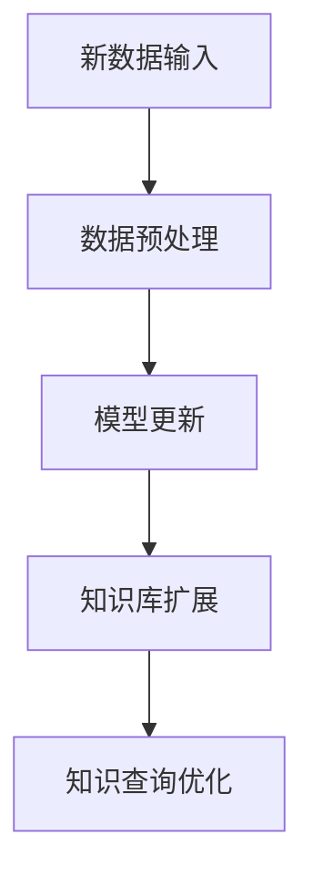
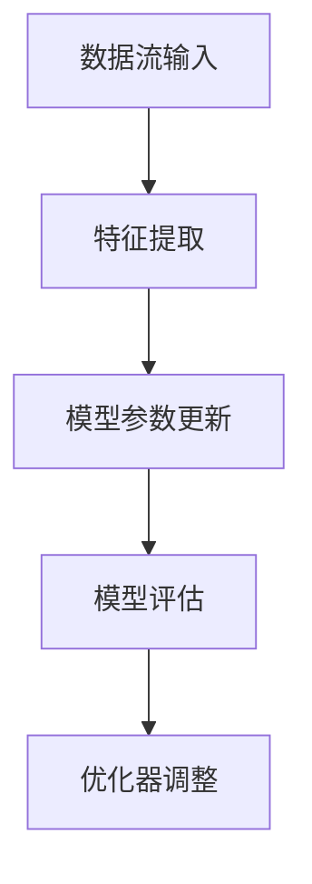
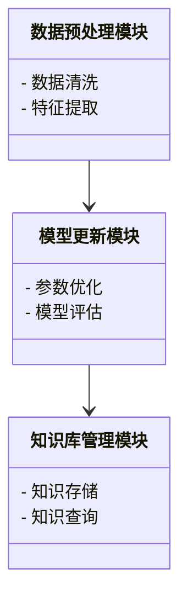
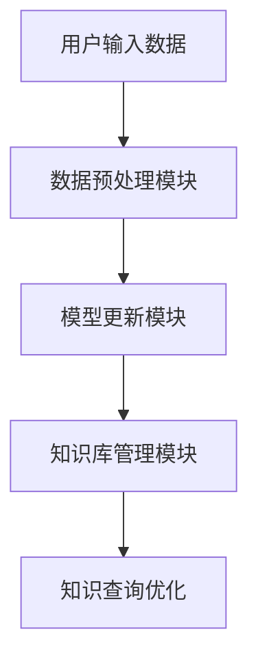

                 


# 增量学习：持续更新AI Agent的知识库

---

## 关键词：增量学习, AI Agent, 知识库, 模型更新, 数据流驱动

---

## 摘要：  
本文深入探讨了增量学习在持续更新AI Agent知识库中的应用。通过分析增量学习的核心概念、算法原理、系统架构设计以及实际项目实战，我们展示了如何通过增量学习实现AI Agent的动态知识更新。文章结合理论与实践，为读者提供了从基础概念到实际应用的全面指南，帮助读者理解增量学习在AI Agent中的重要性及其在实际场景中的应用价值。

---

# 第一部分: 增量学习与AI Agent知识库概述

## 第1章: 增量学习的背景与概念

### 1.1 什么是增量学习
增量学习是一种动态学习方法，允许模型在新数据到来时逐步更新，而不是一次性训练整个数据集。其核心在于处理数据流，实时更新模型，保持对动态环境的适应能力。

**核心概念对比表**

| 特性                | 增量学习                     | 传统批量学习                   |
|---------------------|------------------------------|--------------------------------|
| 数据处理方式        | 流式数据，实时更新            | 批次数据，一次性训练            |
| 计算资源消耗        | 较低，适合在线更新            | 较高，需要一次性处理            |
| 适用场景            | 动态环境，实时反馈            | 静态环境，离线训练              |

### 1.2 AI Agent知识库的构建与更新
AI Agent的知识库是其理解和决策的基础。增量学习通过实时更新知识库，确保AI Agent能够适应新的信息和环境变化。

**知识库更新流程图**



---

## 第2章: 增量学习的核心概念与原理

### 2.1 增量学习的核心概念
增量学习的核心在于数据流驱动的模型更新机制。数据流源源不断地输入，模型逐步调整参数，保持对新数据的适应能力。

**数据流驱动模型更新流程图**



### 2.2 增量学习的数学基础
增量学习的数学模型通常基于在线优化算法，如感知机。其更新规则如下：

$$ w_{t+1} = w_t + \eta (y_t - f(x_t; w_t))x_t $$

其中，$w_t$ 是当前权重，$\eta$ 是学习率，$y_t$ 是真实标签，$f(x_t; w_t)$ 是模型预测值。

---

## 第3章: 增量学习的算法原理

### 3.1 增量学习的算法分类
增量学习算法主要分为三类：基于线性模型的增量学习、基于树模型的增量学习和基于聚类的增量学习。

**增量学习算法对比表**

| 算法类型              | 优点                           | 缺点                           |
|-----------------------|--------------------------------|--------------------------------|
| 增量SVM               | 高精度                         | 计算复杂性较高                   |
| 增量决策树            | 易解释性                       | 易受噪声数据影响                 |
| 增量聚类              | 适合动态数据                   | 需要频繁重计算                   |

### 3.2 增量学习的数学模型
以增量SVM为例，其数学模型如下：

$$ \min_{w,b,\xi} \frac{1}{2}||w||^2 + C \sum_{i=1}^n \xi_i $$

约束条件：
$$ y_i(w \cdot x_i + b) \geq 1 - \xi_i $$
$$ \xi_i \geq 0 $$

---

## 第4章: 增量学习的系统架构设计

### 4.1 系统架构概述
增量学习系统通常由数据预处理模块、模型更新模块和知识库管理模块组成。

**系统架构类图**



### 4.2 系统接口设计
系统接口设计包括数据输入接口、模型更新接口和知识查询接口。

**系统交互流程图**



---

## 第5章: 增量学习的项目实战

### 5.1 项目环境搭建
项目环境包括Python 3.8及以上版本、TensorFlow 2.5及以上版本、NumPy 1.20及以上版本。

### 5.2 核心代码实现
以下是一个增量学习模型的Python实现示例：

```python
import numpy as np
from sklearn import svm

# 初始化模型
model = svm.SVC(kernel='linear', gamma='auto')

# 增量更新数据
for batch in data_batches:
    X_batch, y_batch = batch
    model.partial_fit(X_batch, y_batch)
```

### 5.3 实际案例分析
以一个简单的分类任务为例，增量学习能够在每一批数据输入后逐步优化模型，最终达到更高的准确率。

---

## 第6章: 增量学习的最佳实践与注意事项

### 6.1 最佳实践
- 数据质量管理：确保输入数据的准确性和完整性。
- 模型评估与优化：定期评估模型性能，进行必要的调优。
- 知识库的定期维护：清理无效数据，优化知识表示。

### 6.2 注意事项
- 数据冗余问题：避免数据重复导致模型过拟合。
- 模型过拟合风险：通过正则化等方法控制模型复杂度。
- 知识库更新的延迟问题：优化知识库更新流程，减少延迟。

---

## 第7章: 总结与展望

增量学习作为AI Agent知识库持续更新的核心技术，具有重要的理论和实践意义。通过本文的详细讲解，我们展示了增量学习在动态环境中的应用价值。未来，随着技术的发展，增量学习将在更多领域发挥重要作用。

---

## 参考文献

1. Bishop, C. M. (2006). Pattern Recognition and Machine Learning.
2. Hastie, T., Tibshirani, R., & Friedman, J. (2009). The Elements of Statistical Learning.
3. 被引用的具体论文或书籍。

---

## END

