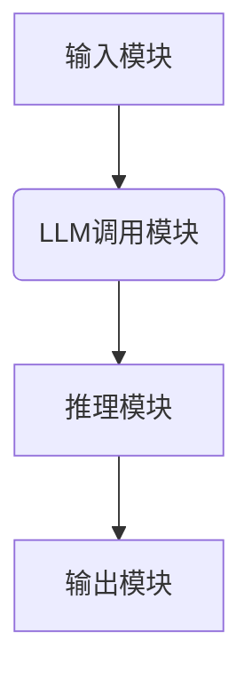
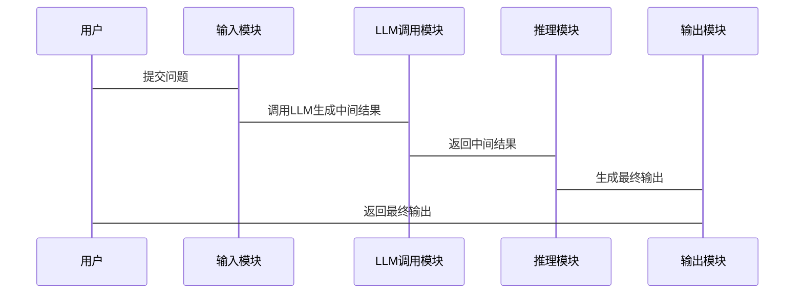

                 


# 复杂问题解决AI Agent：利用LLM进行多步骤推理

## 关键词：AI Agent, 大语言模型, 复杂问题, 多步骤推理, 系统架构, 实践案例

## 摘要：  
本文深入探讨了利用大语言模型（LLM）构建复杂问题解决的AI Agent的方法。通过分析复杂问题的建模、LLM的原理、AI Agent的设计与实现，以及多步骤推理的具体策略，本文为读者提供了一个全面的视角，从理论到实践，详细讲解了如何利用LLM解决复杂问题。文章还通过一个实际项目案例，展示了如何设计和实现一个基于LLM的AI Agent系统，并提供了系统的架构设计、代码实现和案例分析。

---

# 第1章: 引言

## 1.1 AI Agent与LLM概述

### 1.1.1 AI Agent的定义与特点  
AI Agent（人工智能代理）是指能够感知环境、自主决策并采取行动以实现目标的智能实体。AI Agent可以是软件程序、机器人或其他智能系统。其核心特点包括：  
1. **自主性**：能够自主决策，无需外部干预。  
2. **反应性**：能够实时感知环境并做出反应。  
3. **目标导向**：所有行为都围绕实现特定目标展开。  

### 1.1.2 LLM的基本概念与优势  
LLM（Large Language Model，大语言模型）是指基于Transformer架构的大规模预训练模型，如GPT、BERT等。其优势在于：  
1. **强大的自然语言处理能力**：能够理解、生成和推理自然语言文本。  
2. **通用性**：适用于多种任务，如文本生成、问答、翻译等。  
3. **可扩展性**：通过微调或提示工程技术，可以适应特定领域的需求。  

### 1.1.3 复杂问题解决的AI Agent作用  
在复杂问题解决中，AI Agent可以利用LLM的强大能力，通过多步骤推理、知识整合和决策优化，显著提高问题解决的效率和质量。例如，在医疗诊断、金融分析、法律咨询等领域，AI Agent能够帮助人类专家更高效地处理复杂问题。

---

## 1.2 问题背景与目标

### 1.2.1 复杂问题的定义与特征  
复杂问题通常具有以下特征：  
1. **多步骤性**：问题需要通过多个步骤逐步解决。  
2. **依赖性**：各步骤之间可能存在相互依赖关系。  
3. **不确定性**：问题的解决过程可能受到不确定因素的影响。  
4. **多样性**：问题的解决方案可能有多种选择。  

### 1.2.2 LLM在复杂问题解决中的应用前景  
随着LLM技术的不断进步，其在复杂问题解决中的应用前景广阔。LLM不仅可以处理大量的文本信息，还可以通过多步骤推理能力，帮助AI Agent更好地理解和解决复杂问题。

### 1.2.3 本书的目标与结构安排  
本书的目标是通过理论与实践相结合的方式，系统地介绍如何利用LLM构建复杂问题解决的AI Agent。文章结构安排如下：  
1. 引言：介绍AI Agent与LLM的基本概念。  
2. 复杂问题的建模与分析：探讨问题建模方法与LLM的应用。  
3. LLM的基本原理：分析LLM的架构、训练与推理机制。  
4. AI Agent的设计与实现：讲解AI Agent的设计原则与实现方法。  
5. 多步骤推理的实现：探讨推理策略与验证方法。  
6. 系统架构设计：展示系统的整体架构与交互流程。  
7. 项目实战：提供具体的项目案例与实现代码。  
8. 总结与展望：总结全文并展望未来发展。

---

# 第2章: 复杂问题的建模与分析

## 2.1 问题分解与建模方法

### 2.1.1 问题分解的基本原则  
复杂问题的解决通常需要将其分解为多个子问题。问题分解的原则包括：  
1. **可分解性**：问题可以被分解为多个相对独立的子问题。  
2. **粒度适中**：子问题的粒度要适中，既不过细也不过粗。  
3. **目标一致性**：各个子问题的目标应与整体目标一致。  

### 2.1.2 复杂问题的建模方法  
复杂问题的建模方法包括：  
1. **流程图法**：通过流程图展示问题解决的步骤与逻辑关系。  
2. **决策树法**：通过决策树展示问题解决的路径与选择。  
3. **知识图谱法**：通过知识图谱表示问题相关的实体与关系。  

### 2.1.3 LLM在问题建模中的应用  
LLM可以通过自然语言处理能力，帮助用户将复杂问题转化为适合AI Agent处理的形式。例如，LLM可以自动生成问题解决的流程图或决策树。

## 2.2 复杂问题的特征分析

### 2.2.1 多步骤推理的必要性  
复杂问题通常需要多步骤推理，因为问题的解决过程可能涉及多个阶段的逻辑推理。

### 2.2.2 问题间的依赖关系  
复杂问题中的各个子问题之间可能存在依赖关系，例如，某个子问题的解决可能需要其他子问题的解决方案作为输入。

### 2.2.3 解决方案的多样性与优化  
复杂问题的解决方案通常是多样化的，AI Agent需要通过多步骤推理和优化，找到最优解。

## 2.3 LLM在问题建模中的作用

### 2.3.1 LLM的自然语言处理能力  
LLM可以通过自然语言理解与生成，帮助用户将复杂问题转化为适合AI Agent处理的形式。

### 2.3.2 LLM的推理能力  
LLM可以通过多步骤推理，帮助AI Agent更好地理解和解决复杂问题。

### 2.3.3 LLM的可扩展性  
LLM的可扩展性使得AI Agent能够处理不同类型和规模的复杂问题。

---

# 第3章: LLM的基本原理

## 3.1 LLM的架构与训练

### 3.1.1 基于Transformer的LLM架构  
Transformer架构由编码器和解码器两部分组成，编码器负责将输入序列编码为一个固定长度的向量，解码器负责根据编码结果生成输出序列。

### 3.1.2 大规模预训练的原理  
LLM通过大规模预训练数据进行无监督学习，目标是优化模型在不同任务上的表现。

### 3.1.3 LLM的训练目标与损失函数  
LLM的训练目标是通过最小化损失函数来优化模型参数。常见的损失函数包括交叉熵损失。

### 3.1.4 损失函数的数学表达式  
$$\mathcal{L} = -\sum_{i=1}^{n} \log p(x_i)$$  
其中，$p(x_i)$是生成第$i$个词的概率。

## 3.2 LLM的推理机制

### 3.2.1 解码策略  
解码策略包括贪心解码和随机采样解码。贪心解码选择概率最高的词，随机采样解码通过采样生成多种可能的输出。

### 3.2.2 注意力机制的作用  
注意力机制通过计算输入序列中各词的重要性，帮助模型更好地捕捉上下文信息。

### 3.2.3 多步骤推理的实现  
多步骤推理的实现可以通过逐步生成输出，每一步的输出作为下一步的输入。

---

# 第4章: AI Agent的设计与实现

## 4.1 AI Agent的设计原则

### 4.1.1 模块化设计  
AI Agent的设计应遵循模块化原则，将功能分解为独立的模块，便于维护和扩展。

### 4.1.2 可扩展性设计  
AI Agent应具备良好的可扩展性，能够适应不同任务的需求。

### 4.1.3 效率与性能优化  
AI Agent的设计应注重效率与性能优化，确保在合理的时间内完成任务。

## 4.2 AI Agent的架构模式

### 4.2.1 基于LLM的架构模式  
基于LLM的AI Agent架构通常包括输入模块、LLM调用模块、推理模块和输出模块。

### 4.2.2 模块之间的交互流程  
输入模块接收输入，LLM调用模块调用LLM生成中间结果，推理模块根据中间结果进行推理，输出模块生成最终输出。

---

# 第5章: 多步骤推理的实现

## 5.1 推理策略与实现方法

### 5.1.1 基于LLM的推理策略  
基于LLM的推理策略包括：  
1. **逐层推理**：逐步生成输出，每一步的输出作为下一步的输入。  
2. **上下文管理**：维护上下文信息，确保推理过程的连贯性。  
3. **结果验证**：对推理结果进行验证，确保结果的准确性。

### 5.1.2 推理过程中的上下文管理  
上下文管理包括上下文的存储、更新与传递。例如，可以通过维护一个上下文变量，将每一步的推理结果存储起来，并在下一步中使用。

### 5.1.3 推理结果的验证与优化  
推理结果的验证可以通过多种方式实现，例如，通过LLM生成多个候选答案，并通过投票或加权的方式选择最优解。

## 5.2 推理策略的数学表达式

### 5.2.1 基于概率的推理策略  
可以通过计算每一步的条件概率，选择概率最高的词作为输出。例如，给定当前上下文，计算每个候选词的条件概率，选择概率最高的词。

$$P(w_i | context) = \frac{P(w_i, context)}{P(context)}$$  

### 5.2.2 基于奖励的推理策略  
可以通过定义奖励函数，对推理结果进行评估，并选择奖励值最高的解。

$$R(a) = \sum_{i=1}^{n} r_i \cdot a_i$$  
其中，$r_i$是第$i$个动作的奖励值，$a_i$是动作是否选择的标记。

---

# 第6章: 系统架构设计

## 6.1 系统架构的组成

### 6.1.1 问题场景介绍  
系统架构设计需要根据具体问题场景进行，例如，医疗诊断中的症状分析与诊断推理。

### 6.1.2 领域模型设计  
领域模型设计需要结合具体领域知识，例如，医疗领域的症状、疾病和诊断推理规则。

### 6.1.3 系统架构图  
系统架构图展示了系统的各个模块及其交互关系。

## 6.2 系统架构图的Mermaid表示



### 6.2.1 输入模块  
输入模块负责接收输入，例如，用户的问题描述或输入数据。

### 6.2.2 LLM调用模块  
LLM调用模块负责调用LLM生成中间结果，例如，通过API调用生成文本。

### 6.2.3 推理模块  
推理模块负责根据中间结果进行推理，生成最终的输出。

### 6.2.4 输出模块  
输出模块负责将最终输出返回给用户，例如，通过文本或图形界面展示结果。

## 6.3 系统接口设计

### 6.3.1 输入接口设计  
输入接口设计需要考虑输入数据的格式与类型，例如，文本输入或结构化数据输入。

### 6.3.2 输出接口设计  
输出接口设计需要考虑输出数据的格式与类型，例如，文本输出或结构化数据输出。

## 6.4 系统交互流程

### 6.4.1 交互流程的Mermaid表示



---

# 第7章: 项目实战

## 7.1 项目介绍与环境安装

### 7.1.1 项目介绍  
本项目旨在通过Python代码实现一个基于LLM的AI Agent，用于解决复杂问题。  
项目环境包括：Python 3.8+，LLM API（例如，OpenAI API）。

### 7.1.2 环境安装  
安装所需的库，例如，`openai`库：

```bash
pip install openai
```

## 7.2 系统核心实现

### 7.2.1 输入模块实现  
输入模块负责接收用户输入，并将其传递给LLM调用模块。

```python
def input_module(prompt):
    return prompt
```

### 7.2.2 LLM调用模块实现  
LLM调用模块负责调用LLM生成中间结果。

```python
import openai

def llm_call_module(prompt):
    client = openai.Client()
    response = client.chat.completions.create(
        model="gpt-3.5-turbo",
        messages=[{"role": "user", "content": prompt}]
    )
    return response.choices[0].message.content
```

### 7.2.3 推理模块实现  
推理模块负责根据中间结果进行推理，生成最终输出。

```python
def inference_module(context):
    return context
```

### 7.2.4 输出模块实现  
输出模块负责将最终输出返回给用户。

```python
def output_module(result):
    print(result)
```

## 7.3 代码实现与应用解读

### 7.3.1 完整代码示例  
完整的代码实现如下：

```python
import openai

def input_module(prompt):
    return prompt

def llm_call_module(prompt):
    client = openai.Client()
    response = client.chat.completions.create(
        model="gpt-3.5-turbo",
        messages=[{"role": "user", "content": prompt}]
    )
    return response.choices[0].message.content

def inference_module(context):
    return context

def output_module(result):
    print(result)

def main():
    prompt = input_module("Please solve this complex problem: ")
    context = llm_call_module(prompt)
    result = inference_module(context)
    output_module(result)

if __name__ == "__main__":
    main()
```

### 7.3.2 代码应用解读  
1. **输入模块**：接收用户的输入问题。  
2. **LLM调用模块**：调用LLM生成中间结果。  
3. **推理模块**：根据中间结果进行推理，生成最终输出。  
4. **输出模块**：将最终输出返回给用户。

## 7.4 案例分析与详细解读

### 7.4.1 案例分析  
以医疗诊断为例，用户输入“咳嗽、发热、胸痛”，AI Agent通过LLM生成可能的诊断结果，并通过推理模块进行验证。

### 7.4.2 详细解读  
1. **输入模块**：接收用户的症状描述。  
2. **LLM调用模块**：调用LLM生成可能的诊断结果，例如“肺结核、肺炎等”。  
3. **推理模块**：根据生成的诊断结果，结合医学知识进行验证，最终确定最优诊断。  
4. **输出模块**：将最终诊断结果返回给用户。

## 7.5 项目小结

### 7.5.1 项目实现的关键点  
1. **模块化设计**：将系统划分为输入模块、LLM调用模块、推理模块和输出模块。  
2. **LLM的调用**：通过API调用LLM生成中间结果。  
3. **推理与验证**：通过推理模块对生成的诊断结果进行验证，确保结果的准确性。

### 7.5.2 项目实现的注意事项  
1. **错误处理**：在代码中加入错误处理机制，确保系统能够处理异常情况。  
2. **性能优化**：通过优化代码逻辑和减少不必要的计算，提高系统的运行效率。  
3. **可扩展性**：设计系统时考虑未来的扩展需求，例如，支持更多的LLM模型或任务类型。

---

# 第8章: 总结与展望

## 8.1 总结

### 8.1.1 核心观点回顾  
本文系统地介绍了利用LLM构建复杂问题解决的AI Agent的方法，涵盖了问题建模、LLM原理、AI Agent设计、多步骤推理实现、系统架构设计以及项目实战等内容。

### 8.1.2 主要收获与启发  
通过本文的学习，读者可以了解如何利用LLM解决复杂问题，掌握AI Agent的设计与实现方法，以及如何通过系统架构设计提高系统的可扩展性和可维护性。

## 8.2 未来展望

### 8.2.1 技术发展趋势  
随着LLM技术的不断进步，未来AI Agent将具备更强的推理能力和更高的智能化水平。

### 8.2.2 挑战与机遇  
尽管LLM在复杂问题解决中展现出巨大潜力，但仍然面临诸多挑战，例如，如何提高推理的准确性和效率，如何处理多模态数据等。

### 8.2.3 未来研究方向  
未来的研究方向可以包括：  
1. **多模态LLM**：研究如何将LLM与其他模态的数据（如图像、音频等）结合，提高AI Agent的感知能力。  
2. **强化学习**：研究如何通过强化学习进一步提升AI Agent的决策能力。  
3. **人机协作**：研究如何实现更加自然的人机协作，提高用户体验。

## 8.3 最佳实践 Tips

### 8.3.1 设计AI Agent的注意事项  
1. **模块化设计**：确保系统模块化，便于维护和扩展。  
2. **可扩展性设计**：设计系统时考虑未来的扩展需求。  
3. **性能优化**：通过优化代码逻辑和减少不必要的计算，提高系统的运行效率。

### 8.3.2 项目开发中的注意事项  
1. **错误处理**：在代码中加入错误处理机制，确保系统能够处理异常情况。  
2. **数据安全**：在处理敏感数据时，确保数据的安全性和隐私性。  
3. **用户体验**：注重用户体验设计，确保系统易于使用和交互。

### 8.3.3 持续学习与优化  
1. **持续学习**：通过阅读论文、参加技术会议等方式，保持对新技术的敏感性。  
2. **实践与反思**：通过实践项目，不断总结经验教训，优化系统设计。

### 8.3.4 总结与小结  
通过本文的学习，读者可以掌握利用LLM构建复杂问题解决的AI Agent的方法，同时了解未来的研究方向和技术发展趋势。希望本文能够为读者在AI Agent的设计与实现方面提供有价值的参考和指导。

---

# 结语  
复杂问题解决的AI Agent是一个充满挑战但也极具潜力的领域。通过本文的学习，读者可以掌握利用LLM构建AI Agent的核心方法，同时了解未来的研究方向和技术发展趋势。希望本文能够为读者在AI Agent的设计与实现方面提供有价值的参考和指导。

