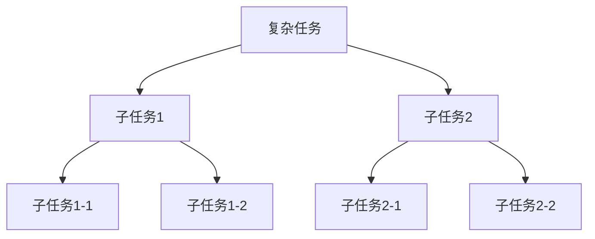
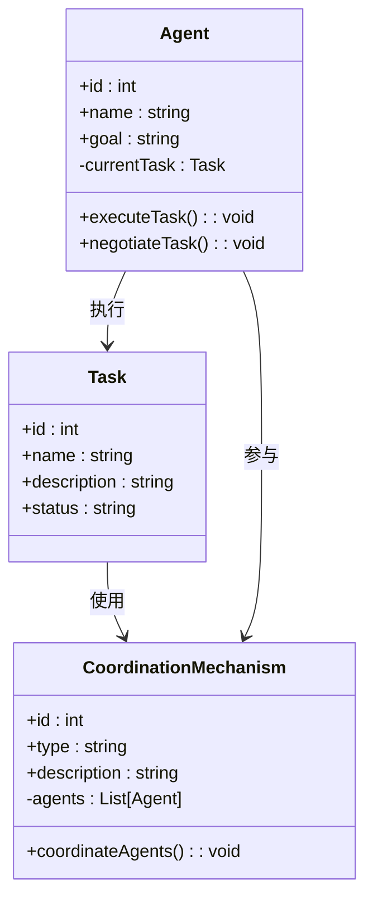

                 


# 多Agent协作系统：复杂任务的分解与协调

> 关键词：多Agent系统，任务分解，协调机制，复杂任务，分布式计算，智能协作

> 摘要：本文详细探讨了多Agent协作系统在复杂任务分解与协调中的应用。首先介绍了多Agent系统的基本概念和复杂任务的特点，接着分析了任务分解与协调的核心概念及其关系。随后，通过ER实体关系图和算法流程图，详细讲解了任务分解与协调的实现原理。最后，通过具体案例分析和系统架构设计，展示了多Agent协作系统的实际应用，并总结了相关经验和最佳实践。

---

## 第一部分：多Agent协作系统概述

### 第1章：多Agent协作系统的基本概念

#### 1.1 多Agent系统的定义
多Agent系统（Multi-Agent System, MAS）是由多个智能体（Agent）组成的分布式系统，这些智能体能够自主决策、协作完成任务。每个Agent都有自己的目标、知识和行为，能够与其他Agent或环境进行交互。

#### 1.2 复杂任务的特点
复杂任务通常具有以下特点：
1. **规模大**：任务涉及多个子任务，需要协调多个智能体。
2. **异构性**：不同子任务需要不同的技能或资源。
3. **动态性**：任务执行过程中可能出现不可预见的变化。
4. **协作性**：需要多个智能体协作完成。

#### 1.3 多Agent协作系统的应用场景
1. **分布式计算**：如分布式数据库、分布式计算任务分配。
2. **智能机器人协作**：如智能工厂中的机器人协作。
3. **群智计算**：如社交网络中的信息协作。

---

### 第2章：复杂任务的分解与协调

#### 2.1 复杂任务的分解
任务分解是将复杂任务分解为多个子任务，确保每个子任务可以由单个Agent完成。分解方法包括：
1. **层次分解法**：将任务分解为多个子任务，形成层次结构。
2. **功能分解法**：根据功能需求分解任务。

#### 2.2 协调机制
协调机制确保多个Agent能够协作完成任务，常见的协调机制包括：
1. **协商机制**：Agent之间通过协商分配任务。
2. **规划机制**：通过规划算法生成协作计划。

---

## 第二部分：多Agent协作系统的实体关系图

### 第3章：多Agent协作系统的实体关系图

#### 3.1 实体关系图的定义
ER图用于描述系统中的实体及其关系。在多Agent系统中，主要实体包括：
1. **Agent**：具有自主决策能力的智能体。
2. **任务**：需要分解和协作完成的任务。
3. **协调机制**：用于协调Agent之间协作的机制。

#### 3.2 ER实体关系图
以下是多Agent协作系统的ER实体关系图：

```mermaid
erDiagram
    agent(Agent) {
        +id : int
        +name : string
        +goal : string
    }
    task(Task) {
        +id : int
        +name : string
        +description : string
    }
    coordinationMechanism(CoordinationMechanism) {
        +id : int
        +type : string
        +description : string
    }
    agent --> task : 执行
    task --> coordinationMechanism : 使用
    agent --> coordinationMechanism : 参与
```

---

## 第三部分：多Agent协作系统的算法原理

### 第4章：任务分解算法

#### 4.1 基于层次的任务分解算法
层次分解法将任务分解为多个子任务，形成层次结构。以下是一个简单的层次分解算法：



#### 4.2 协调机制的实现
协商机制是多Agent协作的重要部分，以下是一个协商算法的伪代码：

```python
def negotiate_task分配(agents, tasks):
    for agent in agents:
        for task in tasks:
            if agent有能力完成task:
                if agent未分配任务:
                    分配task给agent
                    return
    # 如果所有任务都分配完毕，返回True
    return True
```

---

## 第四部分：系统分析与架构设计

### 第5章：系统分析与架构设计

#### 5.1 问题场景介绍
假设我们有一个智能工厂，需要多个机器人协作完成订单分配和路径规划。

#### 5.2 系统功能设计
以下是系统功能的领域模型：



#### 5.3 系统架构设计
以下是系统架构的mermaid图：


---

## 第五部分：项目实战

### 第6章：项目实战

#### 6.1 环境配置
1. 安装Python和相关库（如`networkx`、`numpy`）。
2. 安装多Agent模拟框架（如` mesa`）。

#### 6.2 核心代码实现

```python
import mesa

class Agent(mesa.Agent):
    def __init__(self, unique_id, model):
        super().__init__(unique_id, model)
        self.task = None

    def step(self):
        if self.task is not None:
            # 执行任务
            self.model完成任务(self.task)
        else:
            # 协商任务
            self.negotiate_task()

def negotiate_task(self):
    # 协商任务逻辑
    pass

class Model(mesa.Model):
    def __init__(self, N):
        super().__init__()
        self.agents = [Agent(i, self) for i in range(N)]
        self.tasks = [Task(1, "任务1", "描述1"), Task(2, "任务2", "描述2")]

    def完成任务(self, task):
        # 完成任务的逻辑
        pass
```

#### 6.3 案例分析
以物流调度为例，多个配送Agent需要协作完成订单分配和路径规划。通过协商机制，每个Agent分配到合适的任务，并协作完成。

#### 6.4 项目小结
本项目展示了多Agent协作系统的实现，包括任务分解、协商机制和系统架构设计。

---

## 第六部分：最佳实践

### 第7章：总结与展望

#### 7.1 小结
多Agent协作系统在复杂任务分解与协调中具有重要作用。通过合理分解任务和设计协调机制，可以提高系统的效率和灵活性。

#### 7.2 注意事项
1. **任务分解的粒度**：任务分解的粒度过细或过粗会影响系统的效率。
2. **通信机制**：需要设计可靠的通信机制，确保Agent之间的有效协作。
3. **容错性**：多Agent系统需要考虑单个Agent故障的情况。

#### 7.3 拓展阅读
1. 《Multi-Agent Systems: Complexity, Decentralization and Adaptation》
2. 《Coordination and Planning for Multi-Agent Systems》

---

以上是《多Agent协作系统：复杂任务的分解与协调》的完整目录和内容概要，涵盖了从理论到实践的各个方面，适合技术读者深入理解和应用。

