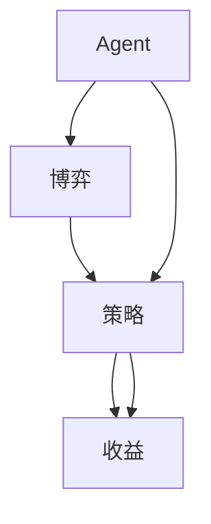
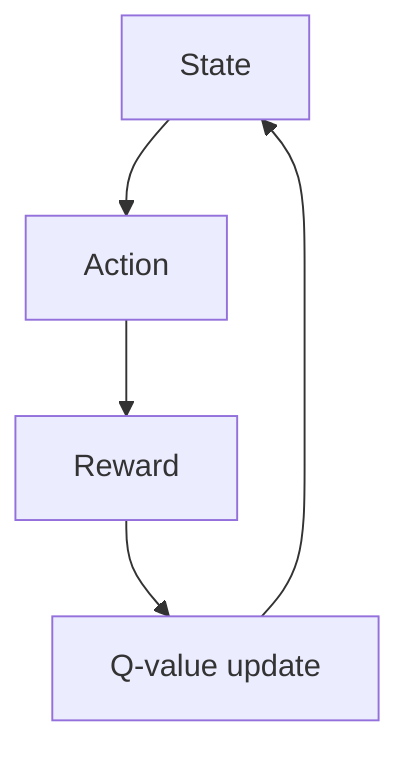
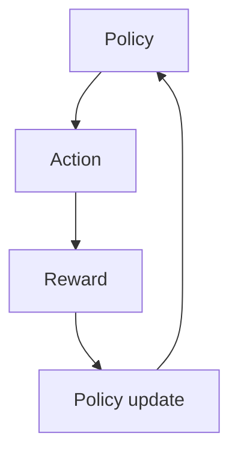
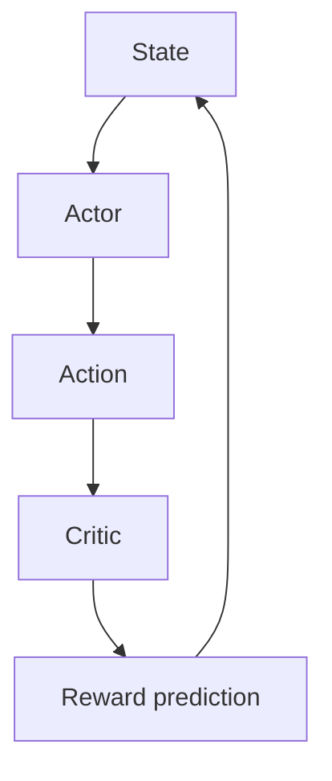
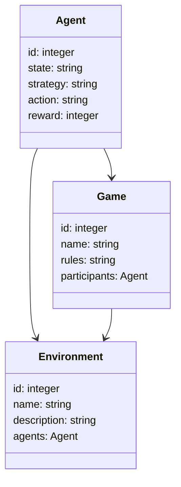
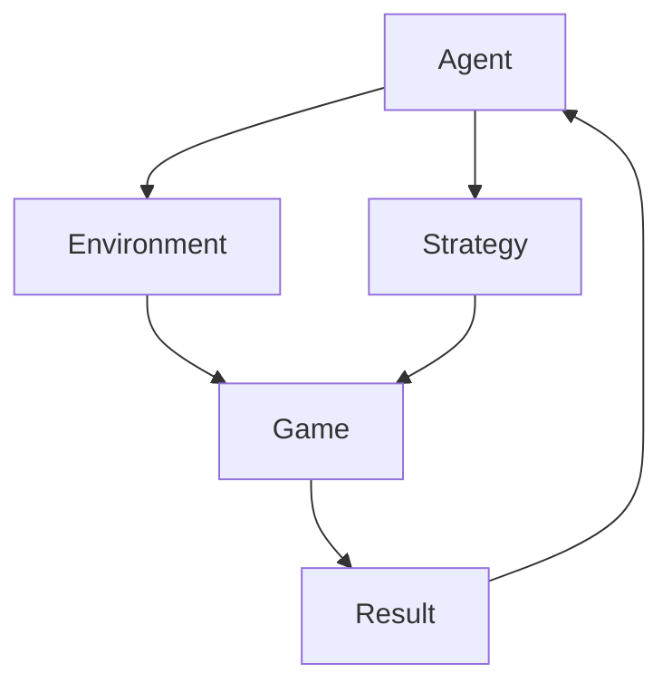
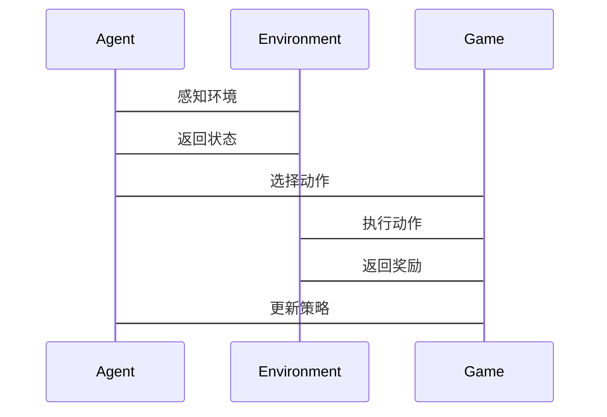

                 


# 多Agent博弈系统：策略学习与优化技术

## 关键词
多Agent系统、博弈论、策略学习、强化学习、进化算法、系统架构

## 摘要
本文深入探讨了多Agent博弈系统中的策略学习与优化技术。从背景知识到核心概念，再到具体的算法实现和系统架构设计，全面解析了多Agent博弈系统的构建与优化方法。通过实际案例分析，展示了策略学习与优化技术在多Agent系统中的应用价值。

---

## 第一部分: 多Agent博弈系统概述

### 第1章: 多Agent系统与博弈论基础

#### 1.1 多Agent系统的基本概念

##### 1.1.1 Agent的定义与特征
- **定义**: Agent是具有感知环境、自主决策和行动能力的智能实体。
- **特征**:
  - 自主性：Agent能够独立做出决策。
  - 反应性：能够实时感知环境并做出响应。
  - 社会性：能够在多个Agent之间进行交互和协作。

##### 1.1.2 多Agent系统的分类
- **完全自主型**: Agent之间完全独立，无中央控制。
- **分布式型**: Agent之间通过分布式协调完成任务。
- **混合型**: 结合自主和集中控制的系统。

##### 1.1.3 多Agent系统的应用场景
- 智能交通管理：多辆自动驾驶汽车协同行驶。
- 电商推荐系统：多个推荐Agent协同为用户推荐商品。
- 多智能体游戏：多个AI角色在游戏中协同或对抗。

#### 1.2 博弈论基础

##### 1.2.1 博弈论的基本概念
- **博弈**: 是多个参与者（Agent）在特定规则下进行决策的过程。
- **参与者**: 博弈中的决策者。
- **策略**: 参与者在博弈中的行动计划。
- **收益**: 每个参与者在博弈中的结果。

##### 1.2.2 博弈的类型与特点
- **零和博弈**: 一方的收益是另一方的损失。
- **非零和博弈**: 参与者的收益可以同时增加。
- **完全信息博弈**: 所有参与者都了解博弈的规则和可能的结果。
- **不完全信息博弈**: 参与者对某些信息不完全了解。

##### 1.2.3 博弈论在多Agent系统中的应用
- 多Agent系统中的协作与竞争问题可以用博弈论进行建模。
- 博弈论为多Agent系统的决策制定提供了理论基础。

#### 1.3 多Agent博弈系统的结合

##### 1.3.1 多Agent与博弈论的结合
- 多Agent系统中的每个Agent都可以看作是一个博弈参与者。
- 多Agent系统的协作与竞争关系可以用博弈论进行建模。

##### 1.3.2 多Agent博弈系统的定义与特点
- **定义**: 由多个具有自主决策能力的Agent组成的博弈系统。
- **特点**:
  - 多智能体之间的决策相互影响。
  - 系统的复杂性高，需要协调各Agent的行为。

##### 1.3.3 多Agent博弈系统的应用场景
- 智能交通管理：多辆自动驾驶汽车协同行驶，避免碰撞。
- 电商推荐系统：多个推荐Agent协同为用户推荐商品，提高用户满意度。
- 多智能体游戏：多个AI角色在游戏中协同或对抗，提供更丰富的游戏体验。

---

### 第2章: 多Agent博弈系统的核心概念与联系

#### 2.1 多Agent博弈系统的核心概念

##### 2.1.1 Agent的定义与属性
- **定义**: Agent是具有感知环境、自主决策和行动能力的智能实体。
- **属性**:
  - 感知能力：通过传感器或其他方式获取环境信息。
  - 决策能力：基于感知信息做出决策。
  - 行动能力：根据决策执行动作。

##### 2.1.2 博弈的定义与类型
- **定义**: 博弈是多个参与者在特定规则下进行决策的过程。
- **类型**:
  - 零和博弈：一方的收益是另一方的损失。
  - 非零和博弈：参与者收益可以同时增加。
  - 完全信息博弈：所有参与者都了解博弈的规则和可能的结果。
  - 不完全信息博弈：参与者对某些信息不完全了解。

##### 2.1.3 策略的定义与分类
- **定义**: 策略是Agent在博弈中采取的行动计划。
- **分类**:
  - 纯策略：Agent在每种情况下都采取固定行动。
  - 混合策略：Agent以一定概率随机选择行动。

##### 2.1.4 多Agent博弈系统的实体关系
- **实体**:
  - Agent：博弈的参与者。
  - 状态：博弈中各Agent所处的环境条件。
  - 动作：Agent在博弈中的具体行为。
  - 收益：Agent在博弈中的结果。

##### 2.1.5 多Agent博弈系统的联系
- **Agent与博弈**: 多Agent系统中的每个Agent都是一个博弈参与者。
- **博弈与策略**: 多Agent系统的协作与竞争关系可以用博弈论进行建模。

---

#### 2.2 多Agent博弈系统的核心概念与联系的Mermaid图



---

#### 2.3 多Agent博弈系统的实体关系图

```mermaid
erd diagram
    class Agent {
        id: integer
        name: string
        strategy: string
        state: string
        action: string
        reward: integer
    }
    class Game {
        id: integer
        name: string
        rules: string
        participants: Agent
    }
    class Strategy {
        id: integer
        name: string
        description: string
        agent: Agent
    }
    class State {
        id: integer
        name: string
        description: string
        agent: Agent
    }
    class Action {
        id: integer
        name: string
        description: string
        agent: Agent
    }
    class Reward {
        id: integer
        name: string
        value: integer
        agent: Agent
    }
    Agent --> Game
    Agent --> Strategy
    Agent --> State
    Agent --> Action
    Agent --> Reward
```

---

### 第3章: 多Agent博弈系统中的策略学习与优化技术

#### 3.1 策略学习的基本原理

##### 3.1.1 强化学习简介
- **定义**: 强化学习是一种通过试错方式来学习策略的方法。
- **核心机制**:
  - 状态（State）：当前环境的描述。
  - 动作（Action）：Agent采取的行为。
  - 奖励（Reward）：Agent行为的结果。
  - 策略（Policy）：Agent在状态下的动作选择概率分布。

##### 3.1.2 强化学习的基本算法
- **Q-Learning**: 基于值函数的强化学习算法。
- **策略梯度法**: 基于策略直接优化的强化学习算法。
- **Actor-Critic**: 结合值函数和策略的强化学习算法。

##### 3.1.3 多Agent强化学习的挑战
- **状态空间的复杂性**: 多Agent系统中的状态空间呈指数级增长。
- **策略协调问题**: 多个Agent之间需要协调策略以达到全局最优。
- **通信与协作**: Agent之间需要通过某种方式共享信息以提高决策质量。

#### 3.2 多Agent强化学习的算法原理

##### 3.2.1 基于Q-Learning的多Agent策略学习


##### 3.2.2 基于策略梯度的多Agent策略优化


##### 3.2.3 基于Actor-Critic的多Agent策略学习


#### 3.3 多Agent强化学习的Python实现示例

##### 3.3.1 环境安装与配置
```bash
pip install gym numpy
```

##### 3.3.2 核心代码实现
```python
import gym
import numpy as np

class Agent:
    def __init__(self, env):
        self.env = env
        self.q_table = np.zeros(env.observation_space.shape)
        self.learning_rate = 0.1
        self.gamma = 0.9

    def take_action(self, observation):
        if np.random.random() < 0.9:
            return np.argmax(self.q_table[observation])
        else:
            return self.env.action_space.sample()

    def update_q_table(self, observation, action, reward, next_observation):
        self.q_table[observation][action] = self.q_table[observation][action] * self.gamma + self.learning_rate * reward

def main():
    env = gym.make('CartPole-v1')
    agent = Agent(env)
    for _ in range(1000):
        observation = env.reset()
        while True:
            action = agent.take_action(observation)
            next_observation, reward, done, _ = env.step(action)
            agent.update_q_table(observation, action, reward, next_observation)
            if done:
                break
            observation = next_observation
    env.close()

if __name__ == "__main__":
    main()
```

##### 3.3.3 代码解读与分析
- **Agent类**: 定义了Agent的基本属性和方法。
  - `__init__`: 初始化Q表。
  - `take_action`: 根据当前状态选择动作。
  - `update_q_table`: 更新Q表。
- **main函数**: 定义了环境和Agent，并进行训练。

---

### 第4章: 多Agent博弈系统的系统架构设计

#### 4.1 系统分析

##### 4.1.1 问题场景介绍
- 多个Agent在博弈环境中进行决策和互动。

##### 4.1.2 项目介绍
- 开发一个多Agent博弈系统，实现多个Agent之间的协作与竞争。

#### 4.2 系统功能设计

##### 4.2.1 领域模型设计


#### 4.3 系统架构设计

##### 4.3.1 系统架构设计


##### 4.3.2 接口设计
- **Agent接口**: 提供感知环境、选择动作、接收奖励等方法。
- **Environment接口**: 提供设置状态、执行动作、返回奖励等方法。
- **Game接口**: 提供启动、终止、获取结果等方法。

#### 4.4 系统交互设计

##### 4.4.1 交互流程图


---

### 第5章: 项目实战

#### 5.1 项目实战概述

##### 5.1.1 项目背景
- 实现一个多Agent博弈系统，展示策略学习与优化技术的应用。

##### 5.1.2 项目目标
- 实现多个Agent在博弈环境中的协作与竞争。
- 展示策略学习与优化技术在多Agent系统中的应用。

#### 5.2 核心代码实现

##### 5.2.1 环境安装与配置
```bash
pip install gym numpy
```

##### 5.2.2 核心代码实现
```python
import gym
import numpy as np

class Agent:
    def __init__(self, env):
        self.env = env
        self.q_table = np.zeros(env.observation_space.shape)
        self.learning_rate = 0.1
        self.gamma = 0.9

    def take_action(self, observation):
        if np.random.random() < 0.9:
            return np.argmax(self.q_table[observation])
        else:
            return self.env.action_space.sample()

    def update_q_table(self, observation, action, reward, next_observation):
        self.q_table[observation][action] = self.q_table[observation][action] * self.gamma + self.learning_rate * reward

def main():
    env = gym.make('CartPole-v1')
    agent = Agent(env)
    for _ in range(1000):
        observation = env.reset()
        while True:
            action = agent.take_action(observation)
            next_observation, reward, done, _ = env.step(action)
            agent.update_q_table(observation, action, reward, next_observation)
            if done:
                break
            observation = next_observation
    env.close()

if __name__ == "__main__":
    main()
```

##### 5.2.3 代码解读与分析
- **Agent类**: 定义了Agent的基本属性和方法。
  - `__init__`: 初始化Q表。
  - `take_action`: 根据当前状态选择动作。
  - `update_q_table`: 更新Q表。
- **main函数**: 定义了环境和Agent，并进行训练。

#### 5.3 实际案例分析

##### 5.3.1 案例背景
- 实现一个多Agent博弈系统，展示策略学习与优化技术的应用。

##### 5.3.2 案例实现
- 多个Agent在博弈环境中进行协作与竞争，展示策略学习与优化技术的效果。

##### 5.3.3 案例分析
- 通过实验结果展示策略学习与优化技术在多Agent系统中的应用效果。

---

### 第6章: 最佳实践与总结

#### 6.1 最佳实践

##### 6.1.1 系统设计建议
- 合理设计Agent的感知与决策机制。
- 确保系统的可扩展性和可维护性。

##### 6.1.2 算法优化建议
- 根据具体场景选择合适的策略学习算法。
- 优化算法的收敛速度和稳定性。

#### 6.2 小结

##### 6.2.1 核心内容总结
- 多Agent博弈系统的核心概念与联系。
- 策略学习与优化技术的算法原理。
- 系统架构设计与实现。

##### 6.2.2 关键点回顾
- 多Agent系统的定义与特点。
- 博弈论的基本概念与类型。
- 策略学习与优化技术的应用。

#### 6.3 注意事项

##### 6.3.1 开发过程中需要注意的问题
- 多Agent系统的复杂性可能导致开发难度增加。
- 策略协调问题需要特别关注。
- 系统的可扩展性和可维护性需要提前考虑。

##### 6.3.2 实际应用中的注意事项
- 根据具体场景选择合适的策略学习算法。
- 确保系统的安全性和稳定性。

#### 6.4 拓展阅读

##### 6.4.1 相关领域推荐书籍
- 《Multi-Agent Systems: Algorithmic, Complexity, and Theory》
- 《Reinforcement Learning: Theory and Algorithms》

##### 6.4.2 相关领域推荐博客与论文
- 多Agent强化学习的相关研究论文。
- 博弈论与多Agent系统结合的经典论文。

---

### 结语
多Agent博弈系统是一个复杂但充满潜力的研究领域。通过深入理解多Agent系统与博弈论的核心概念，掌握策略学习与优化技术的算法原理，合理设计系统的架构与交互流程，我们可以开发出高效、智能的多Agent博弈系统，为实际应用提供有力支持。

---

### 文章结束
---

