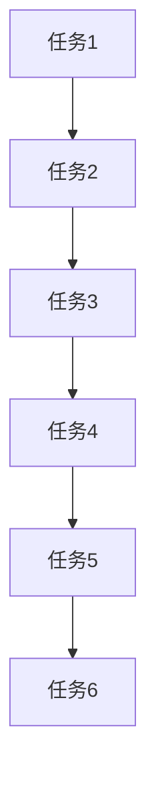
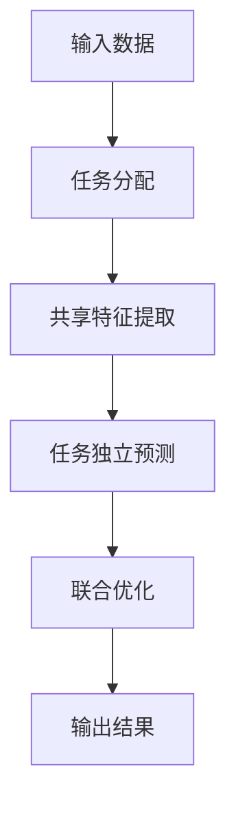
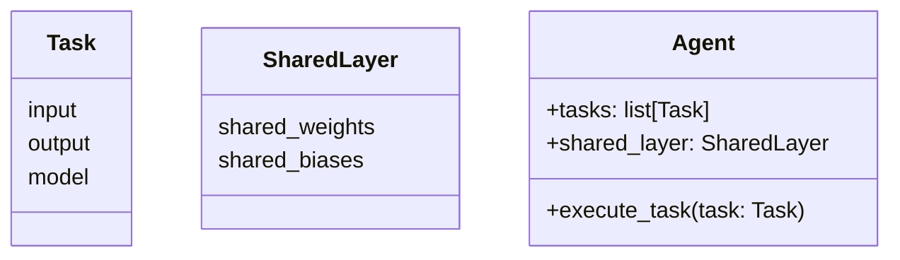
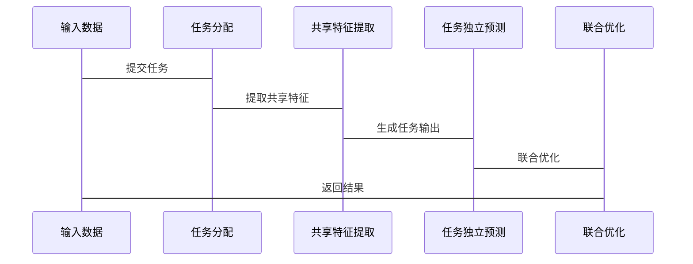

                 


# 《多任务学习框架：构建全能型AI Agent》

> **关键词**：多任务学习，AI Agent，机器学习，深度学习，任务协调
> 
> **摘要**：本文深入探讨了多任务学习（Multi-Task Learning, MTL）框架在构建全能型AI Agent中的应用。通过分析多任务学习的核心概念、算法原理、系统架构及项目实战，详细阐述了如何通过共享表示和任务协调机制，提升AI Agent的多任务处理能力。本文旨在为AI开发者提供一个从理论到实践的全面指南，帮助其构建高效、灵活的多任务学习系统。

---

## 第1章: 多任务学习的背景与概念

### 1.1 多任务学习的背景
多任务学习（Multi-Task Learning, MTL）是机器学习领域的重要研究方向，旨在通过同时学习多个相关任务来提升模型的泛化能力。传统的单任务学习方法在处理单一任务时表现出色，但在面对复杂场景时，往往需要分别训练多个模型，导致资源浪费且难以协调任务之间的关系。相比之下，多任务学习通过共享任务之间的信息，能够在减少训练数据需求的同时，提升模型的综合性能。

#### 1.1.1 从单任务学习到多任务学习的演进
- 单任务学习的特点：专注于单一任务，模型独立优化。
- 多任务学习的动机：任务之间可能存在共享特征，通过联合学习可以提升整体性能。
- 典型应用场景：自然语言处理（NLP）、计算机视觉（CV）、机器人控制等领域。

#### 1.1.2 多任务学习的定义与特点
- **定义**：多任务学习是指在同一模型中同时学习多个任务，通过共享参数或表示来优化所有任务的性能。
- **特点**：
  - 参数共享：任务之间共享部分参数，减少参数量。
  - 任务协调：通过联合优化目标函数，协调任务之间的关系。
  - 资源复用：降低数据需求，提升模型泛化能力。

#### 1.1.3 全能型AI Agent的需求与目标
- **需求**：AI Agent需要在复杂环境中处理多种任务，如感知、决策、规划等。
- **目标**：构建一个能够同时处理多个相关任务的模型，提升AI Agent的全能性。

---

### 1.2 多任务学习的核心问题
多任务学习的核心在于如何处理任务之间的关系，包括任务之间的依赖、共享与独立部分的平衡，以及如何避免“任务干扰”（Task Interference）。

#### 1.2.1 任务之间的关系与依赖
- **同质化任务**：任务之间高度相关，如文本分类和情感分析。
- **异质化任务**：任务之间相对独立，如图像分类和语音识别。
- **任务依赖性**：某些任务的结果可能依赖于其他任务的输出。

#### 1.2.2 多任务学习的挑战与难点
- **任务干扰**：任务之间的参数更新可能互相干扰。
- **资源分配**：如何平衡不同任务之间的资源分配。
- **模型设计**：如何设计有效的共享机制和任务协调机制。

#### 1.2.3 多任务学习的边界与外延
- **边界**：多任务学习的适用场景和极限。
- **外延**：多任务学习与其他技术的结合，如迁移学习、强化学习。

---

### 1.3 多任务学习的框架组成
多任务学习框架通常由以下几部分组成：

#### 1.3.1 任务模块化设计
- 任务模块化：将多个任务分解为可独立处理的模块。
- 模块间交互：模块之间通过共享参数或接口进行交互。

#### 1.3.2 资源共享机制
- 参数共享：共享部分权重，降低模型复杂度。
- 表示共享：共享低层特征，提升任务相关性。

#### 1.3.3 任务协调与优化
- 联合优化：通过联合目标函数优化所有任务。
- 任务权重调节：动态调整任务权重，平衡任务间的关系。

---

## 第2章: 多任务学习的核心概念与联系

### 2.1 多任务学习的原理
多任务学习的核心在于通过共享表示和任务协调机制，同时优化多个任务。其数学模型通常涉及多个损失函数的加权组合。

#### 2.1.1 任务间共享表示的机制
- 共享表示：任务之间共享部分特征，如嵌入层或编码层。
- 任务特定表示：每个任务拥有独立的参数，用于处理任务的特殊需求。

#### 2.1.2 任务间独立性与相关性的平衡
- 独立性：任务之间尽可能独立，避免干扰。
- 相关性：任务之间共享信息，提升整体性能。

#### 2.1.3 多任务学习的数学模型
多任务学习的数学模型通常表示为：
$$
\mathcal{L} = \sum_{i=1}^{N} \lambda_i L_i
$$
其中，$\lambda_i$是任务$i$的权重，$L_i$是任务$i$的损失函数。

---

### 2.2 任务类型与关系分析
任务类型和关系的分析是多任务学习的重要环节，以下是一个任务类型对比表：

| **任务类型** | **特点** | **示例** |
|--------------|----------|----------|
| 同质化任务    | 高度相关，任务目标相似 | 文本分类和情感分析 |
| 异质化任务    | 任务目标不同 | 图像分类和语音识别 |
| 顺序任务      | 任务之间有顺序依赖 | 机器翻译和文本摘要 |

#### 2.2.3 任务间依赖关系的ER实体关系图


---

## 第3章: 多任务学习的算法原理

### 3.1 常见多任务学习算法
#### 3.1.1 多任务学习（MTL）
- **核心思想**：通过共享参数，同时优化多个任务。
- **算法流程**：
  1. 初始化共享参数和任务特定参数。
  2. 对所有任务同时进行反向传播，更新参数。
  3. 重复直到收敛。

#### 3.1.2 多任务迁移学习（MTTL）
- **核心思想**：结合迁移学习，利用源任务的数据增强目标任务的学习。
- **算法流程**：
  1. 在源任务上预训练模型。
  2. 在目标任务上微调模型。

#### 3.1.3 多任务对抗学习（DAML）
- **核心思想**：通过对抗训练，消除任务之间的干扰。
- **算法流程**：
  1. 初始化生成器和判别器。
  2. 生成器生成共享特征，判别器区分任务。
  3. 反复训练生成器和判别器，直到收敛。

---

### 3.2 多任务学习算法的流程图


---

### 3.3 算法实现的Py

#### 3.3.1 MTL算法实现
```python
import torch
import torch.nn as nn

class MultiTaskModel(nn.Module):
    def __init__(self, input_dim, hidden_dim, output_dims):
        super().__init__()
        self.shared = nn.Linear(input_dim, hidden_dim)
        self.task_specific = nn.ModuleList()
        for output_dim in output_dims:
            self.task_specific.append(nn.Linear(hidden_dim, output_dim))

    def forward(self, x):
        x = self.shared(x)
        outputs = []
        for task_output in self.task_specific:
            outputs.append(task_output(x))
        return outputs

# 示例用法
input_dim = 10
hidden_dim = 5
output_dims = [2, 3]
model = MultiTaskModel(input_dim, hidden_dim, output_dims)
```

#### 3.3.2 MTL算法的数学模型
多任务学习的损失函数通常表示为多个任务损失的加权和：
$$
\mathcal{L} = \sum_{i=1}^{N} \lambda_i L_i
$$
其中，$\lambda_i$是任务$i$的权重，$L_i$是任务$i$的损失函数。

---

## 第4章: 系统分析与架构设计

### 4.1 问题场景介绍
构建全能型AI Agent需要考虑多个任务之间的协调与优化，例如在智能客服系统中，模型需要同时处理文本理解、意图识别、情感分析等多个任务。

---

### 4.2 系统功能设计
#### 4.2.1 领域模型设计


#### 4.2.2 系统架构设计


#### 4.2.3 系统接口设计
- 输入接口：接收多个任务的输入数据。
- 输出接口：输出多个任务的处理结果。
- 交互接口：协调任务之间的关系，动态调整任务权重。

#### 4.2.4 系统交互流程


---

## 第5章: 项目实战

### 5.1 环境安装
```bash
pip install torch numpy matplotlib
```

---

### 5.2 系统核心实现
```python
import torch
import torch.nn as nn
import torch.optim as optim

# 定义多任务模型
class MultiTaskNetwork(nn.Module):
    def __init__(self, input_size, hidden_size, output_sizes):
        super().__init__()
        self.shared = nn.Linear(input_size, hidden_size)
        self.tasks = nn.ModuleList()
        for size in output_sizes:
            self.tasks.append(nn.Linear(hidden_size, size))

    def forward(self, x):
        x = self.shared(x)
        outputs = []
        for task in self.tasks:
            outputs.append(task(x))
        return outputs

# 定义损失函数
def multi_task_loss(outputs, targets, weights):
    loss = 0
    for i in range(len(outputs)):
        loss += weights[i] * nn.functional.cross_entropy(outputs[i], targets[i])
    return loss

# 训练过程
def train(model, optimizer, criterion, inputs, targets, weights):
    optimizer.zero_grad()
    outputs = model(inputs)
    loss = criterion(outputs, targets, weights)
    loss.backward()
    optimizer.step()
    return loss.item()
```

---

### 5.3 案例分析与详细解读
以下是一个多任务学习的案例分析，假设我们有三个任务，分别是文本分类、情感分析和命名实体识别。

#### 5.3.1 案例分析
1. **任务定义**：
   - 任务1：文本分类（2类）。
   - 任务2：情感分析（3类）。
   - 任务3：命名实体识别（4类）。

2. **数据准备**：
   - 文本数据集，每个样本包含文本内容和三个任务的标签。

3. **模型训练**：
   - 使用上述定义的`MultiTaskNetwork`模型。
   - 定义权重`weights = [1.0, 1.0, 1.0]`（可根据任务重要性调整）。

4. **训练过程**：
   - 迭代训练，优化模型参数。

---

## 第6章: 最佳实践与总结

### 6.1 本章小结
多任务学习通过共享表示和任务协调机制，能够在减少资源消耗的同时，提升模型的多任务处理能力。本文通过理论分析和实践案例，详细讲解了多任务学习的核心概念、算法原理和系统架构。

---

### 6.2 注意事项
1. **任务相关性**：确保任务之间存在一定的相关性，避免任务干扰。
2. **权重调整**：动态调整任务权重，平衡任务之间的关系。
3. **模型复杂度**：避免模型过于复杂，导致过拟合。

---

### 6.3 拓展阅读
1. 多任务学习的经典论文：Caruana, R. (1997). "Multit task learning".
2. 多任务学习的最新研究：Zhang, Y., et al. (2023). "Progressive neural networks for multi-task learning".

---

通过本文的系统介绍，读者可以全面了解多任务学习的理论与实践，为构建全能型AI Agent提供坚实的理论基础和实践指导。

