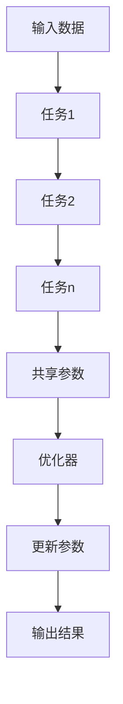
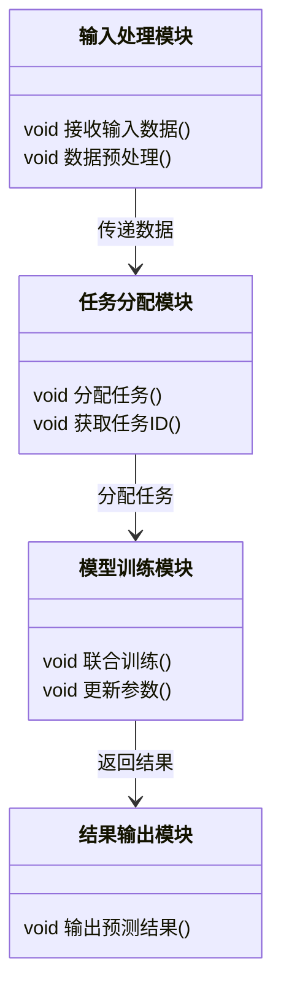
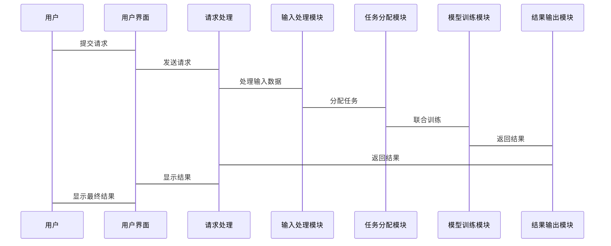

                 


# 多任务学习：构建全能型AI Agent

## 关键词：
多任务学习、AI Agent、算法原理、系统架构、项目实战

## 摘要：
本文深入探讨了多任务学习在构建全能型AI Agent中的应用。通过详细分析多任务学习的核心概念、算法原理、系统架构设计以及项目实战，展示了如何利用多任务学习提升AI Agent的综合能力。文章从背景介绍、核心概念对比、算法实现、系统架构分析到项目实战，层层递进，为读者提供了一套完整的解决方案。

---

## 第一部分: 多任务学习与AI Agent概述

### 第1章: 多任务学习的背景与重要性

#### 1.1 多任务学习的定义与核心概念
##### 1.1.1 多任务学习的定义
多任务学习（Multi-Task Learning, MTL）是一种机器学习范式，旨在通过同时学习多个相关任务来提高模型的泛化能力。与单任务学习不同，MTL允许模型在多个任务之间共享参数，从而更好地利用数据和任务之间的关系。

##### 1.1.2 多任务学习的核心要素
- **共享参数**：多个任务之间共享部分模型参数，减少参数数量，提高模型的泛化能力。
- **任务关系**：任务之间的关系（如相似性或互补性）对模型性能有重要影响。
- **优化目标**：通过优化多个任务的损失函数，找到最优参数。

##### 1.1.3 多任务学习与传统AI的区别
- **传统AI**：通常针对单一任务设计，模型难以扩展到新任务。
- **多任务学习**：通过共享参数和任务关系，模型能够同时处理多个任务，具备更强的适应性。

#### 1.2 多任务学习在AI Agent中的应用
##### 1.2.1 AI Agent的定义与特点
AI Agent是一种智能体，能够感知环境、自主决策并执行任务。其特点包括自主性、反应性、目标导向和社交能力。

##### 1.2.2 多任务学习如何提升AI Agent的能力
- **多任务处理**：AI Agent可以同时执行多个任务，如自然语言处理和视觉识别。
- **知识共享**：通过多任务学习，AI Agent可以在不同任务之间共享知识，减少数据需求。
- **灵活性与适应性**：AI Agent能够快速适应新任务，提高任务处理效率。

##### 1.2.3 多任务学习在AI Agent中的应用场景
- **智能助手**：同时处理信息检索、日程管理等任务。
- **自动驾驶**：同时处理环境感知、路径规划等任务。
- **智能客服**：同时处理客户咨询、问题解决等任务。

#### 1.3 多任务学习的优势与挑战
##### 1.3.1 多任务学习的优势
- **数据效率**：通过共享参数，减少对每个任务单独训练所需的数据量。
- **模型泛化**：模型在多个任务上表现更好，提升泛化能力。
- **任务互补**：利用任务之间的互补性，提高整体性能。

##### 1.3.2 多任务学习的挑战
- **任务竞争**：任务之间可能存在参数竞争，影响模型性能。
- **数据不平衡**：不同任务的数据分布可能不均衡，影响学习效果。
- **计算复杂度**：多任务学习通常需要更复杂的计算，增加计算成本。

##### 1.3.3 解决挑战的方法与策略
- **任务权重调整**：通过调整任务权重，平衡任务之间的竞争。
- **数据增强**：通过数据增强技术，缓解数据不平衡问题。
- **优化算法改进**：采用更高效的优化算法，降低计算复杂度。

---

## 第2章: 多任务学习的核心概念与联系

### 2.1 多任务学习的核心原理
#### 2.1.1 多任务学习的数学模型
多任务学习的数学模型通常表示为：
$$ \mathcal{L}(\theta) = \sum_{i=1}^{n} \lambda_i \mathcal{L}_i(\theta) $$
其中，$\theta$是模型参数，$\mathcal{L}_i$是第$i$个任务的损失函数，$\lambda_i$是任务权重系数。

#### 2.1.2 多任务学习的优化目标
多任务学习的优化目标是在多个任务上找到最优参数$\theta$，使得总损失函数$\mathcal{L}(\theta)$最小化。

#### 2.1.3 多任务学习的权重共享机制
多任务学习通过共享部分权重，使模型在多个任务之间共享知识。共享权重的具体方式取决于任务之间的关系和模型的结构。

### 2.2 多任务学习的核心概念对比
#### 2.2.1 不同任务之间的关系
- **正相关任务**：任务之间存在相似性，可以共享更多参数。
- **负相关任务**：任务之间存在互补性，需要更少共享参数。
- **独立任务**：任务之间无明显关系，共享参数较少。

#### 2.2.2 任务间权重的分配策略
- **固定权重**：任务权重在训练过程中保持不变。
- **动态权重**：任务权重根据任务的难易程度动态调整。
- **自适应权重**：任务权重通过优化算法自动调整。

#### 2.2.3 任务间数据的分布差异
- **均匀分布**：不同任务的数据分布均匀，任务权重相同。
- **非均匀分布**：某些任务的数据较少，任务权重较大。

### 2.3 多任务学习的ER实体关系图
#### 2.3.1 实体关系图的构建
以下是多任务学习的ER实体关系图：
```mermaid
erDiagram
    actor 用户 {
        string 用户ID
        string 用户名
        string 密码
    }
    actor 任务 {
        string 任务ID
        string 任务名称
        string 任务描述
    }
    actor 参数 {
        string 参数ID
        string 参数名称
        float 参数值
    }
    用户 --> 任务 : 执行任务
    参数 --> 任务 : 用于
    用户 --> 参数 : 设置
```

#### 2.3.2 实体关系图的分析
通过ER图可以看出，用户可以执行多个任务，任务可以共享参数。这种设计有助于实现多任务学习的共享参数机制。

#### 2.3.3 实体关系图的优化
通过优化ER图，可以更好地展示任务和参数之间的关系，从而提高多任务学习的效率。

---

## 第3章: 多任务学习的算法原理

### 3.1 主流多任务学习算法概述
#### 3.1.1 MTL（Multi-Task Learning）
MTL是一种经典的多任务学习算法，通过共享参数实现多个任务的联合优化。

#### 3.1.2 MCD（Multi-Class Distillation）
MCD是一种基于知识蒸馏的多任务学习算法，通过教师模型和学生模型的协作优化。

#### 3.1.3 HAT（Hierarchical Attention Transfer）
HAT是一种层次化注意力转移的多任务学习算法，通过注意力机制实现任务之间的信息共享。

### 3.2 MTL算法的详细实现
#### 3.2.1 MTL算法的数学模型
MTL的数学模型可以表示为：
$$ \mathcal{L}(\theta) = \sum_{i=1}^{n} \lambda_i \mathcal{L}_i(\theta) + \lambda \Omega(\theta) $$
其中，$\Omega(\theta)$是正则化项，$\lambda$是正则化系数。

#### 3.2.2 MTL算法的流程图
以下是MTL算法的流程图：


#### 3.2.3 MTL算法的Python代码实现
```python
import torch
import torch.nn as nn

class MTLModel(nn.Module):
    def __init__(self, input_dim, output_dims):
        super(MTLModel, self).__init__()
        self.shared_layer = nn.Linear(input_dim, output_dims['shared'])
        self.task_layers = nn.ModuleList()
        for task in output_dims['tasks']:
            self.task_layers.append(nn.Linear(output_dims['shared'], output_dims['task_output']))
    
    def forward(self, x):
        x = self.shared_layer(x)
        outputs = []
        for task_layer in self.task_layers:
            outputs.append(task_layer(x))
        return outputs

# 示例使用
input_dim = 10
output_dims = {
    'shared': 5,
    'tasks': [2, 3]
}
model = MTLModel(input_dim, output_dims)
criterion = nn.CrossEntropyLoss()
optimizer = torch.optim.Adam(model.parameters(), lr=0.001)

# 假设输入数据为x，标签为labels
outputs = model(x)
losses = []
for i, output in enumerate(outputs):
    losses.append(criterion(output, labels[i]))
total_loss = sum(losses)
optimizer.zero_grad()
total_loss.backward()
optimizer.step()
```

#### 3.2.4 MTL算法的数学公式
$$ \mathcal{L}(\theta) = \sum_{i=1}^{n} \lambda_i \mathcal{L}_i(\theta) + \lambda \Omega(\theta) $$

---

## 第4章: 多任务学习的系统分析与架构设计

### 4.1 系统功能设计
#### 4.1.1 系统功能模块
- **输入处理模块**：接收输入数据并进行预处理。
- **任务分配模块**：将输入分配到不同的任务中。
- **模型训练模块**：对模型进行多任务联合训练。
- **结果输出模块**：输出模型的预测结果。

#### 4.1.2 系统功能设计图
以下是系统功能设计图：


### 4.2 系统架构设计
#### 4.2.1 系统架构图
以下是系统架构图：
```mermaid
containerDiagram
    container Web前端 {
        component 用户界面
        component 请求处理
    }
    container 后端服务 {
        component 输入处理模块
        component 任务分配模块
        component 模型训练模块
        component 结果输出模块
    }
    用户界面 --> 请求处理
    请求处理 --> 输入处理模块
    输入处理模块 --> 任务分配模块
    任务分配模块 --> 模型训练模块
    模型训练模块 --> 结果输出模块
    结果输出模块 --> 请求处理
    请求处理 --> 用户界面
```

#### 4.2.2 系统交互序列图
以下是系统交互序列图：


---

## 第5章: 多任务学习的项目实战

### 5.1 环境安装与配置
#### 5.1.1 安装依赖
- 安装Python和相关库（如PyTorch、numpy、scikit-learn）。
- 安装Mermaid图生成工具。

#### 5.1.2 环境配置
- 设置Python版本。
- 配置虚拟环境。

### 5.2 系统核心实现
#### 5.2.1 核心代码实现
以下是MTL模型的核心代码：
```python
class MTLModel(nn.Module):
    def __init__(self, input_dim, output_dims):
        super(MTLModel, self).__init__()
        self.shared_layer = nn.Linear(input_dim, output_dims['shared'])
        self.task_layers = nn.ModuleList()
        for task in output_dims['tasks']:
            self.task_layers.append(nn.Linear(output_dims['shared'], output_dims['task_output']))
    
    def forward(self, x):
        x = self.shared_layer(x)
        outputs = []
        for task_layer in self.task_layers:
            outputs.append(task_layer(x))
        return outputs
```

#### 5.2.2 代码实现的详细说明
- **共享层**：通过共享层实现多个任务之间的参数共享。
- **任务层**：每个任务有自己的任务层，用于处理特定任务的特征。

### 5.3 实际案例分析
#### 5.3.1 数据准备
- 准备多个任务的数据集。
- 对数据进行预处理和归一化。

#### 5.3.2 模型训练
- 使用PyTorch框架进行模型训练。
- 设定合适的超参数（如学习率、批量大小）。

#### 5.3.3 模型评估
- 使用测试数据集评估模型性能。
- 计算各个任务的准确率和损失值。

### 5.4 项目总结
通过本项目，我们实现了基于多任务学习的AI Agent，展示了多任务学习在实际应用中的优势和效果。

---

## 第6章: 最佳实践与注意事项

### 6.1 最佳实践
- **任务相关性分析**：在选择任务时，分析任务之间的相关性，避免选择完全独立的任务。
- **任务权重调整**：根据任务的重要性动态调整任务权重。
- **数据均衡**：通过数据增强或重新采样，缓解数据不平衡问题。

### 6.2 小结
多任务学习是一种强大的技术，能够显著提升AI Agent的综合能力。通过本文的介绍，读者可以深入了解多任务学习的核心概念、算法原理和系统设计。

### 6.3 注意事项
- **任务竞争**：注意任务之间的参数竞争，避免某些任务的性能下降。
- **计算资源**：多任务学习需要较大的计算资源，确保硬件配置足够。
- **模型复杂度**：避免模型过于复杂，防止过拟合。

### 6.4 拓展阅读
- **推荐书籍**：《Deep Learning》、《Hands-On Machine Learning with Scikit-Learn, Keras, and TensorFlow》。
- **推荐论文**：相关领域的最新论文。

---

通过本文的详细介绍，读者可以全面了解多任务学习在构建全能型AI Agent中的应用，并能够实际操作相关项目。希望本文对读者有所帮助！

