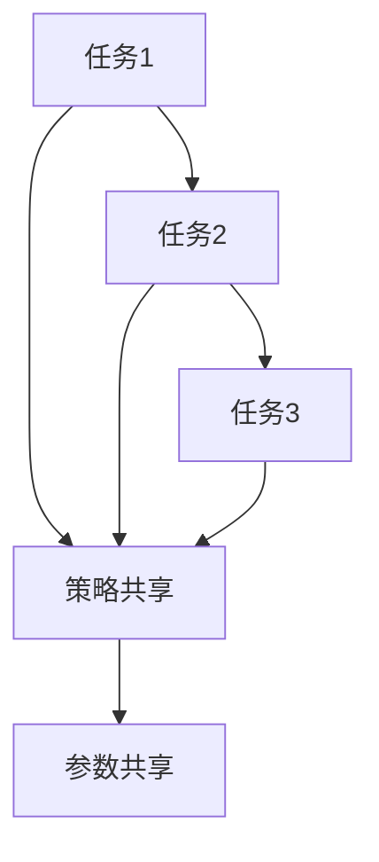
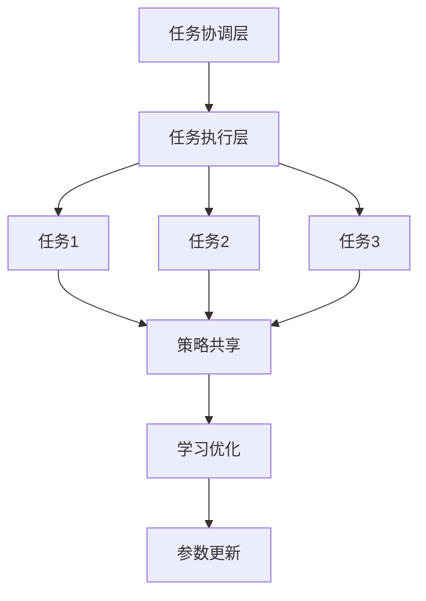

                 


# 多任务强化学习：构建具有广泛技能的AI Agent

## 关键词：
- 多任务强化学习
- AI Agent
- 联合策略
- 数学模型
- 系统架构
- 项目实战
- 最佳实践

## 摘要：
多任务强化学习是一种先进的机器学习方法，旨在让AI代理能够同时处理多个任务，提升其在复杂环境中的适应性和灵活性。本文从背景、核心概念、算法原理、系统设计、项目实战到高级主题，全面解析多任务强化学习的理论与实践，帮助读者构建具有广泛技能的AI Agent。

---

## 第一部分：多任务强化学习背景与基础

### 第1章：多任务强化学习概述

#### 1.1 多任务强化学习的定义与背景
- **1.1.1 强化学习的基本概念**
  - 强化学习（Reinforcement Learning, RL）是一种通过试错方式让智能体（Agent）在环境中学习策略（policy）的方法。智能体通过与环境交互，获得奖励或惩罚，逐步优化其行为以最大化累积奖励。
  - 状态（State）、动作（Action）、奖励（Reward）是强化学习的三个核心要素。智能体通过感知状态，选择动作，获得奖励，从而学习最优策略。

- **1.1.2 多任务学习的定义与特点**
  - 多任务学习（Multi-Task Learning, MTL）是指在多个相关任务上训练模型，使得模型能够同时处理这些任务。相比单任务学习，MTL可以提高模型的泛化能力，减少数据需求。
  - 多任务强化学习结合了MTL和RL的优势，允许智能体在多个任务中共享知识，提升整体性能。

- **1.1.3 多任务强化学习的必要性**
  - 单任务强化学习在单一任务上表现优异，但在复杂环境中难以应对多样化的任务需求。
  - 多任务强化学习能够利用任务之间的共享信息，提高学习效率，减少样本需求，增强泛化能力。

#### 1.2 多任务强化学习的核心问题
- **1.2.1 任务之间的关系与挑战**
  - 任务可能相互独立、部分共享或存在竞争关系。例如，在机器人导航中，任务可能包括避障和路径规划，两者需要协调以实现高效移动。
  - 任务间可能存在冲突，如何平衡各任务的优先级是一个挑战。

- **1.2.2 资源分配与策略协调**
  - 在多任务环境中，智能体需要分配有限的资源（如计算能力、时间）来优化多个策略，确保各任务的性能达到均衡。
  - 策略协调涉及任务间的权重分配和参数共享，需避免某任务过于主导，导致其他任务性能下降。

- **1.2.3 多任务学习的边界与外延**
  - 确定任务的边界是关键，过细的任务分割可能导致共享不足，而过粗的分割则可能失去任务间的独特性。
  - 多任务学习的外延涉及如何与其他学习范式（如迁移学习、对抗学习）结合，扩展应用场景。

#### 1.3 多任务强化学习的应用场景
- **1.3.1 游戏AI与机器人控制**
  - 游戏AI需要同时掌握路径规划、策略选择和对手预测等任务，提升游戏水平。
  - 机器人控制涉及避障、导航和物体识别等多个任务，多任务学习能提高控制效率和鲁棒性。

- **1.3.2 对话系统与自然语言处理**
  - 对话系统需在理解用户意图、生成回复、维护上下文等多个任务上表现良好。
  - 自然语言处理中的多任务学习（如BERT）通过共享特征提取器，同时处理多种任务，提升模型性能。

- **1.3.3 复杂环境下的自主决策**
  - 在自动驾驶中，车辆需同时处理路径规划、障碍物检测、交通规则遵守等多任务，确保安全行驶。
  - 工厂自动化中的机器人需完成物品识别、抓取、组装等多个任务，多任务学习提高效率和精确度。

---

## 第二部分：多任务强化学习的核心概念与联系

### 第2章：强化学习与多任务学习的核心原理

#### 2.1 强化学习的基本原理
- **2.1.1 状态、动作与奖励的定义**
  - 状态（State）：描述环境当前情况的数据结构，如位置、速度等。
  - 动作（Action）：智能体在给定状态下选择的行为，如移动、抓取等。
  - 奖励（Reward）：智能体执行动作后获得的反馈，用于指导学习策略。

- **2.1.2 策略与价值函数的计算**
  - 策略函数（Policy）：描述智能体在状态s下选择动作a的概率分布，目标是最小化损失函数或最大化累积奖励。
  - 价值函数（Value Function）：评估状态s或状态-动作对(s, a)的长期回报。
  - 动作值函数（Q-learning）：通过最大化Q(s, a)来选择最优动作。

- **2.1.3 探索与利用的平衡**
  - 探索（Exploration）：尝试新动作，发现潜在奖励。
  - 利用（Exploitation）：基于当前知识选择最优动作。
  - 平衡探索与利用是提升学习效率的关键，常用ε-greedy策略动态调整。

#### 2.2 多任务学习的核心概念
- **2.2.1 多任务学习的定义与分类**
  - 宏观任务：任务间有明确顺序，如先学习识别，再学习分类。
  - 微观任务：任务间无明确顺序，共享特征，如图像分类和目标检测。

- **2.2.2 任务间的关系与挑战**
  - 独立任务：任务间无共享信息，如分类和回归。
  - 共享任务：任务间共享特征，如多语言模型。
  - 竞争任务：任务间存在冲突，如多目标检测中的不同目标优先级。

- **2.2.3 多任务学习的优缺点**
  - 优点：提升模型泛化能力，减少数据需求。
  - 缺点：任务间可能存在冲突，增加学习难度。

#### 2.3 多任务强化学习的核心要素
- **2.3.1 联合策略与共享参数**
  - 联合策略：多个任务共享策略参数，如使用同一神经网络处理多个任务。
  - 参数共享：通过共享参数降低模型复杂度，提升性能。

- **2.3.2 任务间权重的分配**
  - 任务权重：根据任务的重要性动态调整权重，避免某一任务主导整体学习。
  - 权重调整方法：如基于梯度的方法、基于任务复杂度的方法。

- **2.3.3 跨任务梯度的影响**
  - 跨任务梯度：任务间共享参数的梯度更新需协调，避免梯度冲突。
  - 梯度平衡：通过调整梯度权重，确保各任务共同优化。

#### 2.4 核心概念对比表
以下表格对比了任务关系类型、策略共享方式等核心概念的特征：

| **对比维度** | **独立任务** | **共享任务** | **竞争任务** |
|-------------|--------------|--------------|--------------|
| **任务关系** | 无共享       | 共享特征      | 存在冲突     |
| **策略共享** | 无共享       | 参数共享      | 参数调整      |
| **学习难度** | 较低         | 中等          | 较高         |

#### 2.5 实体关系图（Mermaid）
以下是一个简单的实体关系图，展示了多任务强化学习中任务与策略的关系：



---

## 第三部分：多任务强化学习的算法原理

### 第3章：多任务强化学习算法原理

#### 3.1 多任务强化学习算法概述
- 多任务强化学习算法结合了强化学习和多任务学习的优势，允许智能体在多个任务间共享策略和参数。
- 常见算法包括MIX、MT-ppo、HRL（分层强化学习）等。

#### 3.2 算法实现步骤
- 环境初始化：定义多个任务的环境，如机器人导航和物体识别。
- 策略初始化：共享策略网络，如使用同一神经网络处理多个任务。
- 动作选择：基于当前状态，选择动作并执行。
- 奖励收集：记录每个任务的奖励，用于更新策略。
- 策略优化：基于多任务奖励，优化共享策略参数。

#### 3.3 算法实现代码示例（Python）
以下是一个简单的多任务强化学习代码示例，使用PyTorch框架：

```python
import torch
import torch.nn as nn
import torch.optim as optim

class MultiTaskNetwork(nn.Module):
    def __init__(self, input_size, output_size):
        super(MultiTaskNetwork, self).__init__()
        self.shared = nn.Linear(input_size, 64)
        self.task1_layer = nn.Linear(64, output_size)
        self.task2_layer = nn.Linear(64, output_size)

    def forward(self, x):
        x = torch.relu(self.shared(x))
        out1 = self.task1_layer(x)
        out2 = self.task2_layer(x)
        return out1, out2

def train(network, optimizer, criterion, tasks, epochs):
    for epoch in range(epochs):
        for task in tasks:
            inputs, labels = get_task_data(task)  # 根据任务获取数据
            outputs, _ = network(inputs)
            loss = criterion(outputs, labels)
            loss.backward()
            optimizer.step()
            optimizer.zero_grad()
```

#### 3.4 算法实现的数学模型
多任务强化学习的数学模型通常涉及共享参数θ，多个任务的损失函数L_i，整体目标是最小化加权损失：

$$
\min_{\theta} \sum_{i=1}^{n} \lambda_i L_i(\theta)
$$

其中，λ_i是任务i的权重，用于平衡各任务的贡献。

---

## 第四部分：多任务强化学习的系统设计

### 第4章：系统设计与实现

#### 4.1 系统功能设计
- **问题场景分析**：智能体需在多个任务间切换，如同时进行路径规划和物体识别。
- **系统功能**：设计一个多任务强化学习系统，包括任务管理模块、策略共享模块、奖励评估模块和学习优化模块。

#### 4.2 系统架构设计
- 使用分层架构，上层负责任务协调，下层负责具体任务执行。
- 以下是一个简单的系统架构图：



#### 4.3 接口设计与交互流程
- **接口设计**：定义标准接口，如`execute_action(action)`、`get_reward()`等。
- **交互流程**：智能体接收环境反馈，更新策略参数，循环执行直到收敛。

---

## 第五部分：项目实战与应用

### 第5章：项目实战

#### 5.1 环境安装与配置
- 安装必要的库，如PyTorch、OpenAI Gym、Matplotlib等。
- 配置运行环境，如虚拟环境、GPU支持等。

#### 5.2 核心代码实现
- 实现多任务强化学习算法，如MIX或MT-ppo。
- 使用OpenAI Gym创建多任务环境，如同时进行迷宫导航和物体识别。

#### 5.3 代码解读与分析
- 解释代码的结构和功能，如网络结构、训练循环、奖励机制等。
- 分析关键参数对性能的影响，如任务权重、学习率等。

#### 5.4 实际案例分析
- 以机器人导航为例，展示如何在多任务环境下训练智能体。
- 分析训练过程中的奖励变化，优化策略参数。

---

## 第六部分：高级主题与未来趋势

### 第6章：高级主题与未来趋势

#### 6.1 当前研究热点
- **可扩展性研究**：如何处理更多任务，提升系统扩展性。
- **可解释性研究**：提高多任务强化学习的可解释性，便于调试和优化。
- **实时性研究**：在实时环境中应用多任务强化学习，解决动态变化问题。

#### 6.2 挑战与解决方案
- **任务间冲突**：通过动态权重调整和在线学习方法，平衡任务优先级。
- **计算资源限制**：优化算法复杂度，采用分布式计算和模型压缩技术。

#### 6.3 未来发展趋势
- **跨模态学习**：结合视觉、听觉等多种感知方式，提升智能体的综合能力。
- **人机协作**：多任务强化学习与人类决策结合，提升协作效率。
- **自适应学习**：研究动态调整任务策略，适应环境变化。

---

## 第七部分：附录

### 附录A：术语表
- **强化学习**：通过试错方式优化智能体策略。
- **多任务学习**：同时处理多个任务，共享知识。
- **联合策略**：多个任务共享的策略参数。

### 附录B：参考文献
- 引用相关论文、书籍和技术文档，提供详细参考信息。

### 附录C：扩展资源
- 推荐书籍、在线课程和开源项目，供读者深入学习。

---

通过以上目录结构，您可以逐步展开每一部分的内容，构建一篇系统、详实的技术博客文章。

