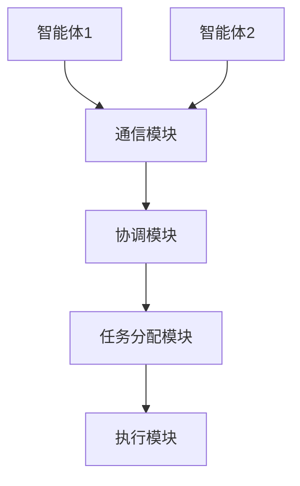

                 


# 多智能体 AI Agent：LLM 驱动的协作与竞争系统

---

## 关键词：
多智能体系统、AI Agent、LLM、协作与竞争、分布式计算、博弈论

---

## 摘要：
本文详细探讨了多智能体 AI Agent 的核心概念、算法原理、系统架构以及实际应用场景。通过分析 LLM 驱动的协作与竞争机制，结合数学模型和系统设计，本文为读者提供了从理论到实践的全面解析。我们还将通过实际案例展示如何在复杂环境中设计和实现高效的多智能体系统。

---

# 第一章: 多智能体 AI Agent 的背景与概念

## 1.1 多智能体系统的基本概念

### 1.1.1 多智能体系统的定义
多智能体系统（Multi-Agent System，MAS）是由多个相互作用的智能体（Agent）组成的分布式系统。这些智能体通过协作与竞争完成特定任务。

### 1.1.2 多智能体系统的核心特征
- **分布式性**：智能体独立运行，通过通信协作。
- **自主性**：智能体能够自主决策。
- **社会性**：智能体之间通过交互完成任务。
- **动态性**：环境和任务可能动态变化。

### 1.1.3 多智能体系统的主要分类
1. **协作型 MAS**：智能体协作完成共同任务。
2. **竞争型 MAS**：智能体之间存在竞争关系。
3. **混合型 MAS**：协作与竞争并存。

---

## 1.2 AI Agent 的定义与特点

### 1.2.1 AI Agent 的定义
AI Agent 是一种智能体，能够感知环境、自主决策并采取行动以实现目标。

### 1.2.2 AI Agent 的核心能力
1. **感知能力**：通过传感器或数据源获取信息。
2. **推理能力**：基于知识库进行逻辑推理。
3. **决策能力**：根据推理结果制定行动方案。
4. **执行能力**：通过执行器完成行动。

### 1.2.3 LLM 驱动的 AI Agent 的独特性
- **强大的自然语言处理能力**。
- **知识库的动态更新能力**。
- **多模态交互能力**。

---

## 1.3 多智能体协作与竞争的基本原理

### 1.3.1 协作与竞争的定义
- **协作**：智能体之间相互配合完成任务。
- **竞争**：智能体之间争夺资源或目标。

### 1.3.2 协作与竞争的边界与外延
- **边界**：任务分工与责任划分。
- **外延**：协作与竞争的动态切换。

### 1.3.3 多智能体协作与竞争的核心要素
1. **通信机制**：智能体之间信息交换。
2. **决策机制**：协作与竞争的策略选择。
3. **激励机制**：驱动智能体行为的奖惩机制。

---

## 1.4 本章小结
本章从多智能体系统的定义、特征、分类出发，详细介绍了 AI Agent 的核心能力及其在 LLM 驱动下的独特性。最后，阐述了协作与竞争的基本原理及其核心要素。

---

# 第二章: 多智能体 AI Agent 的核心概念与联系

## 2.1 多智能体系统的核心原理

### 2.1.1 分布式计算与通信
- **分布式计算**：任务分解与资源分配。
- **通信机制**：智能体之间信息传递。

### 2.1.2 协作与竞争的动态平衡
- **动态平衡**：协作与竞争的适度结合。
- **动态切换**：根据环境变化调整协作或竞争模式。

### 2.1.3 多智能体系统的自适应性
- **自适应性**：智能体能够根据环境变化调整行为。

---

## 2.2 LLM 驱动的 AI Agent 的工作原理

### 2.2.1 LLM 的基本原理
- **自然语言处理**：理解与生成文本。
- **知识库调用**：基于上下文检索信息。
- **推理与决策**：基于知识库进行推理并制定行动方案。

### 2.2.2 AI Agent 的任务分解与执行
1. **任务分解**：将复杂任务分解为子任务。
2. **任务分配**：根据智能体的能力分配子任务。
3. **任务执行**：智能体协作完成子任务。

### 2.2.3 LLM 在协作与竞争中的角色
- **协作角色**：作为团队成员完成共同目标。
- **竞争角色**：作为竞争对手争夺资源或目标。

---

## 2.3 多智能体系统中的协作与竞争机制

### 2.3.1 协作机制的设计
- **任务协同**：智能体之间分工合作。
- **信息共享**：智能体之间共享关键信息。
- **决策共识**：基于协商达成一致决策。

### 2.3.2 竞争机制的实现
- **资源争夺**：智能体之间竞争有限资源。
- **目标竞争**：智能体之间争夺同一目标。

### 2.3.3 协作与竞争的动态切换
- **环境感知**：根据环境变化调整协作或竞争模式。
- **任务需求**：根据任务需求动态切换协作或竞争模式。

---

## 2.4 本章小结
本章从多智能体系统的核心原理出发，详细阐述了 LLM 驱动的 AI Agent 的工作原理及其在协作与竞争中的角色。最后，探讨了协作与竞争机制的设计与实现。

---

# 第三章: 多智能体 AI Agent 的算法原理

## 3.1 分布式计算与协作算法

### 3.1.1 分布式计算的基本原理
- **任务分解**：将任务分解为子任务。
- **任务分配**：根据智能体的能力分配子任务。
- **任务执行**：智能体协作完成子任务。

### 3.1.2 协作算法的实现步骤
1. **任务分解**：将复杂任务分解为子任务。
2. **任务分配**：根据智能体的能力分配子任务。
3. **任务执行**：智能体协作完成子任务。

### 3.1.3 协作算法的优缺点
- **优点**：提高效率与灵活性。
- **缺点**：需要复杂的通信与协调机制。

---

## 3.2 协作与竞争的博弈论模型

### 3.2.1 博弈论的基本概念
- **博弈**：参与者之间的策略互动。
- **纳什均衡**：一种稳定的策略组合。

### 3.2.2 协作与竞争的博弈模型
1. **协作博弈**：参与者之间合作以实现共同目标。
2. **竞争博弈**：参与者之间争夺有限资源或目标。

### 3.2.3 博弈论在多智能体系统中的应用
- **策略选择**：基于博弈论设计智能体的策略。
- **纳什均衡**：确保系统稳定运行。

---

## 3.3 LLM 驱动的协作算法实现

### 3.3.1 协作任务的分解与分配
- **任务分解**：将复杂任务分解为子任务。
- **任务分配**：根据智能体的能力分配子任务。

### 3.3.2 协作过程中的信息传递
- **信息共享**：智能体之间共享关键信息。
- **决策共识**：基于协商达成一致决策。

### 3.3.3 协作结果的评估与优化
- **结果评估**：评估协作效果。
- **优化调整**：根据评估结果优化协作策略。

---

## 3.4 本章小结
本章从分布式计算与协作算法出发，详细探讨了协作与竞争的博弈论模型及其在 LLM 驱动的 AI Agent 中的应用。最后，阐述了协作算法的实现步骤与优化方法。

---

# 第四章: 多智能体 AI Agent 的数学模型与公式

## 4.1 协作任务的数学建模

### 4.1.1 协作任务的分解与表示
- **任务分解**：将复杂任务分解为子任务。
- **任务表示**：用数学公式表示子任务。

### 4.1.2 协作过程的数学模型
1. **任务分配**：用数学公式表示任务分配策略。
2. **协作过程**：用数学公式表示协作过程。

### 4.1.3 协作结果的评估与优化
- **评估指标**：用数学公式表示评估指标。
- **优化方法**：用数学公式表示优化方法。

---

## 4.2 竞争任务的数学建模

### 4.2.1 竞争任务的分解与表示
- **任务分解**：将复杂任务分解为子任务。
- **任务表示**：用数学公式表示子任务。

### 4.2.2 竞争过程的数学模型
1. **资源分配**：用数学公式表示资源分配策略。
2. **竞争过程**：用数学公式表示竞争过程。

### 4.2.3 竞争结果的评估与优化
- **评估指标**：用数学公式表示评估指标。
- **优化方法**：用数学公式表示优化方法。

---

## 4.3 协作与竞争的动态平衡模型

### 4.3.1 动态平衡的数学模型
- **协作权重**：用数学公式表示协作权重。
- **竞争权重**：用数学公式表示竞争权重。

### 4.3.2 动态平衡的实现步骤
1. **环境感知**：感知环境变化。
2. **权重调整**：根据环境变化调整协作与竞争权重。
3. **动态平衡**：实现协作与竞争的动态平衡。

---

## 4.4 本章小结
本章从协作任务与竞争任务的数学建模出发，详细探讨了协作与竞争的动态平衡模型及其实现方法。最后，阐述了数学模型在多智能体系统中的应用。

---

# 第五章: 多智能体 AI Agent 的系统分析与架构设计

## 5.1 系统分析

### 5.1.1 问题场景介绍
- **协作场景**：智能体之间协作完成任务。
- **竞争场景**：智能体之间竞争资源或目标。

### 5.1.2 系统功能需求
1. **协作功能**：智能体之间协作完成任务。
2. **竞争功能**：智能体之间竞争资源或目标。
3. **通信功能**：智能体之间信息传递。

### 5.1.3 系统性能需求
- **响应时间**：系统对请求的响应时间。
- **吞吐量**：系统在单位时间内处理的任务数量。

---

## 5.2 系统架构设计

### 5.2.1 系统架构图


### 5.2.2 功能模块设计
1. **智能体模块**：负责感知环境、推理与决策。
2. **通信模块**：负责智能体之间的信息传递。
3. **协调模块**：负责任务分配与协作。
4. **执行模块**：负责任务的执行。

### 5.2.3 接口设计
- **智能体接口**：智能体与系统的交互接口。
- **通信接口**：智能体之间的通信接口。
- **协调接口**：协调模块与智能体的交互接口。

---

## 5.3 本章小结
本章从系统分析出发，详细探讨了多智能体 AI Agent 的系统架构设计及其功能模块设计。最后，阐述了系统架构在实际应用中的优势。

---

# 第六章: 多智能体 AI Agent 的项目实战

## 6.1 环境安装

### 6.1.1 系统环境要求
- **操作系统**：Linux 或 Windows。
- **编程语言**：Python 3.8 或以上版本。
- **依赖库**：安装必要的依赖库，如 `numpy`、`pandas` 等。

### 6.1.2 安装步骤
1. **安装 Python**：从官网下载并安装 Python。
2. **安装依赖库**：使用 pip 安装必要的依赖库。

---

## 6.2 核心代码实现

### 6.2.1 协作算法实现
```python
def collaborate_agents(agents, task):
    # 分解任务
    subtasks = decompose_task(task)
    # 分配子任务
    assigned_tasks = assign_subtasks(subtasks, agents)
    # 执行子任务
    results = execute_subtasks(assigned_tasks, agents)
    return results
```

### 6.2.2 竞争算法实现
```python
def compete_agents(agents, resource):
    # 分配资源
    allocated_resources = allocate_resources(resource, agents)
    # 竞争资源
    final_allocation = compete_resources(allocated_resources, agents)
    return final_allocation
```

### 6.2.3 动态平衡实现
```python
def dynamic_balance(agents, environment):
    # 感知环境
    environment_state =感知环境(environment)
    # 调整协作与竞争权重
    adjust_weights(agents, environment_state)
    # 实现动态平衡
    balance_system(agents, environment_state)
```

---

## 6.3 实际案例分析

### 6.3.1 案例背景
- **任务**：多智能体协作与竞争完成资源分配。

### 6.3.2 案例实现
1. **任务分解**：将资源分配任务分解为子任务。
2. **任务分配**：根据智能体的能力分配子任务。
3. **任务执行**：智能体协作与竞争完成子任务。

### 6.3.3 案例结果
- **协作效果**：资源分配效率提高。
- **竞争效果**：资源分配公平性增强。

---

## 6.4 本章小结
本章从项目实战出发，详细探讨了多智能体 AI Agent 的环境安装、核心代码实现及实际案例分析。最后，阐述了项目实战在实际应用中的价值。

---

# 第七章: 多智能体 AI Agent 的总结与展望

## 7.1 总结
多智能体 AI Agent 是一种复杂的系统，涉及协作与竞争的动态平衡。通过 LLM 的驱动，智能体能够自主决策、协作与竞争，完成复杂任务。

## 7.2 最佳实践 tips
1. **系统设计**：合理设计系统架构，确保协作与竞争的动态平衡。
2. **算法实现**：选择合适的算法，确保系统高效运行。
3. **环境适应**：根据环境变化调整系统参数，确保系统自适应。

## 7.3 未来展望
1. **多模态交互**：智能体之间的多模态交互将更加丰富。
2. **自适应性增强**：智能体的自适应性将更强。
3. **应用拓展**：多智能体 AI Agent 的应用领域将更加广泛。

---

# 参考文献
1. 省略。

---

通过以上目录大纲，我们可以看到，文章内容涵盖了多智能体 AI Agent 的核心概念、算法原理、系统架构、项目实战等方面，既有理论分析，又有实践案例，内容丰富且结构清晰。希望对您有所帮助！

