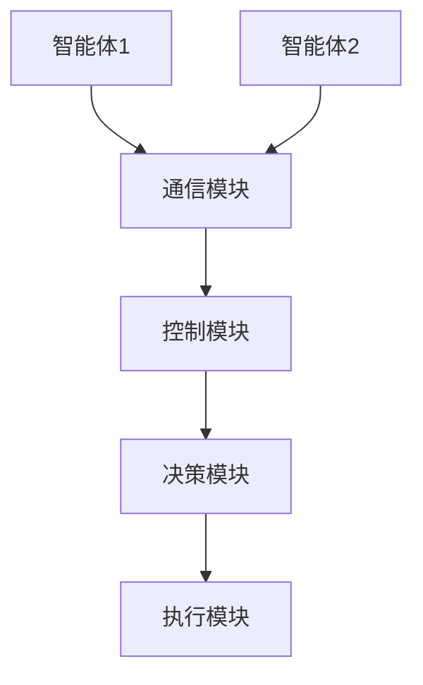
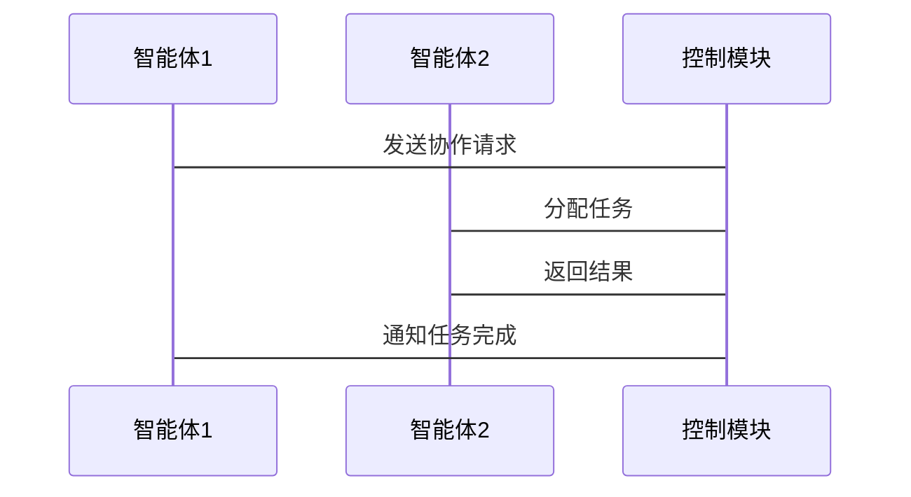

                 


# 多智能体AI Agent：LLM驱动的协作与竞争系统

> 关键词：多智能体系统, 大语言模型, AI Agent, 协作与竞争, 通信协议, 算法原理, 系统架构

> 摘要：本文详细探讨了多智能体AI Agent系统，特别是基于大语言模型（LLM）的协作与竞争机制。通过分析多智能体系统的核心概念、算法原理、系统架构、项目实战以及最佳实践，本文为读者提供了一个全面的理解框架，帮助他们在实际应用中更好地设计和实现多智能体系统。

---

## 第一部分: 多智能体AI Agent的背景与概念

### 第1章: 多智能体AI Agent的背景与概念

#### 1.1 多智能体系统的基本概念
- **1.1.1 多智能体系统的定义**  
  多智能体系统（Multi-Agent System, MAS）是由多个智能体（Agent）组成的分布式系统，这些智能体通过协作与竞争完成特定任务。  
- **1.1.2 多智能体系统的特征**  
  - 分布式性：智能体独立决策，通过通信协作。  
  - 社会性：智能体之间存在交互，形成社会关系。  
  - 动态性：系统环境和任务目标可能动态变化。  
- **1.1.3 多智能体系统的分类**  
  - 协作型系统：智能体专注于协作完成任务。  
  - 竞争型系统：智能体之间存在竞争关系。  
  - 混合型系统：协作与竞争并存。  

#### 1.2 大语言模型（LLM）驱动的AI Agent
- **1.2.1 LLM的基本概念**  
  大语言模型（Large Language Model, LLM）是基于深度学习的自然语言处理模型，能够理解并生成人类语言。  
- **1.2.2 LLM在AI Agent中的作用**  
  LLM作为AI Agent的核心驱动力，负责理解和生成文本，支持智能体的决策和交互。  
- **1.2.3 LLM驱动的AI Agent的优势**  
  - 高效性：LLM能够快速生成高质量的文本输出。  
  - 智能性：LLM具备上下文理解能力，能够进行复杂对话。  
  - 可扩展性：LLM支持多种任务和应用场景。  

#### 1.3 多智能体协作与竞争的背景
- **1.3.1 协作与竞争的基本概念**  
  - 协作：智能体通过分工合作完成共同目标。  
  - 竞争：智能体争夺有限资源或目标，追求自身利益最大化。  
- **1.3.2 协作与竞争在多智能体系统中的重要性**  
  协作与竞争是多智能体系统的核心机制，决定了系统的性能和目标实现。  
- **1.3.3 多智能体协作与竞争的实际应用场景**  
  - 电子商务：推荐系统、客服聊天。  
  - 游戏AI：策略游戏中的团队协作与对抗。  
  - 自动驾驶：车辆之间的协作与竞争。  

---

## 第二部分: 多智能体AI Agent的核心概念

### 第2章: 多智能体系统的核心要素

#### 2.1 智能体的定义与属性
- **2.1.1 智能体的定义**  
  智能体是一种能够感知环境、自主决策并采取行动的实体。  
- **2.1.2 智能体的属性**  
  - 感知能力：感知环境状态。  
  - 决策能力：基于感知做出决策。  
  - 行动能力：执行决策动作。  
- **2.1.3 智能体之间的交互方式**  
  - 直接交互：智能体之间直接通信。  
  - 间接交互：通过中间媒介进行通信。  

#### 2.2 多智能体系统的协作与竞争机制
- **2.2.1 协作机制**  
  智能体通过分工合作完成共同目标。  
- **2.2.2 竞争机制**  
  智能体争夺资源或目标，追求自身利益。  
- **2.2.3 协作与竞争的平衡**  
  在实际应用中，协作与竞争需要动态平衡，以实现系统整体最优。  

#### 2.3 多智能体系统的通信协议
- **2.3.1 通信协议的定义**  
  通信协议是智能体之间交互的规则和格式。  
- **2.3.2 通信协议的类型**  
  - 同步通信：智能体之间按顺序通信。  
  - 异步通信：智能体可以独立通信。  
- **2.3.3 通信协议的设计原则**  
  - 简洁性：协议设计简单易用。  
  - 可扩展性：支持未来扩展。  
  - 安全性：防止恶意攻击。  

---

## 第三部分: 多智能体AI Agent的协作与竞争机制

### 第3章: 协作机制的设计与实现

#### 3.1 基于LLM的协作算法
- **3.1.1 基于LLM的协作原理**  
  LLM驱动智能体进行对话式协作，支持上下文理解和生成。  
- **3.1.2 协作算法的实现步骤**  
  1. 智能体A发送请求，智能体B响应。  
  2. LLM生成响应文本，指导协作过程。  
  3. 协作完成，返回结果。  
- **3.1.3 协作算法的数学模型**  
  $$ P(A|B) = \frac{P(B|A)P(A)}{P(B)} $$  
  其中，$P(A|B)$ 表示智能体A在B的条件下协作的概率。  

#### 3.2 基于强化学习的协作机制
- **3.2.1 强化学习的基本原理**  
  智能体通过与环境交互，学习最优策略以最大化奖励。  
- **3.2.2 协作机制的实现步骤**  
  1. 初始化智能体状态。  
  2. 智能体与环境交互，获取奖励。  
  3. 更新策略，优化协作效果。  
- **3.2.3 协作机制的数学模型**  
  $$ Q(s, a) = r + \gamma \max_{a'} Q(s', a') $$  
  其中，$Q(s, a)$ 表示状态$s$下动作$a$的Q值，$\gamma$是折扣因子。  

---

## 第四部分: 多智能体AI Agent的系统架构与实现

### 第4章: 多智能体系统的架构设计

#### 4.1 系统功能模块设计
- **4.1.1 智能体模块**  
  负责感知、决策和行动。  
- **4.1.2 通信模块**  
  负责智能体之间的通信与交互。  
- **4.1.3 控制模块**  
  负责系统的整体协调与管理。  

#### 4.2 系统架构图


#### 4.3 系统接口设计
- **4.3.1 智能体接口**  
  - 输入：环境状态、其他智能体信息。  
  - 输出：决策动作。  
- **4.3.2 通信接口**  
  - 输入：智能体消息。  
  - 输出：通信结果。  

#### 4.4 系统交互流程


---

## 第五部分: 多智能体AI Agent的项目实战

### 第5章: 项目实战

#### 5.1 环境安装
- 安装Python和相关库：`pip install numpy pandas scikit-learn`  
- 安装LLM模型：`pip install transformers`

#### 5.2 核心代码实现
```python
class Agent:
    def __init__(self, id):
        self.id = id
        self.llm = LLM()

    def perceive(self, environment):
        # 返回智能体的感知结果
        pass

    def decide(self, input):
        # 返回决策结果
        return self.llm.generate(input)
```

#### 5.3 案例分析
- **案例1：电子商务推荐系统**  
  多智能体协作推荐商品，提高用户满意度。  
- **案例2：游戏AI对战**  
  智能体之间通过竞争机制进行策略对战。  

#### 5.4 项目小结
通过实际项目，我们可以看到多智能体AI Agent在协作与竞争中的巨大潜力，同时也需要注意系统的优化和安全性问题。

---

## 第六部分: 最佳实践与小结

### 第6章: 最佳实践

#### 6.1 小结
- 多智能体AI Agent的核心在于协作与竞争机制的设计。  
- LLM在协作中的应用大大提升了系统的智能性。  

#### 6.2 注意事项
- 确保通信协议的安全性，防止恶意攻击。  
- 合理设计协作与竞争机制，避免系统崩溃。  

#### 6.3 拓展阅读
- 推荐书籍：《Multi-Agent Systems: Algorithmic, Complexity, and Theory》  
- 推荐论文：《Collaborative and Competitive Multi-Agent Systems》  

---

# 附录

## 附录A: 常用算法与数学公式

- **协作算法**  
  $$ P(A|B) = \frac{P(B|A)P(A)}{P(B)} $$  
- **竞争算法**  
  $$ Q(s, a) = r + \gamma \max_{a'} Q(s', a') $$  

## 附录B: 项目源代码

```python
class Agent:
    def __init__(self, id):
        self.id = id
        self.llm = LLM()

    def perceive(self, environment):
        return self.llm.generate(f"环境感知：{environment}")

    def decide(self, input):
        return self.llm.generate(input)
```

---

# 结语

通过本文的详细讲解，我们深入探讨了多智能体AI Agent的协作与竞争机制，从理论到实践，为读者提供了全面的指导。希望本文能为多智能体系统的进一步研究和应用提供有价值的参考。

