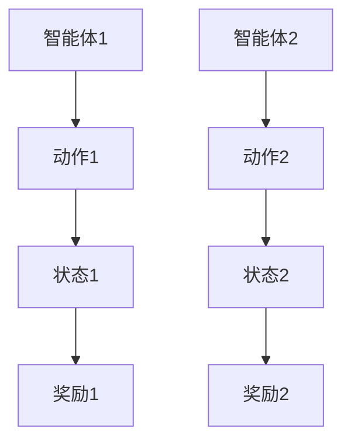
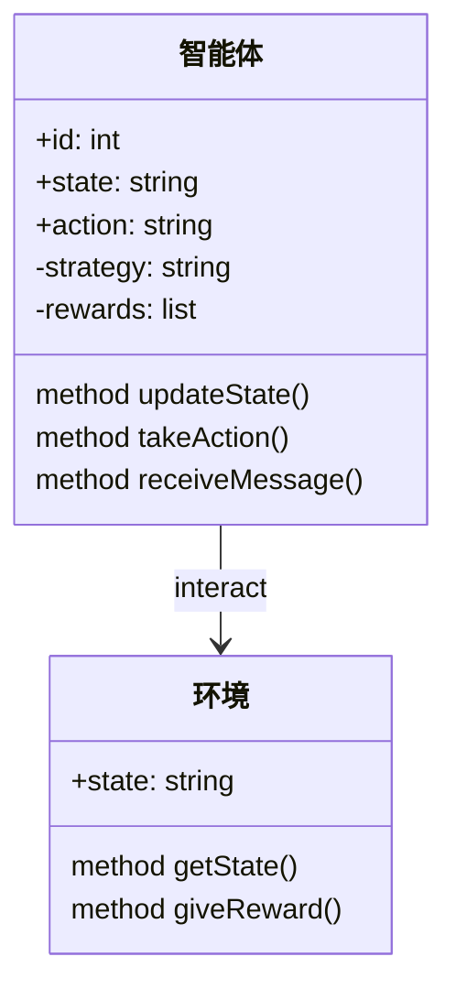
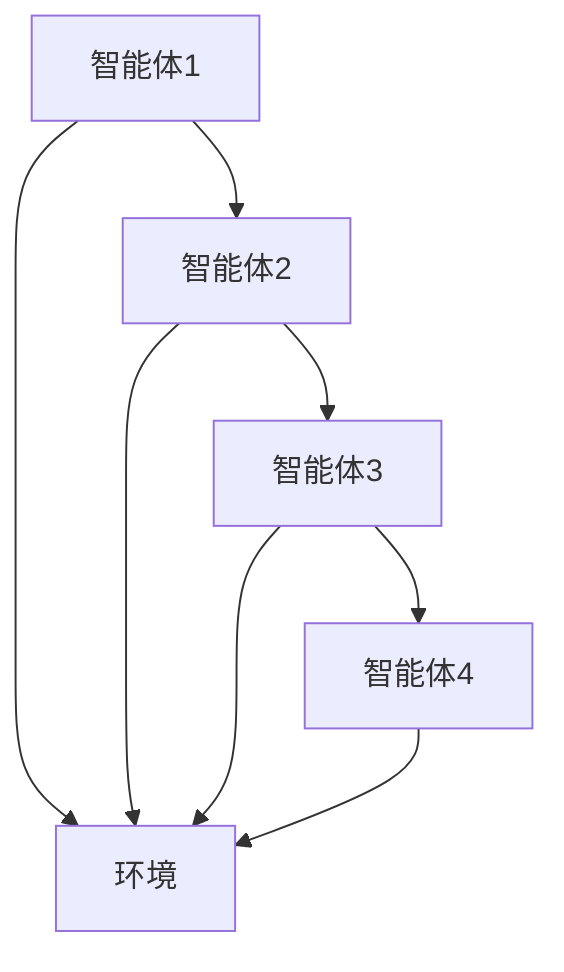
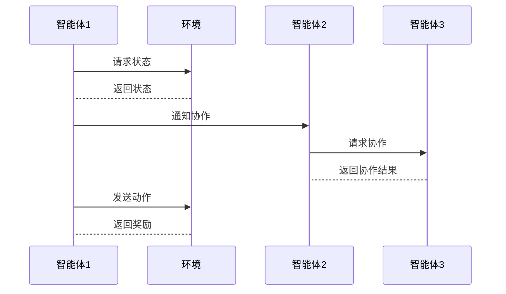

                 


# 多智能体AI如何优化未来增长潜力评估

> 关键词：多智能体AI、增长潜力评估、分布式计算、强化学习、系统架构

> 摘要：本文深入探讨多智能体AI在优化未来增长潜力评估中的应用，从技术基础、算法原理、系统架构到实际项目，全面解析其优势、挑战及解决方案。

---

## 第1章: 多智能体AI的概述

### 1.1 多智能体AI的定义与特点

#### 1.1.1 多智能体AI的定义
多智能体AI是指由多个相互作用的智能体组成的系统，每个智能体能够独立决策并协作完成复杂任务。

#### 1.1.2 多智能体AI的核心特点
- **分布式计算**：任务分解到多个智能体，提高效率。
- **协作性**：智能体间通过通信协作，共同解决问题。
- **自主性**：每个智能体具有自主决策能力。

#### 1.1.3 多智能体AI与传统AI的区别
| 特性       | 多智能体AI              | 传统AI              |
|------------|------------------------|---------------------|
| 结构       | 分布式、多智能体       | 集中式、单点控制    |
| 决策       | 分散决策               | 中央决策            |
| 协作       | 强调协作与通信         | 无协作或单点协作    |

### 1.2 多智能体AI的优势

#### 1.2.1 分布式计算的优势
- **容错性**：部分智能体故障不影响整体系统。
- **扩展性**：易于扩展，适应更大规模任务。

#### 1.2.2 多智能体协作的高效性
- **任务分解**：复杂任务分解为子任务，提高效率。
- **并行处理**：多个智能体同时处理不同部分，节省时间。

#### 1.2.3 多智能体系统的灵活性
- **适应变化**：系统可根据环境变化动态调整。
- **多样性**：多个智能体可提供多样化解决方案。

### 1.3 多智能体AI的应用场景

#### 1.3.1 金融领域的应用
- **股票交易**：多个智能体协作进行市场分析和交易决策。
- **风险管理**：实时监控和评估市场风险。

#### 1.3.2 交通领域的应用
- **智能交通管理**：优化交通流量，减少拥堵。
- **自动驾驶**：多个车辆协同行驶，避免事故。

#### 1.3.3 制造业的应用
- **生产优化**：优化生产流程，提高效率。
- **质量控制**：多个智能体协作进行产品质量监控。

### 1.4 本章小结
本章介绍了多智能体AI的定义、特点、优势及应用场景，为后续章节奠定了基础。

---

## 第2章: 多智能体AI的技术基础

### 2.1 多智能体系统的基本概念

#### 2.1.1 多智能体系统的定义
多智能体系统是由多个智能体组成的系统，每个智能体能够感知环境并采取行动。

#### 2.1.2 多智能体系统的组成
- **智能体**：具备感知和行动能力。
- **通信机制**：智能体间的信息交换方式。
- **协作机制**：智能体间协作完成任务的方式。

#### 2.1.3 多智能体系统的分类
| 类型       | 描述                          |
|------------|-------------------------------|
| 分离式     | 智能体独立运行，无协作         |
| 协作式     | 智能体协作完成共同目标         |
| 分布式     | 智能体分布在网络中，协作完成任务|

### 2.2 多智能体系统的核心技术

#### 2.2.1 多智能体通信机制
- **消息传递**：智能体间通过消息传递信息。
- **通信协议**：定义消息格式和传输规则。

#### 2.2.2 多智能体协作机制
- **协商与协调**：智能体间通过协商确定任务分配。
- **分布式决策**：基于局部信息做出决策。

#### 2.2.3 多智能体学习机制
- **分布式学习**：智能体通过局部信息进行学习。
- **经验共享**：智能体间共享经验以提高整体性能。

### 2.3 多智能体系统的实现基础

#### 2.3.1 分布式计算基础
- **分布式系统**：任务分布在多个计算节点上。
- **并行计算**：同时处理多个任务，提高效率。

#### 2.3.2 多线程与多进程
- **多线程**：同一进程内多个线程同时执行。
- **多进程**：多个进程独立运行，提高资源利用率。

#### 2.3.3 网络通信与数据交换
- **网络通信**：智能体间通过网络进行数据交换。
- **数据格式**：统一数据格式，确保信息传递准确。

### 2.4 本章小结
本章详细介绍了多智能体系统的基本概念、核心技术及实现基础，为后续章节的算法和系统设计提供了理论支持。

---

## 第3章: 多智能体AI的算法原理

### 3.1 多智能体强化学习

#### 3.1.1 强化学习的基本概念
- **强化学习**：智能体通过与环境交互，学习策略以最大化累计奖励。
- **状态-动作-奖励模型**：智能体根据当前状态选择动作，获得奖励。

#### 3.1.2 多智能体强化学习的挑战
- **策略协调**：多个智能体策略协调困难。
- **通信开销**：智能体间通信可能增加系统开销。

#### 3.1.3 多智能体强化学习的算法实现



数学模型：
$$ R = \sum_{i=1}^{n} r_i $$
其中，$r_i$ 是智能体i的奖励。

#### 3.1.4 实际案例
- **游戏AI**：多个智能体协作完成游戏任务，如MOBA游戏中的团队协作。

### 3.2 分布式优化算法

#### 3.2.1 分布式优化的基本原理
- **分解问题**：将整体问题分解为多个子问题。
- **局部优化**：每个智能体解决分配的子问题。
- **全局优化**：整合各个智能体的优化结果，得到全局最优解。

#### 3.2.2 分布式优化的数学模型
$$ \text{目标函数} = \sum_{i=1}^{n} f_i(x_i) $$
其中，$x_i$ 是智能体i的决策变量。

#### 3.2.3 分布式优化的实现步骤
1. **问题分解**：将整体问题分解为子问题。
2. **局部优化**：每个智能体解决子问题。
3. **结果整合**：整合所有智能体的优化结果，得到全局最优解。

### 3.3 多智能体协作算法

#### 3.3.1 协作学习的基本概念
- **协作学习**：多个智能体通过协作学习共同任务。
- **知识共享**：智能体间共享知识以提高整体性能。

#### 3.3.2 协作学习的实现机制
- **知识表示**：定义知识表示方式，如向量或符号。
- **通信协议**：定义知识共享的协议和格式。

#### 3.3.3 协作学习的应用场景
- **推荐系统**：多个智能体协作提供个性化推荐。
- **群体智能**：智能体协作解决复杂问题。

### 3.4 本章小结
本章详细讲解了多智能体强化学习、分布式优化算法和协作学习的原理和实现，为实际应用提供了理论依据。

---

## 第4章: 多智能体AI的系统架构设计

### 4.1 问题场景介绍
- **任务目标**：设计一个多智能体AI系统，优化未来增长潜力评估。
- **应用场景**：金融、交通、制造等领域。

### 4.2 系统功能设计

#### 4.2.1 领域模型设计



#### 4.2.2 系统架构图



### 4.3 系统架构设计

#### 4.3.1 分层架构
- **感知层**：智能体感知环境信息。
- **决策层**：智能体根据感知信息做出决策。
- **执行层**：执行决策动作并反馈结果。

#### 4.3.2 分布式架构
- **分布式计算**：任务分布在多个节点上。
- **通信机制**：智能体间通过网络通信。

### 4.4 系统接口设计

#### 4.4.1 接口定义
- **输入接口**：接收环境状态和反馈。
- **输出接口**：发送动作和状态更新。

#### 4.4.2 通信协议
- **消息格式**：定义消息结构，如JSON。
- **通信频率**：定义智能体间通信的频率。

### 4.5 系统交互流程



### 4.6 本章小结
本章详细介绍了多智能体AI系统的架构设计，包括功能设计、系统架构、接口设计和交互流程，为实际项目提供了指导。

---

## 第5章: 多智能体AI的项目实战

### 5.1 环境安装

#### 5.1.1 安装Python
- 使用Anaconda安装Python 3.8或更高版本。

#### 5.1.2 安装依赖库
```bash
pip install numpy matplotlib
```

### 5.2 核心代码实现

#### 5.2.1 智能体类
```python
class Agent:
    def __init__(self, id):
        self.id = id
        self.state = None
        self.reward = 0

    def receive_message(self, message):
        # 处理消息
        pass

    def take_action(self):
        # 执行动作
        pass
```

#### 5.2.2 环境类
```python
class Environment:
    def __init__(self):
        self.state = None

    def get_state(self):
        return self.state

    def give_reward(self, reward):
        self.reward = reward
```

#### 5.2.3 通信机制
```python
import threading

class Communicator:
    def __init__(self):
        self.message_queue = []

    def send_message(self, agent, message):
        self.message_queue.append((agent, message))

    def receive_message(self, agent):
        messages = [msg for (a, msg) in self.message_queue if a == agent]
        self.message_queue = [msg for (a, msg) in self.message_queue if a != agent]
        return messages
```

### 5.3 代码解读与分析

#### 5.3.1 智能体类
- **初始化**：设置智能体ID和初始状态。
- **receive_message**：处理接收到的消息。
- **take_action**：根据当前状态执行动作。

#### 5.3.2 环境类
- **初始化**：设置初始状态。
- **get_state**：返回当前环境状态。
- **give_reward**：根据智能体动作返回奖励。

#### 5.3.3 通信机制
- **初始化**：创建消息队列。
- **send_message**：发送消息到目标智能体。
- **receive_message**：接收并返回所有消息。

### 5.4 实际案例分析

#### 5.4.1 案例背景
设计一个多智能体系统，用于股票交易市场的预测和投资决策。

#### 5.4.2 案例分析
- **数据采集**：从股票市场获取历史数据。
- **智能体协作**：多个智能体协作分析数据，预测股票走势。
- **交易决策**：基于预测结果，智能体协作做出交易决策。

### 5.5 项目总结
通过实际案例分析，展示了多智能体AI在股票交易中的应用，验证了系统的有效性和高效性。

### 5.6 本章小结
本章通过实际项目实战，详细讲解了多智能体AI系统的实现过程，包括环境安装、核心代码实现、案例分析和项目总结。

---

## 第6章: 多智能体AI的应用案例

### 6.1 金融领域的应用

#### 6.1.1 股票交易
- **智能体协作**：多个智能体协作进行市场分析和交易决策。
- **风险管理**：实时监控和评估市场风险。

#### 6.1.2 信用评估
- **智能体协作**：多个智能体协作评估客户的信用风险。
- **数据共享**：智能体间共享数据，提高评估准确性。

### 6.2 交通领域的应用

#### 6.2.1 智能交通管理
- **优化交通流量**：减少拥堵，提高交通效率。
- **实时监控**：智能体实时监控交通状况，动态调整信号灯。

#### 6.2.2 自动驾驶
- **多车辆协作**：多个自动驾驶车辆协作行驶，避免事故。
- **路径规划**：智能体协作规划最优行驶路径。

### 6.3 制造业的应用

#### 6.3.1 生产优化
- **智能体协作**：多个智能体协作优化生产流程，提高效率。
- **质量控制**：智能体协作进行产品质量监控，确保产品品质。

#### 6.3.2 设备维护
- **预测性维护**：智能体协作预测设备故障，提前进行维护。

### 6.4 智慧城市的应用

#### 6.4.1 智能安防
- **智能监控**：智能体协作监控城市安全，预防犯罪。
- **应急响应**：智能体协作快速响应突发事件，减少损失。

#### 6.4.2 智能能源管理
- **能源分配**：智能体协作优化能源分配，提高能源利用效率。
- **需求预测**：智能体协作预测能源需求，确保供应充足。

### 6.5 本章小结
本章通过多个领域的应用案例，展示了多智能体AI在实际中的广泛应用和巨大价值。

---

## 第7章: 总结与展望

### 7.1 总结
- **技术优势**：多智能体AI具有分布式计算、协作性和灵活性等优势。
- **应用场景**：在金融、交通、制造和智慧城市等领域有广泛应用。

### 7.2 当前挑战
- **通信开销**：智能体间通信可能增加系统开销。
- **协作复杂性**：多个智能体协作复杂，协调困难。
- **安全性**：智能体间通信可能存在安全风险。

### 7.3 未来展望
- **技术进步**：随着AI技术的发展，多智能体AI将更加智能化和高效。
- **应用扩展**：多智能体AI将在更多领域得到应用，推动社会进步。
- **研究方向**：未来的研究将集中在优化协作机制、降低通信开销和提高安全性等方面。

### 7.4 本章小结
本章总结了多智能体AI的优势和当前挑战，展望了未来的发展方向，为读者提供了全面的视角。

---

## 第8章: 最佳实践与注意事项

### 8.1 最佳实践

#### 8.1.1 系统设计
- **模块化设计**：将系统分解为多个模块，便于维护和扩展。
- **松耦合设计**：模块间耦合度低，便于协作和通信。

#### 8.1.2 通信机制
- **高效通信**：选择高效的通信协议，减少系统开销。
- **可靠通信**：确保智能体间通信的可靠性，避免信息丢失。

#### 8.1.3 安全性
- **数据加密**：对敏感数据进行加密，防止被窃取。
- **访问控制**：限制非授权智能体的访问权限，确保系统安全。

### 8.2 注意事项

#### 8.2.1 系统扩展性
- **设计扩展性**：确保系统能够方便地扩展，适应更大规模的任务。
- **模块化设计**：采用模块化设计，便于添加新的智能体。

#### 8.2.2 系统性能
- **优化算法**：选择高效的算法，提高系统性能。
- **并行计算**：利用并行计算技术，提高处理速度。

#### 8.2.3 系统维护
- **定期维护**：定期检查系统，及时修复问题。
- **日志记录**：记录系统运行日志，便于故障排查。

### 8.3 本章小结
本章总结了多智能体AI系统设计和实现中的最佳实践和注意事项，为读者提供了宝贵的指导。

---

## 第9章: 拓展阅读与资源推荐

### 9.1 拓展阅读

#### 9.1.1 经典书籍
- 《Multi-agent Systems: Algorithmic Foundations》
- 《Distributed Artificial Intelligence》

#### 9.1.2 学术论文
- "Distributed Reinforcement Learning in Multi-Agent Systems"
- "Collaborative Learning in Multi-Agent Systems"

### 9.2 在线资源
- **GitHub仓库**：多智能体AI项目的开源实现。
- **技术博客**：分享多智能体AI的最新技术和应用。
- **在线课程**：提供多智能体AI的系统化学习资源。

### 9.3 本章小结
本章推荐了多智能体AI领域的经典书籍、学术论文和在线资源，为读者提供了进一步学习和研究的方向。

---

## 第10章: 结语

### 10.1 再次强调核心观点
多智能体AI通过分布式计算和协作机制，能够高效优化未来增长潜力评估，具有广泛的应用前景。

### 10.2 呼吁读者行动
鼓励读者积极学习和应用多智能体AI技术，推动技术进步和社会发展。

### 10.3 本章小结
本章总结了全文的核心观点，呼吁读者行动，并为未来的研究和应用指明了方向。

---

## 结语
通过本文的详细讲解，读者能够全面理解多智能体AI在优化未来增长潜力评估中的应用，掌握其技术基础、算法原理、系统架构及实际项目实现。希望本文能够为读者在多智能体AI领域提供有价值的参考和指导。

