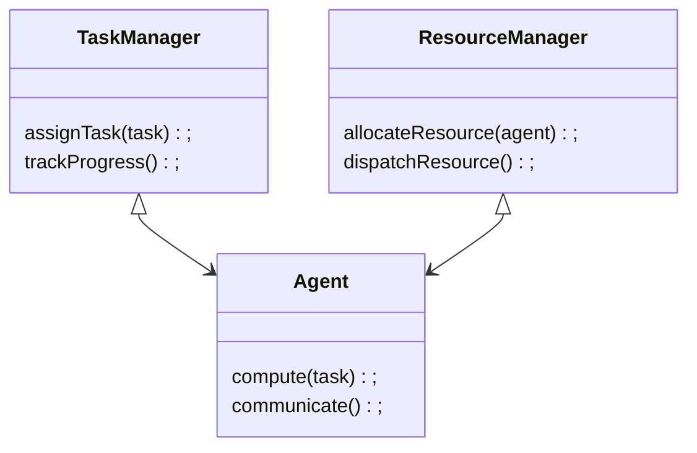
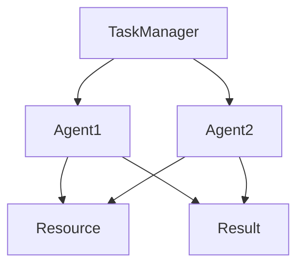
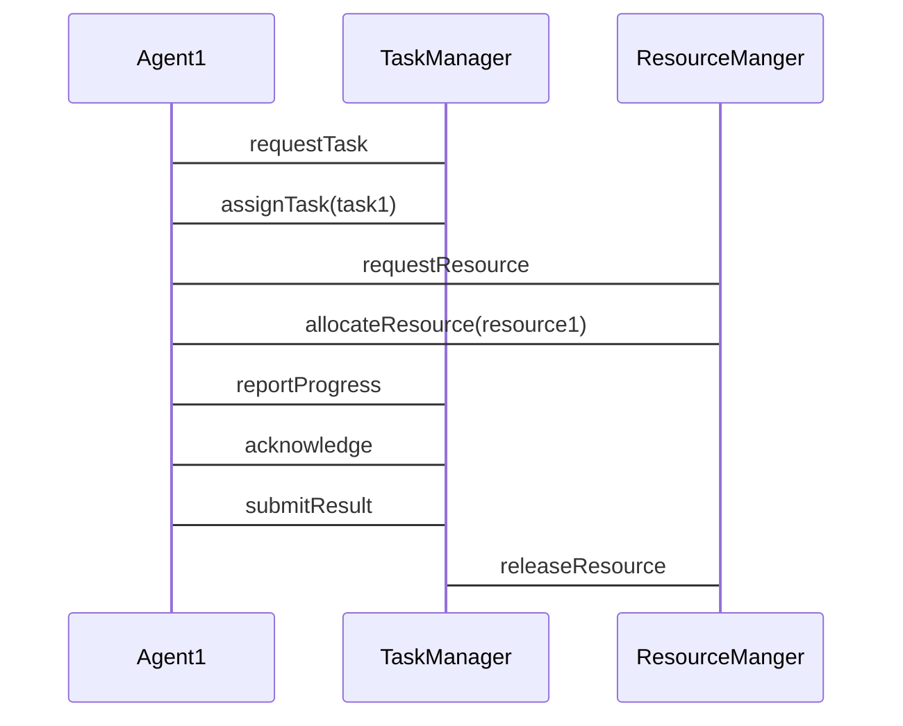

                 


# 多智能体AI如何优化研发效率评估流程

## 关键词：多智能体AI、研发效率评估、分布式计算、协作算法、系统架构设计

## 摘要：本文将探讨多智能体AI如何优化研发效率评估流程。首先介绍多智能体AI的核心概念和研发效率评估的重要性，然后分析多智能体AI在研发效率评估中的应用。接着详细讲解多智能体AI的算法原理和数学模型，并通过系统架构设计展示其在研发效率评估中的实际应用。最后，通过项目实战和最佳实践总结多智能体AI优化研发效率评估流程的优势和挑战。

---

## 第一章：多智能体AI与研发效率评估的背景与概念

### 1.1 多智能体AI的定义与特点

#### 1.1.1 多智能体AI的定义
多智能体AI是指由多个智能体协同工作，通过分布式计算和协作来完成复杂任务的系统。与传统单智能体AI不同，多智能体AI强调智能体之间的通信、协作和共享。

#### 1.1.2 多智能体AI的核心特点
- **分布式计算**：智能体独立计算，通过通信协作完成任务。
- **协作性**：智能体之间共享信息，协同完成目标。
- **动态性**：适应环境变化，实时调整策略。

#### 1.1.3 多智能体AI与传统单智能体AI的区别
| 特性        | 单智能体AI         | 多智能体AI       |
|-------------|-------------------|-----------------|
| 结构         | 单一计算单元     | 多个计算单元    |
| 协作方式     | 独立完成任务     | 协作完成任务    |
| 适应性       | 较低             | 较高            |

### 1.2 研发效率评估的定义与重要性

#### 1.2.1 研发效率评估的定义
研发效率评估是对研发过程中的任务完成情况、资源利用情况等进行量化分析，以优化研发流程。

#### 1.2.2 研发效率评估的指标与方法
- **任务完成率**：任务按时完成的比例。
- **资源利用率**：资源的使用效率。
- **成本控制**：研发成本是否在预算内。

#### 1.2.3 研发效率评估在企业中的作用
- **优化流程**：识别瓶颈，提高效率。
- **降低成本**：合理分配资源，减少浪费。
- **提升竞争力**：加快产品开发速度。

### 1.3 多智能体AI在研发效率评估中的应用前景

#### 1.3.1 多智能体AI的潜在应用场景
- **任务分配**：智能体协同分配研发任务。
- **进度跟踪**：实时监控任务进度。
- **资源优化**：智能分配资源，提高效率。

#### 1.3.2 多智能体AI在研发效率评估中的优势
- **高效协作**：智能体协同工作，提高效率。
- **动态调整**：根据环境变化实时调整策略。
- **数据驱动**：通过数据分析优化评估。

#### 1.3.3 多智能体AI应用的挑战与机遇
- **挑战**：通信延迟、协作复杂性。
- **机遇**：提升效率，降低成本。

## 1.4 本章小结
本章介绍了多智能体AI的定义、特点，研发效率评估的重要性和多智能体AI的应用前景。通过对比分析，展示了多智能体AI在研发效率评估中的潜力和优势。

---

## 第二章：多智能体AI与研发效率评估的核心概念

### 2.1 多智能体AI的核心概念

#### 2.1.1 多智能体系统的组成与关系
- **智能体**：独立计算单元，通过通信协作完成任务。
- **通信机制**：智能体之间共享信息的方式。

#### 2.1.2 多智能体系统的通信机制
- **同步通信**：实时交互，如实时消息传递。
- **异步通信**：非实时交互，如队列处理。

#### 2.1.3 多智能体系统的协作策略
- **协商**：智能体之间通过协商确定任务分配。
- **任务分解**：将复杂任务分解为子任务，分别处理。

### 2.2 研发效率评估的核心要素

#### 2.2.1 研发任务的分解与分配
- **任务分解**：将大任务分解为小任务。
- **任务分配**：根据智能体能力分配任务。

#### 2.2.2 研发进度的跟踪与反馈
- **进度跟踪**：实时监控任务进度。
- **反馈机制**：根据反馈调整策略。

#### 2.2.3 研发资源的优化配置
- **资源分配**：合理分配计算资源。
- **资源调度**：动态调整资源分配。

### 2.3 多智能体AI与研发效率评估的关联

#### 2.3.1 多智能体AI在研发任务分配中的作用
- **智能分配**：根据智能体能力分配任务。
- **动态调整**：根据进度反馈调整任务。

#### 2.3.2 多智能体AI在研发进度跟踪中的应用
- **实时监控**：智能体实时汇报进度。
- **预测分析**：基于历史数据预测进度。

#### 2.3.3 多智能体AI在研发资源优化中的价值
- **资源分配**：智能分配计算资源。
- **动态调度**：根据负载调整资源。

### 2.4 本章小结
本章详细讲解了多智能体AI的核心概念和研发效率评估的核心要素，分析了多智能体AI在研发效率评估中的作用和价值。

---

## 第三章：多智能体AI的算法原理与数学模型

### 3.1 多智能体AI的核心算法

#### 3.1.1 分布式计算与协作算法
- **分布式计算**：任务分解，局部计算，结果汇总。
- **协作算法**：任务分配，协同计算，结果共享。

#### 3.1.2 多智能体通信协议
- **通信协议**：定义消息格式和交互规则。
- **通信机制**：选择同步或异步通信。

#### 3.1.3 多智能体决策模型
- **决策模型**：基于环境和反馈做出决策。
- **学习机制**：通过反馈优化决策模型。

### 3.2 多智能体AI的数学模型

#### 3.2.1 多智能体协作的数学表达
$$ P(i) = \sum_{j=1}^{n} w_{ij} \cdot a_j $$
其中，\( P(i) \) 表示智能体i的贡献，\( w_{ij} \) 是权重，\( a_j \) 是其他智能体的贡献。

#### 3.2.2 多智能体通信的数学模型
$$ C(i) = \sum_{j=1}^{m} c_{ij} \cdot x_j $$
其中，\( C(i) \) 表示智能体i的通信成本，\( c_{ij} \) 是通信权重，\( x_j \) 是其他智能体的通信量。

#### 3.2.3 多智能体决策的数学公式
$$ D(i) = \argmax_{k} \sum_{j=1}^{n} p_{jk} \cdot s_j $$
其中，\( D(i) \) 表示智能体i的决策，\( p_{jk} \) 是概率，\( s_j \) 是状态。

### 3.3 算法实现与代码示例

#### 3.3.1 算法实现步骤
1. 初始化智能体。
2. 分配任务。
3. 协作计算。
4. 返回结果。

#### 3.3.2 Python代码示例

```python
class Agent:
    def __init__(self, id):
        self.id = id
        self.task = None

    def assign_task(self, task):
        self.task = task

    def compute(self):
        # 计算逻辑
        return self.task.result

# 初始化智能体
agents = [Agent(i) for i in range(4)]

# 分配任务
tasks = [task1, task2, task3, task4]
for agent, task in zip(agents, tasks):
    agent.assign_task(task)

# 协作计算
results = [agent.compute() for agent in agents]

# 返回结果
print(results)
```

#### 3.3.3 代码解读与分析
- **Agent类**：表示一个智能体，包含任务分配和计算方法。
- **初始化**：创建多个智能体。
- **任务分配**：将任务分配给智能体。
- **计算**：每个智能体独立计算任务。
- **结果汇总**：收集所有智能体的计算结果。

### 3.4 本章小结
本章介绍了多智能体AI的核心算法和数学模型，并通过Python代码展示了算法的实现步骤。

---

## 第四章：研发效率评估的系统分析与架构设计

### 4.1 系统需求分析

#### 4.1.1 问题场景介绍
- **任务分配**：如何高效分配研发任务。
- **进度跟踪**：如何实时监控任务进度。
- **资源优化**：如何合理分配资源。

#### 4.1.2 系统目标与功能需求
- **目标**：优化研发效率评估流程。
- **功能需求**：任务分配、进度跟踪、资源优化。

#### 4.1.3 系统边界与接口设计
- **系统边界**：研发团队内部。
- **接口设计**：智能体之间的通信接口。

### 4.2 系统架构设计

#### 4.2.1 系统模块划分
- **任务管理模块**：负责任务分配和跟踪。
- **资源管理模块**：负责资源分配和调度。
- **通信模块**：负责智能体之间的通信。

#### 4.2.2 系统功能设计（领域模型）



#### 4.2.3 系统架构设计图（Mermaid 架构图）



### 4.3 系统交互设计

#### 4.3.1 系统交互流程图（Mermaid 序列图）



### 4.4 本章小结
本章详细分析了研发效率评估系统的架构设计，包括模块划分、功能设计和交互设计，展示了多智能体AI在系统中的应用。

---

## 第五章：多智能体AI优化研发效率评估的项目实战

### 5.1 项目环境与工具

#### 5.1.1 环境安装
- **Python 3.8+**
- **库依赖**：networkx, matplotlib

#### 5.1.2 工具介绍
- **网络模拟工具**：模拟智能体之间的通信。
- **任务管理工具**：分配和跟踪任务。

### 5.2 系统核心实现源代码

#### 5.2.1 系统核心代码实现

```python
import networkx as nx
from collections import deque

class TaskManager:
    def __init__(self):
        self.tasks = []

    def assign_task(self, agent, task):
        agent.task = task
        self.tasks.append(task)

class ResourceManager:
    def __init__(self):
        self.resources = []

    def allocate_resource(self, agent):
        if self.resources:
            agent.resource = self.resources.pop(0)
        else:
            agent.resource = None

class Agent:
    def __init__(self, id):
        self.id = id
        self.task = None
        self.resource = None

    def compute(self):
        if self.resource:
            return f"Task {self.task} completed by Agent {self.id}"
        else:
            return f"Task {self.task} failed due to resource shortage"

# 初始化
task_manager = TaskManager()
resource_manager = ResourceManager()
agents = [Agent(i) for i in range(4)]

# 分配资源
for agent in agents:
    resource_manager.allocate_resource(agent)

# 分配任务
tasks = [f"Task{i+1}" for i in range(4)]
for i in range(len(agents)):
    task_manager.assign_task(agents[i], tasks[i])

# 计算结果
results = [agent.compute() for agent in agents]
print(results)
```

#### 5.2.2 代码解读与分析
- **TaskManager类**：管理任务分配。
- **ResourceManager类**：管理资源分配。
- **Agent类**：表示智能体，包含任务和资源分配。

### 5.3 实际案例分析与详细讲解

#### 5.3.1 系统交互分析
- **任务分配**：每个智能体分配一个任务。
- **资源分配**：每个智能体分配一个资源。
- **计算结果**：智能体根据分配的任务和资源进行计算。

#### 5.3.2 系统运行结果
- **正常情况**：所有任务成功完成。
- **资源不足情况**：部分任务失败。

### 5.4 本章小结
本章通过具体案例展示了多智能体AI优化研发效率评估的实现过程，包括环境搭建、代码实现和案例分析。

---

## 第六章：多智能体AI优化研发效率评估的最佳实践与总结

### 6.1 小结
多智能体AI通过协作和分布式计算，显著提升了研发效率评估的效率和准确性。

### 6.2 注意事项
- **通信延迟**：需要考虑通信延迟对任务的影响。
- **协作复杂性**：协作越复杂，效率可能越低。
- **资源分配**：合理分配资源是关键。

### 6.3 拓展阅读
- **推荐书籍**：《Multi-Agent Systems: Algorithmic, Complexity, and Synthesis》
- **推荐文章**：《Distributed Computing and Its Discontents》

### 6.4 本章小结
本章总结了多智能体AI优化研发效率评估的最佳实践，提出了注意事项和拓展阅读方向。

---

## 总结
本文详细探讨了多智能体AI如何优化研发效率评估流程，从背景概念、算法原理到系统设计和项目实战，全面展示了多智能体AI在研发效率评估中的应用。通过具体案例和代码实现，读者可以深入了解多智能体AI的核心原理和实际应用。最后，本文提出了最佳实践和注意事项，为读者提供了进一步学习和实践的方向。

