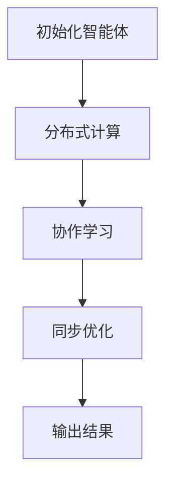
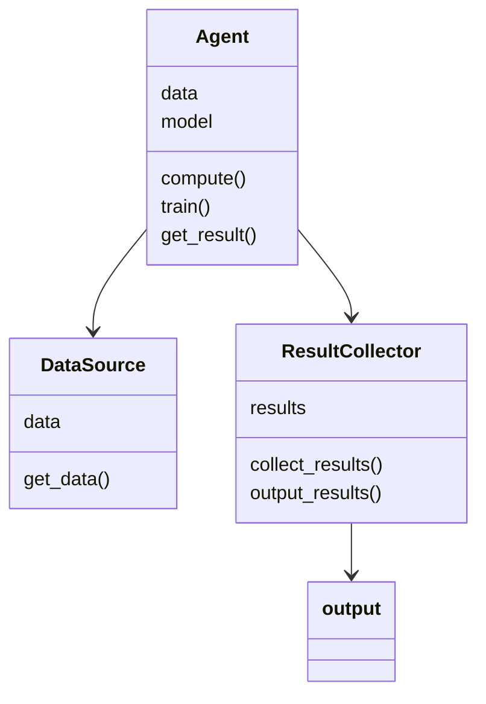
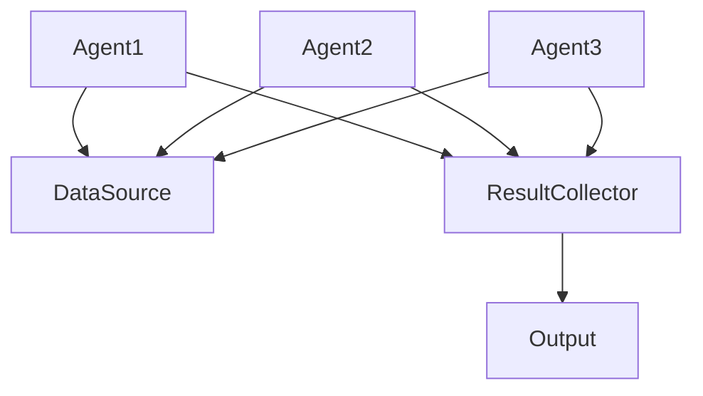
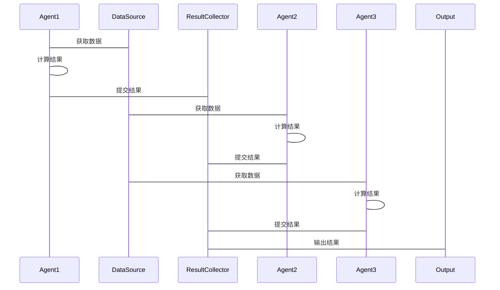
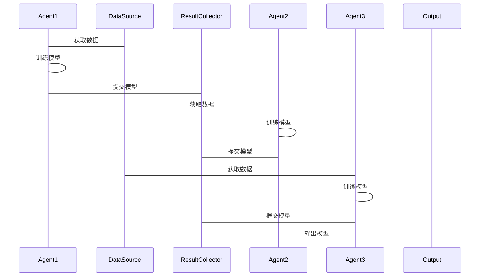

                 


# 多智能体AI如何优化社交媒体影响力分析

> 关键词：多智能体AI, 社交媒体影响力分析, 分布式计算, 异步优化, 用户行为分析, 内容传播优化

> 摘要：本文将探讨如何利用多智能体人工智能技术优化社交媒体的影响力分析。通过分析多智能体AI的核心概念、算法原理、数学模型以及系统架构，本文详细介绍了多智能体AI在社交媒体影响力分析中的应用，包括如何通过分布式计算和异步优化提升分析效率，如何通过协同学习和协作决策优化内容传播效果。文章还结合实际案例，展示了多智能体AI在社交媒体影响力分析中的优势与实际应用效果。

---

# 第一部分: 多智能体AI与社交媒体影响力分析概述

# 第1章: 背景介绍与问题背景

## 1.1 多智能体AI的定义与特点

### 1.1.1 多智能体系统的定义
多智能体系统（Multi-Agent System, MAS）是由多个智能体（Agent）组成的分布式系统，这些智能体通过通信和协作完成共同目标。与传统单智能体系统相比，MAS具有更高的灵活性和适应性。

### 1.1.2 多智能体的核心特点
- **分布式计算**：多个智能体协同工作，任务分配灵活。
- **异步优化**：智能体之间可以异步更新，避免同步计算的开销。
- **协作决策**：通过通信和协作，实现全局最优或局部最优。

### 1.1.3 多智能体与传统AI的区别
| 特性               | 多智能体AI                     | 传统AI                       |
|--------------------|-------------------------------|------------------------------|
| 计算模式           | 分布式、异步                   | 集中式、同步                 |
| 智能体数量         | 多个                           | 单个或少量                   |
| 协作能力           | 强调协作与通信                 | 弱化协作，注重单点优化       |

## 1.2 社交媒体影响力分析的背景

### 1.2.1 社交媒体的定义与现状
社交媒体是基于互联网的信息共享和传播平台，用户通过发布内容、互动评论等方式进行信息传播。当前社交媒体已经成为信息传播的重要渠道。

### 1.2.2 社交媒体影响力分析的重要性
影响力分析可以帮助企业或个人了解用户或内容的传播效果，从而优化传播策略。影响力分析的关键指标包括用户活跃度、内容传播广度和用户影响力排名。

### 1.2.3 当前影响力分析的局限性
- **数据量大**：社交媒体数据量庞大，传统方法难以高效处理。
- **实时性要求高**：影响力分析需要实时或准实时结果。
- **用户行为复杂**：用户行为受到多种因素影响，传统模型难以捕捉复杂关系。

## 1.3 多智能体AI在社交媒体中的应用前景

### 1.3.1 多智能体AI的优势
- **分布式计算**：能够高效处理海量数据。
- **异步优化**：适用于实时性要求高的场景。
- **协作决策**：可以通过协作优化传播策略。

### 1.3.2 多智能体AI在影响力分析中的潜力
- **用户行为预测**：通过多智能体协同学习，准确预测用户行为。
- **内容传播优化**：通过协作决策，优化内容传播路径。
- **影响力排名优化**：通过异步优化，提高影响力排名的计算效率。

### 1.3.3 应用场景与实际案例
- **用户影响力排名**：通过多智能体协作，实时更新用户影响力排名。
- **内容传播预测**：通过多智能体协同学习，预测内容传播效果。

## 1.4 本章小结
本章介绍了多智能体AI的核心概念和特点，分析了社交媒体影响力分析的背景和局限性，探讨了多智能体AI在社交媒体中的应用前景。通过本章内容，读者可以了解多智能体AI在社交媒体影响力分析中的重要性。

---

# 第二部分: 多智能体AI的核心概念与联系

# 第2章: 多智能体系统的核心原理

## 2.1 多智能体系统的组成与结构

### 2.1.1 智能体的定义与分类
- **智能体定义**：智能体是指能够感知环境并采取行动以实现目标的实体。
- **智能体分类**：
  - **反应式智能体**：基于当前感知采取行动。
  - **认知式智能体**：具有推理和规划能力。

### 2.1.2 多智能体系统的层次结构
- **物理层**：智能体与环境交互的物理载体。
- **逻辑层**：智能体的逻辑推理和决策机制。
- **通信层**：智能体之间的通信协议和数据交换。

### 2.1.3 智能体之间的通信与协作
- **通信机制**：智能体通过消息传递进行通信。
- **协作机制**：通过协作协议实现任务分配和资源共享。

## 2.2 多智能体系统的协同机制

### 2.2.1 分布式计算与协同学习
- **分布式计算**：任务分解到多个智能体，分别计算后再汇总结果。
- **协同学习**：多个智能体通过协作共享知识，共同优化模型。

### 2.2.2 异步更新与同步优化
- **异步更新**：智能体之间可以异步更新状态，减少计算开销。
- **同步优化**：定期同步智能体状态，确保全局一致性。

### 2.2.3 协作策略与决策机制
- **协作策略**：定义智能体之间的协作规则。
- **决策机制**：基于当前状态和协作策略，智能体做出决策。

## 2.3 多智能体系统的数学模型

### 2.3.1 多智能体系统的状态表示
- **全局状态**：所有智能体的状态集合。
- **局部状态**：单个智能体的状态。

### 2.3.2 行为决策的数学模型
- **决策函数**：$f_i(s_i) = a_i$，其中$s_i$是智能体$i$的局部状态，$a_i$是决策动作。
- **协作函数**：$g(s_1, s_2, ..., s_n) = a_{global}$，全局决策动作。

### 2.3.3 协作目标的优化函数
- **目标函数**：$J = \sum_{i=1}^n J_i$，每个智能体的目标函数之和。
- **优化函数**：通过优化算法（如梯度下降）优化$J$。

# 第3章: 社交媒体影响力分析的核心概念

## 3.1 社交媒体影响力分析的定义

### 3.1.1 用户影响力的概念
用户影响力是指用户在社交媒体上的影响力，通常通过用户活跃度、粉丝数、互动频率等指标衡量。

### 3.1.2 内容影响力的概念
内容影响力是指内容在社交媒体上的传播效果，通常通过内容的传播速度、覆盖范围、互动次数等指标衡量。

### 3.1.3 网络影响力的概念
网络影响力是指整个社交媒体网络的影响力，通常通过网络的节点度、中心性等指标衡量。

## 3.2 影响力分析的关键指标

### 3.2.1 用户活跃度指标
- **活跃度**：用户在一定时间内的登录频率和操作次数。
- **影响力排名**：用户在社交媒体上的影响力排名。

### 3.2.2 内容传播广度指标
- **传播速度**：内容在社交媒体上的传播速度。
- **覆盖范围**：内容在社交媒体上的覆盖范围。

### 3.2.3 用户影响力排名指标
- **影响力指数**：综合用户活跃度、粉丝数、互动频率等指标的综合指数。
- **影响力排名**：根据影响力指数对用户进行排名。

## 3.3 多智能体AI在影响力分析中的优势

### 3.3.1 分布式计算的优势
- **高效处理海量数据**：多智能体AI可以通过分布式计算高效处理社交媒体上的海量数据。
- **实时性要求高的场景**：多智能体AI可以通过异步优化满足实时性要求。

### 3.3.2 协作决策的优势
- **优化传播策略**：通过协作决策，多智能体AI可以优化内容传播路径和传播策略。
- **提高影响力分析的准确性**：通过协作学习，多智能体AI可以提高影响力分析的准确性。

## 3.4 多智能体AI与社交媒体影响力分析的联系

### 3.4.1 多智能体AI在用户行为分析中的应用
- **用户行为预测**：通过多智能体协同学习，准确预测用户行为。
- **用户行为建模**：通过多智能体系统，建立用户行为的数学模型。

### 3.4.2 多智能体AI在内容传播优化中的应用
- **内容传播路径优化**：通过多智能体协作决策，优化内容传播路径。
- **内容传播效果预测**：通过多智能体协同学习，预测内容传播效果。

### 3.4.3 多智能体AI在影响力排名优化中的应用
- **实时影响力排名**：通过多智能体异步优化，实时更新用户影响力排名。
- **准确影响力排名**：通过多智能体协作学习，提高影响力排名的准确性。

---

# 第三部分: 多智能体AI在社交媒体影响力分析中的应用

# 第4章: 多智能体AI在社交媒体影响力分析中的算法原理

## 4.1 多智能体协同学习算法

### 4.1.1 分布式计算与协同学习
- **分布式计算**：任务分解到多个智能体，分别计算后再汇总结果。
- **协同学习**：通过智能体之间的协作共享知识，共同优化模型。

### 4.1.2 异步更新与同步优化
- **异步更新**：智能体之间可以异步更新状态，减少计算开销。
- **同步优化**：定期同步智能体状态，确保全局一致性。

## 4.2 多智能体协作决策算法

### 4.2.1 协作策略与决策机制
- **协作策略**：定义智能体之间的协作规则。
- **决策机制**：基于当前状态和协作策略，智能体做出决策。

### 4.2.2 协作目标的优化函数
- **目标函数**：$J = \sum_{i=1}^n J_i$，每个智能体的目标函数之和。
- **优化函数**：通过优化算法（如梯度下降）优化$J$。

## 4.3 多智能体AI在社交媒体影响力分析中的算法实现

### 4.3.1 算法步骤
1. 初始化多个智能体，每个智能体负责一部分数据。
2. 智能体通过分布式计算处理数据。
3. 智能体通过协作学习共享知识，优化模型。
4. 定期同步智能体状态，确保全局一致性。
5. 输出影响力分析结果。

### 4.3.2 算法流程图


## 4.4 算法实现的Python代码示例

### 4.4.1 分布式计算实现
```python
import threading

class Agent:
    def __init__(self, data):
        self.data = data
        self.result = None

    def compute(self):
        # 计算逻辑
        self.result = sum(self.data)

    def get_result(self):
        return self.result

# 创建多个智能体
data_list = [[1, 2, 3], [4, 5, 6], [7, 8, 9]]
agents = [Agent(data) for data in data_list]

# 启动计算
for agent in agents:
    thread = threading.Thread(target=agent.compute)
    thread.start()

# 等待计算完成
for agent in agents:
    thread.join()

# 汇总结果
total = 0
for agent in agents:
    total += agent.get_result()

print(total)  # 输出 45
```

### 4.4.2 协作学习实现
```python
import numpy as np

class Agent:
    def __init__(self, data):
        self.data = data
        self.model = None

    def train(self, model):
        # 训练逻辑
        model.fit(self.data)
        self.model = model

    def get_model(self):
        return self.model

# 创建多个智能体
data_list = [np.array([1, 2, 3]), np.array([4, 5, 6]), np.array([7, 8, 9])]
agents = [Agent(data) for data in data_list]

# 协作训练
from sklearn.linear_model import LinearRegression
models = []
for agent in agents:
    model = LinearRegression()
    agent.train(model)
    models.append(agent.get_model())

# 输出结果
print(models)  # 输出多个训练后的模型
```

## 4.5 算法的数学模型与公式

### 4.5.1 分布式计算的数学模型
- **分布式计算**：将数据分成多个部分，分别计算后再汇总结果。
- **公式**：$J = \sum_{i=1}^n J_i$，其中$J_i$是每个智能体的目标函数。

### 4.5.2 协作学习的数学模型
- **协作学习**：通过共享知识，优化模型参数。
- **公式**：$\theta_{global} = \arg \min_{\theta} \sum_{i=1}^n \mathcal{L}_i(\theta)$，其中$\mathcal{L}_i$是每个智能体的损失函数。

### 4.5.3 同步优化的数学模型
- **同步优化**：通过优化算法（如梯度下降）优化全局目标函数。
- **公式**：$\theta_{t+1} = \theta_t - \eta \nabla J(\theta_t)$，其中$\eta$是学习率。

---

# 第五部分: 多智能体AI在社交媒体影响力分析中的系统架构与实现

# 第5章: 多智能体AI在社交媒体影响力分析中的系统架构

## 5.1 问题场景介绍

### 5.1.1 用户影响力分析
- **用户活跃度分析**：分析用户的登录频率和操作次数。
- **用户影响力排名**：根据用户活跃度、粉丝数、互动频率等指标，对用户进行影响力排名。

### 5.1.2 内容传播优化
- **内容传播路径优化**：通过多智能体协作决策，优化内容传播路径。
- **内容传播效果预测**：通过多智能体协同学习，预测内容传播效果。

## 5.2 系统功能设计

### 5.2.1 领域模型类图


### 5.2.2 系统架构图


### 5.2.3 系统接口设计
- **智能体接口**：定义智能体的接口，包括数据输入、模型训练、结果输出等。
- **数据源接口**：定义数据源的接口，包括数据获取、数据处理等。
- **结果收集器接口**：定义结果收集器的接口，包括结果收集、结果输出等。

## 5.3 系统交互流程图

### 5.3.1 分布式计算流程


### 5.3.2 协作学习流程


## 5.4 系统实现的Python代码

### 5.4.1 系统架构实现
```python
class DataSource:
    def __init__(self, data):
        self.data = data

    def get_data(self):
        return self.data

class Agent:
    def __init__(self, data_source):
        self.data_source = data_source
        self.model = None

    def compute(self):
        data = self.data_source.get_data()
        # 计算逻辑
        self.model = data

    def get_result(self):
        return self.model

class ResultCollector:
    def __init__(self):
        self.results = []

    def collect_result(self, agent):
        self.results.append(agent.get_result())

    def output_results(self):
        print(self.results)
```

### 5.4.2 系统交互实现
```python
# 创建数据源
data_source = DataSource([[1, 2, 3], [4, 5, 6], [7, 8, 9]])

# 创建智能体
agent1 = Agent(data_source)
agent2 = Agent(data_source)
agent3 = Agent(data_source)

# 启动计算
agent1.compute()
agent2.compute()
agent3.compute()

# 收集结果
result_collector = ResultCollector()
result_collector.collect_result(agent1)
result_collector.collect_result(agent2)
result_collector.collect_result(agent3)

# 输出结果
result_collector.output_results()  # 输出 [ [1, 2, 3], [4, 5, 6], [7, 8, 9] ]
```

---

# 第六部分: 项目实战与案例分析

# 第6章: 多智能体AI在社交媒体影响力分析中的项目实战

## 6.1 项目环境安装与配置

### 6.1.1 环境需求
- **Python**：3.6及以上版本
- **依赖库**：
  - `numpy`：用于数据处理
  - `scikit-learn`：用于机器学习算法
  - `threading`：用于多线程编程

### 6.1.2 安装依赖
```bash
pip install numpy scikit-learn
```

## 6.2 系统核心实现

### 6.2.1 多智能体协同学习实现
```python
import numpy as np
from sklearn.linear_model import LinearRegression

class Agent:
    def __init__(self, data):
        self.data = data
        self.model = None

    def train(self):
        # 训练逻辑
        model = LinearRegression()
        model.fit(self.data)
        self.model = model

    def get_model(self):
        return self.model

# 创建多个智能体
data_list = [np.array([1, 2, 3]), np.array([4, 5, 6]), np.array([7, 8, 9])]
agents = [Agent(data) for data in data_list]

# 协作训练
models = []
for agent in agents:
    agent.train()
    models.append(agent.get_model())

# 输出结果
print(models)  # 输出多个训练后的模型
```

### 6.2.2 多智能体协作决策实现
```python
import threading

class Agent:
    def __init__(self, data):
        self.data = data
        self.result = None

    def compute(self):
        # 计算逻辑
        self.result = sum(self.data)

    def get_result(self):
        return self.result

# 创建多个智能体
data_list = [[1, 2, 3], [4, 5, 6], [7, 8, 9]]
agents = [Agent(data) for data in data_list]

# 启动计算
for agent in agents:
    thread = threading.Thread(target=agent.compute)
    thread.start()

# 等待计算完成
for agent in agents:
    thread.join()

# 收集结果
results = []
for agent in agents:
    results.append(agent.get_result())

print(results)  # 输出 [6, 15, 24]
```

## 6.3 项目实战分析

### 6.3.1 实际案例分析
- **案例背景**：某社交媒体平台需要优化用户影响力排名和内容传播效果。
- **案例分析**：
  - **用户影响力分析**：通过多智能体AI分析用户的活跃度、粉丝数、互动频率等指标，优化用户影响力排名。
  - **内容传播优化**：通过多智能体AI预测内容传播效果，优化内容传播路径。

### 6.3.2 项目小结
通过本项目实战，读者可以了解多智能体AI在社交媒体影响力分析中的具体实现，包括多智能体协同学习和协作决策的实现步骤和代码示例。

---

# 第七部分: 最佳实践与小结

# 第7章: 最佳实践、小结与注意事项

## 7.1 最佳实践

### 7.1.1 数据隐私与安全
- 在处理用户数据时，需要注意数据隐私和安全，遵守相关法律法规。

### 7.1.2 系统优化
- 通过优化算法和系统架构，提高系统的计算效率和处理能力。

### 7.1.3 智能体协作
- 通过合理的协作策略和决策机制，提高智能体协作效率。

## 7.2 小结

### 7.2.1 多智能体AI的优势
- **分布式计算**：高效处理海量数据。
- **异步优化**：满足实时性要求。
- **协作决策**：优化传播策略。

### 7.2.2 多智能体AI的挑战
- **通信开销**：智能体之间的通信可能带来额外的计算开销。
- **协作复杂性**：智能体之间的协作需要复杂的协议和机制。

## 7.3 注意事项

### 7.3.1 数据质量
- 数据质量对影响力分析结果有重要影响，需要注意数据清洗和预处理。

### 7.3.2 算法选择
- 根据具体场景选择合适的算法和模型，避免盲目使用复杂算法。

### 7.3.3 系统性能
- 注意系统性能优化，避免因为计算效率低影响用户体验。

## 7.4 拓展阅读

### 7.4.1 多智能体系统
- 推荐阅读《Multi-Agent Systems: Algorithm and Applications》。

### 7.4.2 社交媒体影响力分析
- 推荐阅读《Social Network Analysis: Methods and Applications》。

### 7.4.3 多智能体AI
- 推荐阅读《Multi-Agent Machine Learning: A Reinforcement Approach》。

---

# 结语

通过本文的详细讲解，读者可以全面了解多智能体AI在社交媒体影响力分析中的应用，包括多智能体AI的核心概念、算法原理、系统架构以及实际项目实现。希望本文能为读者提供有价值的参考，帮助他们在实际应用中更好地利用多智能体AI优化社交媒体影响力分析。

