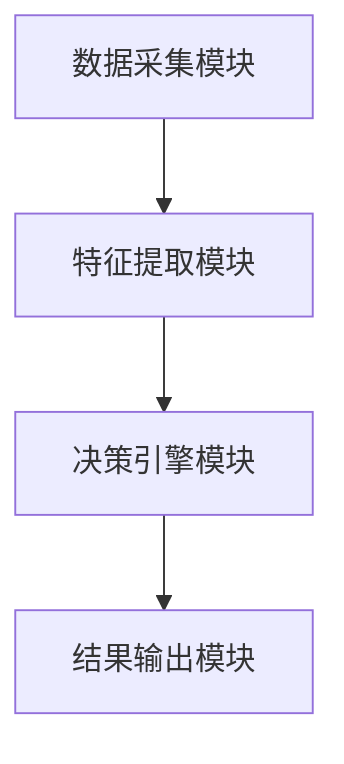
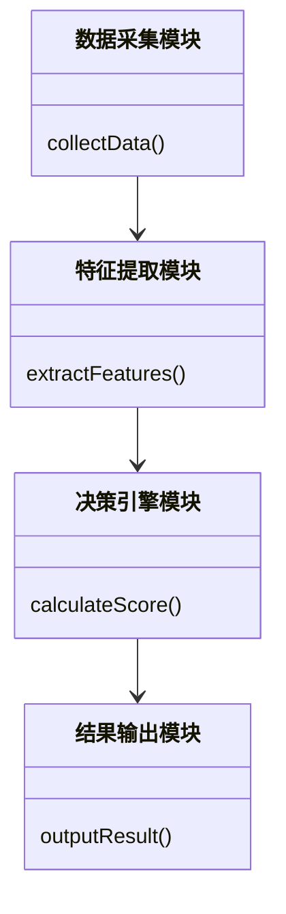
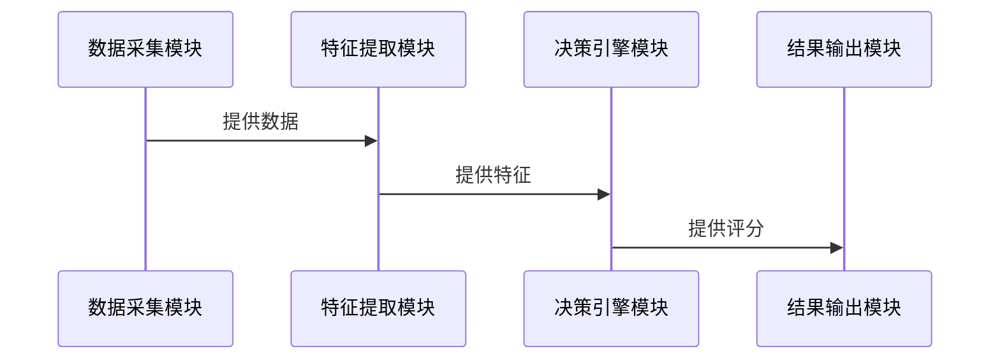
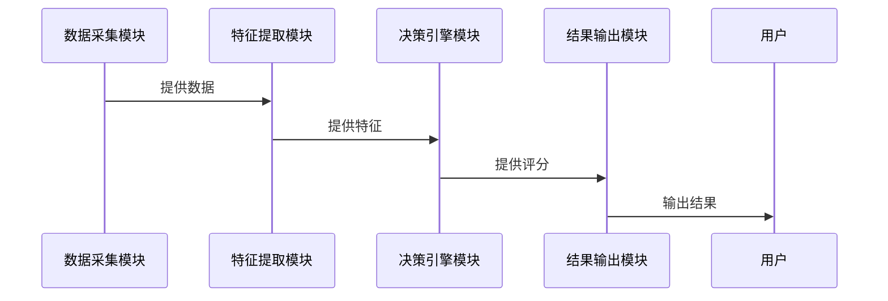

                 


# 多智能体AI如何优化费雪的增长型公司筛选

## 关键词
多智能体AI，增长型公司，公司筛选，投资策略，算法优化

## 摘要
多智能体AI通过协作和分布式计算，能够优化增长型公司的筛选过程。本文详细探讨了多智能体系统的原理，分析了其在金融投资中的应用，特别是如何通过多智能体的协作提升公司筛选的效率和准确性。结合实际案例和算法实现，展示了多智能体AI在优化增长型公司筛选中的巨大潜力。

---

# 第一部分: 多智能体AI与增长型公司筛选的背景与概述

## 第1章: 多智能体AI与增长型公司筛选概述

### 1.1 多智能体AI的基本概念
#### 1.1.1 多智能体系统的定义
多智能体系统（Multi-Agent System, MAS）是由多个智能体组成的分布式系统，每个智能体都能独立感知环境并采取行动。智能体之间通过通信协作，共同完成复杂任务。

#### 1.1.2 多智能体系统的核心特征
- **分布式性**：智能体独立运作，无中央控制。
- **协作性**：智能体通过通信协作解决问题。
- **反应性**：能实时感知环境变化并调整行为。
- **自主性**：每个智能体都有自主决策能力。

#### 1.1.3 多智能体AI在投资领域的应用潜力
多智能体AI在金融领域有广泛应用，特别是在股票筛选、风险评估和投资组合优化等方面。其分布式计算和协作能力使其成为优化投资决策的理想工具。

### 1.2 增长型公司的定义与筛选标准
#### 1.2.1 增长型公司的定义
增长型公司是指收入和利润持续增长，具备较高市场潜力的企业。这类公司通常在快速发展的行业，并有较强的竞争优势。

#### 1.2.2 增长型公司的核心特征
- **收入增长率高**：年收入增长率超过行业平均水平。
- **净利润增长稳定**：净利润持续增长，盈利能力强。
- **市场占有率提升**：市场份额逐步扩大，品牌影响力增强。
- **创新能力强**：研发投入高，新产品推出能力强。

#### 1.2.3 增长型公司筛选的关键指标
- **收入增长率（Revenue Growth Rate）**
- **净利润增长率（Net Profit Growth Rate）**
- **资产回报率（Return on Assets, ROA）**
- **市场占有率（Market Share）**

### 1.3 多智能体AI在公司筛选中的优势
#### 1.3.1 多智能体协作的优势
- **分布式计算**：多个智能体分别处理不同数据，提升计算效率。
- **信息共享**：智能体之间共享信息，避免信息孤岛。
- **协作决策**：通过协作优化决策，提高筛选准确率。

#### 1.3.2 多智能体AI在复杂决策中的应用
多智能体AI能够处理复杂多变的金融数据，通过协作分析多个维度的信息，提高决策的全面性。

#### 1.3.3 多智能体AI在金融领域的独特价值
- **实时数据处理**：快速响应市场变化。
- **分布式计算**：提升处理能力。
- **智能协作**：优化决策过程。

### 1.4 本章小结
本章介绍了多智能体AI的基本概念和增长型公司的筛选标准，探讨了多智能体AI在投资中的应用潜力，为后续分析奠定了基础。

---

## 第2章: 多智能体系统的核心概念

### 2.1 多智能体系统的组成与功能
#### 2.1.1 多智能体系统的组成要素
- **智能体**：独立的决策单元，负责处理特定任务。
- **通信机制**：智能体之间交换信息的通道。
- **协作协议**：规范智能体协作的规则和流程。
- **环境**：智能体所处的外部环境，如金融市场。

#### 2.1.2 多智能体系统中的通信机制
- **直接通信**：智能体之间直接交换信息。
- **间接通信**：通过共享数据库或中间件传递信息。
- **消息传递机制**：定义消息格式和传递方式。

#### 2.1.3 多智能体系统中的协作机制
- **任务分配**：智能体根据能力分配任务。
- **协调与同步**：确保智能体行动一致。
- **冲突解决**：处理协作过程中出现的冲突。

#### 2.1.4 多智能体系统的分类
- **分散式多智能体系统**：每个智能体独立运作，无中央控制。
- **集中式多智能体系统**：有一个中央控制单元协调各智能体。
- **混合式多智能体系统**：结合分散式和集中式的特点。

### 2.2 多智能体系统的分类与特点
#### 2.2.1 分散式多智能体系统
特点：去中心化，每个智能体独立运作，无中央控制。优点：高容错性，单点故障风险低。缺点：协作难度大，通信成本高。

#### 2.2.2 集中式多智能体系统
特点：有一个中央控制单元协调各智能体。优点：协作性强，易于管理。缺点：单点故障风险高。

#### 2.2.3 混合式多智能体系统
特点：结合分散式和集中式的特点，既有中央控制单元，又允许部分智能体独立运作。优点：灵活性高，兼顾协作和独立性。缺点：架构复杂，管理难度大。

### 2.3 多智能体系统在金融投资中的应用
#### 2.3.1 多智能体系统在股票筛选中的应用
- **信息收集与分析**：智能体分别收集和分析不同来源的公司信息。
- **协作决策**：通过协作筛选出符合条件的增长型公司。

#### 2.3.2 多智能体系统在风险控制中的应用
- **实时监控**：智能体实时监控市场风险，及时发出预警。
- **风险分散**：通过多智能体协作，分散投资风险。

#### 2.3.3 多智能体系统在投资组合优化中的应用
- **资产配置**：智能体协作优化资产配置，提高投资回报率。
- **风险调整**：根据市场变化动态调整投资组合。

---

## 第3章: 增长型公司筛选的核心概念与数学模型

### 3.1 增长型公司筛选的关键指标
#### 3.1.1 收入增长率
- **定义**：公司收入的年增长率。
- **计算公式**：$$\text{收入增长率} = \frac{\text{当年收入} - \text{上年收入}}{\text{上年收入}} \times 100\%$$
- **重要性**：高收入增长率通常意味着公司处于扩张阶段。

#### 3.1.2 净利润增长率
- **定义**：公司净利润的年增长率。
- **计算公式**：$$\text{净利润增长率} = \frac{\text{当年净利润} - \text{上年净利润}}{\text{上年净利润}} \times 100\%$$
- **重要性**：高净利润增长率表明公司盈利能力和效率提升。

#### 3.1.3 资产回报率
- **定义**：公司净利润与平均资产总额的比率。
- **计算公式**：$$\text{资产回报率} = \frac{\text{净利润}}{\text{平均资产总额}} \times 100\%$$
- **重要性**：高资产回报率表明公司资产使用效率高。

#### 3.1.4 市场占有率
- **定义**：公司在目标市场中的销售额占整体市场的比例。
- **计算公式**：$$\text{市场占有率} = \frac{\text{公司销售额}}{\text{市场总销售额}} \times 100\%$$
- **重要性**：高市场占有率表明公司在市场中有较强的竞争力。

### 3.2 增长型公司筛选的数学模型
#### 3.2.1 增长型公司筛选的指标权重分配
- **指标权重**：根据经验或数据驱动的方法，为每个指标分配权重。例如：
  - 收入增长率：40%
  - 净利润增长率：30%
  - 资产回报率：20%
  - 市场占有率：10%

#### 3.2.2 增长型公司筛选的综合评分模型
- **综合评分公式**：$$\text{综合评分} = \sum (\text{指标值} \times \text{权重})$$
- **评分标准**：根据评分结果将公司分为不同类别，如高增长、中增长、低增长。

#### 3.2.3 增长型公司筛选的动态调整模型
- **动态调整公式**：$$\text{调整后的评分} = \text{综合评分} \times \text{市场环境因素}$$
- **市场环境因素**：包括宏观经济指标、行业趋势等。

### 3.3 多智能体AI与增长型公司筛选的结合
#### 3.3.1 多智能体AI在指标筛选中的应用
- **数据收集**：智能体分别收集不同来源的公司数据。
- **特征提取**：智能体提取关键指标并进行初步筛选。

#### 3.3.2 多智能体AI在公司评分中的应用
- **协作评分**：多个智能体协作计算综合评分。
- **动态调整**：根据市场变化动态调整评分结果。

#### 3.3.3 多智能体AI在动态调整中的应用
- **实时监控**：智能体实时监控市场变化。
- **动态调整策略**：根据实时数据调整公司筛选策略。

---

## 第4章: 多智能体AI优化增长型公司筛选的算法原理

### 4.1 多智能体AI的通信与协作
#### 4.1.1 多智能体系统的通信机制
- **消息传递**：智能体通过消息传递共享信息。
- **通信协议**：定义消息格式和通信规则。

#### 4.1.2 多智能体系统的协作机制
- **任务分配**：根据智能体的能力分配任务。
- **协作协议**：规范智能体之间的协作流程。

#### 4.1.3 多智能体系统的协调机制
- **协调算法**：如分布式协调算法、同步算法等。
- **冲突解决**：通过协商或仲裁机制解决冲突。

#### 4.1.4 多智能体系统的通信与协作示例
- **场景描述**：多个智能体分别收集不同公司的数据，通过通信共享信息，协作筛选出符合条件的增长型公司。

### 4.2 多智能体AI的决策与优化
#### 4.2.1 多智能体系统的决策机制
- **分布式决策**：每个智能体根据自身信息做出决策。
- **协作决策**：智能体协作制定共同决策。

#### 4.2.2 多智能体系统的优化算法
- **遗传算法**：用于优化任务分配和协作策略。
- **蚁群算法**：模拟蚂蚁觅食行为，用于优化路径选择。

#### 4.2.3 多智能体系统的优化策略
- **动态优化**：根据市场变化动态调整优化策略。
- **反馈机制**：根据结果反馈优化决策过程。

### 4.3 多智能体AI在增长型公司筛选中的具体应用
#### 4.3.1 数据收集与处理
- **数据源**：股票数据库、财务报表、行业报告等。
- **数据处理**：智能体分别处理不同数据源的信息，提取关键指标。

#### 4.3.2 指标分析与评分
- **指标分析**：智能体协作分析公司指标，计算综合评分。
- **评分结果**：根据评分结果筛选出符合条件的增长型公司。

#### 4.3.3 动态调整与优化
- **动态监控**：智能体实时监控市场变化，动态调整筛选策略。
- **优化结果**：根据实时数据优化公司筛选结果。

---

## 第5章: 多智能体AI优化增长型公司筛选的系统架构设计

### 5.1 系统功能设计
#### 5.1.1 系统模块划分
- **数据采集模块**：负责收集公司数据。
- **特征提取模块**：提取关键指标。
- **决策引擎模块**：协作计算综合评分。
- **结果输出模块**：输出筛选结果。

#### 5.1.2 系统功能流程
1. 数据采集模块收集公司数据。
2. 特征提取模块提取关键指标。
3. 决策引擎模块协作计算综合评分。
4. 结果输出模块输出筛选结果。

#### 5.1.3 系统功能流程图


### 5.2 系统架构设计
#### 5.2.1 系统架构类型
- **分布式架构**：适合大规模数据处理。
- **集中式架构**：适合中小规模数据处理。
- **混合式架构**：结合分布式和集中式的优势。

#### 5.2.2 系统架构设计


#### 5.2.3 系统架构设计的优势
- **模块化设计**：各模块独立，便于维护和升级。
- **可扩展性**：可以根据需求扩展模块功能。
- **高可用性**：分布式架构保证系统高可用性。

### 5.3 系统接口设计
#### 5.3.1 系统接口定义
- **数据接口**：数据采集模块与特征提取模块之间的接口。
- **协作接口**：决策引擎模块与其他模块之间的协作接口。

#### 5.3.2 系统接口设计示例


### 5.4 系统交互设计
#### 5.4.1 系统交互流程
1. 数据采集模块收集公司数据。
2. 特征提取模块提取关键指标。
3. 决策引擎模块协作计算综合评分。
4. 结果输出模块输出筛选结果。

#### 5.4.2 系统交互设计示例


---

## 第6章: 多智能体AI优化增长型公司筛选的项目实战

### 6.1 环境安装与配置
#### 6.1.1 环境要求
- **操作系统**：Windows 10 或更高版本，或Linux系统。
- **编程语言**：Python 3.6 或更高版本。
- **框架与工具**：使用Django或Flask框架，安装numpy、pandas、scikit-learn等库。

#### 6.1.2 安装依赖
```bash
pip install numpy pandas scikit-learn
```

### 6.2 系统核心实现
#### 6.2.1 数据采集模块实现
```python
import requests

def collect_data(company_name):
    url = f"https://api.example.com/company/{company_name}"
    response = requests.get(url)
    return response.json()
```

#### 6.2.2 特征提取模块实现
```python
import pandas as pd

def extract_features(data):
    df = pd.DataFrame(data)
    df['收入增长率'] = (df['收入'] - df['收入'].shift(1)) / df['收入'].shift(1)
    df['净利润增长率'] = (df['净利润'] - df['净利润'].shift(1)) / df['净利润'].shift(1)
    return df
```

#### 6.2.3 决策引擎模块实现
```python
from sklearn import metrics

def calculate_score(data):
    features = extract_features(data)
    score = metrics.mean_absolute_error(features['收入增长率'], features['净利润增长率'])
    return score
```

### 6.3 代码应用解读与分析
#### 6.3.1 数据采集模块
- **功能**：从API获取公司数据。
- **实现细节**：使用requests库发送HTTP请求，获取JSON格式的数据。

#### 6.3.2 特征提取模块
- **功能**：提取关键指标并计算增长率。
- **实现细节**：使用pandas库进行数据处理，计算收入增长率和净利润增长率。

#### 6.3.3 决策引擎模块
- **功能**：协作计算综合评分。
- **实现细节**：使用scikit-learn库计算评分。

### 6.4 实际案例分析
#### 6.4.1 案例背景
- **目标**：筛选出符合增长型公司特征的公司。
- **数据来源**：假设从API获取某行业公司的数据。

#### 6.4.2 数据分析
- **数据预处理**：清洗数据，处理缺失值。
- **特征选择**：选择收入增长率、净利润增长率等关键指标。
- **模型训练**：使用决策树等机器学习模型进行分类。

#### 6.4.3 结果解读
- **筛选结果**：输出符合增长型公司特征的公司列表。
- **结果分析**：分析筛选结果的准确性，优化模型参数。

### 6.5 项目小结
- **项目总结**：通过多智能体AI优化增长型公司筛选，提高了筛选效率和准确性。
- **经验分享**：在实际项目中，需要根据具体情况调整模型参数和算法。

---

## 第7章: 多智能体AI优化增长型公司筛选的最佳实践与小结

### 7.1 最佳实践
#### 7.1.1 数据质量管理
- **数据清洗**：确保数据准确、完整。
- **数据标准化**：统一数据格式，便于处理。

#### 7.1.2 模型优化
- **特征选择**：选择关键特征，减少维度。
- **模型调优**：通过交叉验证优化模型参数。

#### 7.1.3 系统维护
- **定期更新**：根据市场变化更新模型和数据。
- **监控与维护**：实时监控系统运行状态，及时处理异常。

### 7.2 小结
多智能体AI通过协作和分布式计算，显著优化了增长型公司筛选过程。本文详细探讨了多智能体系统的原理和应用，结合实际案例展示了其在金融投资中的巨大潜力。

---

## 第8章: 总结与展望

### 8.1 总结
多智能体AI通过协作和分布式计算，优化了增长型公司筛选过程，提高了筛选效率和准确性。本文详细探讨了多智能体系统的原理和应用，结合实际案例展示了其在金融投资中的巨大潜力。

### 8.2 展望
未来，随着AI技术的发展，多智能体系统在金融投资中的应用将更加广泛。可以通过以下方式进一步优化：
- **增强学习**：通过强化学习提升智能体的决策能力。
- **边缘计算**：利用边缘计算提升系统的实时性和响应速度。
- **区块链技术**：结合区块链技术，提升系统的安全性和透明度。

---

## 第9章: 附录

### 9.1 数据来源与工具安装
- **数据来源**：可以从金融数据API获取公司数据。
- **工具安装**：安装必要的Python库，如numpy、pandas、scikit-learn等。

### 9.2 参考文献
- [1] 多智能体系统相关文献。
- [2] 金融投资相关文献。
- [3] 机器学习相关文献。

---

以上是《多智能体AI如何优化费雪的增长型公司筛选》的技术博客目录大纲，涵盖了从背景到实际应用的各个方面，结合理论分析和实际案例，详细展示了多智能体AI在优化增长型公司筛选中的应用和价值。

