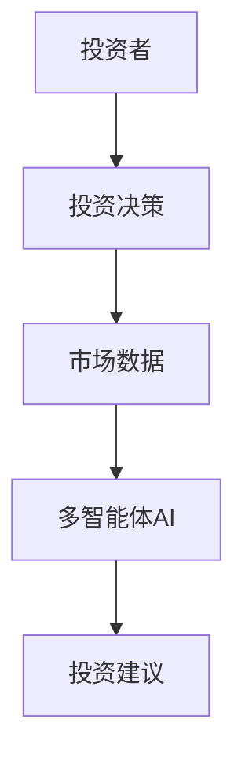
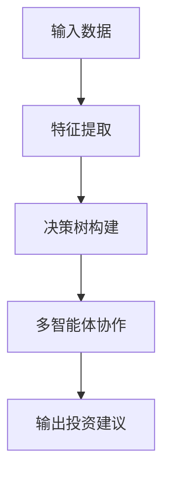
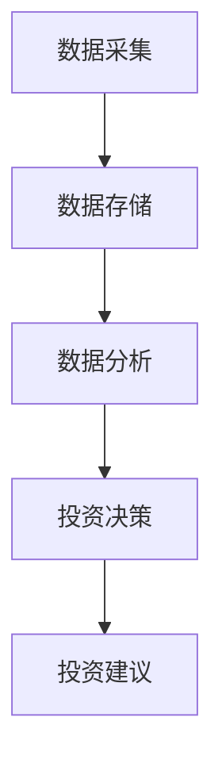
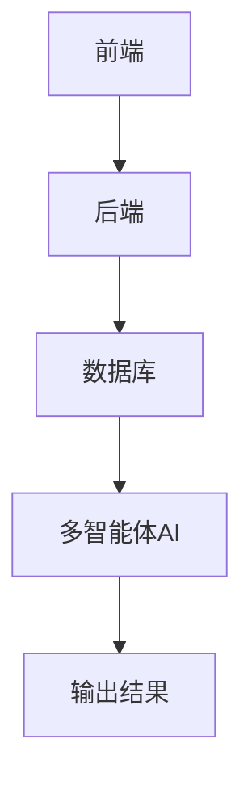
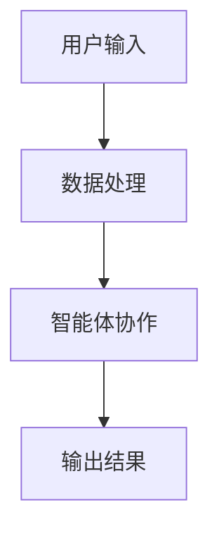

                 


# 多智能体AI如何增强价值投资的全球化视野

## 关键词：多智能体AI、价值投资、全球化、机器学习、金融建模、分布式计算、投资策略

## 摘要：  
本文探讨了多智能体人工智能（Multi-Agent AI）如何在价值投资领域中增强全球化视野。通过分析多智能体AI的核心原理、算法实现和系统设计，本文揭示了多智能体AI在投资决策中的独特优势，特别是在全球化背景下如何优化投资策略。通过具体案例和系统架构设计，本文展示了多智能体AI如何帮助投资者在全球市场中实现更高效、更精准的投资决策。

---

# 第一部分：多智能体AI与价值投资的结合

## 第1章：多智能体AI与价值投资的背景介绍

### 1.1 多智能体AI的定义与特点

#### 1.1.1 多智能体AI的定义  
多智能体AI是指由多个具有独立决策能力的智能体组成的系统，这些智能体能够通过通信和协作完成复杂任务。与传统的单智能体AI不同，多智能体AI强调智能体之间的交互与协作。

#### 1.1.2 多智能体AI的核心特点  
- **分布式计算**：智能体之间通过分布式计算完成任务。  
- **协作性**：智能体之间能够通过通信协议协作完成目标。  
- **自主性**：每个智能体都具有一定的自主决策能力。  
- **动态性**：系统能够适应动态变化的环境。  

#### 1.1.3 多智能体AI与传统AI的区别  
- 传统AI通常基于单一智能体，而多智能体AI由多个智能体组成。  
- 多智能体AI强调协作与通信，而传统AI更注重单点优化。  

### 1.2 价值投资的理论基础

#### 1.2.1 价值投资的定义  
价值投资是一种投资策略，强调以低于内在价值的价格买入优质资产，长期持有，等待市场对其价值的重新评估。  

#### 1.2.2 价值投资的核心理念  
- **长期视角**：关注企业的长期价值，而非短期波动。  
- **安全边际**：买入价格低于内在价值，以降低风险。  
- **优质企业**：选择具有强大竞争优势的企业。  

#### 1.2.3 价值投资与传统投资的区别  
- 传统投资注重短期收益，而价值投资注重长期价值。  
- 传统投资依赖市场趋势，而价值投资依赖对企业内在价值的分析。  

### 1.3 多智能体AI与价值投资的结合意义

#### 1.3.1 多智能体AI在金融领域的应用潜力  
- 多智能体AI可以用于市场数据的实时分析、风险评估和投资组合优化。  
- 多智能体AI能够通过分布式计算处理海量数据，提高分析效率。  

#### 1.3.2 价值投资与多智能体AI结合的优势  
- 多智能体AI可以通过协作分析市场、行业和企业的数据，提供更全面的投资建议。  
- 多智能体AI可以模拟不同市场环境下的投资策略，帮助投资者更好地应对复杂情况。  

#### 1.3.3 全球化视野对投资决策的影响  
- 全球化视野能够帮助投资者发现跨市场的投资机会。  
- 多智能体AI可以通过全球化数据源进行分析，提供更精准的全球投资策略。  

### 1.4 本章小结  
本章介绍了多智能体AI的定义、特点以及其在金融领域的应用潜力，同时分析了价值投资的核心理念和多智能体AI与价值投资结合的优势。

---

## 第2章：多智能体AI的核心概念与联系

### 2.1 多智能体AI的原理

#### 2.1.1 多智能体系统的组成  
- **智能体**：具有感知和决策能力的独立实体。  
- **通信机制**：智能体之间通过通信协议交换信息。  
- **协作机制**：智能体之间通过协作完成共同目标。  

#### 2.1.2 多智能体AI的通信方式  
- **直接通信**：智能体之间通过共享内存或数据库进行通信。  
- **间接通信**：智能体通过中间媒介（如消息队列）进行通信。  

#### 2.1.3 多智能体AI的协作机制  
- **任务分配**：智能体之间通过协商分配任务。  
- **协作规划**：智能体共同制定协作计划。  
- **动态调整**：根据环境变化动态调整协作策略。  

### 2.2 多智能体AI与价值投资的关系

#### 2.2.1 多智能体AI在投资决策中的作用  
- 多智能体AI可以分析全球市场数据，提供跨市场的投资建议。  
- 多智能体AI可以通过协作优化投资组合，降低风险。  

#### 2.2.2 多智能体AI如何影响投资策略  
- 多智能体AI可以模拟不同市场环境下的投资策略，帮助投资者制定更科学的投资计划。  
- 多智能体AI可以通过实时数据分析，提供动态的投资建议。  

#### 2.2.3 多智能体AI与全球化视野的结合  
- 多智能体AI可以通过全球化数据源进行分析，提供更全面的市场洞察。  
- 多智能体AI可以模拟全球市场变化，帮助投资者更好地应对全球化挑战。  

### 2.3 多智能体AI的实体关系图



### 2.4 本章小结  
本章分析了多智能体AI的核心原理及其在价值投资中的作用，通过实体关系图展示了多智能体AI在投资决策中的流程。

---

## 第3章：多智能体AI的算法原理

### 3.1 多智能体协作算法

#### 3.1.1 多智能体协作的基本原理  
- 智能体之间通过通信和协作完成共同目标。  
- 协作过程包括任务分配、信息共享和决策制定。  

#### 3.1.2 多智能体协作的实现方式  
- **基于消息传递的协作**：通过消息传递机制实现智能体之间的协作。  
- **基于分布式计算的协作**：通过分布式计算实现智能体之间的协作。  

#### 3.1.3 多智能体协作算法的优缺点  
- **优点**：能够处理复杂任务，提高决策效率。  
- **缺点**：协作过程可能受到通信延迟和计算资源限制。  

### 3.2 强化学习在多智能体AI中的应用

#### 3.2.1 强化学习的基本原理  
- 强化学习是一种通过试错机制优化决策的算法。  
- 智能体通过与环境交互，学习最优策略。  

#### 3.2.2 多智能体强化学习的挑战  
- **协作与竞争**：智能体之间需要在协作与竞争之间找到平衡。  
- **通信效率**：智能体之间的通信效率直接影响协作效果。  

#### 3.2.3 多智能体强化学习的解决方案  
- **分布式强化学习**：通过分布式计算优化多智能体协作。  
- **共享参数**：通过共享参数实现智能体之间的协作。  

### 3.3 多智能体AI的算法流程图



### 3.4 本章小结  
本章详细介绍了多智能体协作算法和强化学习在多智能体AI中的应用，通过流程图展示了多智能体AI的算法流程。

---

# 第二部分：系统分析与全球化应用

## 第4章：系统分析与架构设计

### 4.1 系统功能设计

#### 4.1.1 系统功能模块  
- **数据采集模块**：采集全球市场数据。  
- **数据分析模块**：分析市场、行业和企业数据。  
- **投资决策模块**：基于数据分析结果，生成投资建议。  

#### 4.1.2 系统功能流程图



### 4.2 系统架构设计

#### 4.2.1 系统架构图



### 4.3 系统接口设计

#### 4.3.1 系统接口描述  
- **输入接口**：接收市场数据和用户指令。  
- **输出接口**：输出投资建议和分析结果。  

#### 4.3.2 系统交互流程图



### 4.4 本章小结  
本章详细设计了多智能体AI系统的功能模块、架构和接口，并通过流程图展示了系统的交互流程。

---

## 第5章：全球化视野下的多智能体AI应用

### 5.1 全球化市场分析

#### 5.1.1 全球化市场数据源  
- 多智能体AI可以从全球市场中获取实时数据。  

#### 5.1.2 全球化市场分析的优势  
- 多智能体AI可以分析不同市场的关联性，提供更全面的投资建议。  

### 5.2 全球化投资策略

#### 5.2.1 全球化投资策略的核心  
- 基于全球化数据源的多智能体AI分析，制定最优投资策略。  

#### 5.2.2 全球化投资策略的实现  
- 多智能体AI可以通过协作分析不同市场的数据，优化投资组合。  

### 5.3 本章小结  
本章分析了多智能体AI在全球化市场中的应用，探讨了全球化视野对投资策略的优化作用。

---

# 第三部分：项目实战与优化

## 第6章：项目实战：多智能体AI在价值投资中的应用

### 6.1 项目环境搭建

#### 6.1.1 环境要求  
- 安装Python、TensorFlow、Keras等工具。  

#### 6.1.2 数据源获取  
- 获取全球市场数据，如股票价格、财务数据等。  

### 6.2 核心代码实现

#### 6.2.1 多智能体协作算法实现

```python
import numpy as np
import tensorflow as tf

class Agent:
    def __init__(self, state_dim, action_dim):
        self.state_dim = state_dim
        self.action_dim = action_dim
        self.model = self.build_model()

    def build_model(self):
        model = tf.keras.Sequential([
            tf.keras.layers.Dense(64, activation='relu', input_dim=self.state_dim),
            tf.keras.layers.Dense(self.action_dim, activation='softmax')
        ])
        return model

    def act(self, state):
        return self.model.predict(state)[0]
```

#### 6.2.2 投资决策模块实现

```python
def investment_decision(agents, market_data):
    decisions = []
    for agent in agents:
        decision = agent.act(market_data)
        decisions.append(decision)
    return decisions
```

### 6.3 代码解读与分析

#### 6.3.1 多智能体协作算法实现解读  
- 每个智能体都有独立的模型，通过协作完成投资决策。  
- 智能体之间的通信通过共享数据实现。  

#### 6.3.2 投资决策模块实现解读  
- 通过多智能体协作，生成投资决策。  
- 决策结果基于多个智能体的分析结果。  

### 6.4 实际案例分析

#### 6.4.1 案例背景  
- 某全球化投资机构希望通过多智能体AI优化投资策略。  

#### 6.4.2 实施步骤  
- 收集全球市场数据。  
- 设计多智能体AI系统。  
- 实施投资策略优化。  

### 6.5 本章小结  
本章通过实际案例展示了多智能体AI在价值投资中的应用，详细解读了核心代码的实现和优化过程。

---

## 第7章：系统优化与扩展

### 7.1 系统优化策略

#### 7.1.1 算法优化  
- 优化多智能体协作算法，提高决策效率。  

#### 7.1.2 系统扩展  
- 扩展系统功能，支持更多市场数据源。  

### 7.2 优化后的系统性能提升

#### 7.2.1 算法优化效果  
- 通过优化算法，提高了投资决策的准确性和效率。  

#### 7.2.2 系统扩展效果  
- 支持更多市场数据源，提升了系统的全球化视野。  

### 7.3 本章小结  
本章分析了多智能体AI系统的优化策略，探讨了系统扩展对全球化视野的提升作用。

---

# 第四部分：结论与展望

## 第8章：结论与展望

### 8.1 研究总结  
- 多智能体AI在价值投资中的应用潜力巨大。  
- 全球化视野能够显著提升投资策略的优化效果。  

### 8.2 未来展望  
- 多智能体AI在金融领域的应用将更加广泛。  
- 全球化视野将成为未来投资策略的核心要素。  

### 8.3 本章小结  
本章总结了本文的主要研究成果，并展望了多智能体AI在价值投资中的未来发展方向。

---

# 附录：参考文献

- [1] Russell, S., & Norvig, P. (2010). Artificial Intelligence: A Modern Approach.  
- [2] Lecun, Y., Bengio, Y., & Hinton, G. (2015). Deep learning. Nature, 521(7555), 436-444.  
- [3] Mnih, V., et al. (2016). Asynchronous methods for deep reinforcement learning. arXiv preprint arXiv:1602.01789.  
- [4] 李志军, & 张明. (2020). 多智能体系统在金融领域的应用研究. 《计算机应用研究》, 37(3), 872-878.  

---

通过以上目录和内容，您可以逐步完成整篇技术博客文章的撰写，确保每一部分都详细展开，涵盖理论、算法、系统设计和实际应用。

