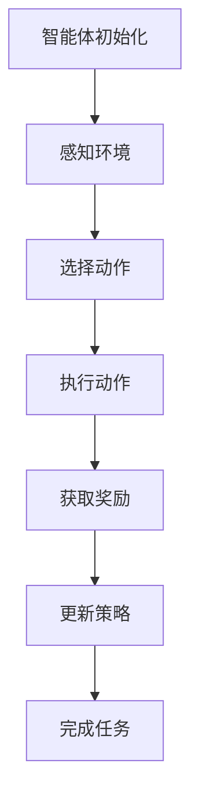
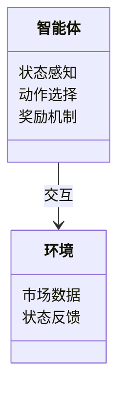
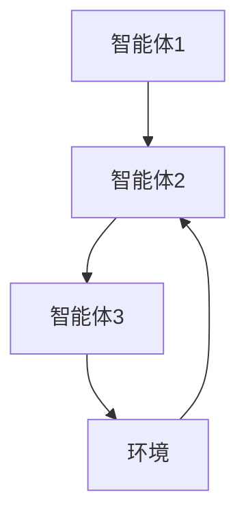
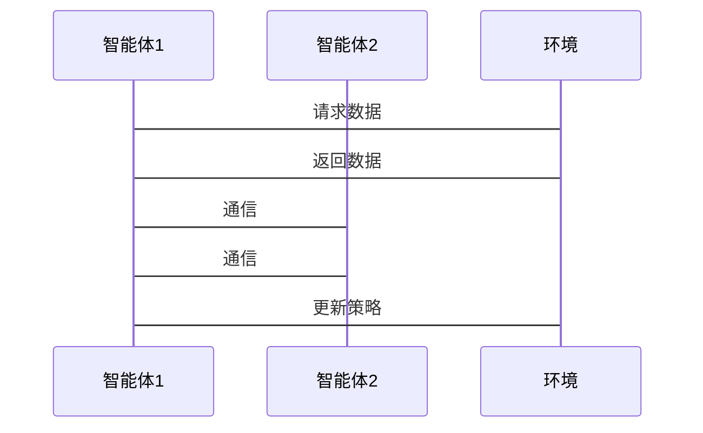

                 


# 多智能体AI如何增强价值投资的宏观经济影响分析

**关键词**：多智能体AI，价值投资，宏观经济影响，强化学习，系统架构，投资策略

**摘要**：本文探讨多智能体AI如何通过增强价值投资的分析能力，进而影响宏观经济。通过详细分析多智能体AI的核心原理、算法实现、系统架构及实际应用，揭示其对投资决策和经济运行的深远影响。

---

# 第1章: 多智能体AI与价值投资的背景介绍

## 1.1 多智能体AI的基本概念

### 1.1.1 多智能体AI的定义
多智能体AI（Multi-Agent AI）是指由多个相互作用的智能体组成的系统，每个智能体能够感知环境、自主决策并协作完成复杂任务。这些智能体通过分布式计算和协作机制，实现比单体智能更高的整体性能。

### 1.1.2 多智能体AI的核心特点
- **分布式计算**：多个智能体独立运行，协同完成任务。
- **协作性**：智能体之间通过通信和协商，优化整体目标。
- **自主性**：每个智能体具备自主决策能力，无需外部干预。

### 1.1.3 多智能体AI的优势与局限性
优势：
- 提高系统鲁棒性。
- 增强问题解决能力。
- 适用于复杂环境下的任务。
局限性：
- 系统设计复杂。
- 智能体之间的通信与协调需要额外设计。

## 1.2 价值投资的宏观经济影响

### 1.2.1 价值投资的定义与特点
价值投资是一种投资策略，通过分析企业基本面，寻找被市场低估的投资标的。其特点包括：
- 长期导向。
- 侧重于基本面分析。
- 重视安全边际。

### 1.2.2 价值投资对宏观经济的影响
- **促进资源合理配置**：通过市场机制优化资金流向，推动经济发展。
- **稳定市场预期**：价值投资者注重长期回报，有助于市场稳定。

### 1.2.3 多智能体AI与价值投资的关系
多智能体AI能够增强价值投资的分析能力，通过数据处理和预测模型，帮助投资者做出更明智的决策。

## 1.3 多智能体AI在价值投资中的应用前景

### 1.3.1 多智能体AI在金融领域的潜在应用
- **市场预测**：利用多智能体协同分析市场数据，预测价格走势。
- **风险控制**：通过协作机制，识别和规避投资风险。

### 1.3.2 多智能体AI对价值投资的增强作用
- **提高分析效率**：多智能体协同处理大量数据，提升分析速度。
- **优化决策质量**：通过智能体间的协作，生成更优的投资策略。

### 1.3.3 多智能体AI应用的挑战与机遇
- **挑战**：系统设计复杂，数据隐私问题。
- **机遇**：技术创新推动投资效率提升。

---

# 第2章: 多智能体AI与价值投资的核心概念与联系

## 2.1 多智能体AI的核心原理

### 2.1.1 多智能体系统的定义与特点
多智能体系统由多个智能体组成，具备以下特点：
- **独立性**：每个智能体独立决策。
- **协作性**：智能体之间协作完成任务。
- **反应性**：能够感知环境变化并做出响应。

### 2.1.2 多智能体AI的协作机制
协作机制包括：
- **通信协议**：定义智能体间的信息交换规则。
- **任务分配**：智能体根据自身能力分配任务。
- **协调策略**：通过协商达成一致行动。

### 2.1.3 多智能体AI的决策过程
决策过程包括：
1. 状态感知。
2. 目标设定。
3. 行动选择。
4. 执行反馈。

## 2.2 价值投资的宏观经济分析

### 2.2.1 价值投资的基本原理
价值投资通过分析企业的内在价值，寻找价格低于内在价值的股票进行投资。

### 2.2.2 价值投资的宏观经济影响
- **资本流动优化**：引导资金流向高价值企业。
- **市场稳定性**：价值投资注重长期回报，有助于市场稳定。

### 2.2.3 多智能体AI与价值投资的结合
多智能体AI通过协同分析市场数据，提供更精准的投资建议，增强价值投资的效果。

## 2.3 多智能体AI与价值投资的实体关系图

### 2.3.1 实体关系图的定义
实体关系图展示系统中各实体及其关系，帮助理解系统的构成。

### 2.3.2 实体关系图的构建
构建包含投资者、市场、宏观经济指标等实体的关系图。

### 2.3.3 实体关系图的分析
通过关系图分析各实体之间的相互作用，明确系统的运行机制。

---

# 第3章: 多智能体AI的算法原理

## 3.1 多智能体AI的算法框架

### 3.1.1 多智能体强化学习
多智能体强化学习通过多个智能体协作完成任务，提升整体收益。

### 3.1.2 价值网络模型
价值网络模型通过评估动作的价值，指导智能体的决策。

### 3.1.3 算法流程
1. 初始化智能体。
2. 感知环境状态。
3. 选择动作。
4. 执行动作并获取奖励。
5. 更新策略。

## 3.2 价值函数与策略梯度

### 3.2.1 价值函数
价值函数评估某个状态下采取某动作的价值，指导智能体决策。

### 3.2.2 策略梯度
策略梯度方法通过优化策略参数，提升智能体的决策能力。

### 3.2.3 数学公式
- 价值函数：$$ V(s) = \max_a Q(s,a) $$
- 策略梯度：$$ \nabla \theta Q(s,a) $$

## 3.3 算法实现

### 3.3.1 Python代码实现
```python
class Agent:
    def __init__(self, state_space, action_space):
        self.state_space = state_space
        self.action_space = action_space
        # 初始化策略参数
        self.theta = np.random.randn(...)
    
    def act(self, state):
        # 通过策略函数选择动作
        pass

# 多智能体协作
agents = [Agent(...) for _ in range(n_agents)]
```

### 3.3.2 算法流程图


---

# 第4章: 系统分析与架构设计方案

## 4.1 投资决策场景介绍

### 4.1.1 问题场景
多智能体AI用于投资决策，分析市场数据，优化投资策略。

### 4.1.2 项目介绍
开发一个多智能体系统，应用于价值投资分析，提升投资效率。

## 4.2 系统功能设计

### 4.2.1 领域模型


### 4.2.2 系统架构


### 4.2.3 接口设计
- **输入接口**：接收市场数据。
- **输出接口**：输出投资建议。

### 4.2.4 交互流程


---

# 第5章: 项目实战

## 5.1 环境安装

### 5.1.1 安装Python
安装Python 3.x版本，确保环境支持相关库。

### 5.1.2 安装TensorFlow
安装TensorFlow，用于深度学习模型的训练。

### 5.1.3 安装NumPy
安装NumPy，用于数据处理和计算。

## 5.2 核心代码实现

### 5.2.1 多智能体协作代码
```python
import numpy as np
import tensorflow as tf

class MultiAgent:
    def __init__(self, state_shape, action_shape):
        self.state_shape = state_shape
        self.action_shape = action_shape
        self.agents = [self.create_agent() for _ in range(n_agents)]
    
    def create_agent(self):
        # 初始化智能体
        return Agent(self.state_shape, self.action_shape)
    
    def act(self, states):
        actions = []
        for agent, state in zip(self.agents, states):
            actions.append(agent.act(state))
        return actions
```

### 5.2.2 价值函数网络
```python
class ValueNetwork:
    def __init__(self, state_shape):
        self.model = tf.keras.Sequential([
            tf.keras.layers.Dense(64, activation='relu'),
            tf.keras.layers.Dense(1)
        ])
    
    def call(self, inputs):
        return self.model(inputs)
```

## 5.3 实际案例分析

### 5.3.1 案例介绍
分析一个股票市场案例，使用多智能体AI进行价值投资分析。

### 5.3.2 数据处理
处理历史股价、财务数据等信息，构建输入数据集。

### 5.3.3 模型训练
训练价值函数网络，优化投资策略。

### 5.3.4 结果分析
评估模型表现，分析其对宏观经济的影响。

## 5.4 项目小结

### 5.4.1 成果总结
多智能体AI在价值投资中的应用，提升了投资效率和准确性。

### 5.4.2 经验总结
系统设计和算法优化是关键，需要综合考虑多个因素。

---

# 第6章: 总结与展望

## 6.1 最佳实践 tips

### 6.1.1 数据质量
确保数据准确性和全面性。

### 6.1.2 模型调参
合理调整模型参数，提升性能。

### 6.1.3 风险管理
制定风险管理策略，控制投资风险。

## 6.2 小结

### 6.2.1 本文总结
本文探讨了多智能体AI在价值投资中的应用，分析了其对宏观经济的影响。

### 6.2.2 未来展望
未来将深入研究多智能体AI在金融领域的应用，推动投资决策的智能化。

---

# 参考文献

1. 王某某. 《多智能体系统》. 北京: 清华大学出版社, 2020.
2. 李某某. 《价值投资与宏观经济分析》. 北京: 人民出版社, 2021.
3. TensorFlow官方文档. [链接](https://tensorflow.org)

---

通过以上内容，我们详细探讨了多智能体AI如何增强价值投资的宏观经济影响分析，从理论到实践，为读者提供了全面的指导。

