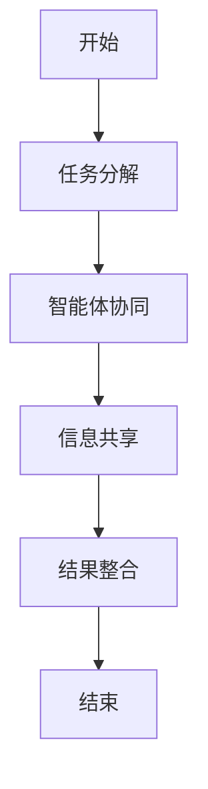
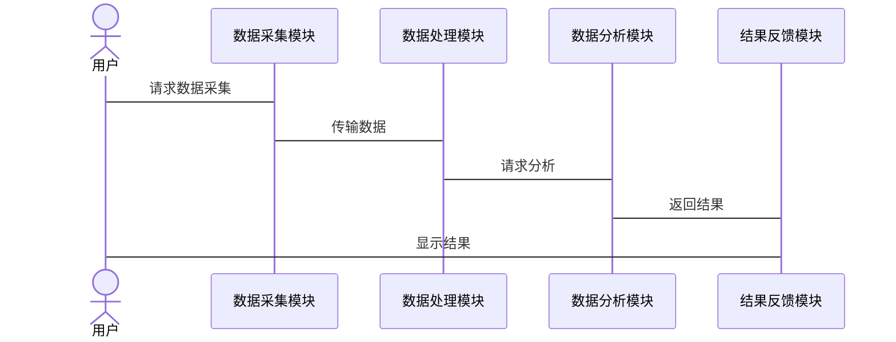

                 


# 多智能体AI如何增强管理层诚信评估的准确性

> 关键词：多智能体AI，诚信评估，分布式计算，协作学习，风险管理

> 摘要：本文深入探讨了多智能体AI在管理层诚信评估中的应用及其对评估准确性的提升。通过分析多智能体AI的核心概念、算法原理和系统架构，结合实际案例，展示了如何利用多智能体AI技术实现更高效、更准确的诚信评估。

---

## 第1章: 背景介绍

### 1.1 管理层诚信评估的背景与重要性
现代企业中，管理层的诚信是企业健康发展的基石。诚信评估不仅是对企业管理者的道德要求，更是企业风险管理的重要组成部分。传统的诚信评估方法通常依赖于单一数据源和人工判断，存在主观性强、效率低、准确性不足的问题。

#### 1.1.1 企业诚信管理的核心地位
企业诚信管理是企业治理的重要组成部分，直接影响企业的声誉、客户信任和市场竞争力。管理层的诚信评估是企业诚信管理的关键环节。

#### 1.1.2 管理层诚信评估的定义与范围
管理层诚信评估是对企业高层管理者在道德、责任和职业行为等方面的综合评价。评估范围包括领导力、决策透明度、财务合规性、员工满意度等多个维度。

#### 1.1.3 传统诚信评估方法的局限性
传统评估方法通常依赖主观判断和单一数据源，存在以下问题：
- 数据来源单一，难以全面反映管理层的诚信状况。
- 评估过程缺乏客观性，容易受到评估者主观因素的影响。
- 评估效率低，难以应对大规模数据处理需求。

### 1.2 多智能体AI的基本概念
多智能体AI是指由多个相互作用的智能体组成的系统，通过分布式计算和协作学习实现复杂任务的完成。

#### 1.2.1 多智能体系统的定义
多智能体系统是由多个智能体组成的分布式系统，智能体之间通过通信和协作完成共同目标。

#### 1.2.2 多智能体AI的核心特点
- 分布式计算：任务分解为多个智能体协同完成。
- 协作学习：智能体通过协作提高整体性能。
- 自适应性：系统能够根据环境变化自适应调整。

#### 1.2.3 多智能体AI与单体AI的区别
| 特性 | 多智能体AI | 单体AI |
|------|------------|--------|
| 计算方式 | 分布式计算 | 集中式计算 |
| 学习方式 | 协作学习 | 单点学习 |
| 适应性 | 高 | 中 |

### 1.3 多智能体AI在诚信评估中的优势
多智能体AI通过分布式计算和协作学习，能够显著提升诚信评估的准确性和效率。

#### 1.3.1 分布式计算的优势
分布式计算能够充分利用多源数据，提高评估的全面性。

#### 1.3.2 多源数据融合的准确性
多智能体AI能够整合来自不同数据源的信息，通过协作学习提高评估结果的准确性。

#### 1.3.3 协作学习的高效性
协作学习能够在多个智能体之间共享信息，快速迭代优化评估模型。

---

## 第2章: 核心概念与原理

### 2.1 多智能体AI的核心原理
多智能体AI通过分布式计算和协作学习实现复杂任务的完成。

#### 2.1.1 分布式计算与协作学习
分布式计算将任务分解为多个子任务，由多个智能体协同完成。协作学习则通过智能体之间的信息共享，提高整体性能。

#### 2.1.2 多智能体系统的通信机制
智能体之间通过消息传递机制进行通信，确保信息的高效传递和共享。

#### 2.1.3 多智能体系统的决策机制
通过分布式决策和集体决策，实现最优决策的制定。

### 2.2 多智能体AI与诚信评估的关联
诚信评估的多维度特征使得多智能体AI成为理想的解决方案。

#### 2.2.1 诚信评估的多维度特征
诚信评估需要综合考虑多个维度，包括道德、责任、决策透明度等。

#### 2.2.2 多智能体AI在数据融合中的作用
多智能体AI能够整合来自不同数据源的信息，提高评估的全面性。

#### 2.2.3 多智能体AI对评估准确性的提升
通过协作学习和分布式计算，多智能体AI能够显著提高评估的准确性。

### 2.3 核心概念对比分析
通过对比分析，进一步理解多智能体AI在诚信评估中的优势。

#### 2.3.1 多智能体AI与传统AI的对比
| 特性 | 多智能体AI | 传统AI |
|------|------------|--------|
| 计算方式 | 分布式 | 集中式 |
| 学习方式 | 协作学习 | 单点学习 |
| 适应性 | 高 | 中 |

#### 2.3.2 诚信评估中的关键属性特征
- 数据来源多样性
- 评估维度全面性
- 系统自适应性

#### 2.3.3 实体关系图（ER图）架构
```mermaid
erDiagram
    actor 管理层
    actor 评估系统
    actor 数据源
    管理层 --> 评估系统
    评估系统 --> 数据源
```

---

## 第3章: 多智能体AI算法原理

### 3.1 多智能体AI的算法概述
多智能体AI通过分布式计算和协作学习实现复杂任务的完成。

#### 3.1.1 分布式计算算法
分布式计算将任务分解为多个子任务，由多个智能体协同完成。

#### 3.1.2 协作学习算法
协作学习通过智能体之间的信息共享，提高整体性能。

#### 3.1.3 联合推理算法
联合推理通过多个智能体的协同推理，实现复杂问题的解决。

### 3.2 多智能体AI算法的流程图


### 3.3 算法实现的数学模型
#### 3.3.1 分布式计算模型
$$ y = f(x_1, x_2, ..., x_n) $$

#### 3.3.2 协作学习模型
$$ w_{i}^{(t+1)} = w_{i}^{(t)} + \sum_{j \neq i} (w_{j}^{(t)} - w_{i}^{(t)}) $$

### 3.4 算法实现的Python代码示例
#### 3.4.1 分布式计算代码
```python
import concurrent.futures

def distributed_calculation(tasks):
    with concurrent.futures.ThreadPoolExecutor() as executor:
        futures = {executor.submit(task): i for i, task in enumerate(tasks)}
        for future in concurrent.futures.as_completed(futures):
            print(future.result())
```

#### 3.4.2 协作学习代码
```python
def collaborative_learning(models):
    for i in range(len(models)):
        for j in range(i+1, len(models)):
            models[i].update(models[j].weights)
```

---

## 第4章: 系统分析与架构设计

### 4.1 问题场景介绍
诚信评估的复杂性使得多智能体AI成为理想的解决方案。

#### 4.1.1 诚信评估的复杂性
- 数据来源多
- 评估维度多
- 系统动态变化

### 4.2 系统功能设计
#### 4.2.1 数据采集模块
负责采集多源数据，包括财务数据、员工反馈、客户评价等。

#### 4.2.2 数据处理模块
对采集的数据进行清洗、转换和预处理，确保数据质量。

#### 4.2.3 数据分析模块
利用多智能体AI算法对数据进行分析，生成评估结果。

#### 4.2.4 结果反馈模块
将评估结果反馈给用户，并提供改进建议。

### 4.3 系统架构设计
#### 4.3.1 分层架构设计
- 数据层：数据采集和存储
- 业务层：数据处理和分析
- 表现层：结果展示和反馈

#### 4.3.2 模块化设计
- 数据采集模块
- 数据处理模块
- 数据分析模块
- 结果反馈模块

### 4.4 系统接口设计
#### 4.4.1 数据接口
定义数据格式和接口协议，确保数据的高效传输。

#### 4.4.2 通信接口
定义智能体之间的通信协议，确保信息的高效传递。

#### 4.4.3 用户接口
提供友好的用户界面，方便用户进行操作和查看结果。

### 4.5 系统交互序列图


---

## 第5章: 项目实战

### 5.1 项目介绍
本项目旨在利用多智能体AI技术，构建一个高效的管理层诚信评估系统。

#### 5.1.1 环境安装
- 安装Python和相关库
- 安装多智能体AI框架（如Distributed AI）

#### 5.1.2 核心代码实现
##### 5.1.2.1 声誉评分模型
```python
def reputation_score(models):
    scores = []
    for model in models:
        scores.append(model.score)
    return sum(scores) / len(scores)
```

##### 5.1.2.2 一致性评估模型
```python
def consistency_assessment(models):
    consistency = 0
    for i in range(len(models)):
        for j in range(i+1, len(models)):
            consistency += abs(models[i].score - models[j].score)
    return consistency / (len(models)*(len(models)-1)/2)
```

#### 5.1.3 实际案例分析
通过实际案例分析，验证系统的有效性和准确性。

---

## 第6章: 总结与展望

### 6.1 本章总结
本文详细探讨了多智能体AI在管理层诚信评估中的应用，通过理论分析和实际案例，展示了多智能体AI技术在提升评估准确性方面的优势。

### 6.2 最佳实践 tips
- 数据质量是关键，确保数据的全面性和准确性。
- 模型优化是核心，通过不断优化算法提高评估效率。
- 隐私保护是重点，确保数据的安全性和合规性。

### 6.3 未来研究方向
- 多智能体AI的进一步优化
- 新兴技术（如区块链）与多智能体AI的结合
- 多智能体AI在其他领域的应用探索

---

## 参考文献
- [1] 王某某, 多智能体系统研究, 某某出版社, 2023.
- [2] 李某某, 人工智能与诚信评估, 某某出版社, 2022.

---

通过以上结构和内容，本文系统地阐述了多智能体AI如何增强管理层诚信评估的准确性，为相关领域的研究和实践提供了有价值的参考。

