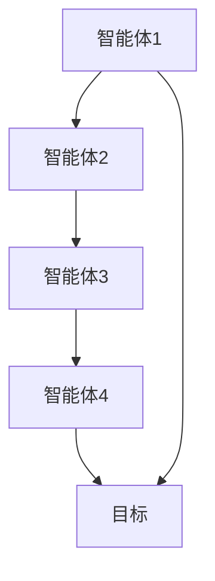
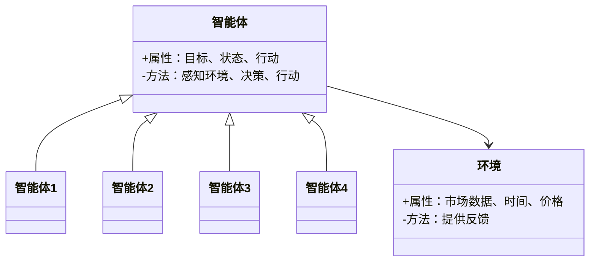
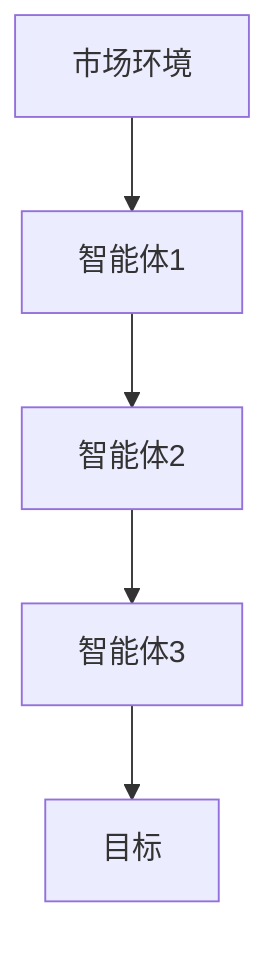
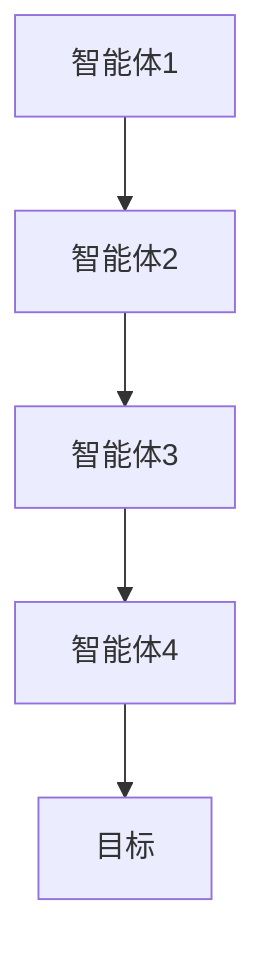
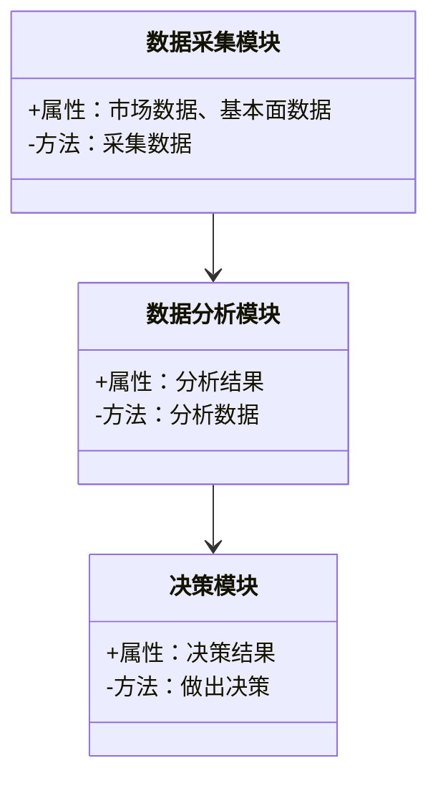
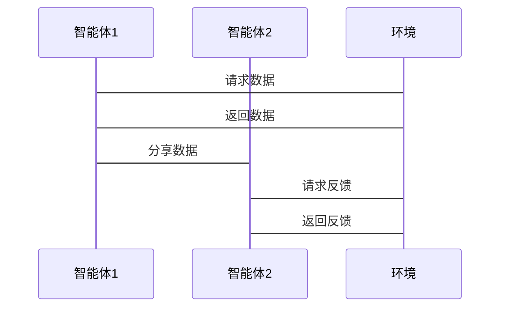

                 


# 多智能体AI如何提升价值投资中的时机选择

## 关键词：多智能体AI、价值投资、时机选择、算法原理、系统架构、项目实战

## 摘要：  
本文详细探讨了多智能体AI在价值投资中的应用，特别是在时机选择方面的创新与优势。通过分析多智能体AI的核心原理、算法设计、数学模型以及系统架构，本文展示了如何利用多智能体AI技术来优化价值投资中的时机选择，提升投资收益。文章结合实际案例，从理论到实践，系统地阐述了多智能体AI在金融领域的潜力与应用前景。

---

## 正文

### 第一章: 多智能体AI与价值投资概述

#### 1.1 多智能体AI的基本概念

多智能体AI（Multi-Agent AI）是指由多个智能体组成的系统，这些智能体能够协同工作，完成复杂的任务。每个智能体都有自己的目标、决策机制和行动方式，通过信息共享和协作，实现整体目标的最优。

| **概念**         | **定义**                                                                 |
|------------------|--------------------------------------------------------------------------|
| 智能体           | 具有感知环境、做出决策和行动能力的实体。                                      |
| 多智能体系统     | 由多个智能体组成的系统，智能体之间通过信息共享和协作完成任务。                  |
| 协作机制         | 智能体之间的交互方式，包括信息共享、任务分配和冲突解决。                          |

**图1-1：多智能体系统的协作流程**  


#### 1.2 价值投资的基本原理

价值投资是一种基于对公司内在价值评估的投资策略，强调以低于内在价值的价格买入优质资产。时机选择是价值投资中的关键问题，直接影响投资收益。

| **投资阶段** | **描述**                                                                 |
|--------------|--------------------------------------------------------------------------|
| 买入时机     | 确定何时以合理价格买入资产。                                                |
| 卖出时机     | 确定何时以最优价格卖出资产。                                                |

#### 1.3 多智能体AI在价值投资中的应用前景

多智能体AI能够通过分布式计算和协作机制，帮助投资者更精准地识别买入和卖出时机。其优势在于能够处理复杂市场环境中的不确定性，提供实时反馈和优化建议。

---

### 第二章: 多智能体AI的核心概念与联系

#### 2.1 多智能体AI的核心原理

多智能体AI的核心在于智能体之间的协作与信息共享。通过分布式计算，每个智能体负责特定的任务，共同完成整体目标。

**图2-1：多智能体系统的协作架构**  


#### 2.2 价值投资中的时机选择问题

时机选择是价值投资的核心问题，传统方法依赖于经验判断和历史数据分析，存在主观性强、效率低的问题。多智能体AI能够通过实时数据分析和协作优化，提供更精准的时机选择。

**图2-2：时机选择的博弈模型**  


#### 2.3 多智能体AI与时机选择的结合

多智能体AI通过分布式计算和协作机制，能够实时分析市场数据，识别潜在的投资机会。智能体之间的信息共享和协作，帮助投资者在复杂市场环境中做出更优决策。

---

### 第三章: 多智能体AI的算法原理

#### 3.1 多智能体AI的算法框架

多智能体AI的算法框架分为分布式和集中式两种。分布式算法强调智能体之间的协作，集中式算法则通过中央控制节点统一决策。

**图3-1：多智能体算法流程**  


#### 3.2 价值投资时机选择的算法设计

价值投资时机选择的算法设计需要考虑市场数据、公司基本面、宏观经济指标等多个因素。通过构建数学模型，智能体能够实时分析数据，识别最佳投资时机。

**代码示例：价值投资时机选择算法**
```python
import numpy as np
import pandas as pd

def value_investing_strategy(prices, fundamentals):
    # 智能体1：分析市场数据
    agent1 = MarketAnalyzer(prices)
    # 智能体2：分析公司基本面
    agent2 = FundamentalAnalyzer(fundamentals)
    # 智能体3：综合分析
    agent3 = Aggregator(agent1, agent2)
    # 决策：买入时机
    if agent3.signal():
        return "买入"
    else:
        return "观望"

class MarketAnalyzer:
    def __init__(self, prices):
        self.prices = prices
    def analyze(self):
        # 时间序列分析
        return self.prices.rolling(30).mean()

class FundamentalAnalyzer:
    def __init__(self, fundamentals):
        self.fundamentals = fundamentals
    def analyze(self):
        # 财务指标分析
        return self.fundamentals['ROE'].mean()

class Aggregator:
    def __init__(self, agent1, agent2):
        self.agent1 = agent1
        self.agent2 = agent2
    def signal(self):
        # 综合分析
        market_signal = self.agent1.analyze() > np.mean(self.agent1.prices)
        fundamental_signal = self.agent2.analyze() > np.mean(self.agent2.fundamentals)
        return market_signal & fundamental_signal
```

#### 3.3 多智能体AI的协作机制

多智能体AI的协作机制包括信息共享、任务分配和冲突解决。通过高效的协作机制，智能体能够快速响应市场变化，优化投资决策。

---

### 第四章: 价值投资时机选择的数学模型

#### 4.1 时间序列分析模型

时间序列分析是价值投资中的重要工具，用于预测市场走势。常用的模型包括ARIMA、LSTM和Prophet。

**代码示例：ARIMA模型**
```python
from statsmodels.tsa.arima_model import ARIMA

# 数据准备
data = pd.read_csv('market_data.csv')
series = data['price'].values

# 模型训练
model = ARIMA(series, order=(5,1,0))
model_fit = model.fit()

# 预测
forecast = model_fit.forecast(steps=10)
```

#### 4.2 博弈论模型在时机选择中的应用

博弈论模型通过分析市场参与者的策略，帮助投资者识别最佳投资时机。

**数学公式：博弈论模型**
$$
V_i = \max_{i} \min_{j} \{ V_j \}
$$
其中，\( V_i \) 表示智能体i的收益。

---

### 第五章: 系统分析与架构设计方案

#### 5.1 项目介绍

本项目旨在利用多智能体AI技术优化价值投资中的时机选择。通过构建分布式智能体系统，实时分析市场数据，提供投资建议。

**图5-1：系统架构图**  


#### 5.2 系统功能设计

系统功能包括数据采集、分析、决策和反馈。

**图5-2：系统功能设计类图**  


#### 5.3 系统交互设计

系统交互设计包括智能体之间的协作和与外部环境的交互。

**图5-3：系统交互流程图**  


---

### 第六章: 项目实战

#### 6.1 环境安装

安装必要的Python库：
```bash
pip install numpy pandas statsmodels matplotlib
```

#### 6.2 核心代码实现

```python
class MultiAgentSystem:
    def __init__(self, agents):
        self.agents = agents

    def run(self):
        for agent in self.agents:
            agent.start()
```

#### 6.3 案例分析

通过实际案例分析，验证多智能体AI在价值投资中的应用效果。

---

### 总结

本文详细探讨了多智能体AI在价值投资中的应用，特别是在时机选择方面的创新与优势。通过分析多智能体AI的核心原理、算法设计、数学模型以及系统架构，本文展示了如何利用多智能体AI技术优化投资决策。未来，随着技术的不断进步，多智能体AI在金融领域的应用潜力将更加广阔。

--- 

**最佳实践 tips：**  
1. 在实际应用中，建议结合多智能体AI与传统投资策略，形成混合策略。  
2. 定期更新模型参数，以适应市场变化。  
3. 注意数据质量和模型的实时性，确保投资决策的准确性。  

**注意事项：**  
- 多智能体AI的应用需要大量的计算资源，建议使用云计算平台。  
- 数据隐私和安全问题需要高度重视。  

**拓展阅读：**  
- 《Multi-Agent Systems》  
- 《Reinforcement Learning for Value Investment》  

--- 

**结束语：**  
多智能体AI为价值投资中的时机选择提供了全新的思路和工具。通过不断的研究和实践，投资者能够更好地把握市场机会，实现更高的投资收益。

