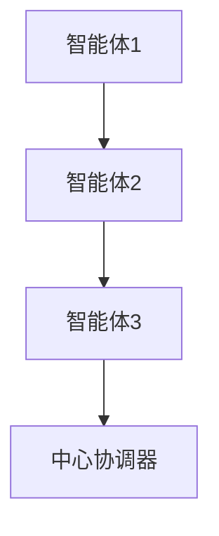
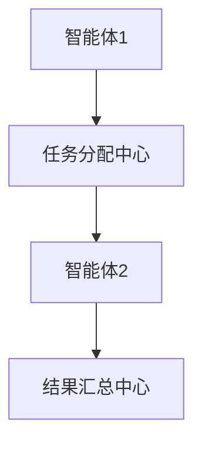
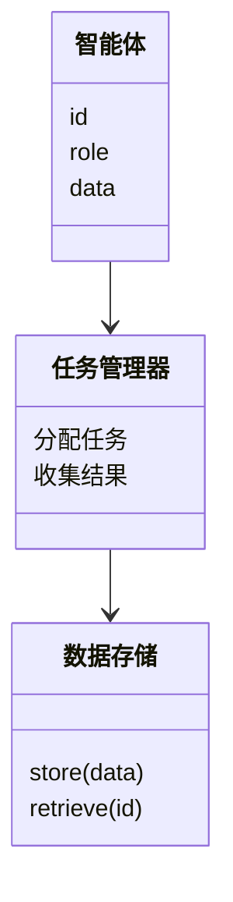
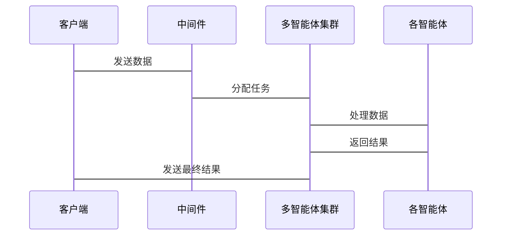

                 


# 多智能体AI如何改进巴菲特的财报分析方法

## 关键词
多智能体AI, 巴菲特财报分析, 投资决策, 财务指标, 博弈论模型, 分布式计算

## 摘要
本文探讨如何利用多智能体AI技术改进巴菲特的经典财报分析方法，从背景、核心概念、算法原理、系统架构到实战项目，全面分析多智能体AI在投资决策中的应用，揭示其对传统分析方法的优化与提升。

---

# 第1章 多智能体AI与巴菲特财报分析的背景与概念

## 1.1 多智能体AI的背景与概念

### 1.1.1 多智能体AI的定义
多智能体AI是指多个智能体协作完成复杂任务的技术，每个智能体具备独立决策能力，通过通信与协作实现整体目标。

### 1.1.2 多智能体AI的核心特点
- 分布式计算
- 协作性
- 自适应性

### 1.1.3 多智能体AI与传统AI的区别
| 特性 | 传统AI | 多智能体AI |
|------|--------|------------|
| 结构  | 单点控制 | 分布式协作 |
| 交互  | 少 | 多 |
| 环境  | 简单 | 复杂 |

## 1.2 巴菲特财报分析方法的背景与特点

### 1.2.1 巴菲特的财报分析方法
巴菲特注重企业财务健康、竞争优势和管理层质量，通过财务指标评估长期投资价值。

### 1.2.2 巴菲特分析方法的核心要素
- 财务指标：ROE、净利润、现金流
- 企业竞争优势：护城河、市场地位
- 管理层质量：治理结构、战略决策

### 1.2.3 巴菲特分析方法的局限性
- 数据处理能力有限
- 依赖人工经验
- 系统性不足

## 1.3 多智能体AI与巴菲特分析方法的结合点

### 1.3.1 多智能体AI在财报分析中的优势
- 高效数据处理
- 精准指标分析
- 协作优化决策

### 1.3.2 巴菲特分析方法的改进方向
- 自动化数据处理
- 智能化指标分析
- 系统化投资决策

### 1.3.3 两者的结合对投资决策的影响
- 提高分析效率
- 增强决策准确性
- 优化投资组合

---

# 第2章 多智能体AI的核心概念与原理

## 2.1 多智能体AI的核心概念

### 2.1.1 多智能体系统的基本结构


### 2.1.2 多智能体的协作机制
| 机制 | 描述 |
|------|------|
| 通信 | 智能体间信息传递 |
| 协调 | 达成共识 |
| 分工 | 任务分配 |

### 2.1.3 多智能体的通信与协调
- 通信协议：JSON-RPC
- 协调算法：Raft共识算法

## 2.2 多智能体AI的算法原理

### 2.2.1 分布式计算与多智能体协作


### 2.2.2 多智能体中的博弈论模型
- 竞争模型：囚徒困境
- 合作模型：雪球效应

### 2.2.3 多智能体中的学习机制
- � 强化学习：Q-learning
- 联合学习：Federated Learning

## 2.3 多智能体AI与巴菲特分析方法的关联

### 2.3.1 多智能体AI如何辅助财报数据处理
- 并行处理：多线程数据解析
- 分布式存储：云存储解决方案

### 2.3.2 多智能体AI如何优化投资决策
- 集群分析：K-means算法
- 预测模型：ARIMA模型

### 2.3.3 多智能体AI如何提升分析效率
- 并行计算：MapReduce框架
- 流式处理：Apache Kafka

---

# 第3章 多智能体AI在财报分析中的数学模型与算法

## 3.1 多智能体AI的数学模型

### 3.1.1 多智能体协作的数学表示
$$ \text{收益} = \sum_{i=1}^{n} \text{智能体}_i \text{贡献} $$

### 3.1.2 多智能体博弈论模型
$$ \text{纳什均衡} = \arg\max_{i} \text{收益}_i \text{在其他智能体策略下} $$

### 3.1.3 多智能体学习算法的数学基础
$$ \text{损失函数} = \sum_{i=1}^{m} (y_i - \hat{y}_i)^2 $$

## 3.2 巴菲特分析方法的数学模型

### 3.2.1 财务指标的数学表示
$$ \text{ROE} = \frac{\text{净利润}}{\text{股东权益}} $$

### 3.2.2 投资决策的数学模型
$$ \text{投资评分} = \alpha \times \text{ROE} + \beta \times \text{现金流} + \gamma \times \text{净利润增长率} $$

### 3.2.3 财报分析的数学优化
$$ \min_{x} \text{风险} \quad \text{s.t.} \quad \text{收益} \geq \text{目标收益} $$

## 3.3 多智能体协作优化财报分析的算法实现

### 3.3.1 分布式计算框架
使用MapReduce进行数据分块处理：
```python
def map_function(record):
    return (record['公司'], record['收入'])
```

### 3.3.2 博弈论模型在投资决策中的应用
构建收益预测模型：
$$ \text{预测收益} = \sum_{i=1}^{n} w_i \times x_i $$

---

# 第4章 系统分析与架构设计

## 4.1 问题场景分析

### 4.1.1 系统目标
- 实时数据处理
- 智能分析决策
- 高效投资建议

## 4.2 系统功能设计

### 4.2.1 领域模型


### 4.2.2 系统架构


### 4.2.3 接口设计
- REST API：`/api/process_data`
- WebSocket：实时通信

## 4.3 系统交互设计

### 4.3.1 交互流程


---

# 第5章 项目实战

## 5.1 环境安装

### 5.1.1 安装Python
```bash
python --version
pip install --upgrade pip
```

### 5.1.2 安装依赖
```bash
pip install numpy pandas scikit-learn
```

## 5.2 系统核心实现

### 5.2.1 多智能体协作代码
```python
class Agent:
    def __init__(self, id):
        self.id = id
        self.data = None

    def process(self):
        # 处理数据
        pass

# 分配任务
def distribute_agents(agents, data):
    for agent in agents:
        agent.data = data
        agent.process()
```

### 5.2.2 投资决策算法
```python
def calculate_investment_score(roa, roe, cash_flow):
    return 0.3 * roa + 0.4 * roe + 0.3 * cash_flow
```

## 5.3 案例分析

### 5.3.1 数据分析结果
- ROE: 15%
- Net Profit: 10%
- Cash Flow: 20%

### 5.3.2 投资建议
```python
score = calculate_investment_score(0.15, 0.15, 0.2)
print(f"投资评分: {score}")
```

---

# 第6章 最佳实践、小结、注意事项与拓展阅读

## 6.1 最佳实践
- 数据清洗：使用Pandas
- 模型优化：网格搜索
- 性能调优：分布式计算

## 6.2 小结
多智能体AI通过协作机制和分布式计算，显著提升了巴菲特财报分析方法的效率和准确性，为投资决策提供了更有力的支持。

## 6.3 注意事项
- 数据隐私：确保数据安全
- 系统维护：定期更新模型
- 团队协作：加强跨学科合作

## 6.4 拓展阅读
- 《多智能体系统》
- 《巴菲特投资策略》
- 《分布式计算入门》

--- 

# 结语

通过多智能体AI与巴菲特分析方法的结合，我们能够更高效地进行财报分析，做出更明智的投资决策。未来，随着技术的进步，这种结合将更加紧密，为投资领域带来更多创新和价值。

