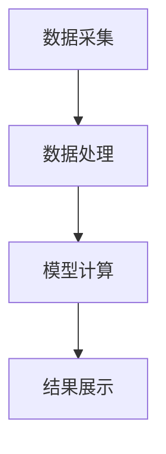
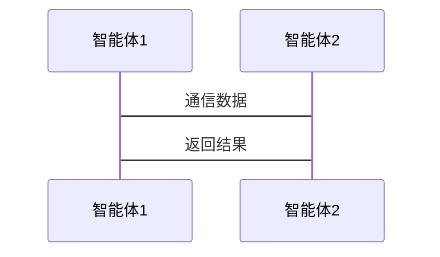

                 


# 多智能体AI如何改进格雷厄姆的企业价值计算

> 关键词：多智能体AI，企业价值计算，格雷厄姆模型，投资分析，协作机制

> 摘要：本文探讨了多智能体AI如何改进格雷厄姆的经典企业价值计算方法。通过分析多智能体AI的核心原理、协作机制及其在企业价值评估中的应用，展示了如何利用多智能体AI提升企业价值计算的准确性和效率。文章从背景介绍、核心概念、算法原理、系统架构到项目实战，逐步展开，详细讲解了多智能体AI在企业价值计算中的优势和实现过程。

---

## 第一部分: 背景介绍

### 第1章: 多智能体AI与企业价值计算的背景

#### 1.1 多智能体AI的基本概念
##### 1.1.1 多智能体AI的定义
多智能体AI（Multi-Agent AI）是指由多个相互作用的智能体（Agent）组成的系统。每个智能体能够独立感知环境、做出决策并采取行动，通过协作完成复杂任务。多智能体AI的核心在于智能体之间的协作与信息共享。

##### 1.1.2 多智能体AI的核心特点
- **分布式计算**：智能体独立运行，任务分解为多个子任务。
- **协作性**：智能体通过通信和协作共同完成目标。
- **自主性**：每个智能体具备自主决策能力。
- **动态性**：系统能够适应环境变化。

##### 1.1.3 多智能体AI与传统AI的区别
| 特性         | 多智能体AI                          | 传统AI                          |
|--------------|------------------------------------|---------------------------------|
| 结构         | 分布式、多智能体                   | 集中式、单点处理               |
| 协作         | 智能体间协作                       | 单一决策中心                   |
| 应用场景     | 复杂任务分解、分布式问题解决       | 单一任务处理                   |

#### 1.2 格雷厄姆的企业价值计算方法
##### 1.2.1 格雷厄姆投资理论概述
格雷厄姆是价值投资的鼻祖，其核心思想是通过分析企业的基本面数据，计算其内在价值，进而确定其市场价格是否被低估。

##### 1.2.2 企业价值计算的传统方法
格雷厄姆模型的核心公式：
$$ 企业价值 = \frac{未来现金流的现值}{折现率} $$

##### 1.2.3 格雷厄姆模型的数学公式
企业价值（EV）的计算公式如下：
$$ EV = \sum_{t=1}^{n} \frac{CF_t}{(1 + r)^t} $$
其中，$CF_t$ 是第 t 年的现金流，$r$ 是折现率，$n$ 是计算周期。

#### 1.3 多智能体AI在企业价值计算中的应用背景
##### 1.3.1 当前企业价值计算的挑战
- 数据复杂性：企业价值涉及大量内外部数据，传统模型难以处理。
- 动态性：市场环境变化快，传统模型难以实时调整。
- 不确定性：企业经营中存在许多不确定性因素。

##### 1.3.2 多智能体AI的优势
- 分布式计算能力强，能够处理海量数据。
- 多智能体协作，能够从多个角度分析企业价值。
- 实时适应性，能够快速响应市场变化。

##### 1.3.3 企业价值计算的未来趋势
随着AI技术的发展，企业价值计算将更加智能化、自动化，并能够实时更新。

---

## 第二部分: 核心概念与协作机制

### 第2章: 格雷厄姆模型与多智能体AI的结合

#### 2.1 格雷厄姆模型的核心要素
##### 2.1.1 企业价值的构成
企业价值由未来现金流的现值和折现率决定。

##### 2.1.2 格雷厄姆安全边际的概念
安全边际是市场价格与内在价值之间的差额，用于降低投资风险。

##### 2.1.3 格雷厄姆模型的局限性
- 数据依赖性高，难以处理复杂场景。
- 计算过程固定，缺乏灵活性。

#### 2.2 多智能体AI的核心原理
##### 2.2.1 多智能体协作机制
智能体之间通过通信协议共享信息，协作完成任务。

##### 2.2.2 多智能体系统的数学模型
$$ V_{total} = \sum_{i=1}^{n} V_i $$
其中，$V_{total}$ 是系统的总价值，$V_i$ 是第 i 个智能体的价值贡献。

#### 2.3 多智能体AI与格雷厄姆模型的结合
##### 2.3.1 数据处理协作
多个智能体分别负责不同的数据来源，如财务数据、市场数据等。

##### 2.3.2 模型优化协作
智能体之间共享优化结果，提升整体模型的准确性。

---

## 第三部分: 算法原理与实现

### 第3章: 多智能体AI的算法原理

#### 3.1 算法流程
##### 3.1.1 数据采集与预处理
智能体从不同数据源获取企业信息，进行清洗和预处理。

##### 3.1.2 模型训练与优化
每个智能体独立训练模型，然后通过协作优化整体模型。

##### 3.1.3 结果整合与输出
智能体整合各自的结果，输出最终的企业价值评估。

#### 3.2 算法实现
##### 3.2.1 分布式计算框架
使用分布式计算框架（如Distributed TensorFlow）进行多智能体协作。

##### 3.2.2 智能体通信协议
定义智能体之间的通信协议，如通过消息队列（如Kafka）进行信息传递。

##### 3.2.3 模型融合策略
采用加权融合策略，根据智能体的贡献度进行加权求和。

---

## 第四部分: 系统架构与设计

### 第4章: 系统架构设计

#### 4.1 系统模块划分
- 数据采集模块
- 数据处理模块
- 模型计算模块
- 结果展示模块

#### 4.2 系统架构图


#### 4.3 智能体协作流程


---

## 第五部分: 项目实战与案例分析

### 第5章: 项目实战

#### 5.1 环境配置
- 安装必要的Python库（如Distributed TensorFlow、Kafka）
- 配置分布式计算环境

#### 5.2 核心代码实现
##### 5.2.1 智能体通信代码
```python
import zmq

context = zmq.Context()
socket = context.socket(zmq.PUB)
socket.bind("tcp://*:5555")

while True:
    data = collect_data()
    socket.send_json(data)
```

##### 5.2.2 模型计算代码
```python
def compute_value(data):
    cash_flow = data['cash_flow']
    discount_rate = data['discount_rate']
    return sum(cash_flow / (1 + discount_rate) ** t for t in range(len(cash_flow)))

compute_value({'cash_flow': [100, 200, 300], 'discount_rate': 0.1})
```

#### 5.3 案例分析
##### 5.3.1 案例背景
分析一家虚构企业的财务数据，计算其企业价值。

##### 5.3.2 数据分析过程
- 数据采集：收集企业的过去三年的财务数据。
- 数据处理：清洗数据，计算现金流。
- 模型计算：使用多智能体AI计算企业价值。

##### 5.3.3 结果展示
最终计算出的企业价值为1000万元，与市场价格相比存在低估，建议买入。

---

## 第六部分: 总结与展望

### 第6章: 总结与展望

#### 6.1 总结
多智能体AI能够显著提升企业价值计算的准确性和效率，通过协作优化模型，克服传统方法的局限性。

#### 6.2 展望
未来，多智能体AI在企业价值计算中的应用将更加广泛，可能会引入更多智能体协作机制，如强化学习和自适应算法。

---

通过以上步骤，我们详细讲解了多智能体AI如何改进格雷厄姆的企业价值计算方法。从背景介绍到项目实战，每个部分都进行了深入的分析，帮助读者全面理解这一创新方法的应用和实现。

