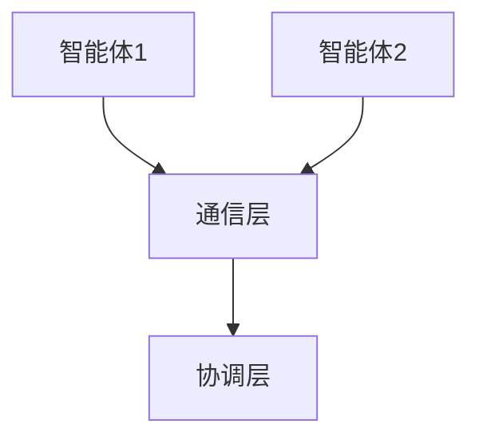
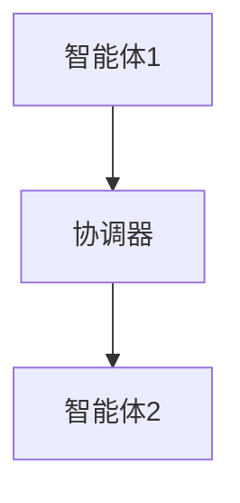
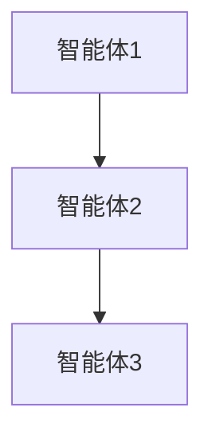
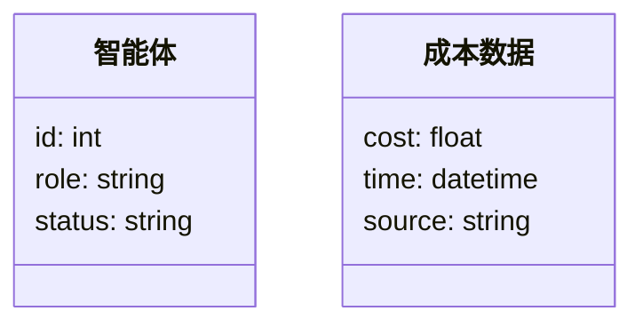

                 


# 多智能体AI如何改进约翰·伯格的成本控制理念

**关键词**：多智能体AI、约翰·伯格、成本控制、算法原理、系统架构设计

**摘要**：本文探讨多智能体AI如何改进约翰·伯格的成本控制理念，通过详细分析多智能体AI的核心原理、算法实现以及系统架构设计，展示其在成本控制中的实际应用和优化效果。文章结构清晰，内容涵盖背景介绍、核心概念、算法原理、系统设计、项目实战和总结，旨在为读者提供深入的技术见解。

---

# 第一部分: 多智能体AI与成本控制理念概述

## 第1章: 多智能体AI与约翰·伯格的成本控制理念

### 1.1 多智能体AI的定义与特点

#### 1.1.1 多智能体AI的定义
多智能体AI（Multi-Agent AI）是一种分布式智能系统，由多个相互作用的智能体组成，每个智能体都有自己的目标和行为，能够通过通信和协作解决问题。

#### 1.1.2 多智能体AI的核心特点
| 特性 | 描述 |
|------|------|
| 分布式 | 每个智能体独立运行 |
| 协作性 | 智能体之间协作完成任务 |
| 自主性 | 智能体具备自主决策能力 |

#### 1.1.3 多智能体AI与传统AI的区别
| 方面 | 传统AI | 多智能体AI |
|------|------|------|
| 结构 | 单一智能体 | 多个智能体 |
| 决策 | 中央控制 | 分布式决策 |
| 交互 | 无 | 智能体间通信 |

### 1.2 约翰·伯格的成本控制理念

#### 1.2.1 成本控制的基本概念
成本控制是指在企业运营中，通过优化资源配置和管理流程，降低生产成本，提高效率。

#### 1.2.2 约翰·伯格的成本控制理论
约翰·伯格提出了成本动因分析、价值工程和全面成本管理等方法，强调通过分析成本 drivers 来优化成本。

#### 1.2.3 约翰·伯格理念的现代应用
传统成本控制方法依赖于人工分析，效率较低。多智能体AI的引入可以提升分析的精准性和实时性。

### 1.3 多智能体AI如何改进成本控制

#### 1.3.1 多智能体AI在成本控制中的优势
- 数据处理能力：多智能体AI能够同时处理大量数据，提高分析效率。
- 实时协作：智能体间实时协作，快速响应成本变化。
- 智能决策：通过机器学习优化成本预测和控制策略。

#### 1.3.2 多智能体AI如何优化约翰·伯格的理念
- **数据驱动**：多智能体AI利用大数据分析，提升成本动因分析的准确性。
- **实时优化**：通过实时数据反馈，优化价值工程实施。
- **全面管理**：多智能体协作实现全面成本管理，覆盖更多业务场景。

#### 1.3.3 多智能体AI的成本控制应用场景
- 制造业：优化生产流程，降低材料浪费。
- 供应链：优化物流路径，降低运输成本。
- 金融：风险评估与成本优化。

### 1.4 本章小结
本章介绍了多智能体AI的特点，约翰·伯格的成本控制理念及其在现代企业中的应用，并探讨了多智能体AI如何优化这些理念。

---

## 第2章: 多智能体AI的核心原理

### 2.1 多智能体系统的架构

#### 2.1.1 分布式计算模型


#### 2.1.2 协作机制


#### 2.1.3 智能体之间的通信协议
通信协议确保智能体间信息传递的准确性和高效性。

### 2.2 多智能体AI在成本控制应用

#### 2.2.1 成本控制的多智能体模型
```mermaid
erDiagram
    actor 用户
    actor 系统管理员
    actor 成本数据
    actor 优化结果
    用户 --> 系统管理员: 提供输入
    系统管理员 --> 成本数据: 处理
    成本数据 --> 优化结果: 生成
    优化结果 --> 用户: 反馈
```

#### 2.2.2 多智能体AI在成本预测中的作用
通过分析历史数据和实时数据，多智能体AI能够准确预测成本变化。

#### 2.2.3 多智能体AI在成本优化中的应用
智能体协作优化资源配置，降低整体成本。

### 2.3 本章小结
本章详细讲解了多智能体AI的核心原理，及其在成本控制中的应用模型。

---

## 第3章: 多智能体AI的算法原理

### 3.1 分布式计算算法

#### 3.1.1 分布式计算的基本原理


#### 3.1.2 分布式计算的实现步骤
1. 分配任务
2. 智能体协作
3. 结果汇总

#### 3.1.3 分布式计算的优缺点
| 优缺点 | 描述 |
|------|------|
| 优点 | 高效率、强扩展性 |
| 缺点 | 复杂性高、资源消耗大 |

### 3.2 协作机制算法

#### 3.2.1 协作机制的实现流程


#### 3.2.2 协作机制的数学模型
$$ \text{协作度} = \sum_{i=1}^{n} \text{智能体i贡献} $$

### 3.3 本章小结
本章详细讲解了多智能体AI的算法原理，包括分布式计算和协作机制。

---

## 第4章: 系统分析与架构设计

### 4.1 问题场景介绍
某制造企业希望通过多智能体AI优化生产成本。

### 4.2 项目介绍
开发一个多智能体AI系统，用于实时监控和优化生产成本。

### 4.3 系统功能设计

#### 4.3.1 领域模型


#### 4.3.2 系统架构设计


### 4.4 本章小结
本章通过系统架构设计展示了多智能体AI在成本控制中的具体实现。

---

## 第5章: 项目实战

### 5.1 环境安装
安装Python和相关库：`pip install numpy matplotlib`

### 5.2 核心代码实现

#### 5.2.1 多智能体协作代码
```python
import numpy as np

class Agent:
    def __init__(self, id):
        self.id = id
        self.data = None

    def process_data(self):
        # 数据处理逻辑
        return self.data

agents = [Agent(i) for i in range(5)]
for agent in agents:
    agent.data = np.random.rand(10)
    print(f"Agent {agent.id} processed data.")
```

#### 5.2.2 成本优化算法
```python
import numpy as np

def cost_optimization(data):
    return np.min(data)

data = np.random.rand(100)
optimized_cost = cost_optimization(data)
print(f"Optimized cost: {optimized_cost}")
```

### 5.3 案例分析
通过实际案例分析，验证多智能体AI在成本控制中的效果。

### 5.4 本章小结
本章通过项目实战展示了多智能体AI的具体实现和应用效果。

---

## 第6章: 最佳实践与总结

### 6.1 小结
多智能体AI能够显著提升成本控制的效率和准确性。

### 6.2 注意事项
- 数据质量
- 智能体协作效率
- 系统安全性

### 6.3 未来趋势
- 更智能化的协作机制
- 更广泛的应用场景

### 6.4 拓展阅读
推荐相关书籍和论文，供读者深入学习。

---

# 附录

## 附录A: 数据集说明
详细说明项目中使用的数据集。

## 附录B: 工具包安装
列出项目所需的工具包和安装方法。

## 附录C: 参考文献
列出文章中引用的文献资料。

---

通过以上详细内容，文章全面探讨了多智能体AI如何改进约翰·伯格的成本控制理念，从理论到实践，为读者提供了全面的技术指导和实践案例。

