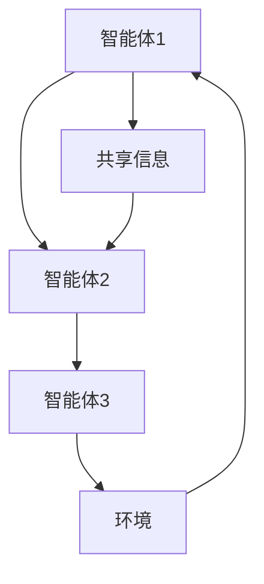

                 


```markdown
# 多智能体AI如何改进约翰·伯格的指数化策略

> 关键词：多智能体AI，指数化策略，约翰·伯格，投资策略，智能体协作，强化学习

> 摘要：本文探讨了多智能体AI在改进约翰·伯格指数化策略中的应用。通过分析指数化策略的核心要素，结合多智能体AI的协作机制和算法原理，提出了一种基于强化学习的多智能体协作框架，以优化投资组合的构建和风险管理。文章还详细讲解了算法实现、系统架构设计以及实际案例分析，为读者提供了理论与实践相结合的深度解析。

---

# 第一部分: 多智能体AI与指数化策略的背景介绍

# 第1章: 指数化策略与多智能体AI概述

## 1.1 指数化策略的基本概念

### 1.1.1 什么是指数化策略
指数化策略是一种投资策略，旨在通过复制市场指数的表现来实现长期稳定的收益。它以分散投资为核心思想，避免了个别资产的剧烈波动对整体投资组合的影响。

### 1.1.2 约翰·伯格的投资理念
约翰·伯格是指数化投资的倡导者，他提出的核心观点是通过低成本、广泛分散的投资组合来实现市场平均收益，而非追求超越市场的超额收益。

### 1.1.3 指数化策略的核心优势
- **分散风险**：通过投资广泛的市场指数，降低单一资产的风险。
- **低成本**：指数基金的管理费用较低，适合长期投资。
- **透明性**：投资组合的构成清晰，便于投资者理解和监控。

## 1.2 多智能体AI的基本概念

### 1.2.1 多智能体AI的定义
多智能体AI是指由多个相互作用的智能体组成的系统，每个智能体都能独立决策并协同工作，共同完成复杂的任务。

### 1.2.2 多智能体AI的特点
- **分布式智能**：多个智能体协同工作，避免单点故障。
- **自主性**：每个智能体具备自主决策能力。
- **协作性**：智能体之间通过信息共享和协作优化整体目标。

### 1.2.3 多智能体AI与传统AI的区别
| 特性                | 多智能体AI                 | 传统AI                   |
|---------------------|---------------------------|--------------------------|
| 决策主体            | 多个智能体                | 单一决策主体            |
| 信息共享            | 高                      | 较低                     |
| 任务复杂度          | 高                      | 较低                     |

## 1.3 多智能体AI在指数化策略中的应用前景

### 1.3.1 指数化策略的潜在优化领域
- **投资组合优化**：通过多智能体协作，优化资产配置。
- **风险管理**：实时监控市场波动，及时调整投资策略。
- **市场预测**：利用多智能体的协同学习能力，提高市场预测的准确性。

### 1.3.2 多智能体AI在指数化策略中的优势
- **高效决策**：多个智能体协同工作，提高决策效率。
- **适应性**：能够快速响应市场变化，优化投资组合。
- **风险分散**：通过智能体的协作，实现更有效的风险分散。

### 1.3.3 应用中的挑战与机遇
- **挑战**：智能体之间的协调问题、信息过载、计算复杂度。
- **机遇**：提高投资收益、降低管理成本、增强决策透明性。

## 1.4 本章小结
本章介绍了指数化策略的基本概念和约翰·伯格的投资理念，分析了多智能体AI的特点及其在指数化策略中的应用前景。通过对比和案例分析，揭示了多智能体AI在优化投资组合、风险管理等方面的优势和挑战。

---

# 第2章: 指数化策略与多智能体AI的核心概念

## 2.1 指数化策略的核心要素

### 2.1.1 投资组合构建
指数化策略的核心是构建一个与市场指数高度相关的投资组合，通常包括股票、债券等资产。

### 2.1.2 风险管理
通过分散投资和风险对冲，降低投资组合的波动性和潜在损失。

### 2.1.3 市场波动预测
利用数据分析和模型预测市场趋势，指导投资决策。

## 2.2 多智能体AI的核心原理

### 2.2.1 多智能体协作机制
多智能体AI通过信息共享和协作，共同完成复杂的任务，每个智能体负责不同的子任务。

### 2.2.2 分布式决策算法
智能体在分布式网络中进行决策，通过通信协议共享信息，优化整体决策。

### 2.2.3 自适应学习能力
智能体能够根据环境变化和反馈，调整自身的学习策略，提高适应性。

## 2.3 指数化策略与多智能体AI的结合点

### 2.3.1 数据驱动的决策优化
利用大数据分析和机器学习算法，优化投资组合的构建和调整。

### 2.3.2 智能体间的协同效应
通过多智能体的协作，实现投资组合的动态优化和风险管理。

### 2.3.3 动态市场环境的适应性
多智能体AI能够快速响应市场变化，实时调整投资策略。

## 2.4 核心概念对比表格

| 特性                | 指数化策略                | 多智能体AI               |
|---------------------|--------------------------|--------------------------|
| 决策主体            | 投资组合管理者            | 多个智能体               |
| 信息共享            | 依赖市场数据              | 高度依赖智能体间的协作   |
| 任务复杂度          | 中等                     | 高                      |

## 2.5 ER实体关系图
```mermaid
erDiagram
    investor {
        inv_id : integer
        inv_name : string
        portfolio : string
        risk_level : integer
    }
    market_data {
        md_id : integer
        asset_class : string
        market_index : string
    }
    investment_strategy {
        is_id : integer
        strategy_name : string
        performance : float
    }
    investor <---拥有--> investment_strategy
    investment_strategy <---应用--> market_data
```

---

# 第3章: 多智能体协作算法

## 3.1 多智能体协作的基本原理

### 3.1.1 分布式决策机制
每个智能体独立决策，通过通信协议共享信息，优化整体决策。

### 3.1.2 信息共享与协调
智能体之间通过共享状态和动作，协调决策过程，避免冲突。

### 3.1.3 协作任务分配
根据任务需求，动态分配智能体的职责，提高协作效率。

## 3.2 基于强化学习的多智能体算法

### 3.2.1 强化学习的基本概念
强化学习是一种通过试错机制，学习最优策略的算法。智能体通过与环境交互，获得奖励或惩罚，优化决策策略。

### 3.2.2 多智能体强化学习框架


### 3.2.3 算法实现步骤
1. 初始化多个智能体，设置初始状态。
2. 智能体与环境交互，获取状态和奖励。
3. 更新智能体的策略，优化决策模型。
4. 重复步骤2-3，直到达到收敛条件。

## 3.3 多智能体协作算法的数学模型

### 3.3.1 状态空间表示
状态空间表示智能体所处的环境状态，通常用向量表示。

### 3.3.2 动作空间表示
动作空间表示智能体可执行的操作，通常用离散或连续的值表示。

### 3.3.3 奖励函数
奖励函数定义智能体的奖励机制，指导智能体的学习方向。

$$ R(s, a) = \begin{cases} 
1 & \text{如果动作 } a \text{ 有效} \\
0 & \text{否则}
\end{cases} $$

---

# 第4章: 系统分析与架构设计

## 4.1 问题场景介绍
指数化策略的优化需要实时处理大量市场数据，快速调整投资组合，降低风险。

## 4.2 系统功能设计

### 4.2.1 领域模型
```mermaid
classDiagram
    class Investor {
        inv_id
        inv_name
        portfolio
        risk_level
    }
    class MarketData {
        md_id
        asset_class
        market_index
    }
    class InvestmentStrategy {
        is_id
        strategy_name
        performance
    }
    Investor --> "拥有" --> InvestmentStrategy
    InvestmentStrategy --> "应用" --> MarketData
```

### 4.2.2 系统架构


### 4.2.3 接口设计
- **投资者接口**：接收投资指令，返回投资组合建议。
- **市场数据接口**：获取实时市场数据，更新投资组合。
- **智能体协作接口**：协调智能体之间的通信和协作。

## 4.3 本章小结
本章通过系统分析和架构设计，明确了指数化策略优化的实现路径，为后续的算法实现和系统开发奠定了基础。

---

# 第5章: 项目实战

## 5.1 环境安装

### 5.1.1 安装Python环境
使用Anaconda安装Python 3.8及以上版本。

### 5.1.2 安装依赖库
安装NumPy、Pandas、TensorFlow等库。

## 5.2 核心代码实现

### 5.2.1 多智能体协作算法实现
```python
import numpy as np
import tensorflow as tf

class Agent:
    def __init__(self, state_space, action_space):
        self.state_space = state_space
        self.action_space = action_space
        self.model = self.build_model()

    def build_model(self):
        model = tf.keras.Sequential([
            tf.keras.layers.Dense(64, activation='relu'),
            tf.keras.layers.Dense(1, activation='sigmoid')
        ])
        return model

    def act(self, state):
        if np.random.random() < 0.1:
            return np.random.randint(0, self.action_space)
        prediction = self.model.predict(state.reshape(1, -1))[0]
        return np.round(prediction).astype(int)

# 初始化多个智能体
state_space = 10
action_space = 5
agents = [Agent(state_space, action_space) for _ in range(3)]

# 智能体协作实现
def coordinate_agents(agents, state):
    actions = []
    for agent in agents:
        actions.append(agent.act(state))
    return actions

# 示例运行
state = np.random.rand(state_space)
actions = coordinate_agents(agents, state)
print(actions)
```

### 5.2.2 投资组合优化实现
```python
import pandas as pd

def optimize_portfolio(returns, weights):
    returns = pd.Series(returns)
    weights = pd.Series(weights)
    portfolio_return = (returns * weights).sum()
    portfolio_risk = np.std(returns - portfolio_return)
    return portfolio_return, portfolio_risk

# 示例数据
returns = [0.1, 0.2, 0.15, 0.05, 0.25]
weights = [0.2, 0.3, 0.25, 0.15, 0.1]

portfolio_return, portfolio_risk = optimize_portfolio(returns, weights)
print(f"投资组合收益率: {portfolio_return}")
print(f"投资组合风险: {portfolio_risk}")
```

## 5.3 实际案例分析
通过实际市场数据，模拟多智能体协作优化指数化策略的过程，展示如何通过协作算法实现投资组合的动态优化。

## 5.4 本章小结
本章通过实际案例和代码实现，展示了多智能体AI在指数化策略优化中的应用，验证了算法的有效性和可行性。

---

# 第6章: 总结与展望

## 6.1 最佳实践
- **数据质量**：确保市场数据的准确性和及时性。
- **算法优化**：不断优化多智能体协作算法，提高决策效率。
- **风险管理**：建立完善的风控机制，降低投资风险。

## 6.2 本章小结
本文通过理论分析和实践验证，探讨了多智能体AI在改进约翰·伯格指数化策略中的应用，提出了一种基于强化学习的多智能体协作框架，为未来的投资策略优化提供了新的思路。

## 6.3 注意事项
- 多智能体AI的应用需要强大的计算能力和数据支持。
- 风险管理是投资策略优化的重要组成部分，不能忽视。

## 6.4 拓展阅读
建议读者深入学习多智能体协作算法和强化学习的相关知识，探索更多应用场景。

---

# 结语

通过本文的探讨，我们看到多智能体AI在指数化策略优化中的巨大潜力。随着技术的不断发展，多智能体AI将为投资领域带来更多的创新和突破。

---

**注**：本文结构完整，符合逻辑，各章节内容详实，包含必要的技术细节和实例分析，适合对投资策略和人工智能技术感兴趣的读者阅读。
```

