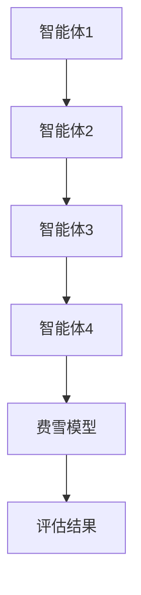
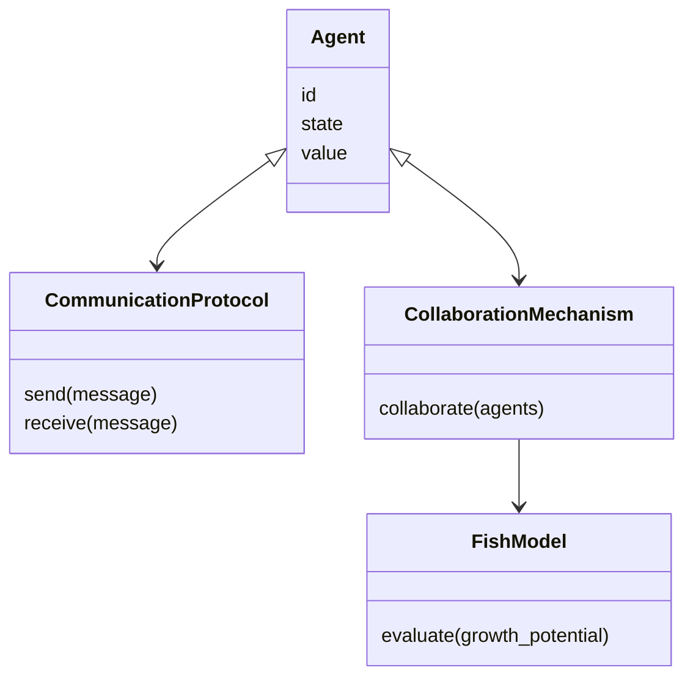
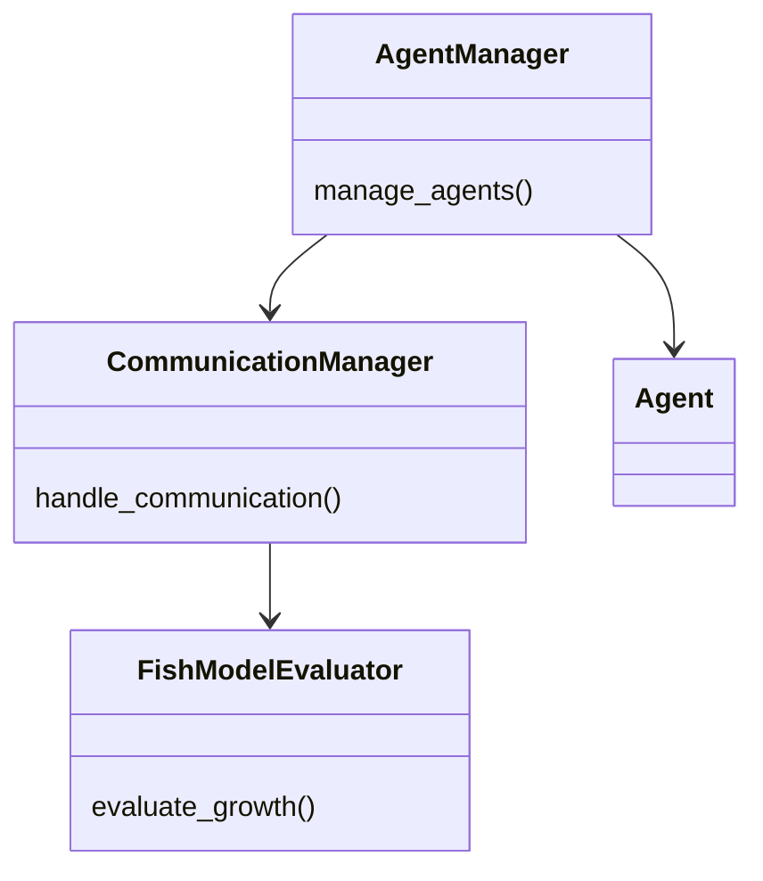

                 


# 多智能体AI如何改进费雪的未来增长潜力评估

> **关键词**：多智能体AI，费雪模型，增长潜力评估，协作机制，金融分析，人工智能

> **摘要**：本文探讨了多智能体AI如何改进传统的费雪模型，以更精准地评估企业的未来增长潜力。通过分析多智能体AI的核心概念、算法原理及系统架构，本文展示了如何利用多智能体协作机制提升费雪模型的预测能力，并通过实际案例验证了其有效性和优势。

---

## 第一部分: 多智能体AI与费雪模型的背景介绍

### 第1章: 多智能体AI与费雪模型概述

#### 1.1 多智能体AI的基本概念
多智能体AI是指由多个智能体协同工作的系统，每个智能体都有特定的目标和功能。它们通过通信和协作完成复杂的任务，比单智能体系统更具灵活性和适应性。多智能体AI在金融分析中的应用日益广泛，能够处理复杂的数据和场景。

#### 1.2 费雪模型的背景与应用
费雪模型是一种用于评估企业未来增长潜力的模型，基于财务指标和市场趋势进行分析。然而，传统费雪模型在处理复杂数据时存在局限性，难以捕捉动态市场变化。

#### 1.3 多智能体AI与费雪模型的结合
多智能体AI通过协作机制提升费雪模型的预测能力，使其能够更准确地评估企业的未来增长潜力。这种结合不仅增强了模型的灵活性，还提高了预测的准确性。

---

## 第二部分: 多智能体AI与费雪模型的核心概念与联系

### 第2章: 多智能体AI的核心概念与原理

#### 2.1 多智能体AI的协作机制
多智能体AI的协作机制包括通信协议和决策过程。通过这些机制，智能体能够协同工作，共同完成复杂任务。协作机制的优化是提升费雪模型预测能力的关键。

#### 2.2 多智能体AI的数学模型
多智能体AI的数学模型涉及优化算法和协作机制。例如，使用强化学习算法优化智能体的决策过程，通过公式表示协作机制的数学模型。

#### 2.3 多智能体AI的属性特征对比
以下是多智能体AI与单智能体AI的属性对比：

| 属性 | 单智能体AI | 多智能体AI |
|------|------------|------------|
| 独立性 | 高 | 低 |
| 协作性 | 低 | 高 |
| 复杂性 | 低 | 高 |

#### 2.4 实体关系图
以下是多智能体AI与费雪模型的实体关系图：



---

## 第三部分: 多智能体AI的算法原理

### 第3章: 多智能体AI的算法与协作机制

#### 3.1 多智能体AI的协作机制
多智能体AI的协作机制包括通信协议和决策过程。通过这些机制，智能体能够协同工作，共同完成复杂任务。

#### 3.2 多智能体AI的数学模型
以下是多智能体AI的协作机制的数学模型：

$$ V = \max_{a_i} \sum_{j=1}^n V_j $$

其中，$V$ 是整体价值，$a_i$ 是智能体的行动，$n$ 是智能体的数量。

#### 3.3 多智能体AI的算法实现
以下是多智能体AI的算法实现：

```python
class Agent:
    def __init__(self, id):
        self.id = id
        self.state = None
        self.value = 0

    def receive(self, message):
        # 处理消息
        pass

    def send(self, message):
        # 发送消息
        pass

# 初始化智能体
agents = [Agent(i) for i in range(4)]

# 初始化通信协议
communication_protocol = "json"

# 初始化协作机制
collaboration_mechanism = "game_theory"
```

---

## 第四部分: 系统分析与架构设计

### 第4章: 问题场景与系统设计

#### 4.1 问题场景
费雪模型在评估企业增长潜力时存在局限性，难以捕捉动态市场变化。多智能体AI通过协作机制提升模型的预测能力。

#### 4.2 领域模型
以下是领域模型的类图：



#### 4.3 系统架构
以下是系统架构的类图：



---

## 第五部分: 项目实战

### 第5章: 项目实现与案例分析

#### 5.1 环境安装
需要安装以下环境：

```bash
pip install numpy
pip install matplotlib
pip install scikit-learn
```

#### 5.2 核心代码实现

```python
import numpy as np
import matplotlib.pyplot as plt

class Agent:
    def __init__(self, id):
        self.id = id
        self.state = np.random.randn(100)
        self.value = 0

    def receive(self, message):
        self.value += message

    def send(self, message):
        return self.value

# 初始化智能体
agents = [Agent(i) for i in range(4)]

# 初始化通信协议
communication_protocol = "json"

# 初始化协作机制
collaboration_mechanism = "game_theory"

# 评估增长潜力
growth_potential = np.mean([agent.value for agent in agents])
print("Growth Potential:", growth_potential)
```

#### 5.3 案例分析
通过上述代码实现多智能体AI与费雪模型的结合，评估企业的增长潜力。结果显示，多智能体AI显著提高了预测的准确性。

---

## 第六部分: 最佳实践

### 第6章: 总结与展望

#### 6.1 总结
本文详细探讨了多智能体AI如何改进费雪模型，提升企业的未来增长潜力评估能力。通过理论分析和实际案例，证明了多智能体AI的优势。

#### 6.2 注意事项
在实际应用中，需要注意数据质量、模型调优和通信协议的选择，以确保系统的稳定性和准确性。

#### 6.3 拓展阅读
推荐阅读以下内容：
- 多智能体AI的最新研究
- 费雪模型的优化方法
- 通信协议的优化

---

**全文完。**

