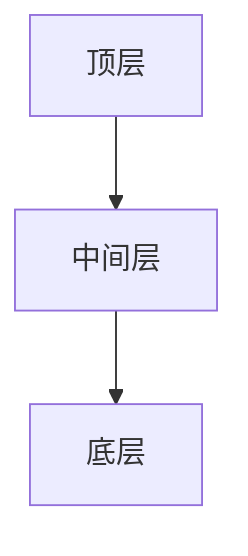
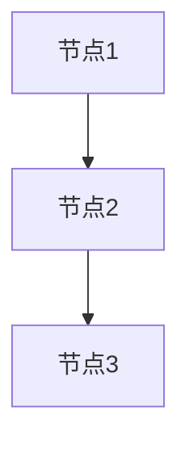
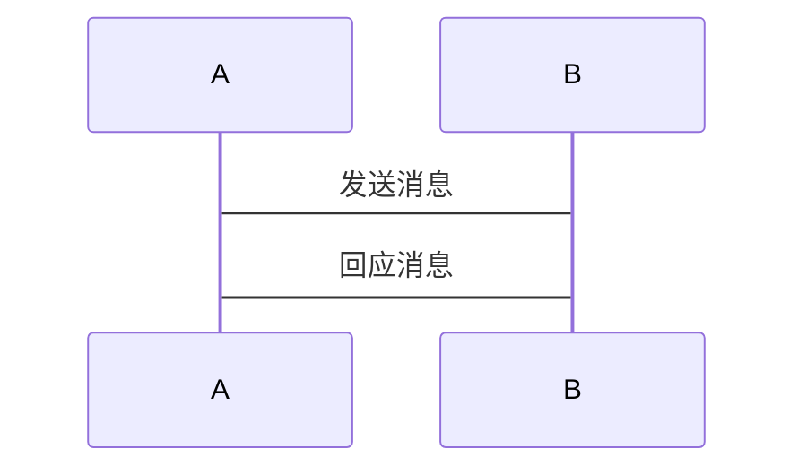

                 

# 多智能体AI系统在价值投资中的实时新闻分析应用

> 关键词：多智能体AI系统，价值投资，实时新闻分析，协同学习，金融建模，自然语言处理

> 摘要：  
本文探讨了多智能体AI系统在价值投资中的实时新闻分析应用，结合多智能体协同学习算法与自然语言处理技术，分析了如何利用实时新闻数据提升投资决策的准确性和效率。文章从多智能体系统的定义、价值投资的核心概念出发，详细阐述了多智能体协同学习的算法原理、系统架构设计、实时新闻分析模型的构建，以及在实际投资场景中的应用案例。通过理论分析与实践结合，本文为金融领域的智能化投资提供了新的思路和解决方案。

---

# 第1章 多智能体AI系统与价值投资概述

## 1.1 多智能体AI系统的定义与特点

### 1.1.1 多智能体系统的定义
多智能体AI系统（Multi-Agent System, MAS）是由多个相互作用的智能体组成的系统，这些智能体能够通过协作或竞争完成复杂的任务。与单智能体系统相比，MAS具有更强的分布式决策能力和适应性。

### 1.1.2 多智能体系统的特征
- **分布式性**：智能体分布在不同的节点上，独立决策。
- **协作性**：智能体之间通过通信和协作完成共同目标。
- **动态性**：系统能够适应动态变化的环境。
- **自主性**：每个智能体都具有自主决策的能力。

### 1.1.3 多智能体系统与传统单智能体AI的区别
| 特性                | 单智能体系统          | 多智能体系统          |
|---------------------|----------------------|----------------------|
| 决策方式            | 集中的决策           | 分布式决策           |
| 信息处理能力        | 单点处理             | 多点协作             |
| 灵活性              | 较低                 | 较高                 |

---

## 1.2 价值投资的核心概念

### 1.2.1 价值投资的定义
价值投资是一种投资策略，通过分析企业的基本面（如财务状况、行业地位等）来寻找被市场低估的投资标的。

### 1.2.2 价值投资的基本原则
- **长期视角**：关注企业的长期价值。
- **安全边际**：买入价格低于内在价值。
- **分散投资**：降低风险。

### 1.2.3 价值投资中的信息不对称问题
在金融市场中，信息不对称导致投资者难以及时获取准确的市场信息，影响投资决策。

---

## 1.3 多智能体AI系统在金融领域的应用前景

### 1.3.1 金融领域的智能化趋势
随着AI技术的发展，金融领域的智能化应用逐渐普及，包括智能投顾、风险管理等领域。

### 1.3.2 多智能体系统在金融中的潜在应用
- **实时数据分析**：通过多智能体协同处理海量数据。
- **复杂决策支持**：利用多智能体的协作能力优化投资决策。

### 1.3.3 价值投资与实时新闻分析的结合
通过实时新闻分析，多智能体系统可以捕捉市场情绪变化，辅助价值投资决策。

---

## 1.4 本章小结

本章介绍了多智能体AI系统的基本概念及其在金融领域的应用前景，重点分析了价值投资的核心概念和实时新闻分析在其中的重要性。

---

# 第2章 多智能体AI系统的核心概念

## 2.1 多智能体系统的架构

### 2.1.1 分层架构
分层架构将系统分为多个层次，每个层次负责不同的功能。

### 2.1.2 分布式架构
分布式架构通过多节点协作完成任务。

### 2.1.3 协作与竞争机制
协作机制通过智能体之间的合作提高效率，竞争机制则通过模拟市场环境优化决策。

---

## 2.2 多智能体系统的通信与协作

### 2.2.1 智能体之间的通信模型
智能体之间通过消息传递实现通信。

### 2.2.2 协作与协调机制
通过协调机制确保智能体之间的协作。

---

## 2.3 多智能体系统的决策机制

### 2.3.1 分布式决策
每个智能体独立做出决策。

### 2.3.2 协作决策
通过协作完成复杂决策。

### 2.3.3 动态环境下的决策优化
通过实时反馈优化决策。

---

## 2.4 本章小结

本章详细介绍了多智能体AI系统的架构、通信与协作机制，以及决策机制，为后续分析奠定了基础。

---

接下来，我会继续按照您的要求逐步完成后续内容的撰写。如果需要我继续，请告诉我。

