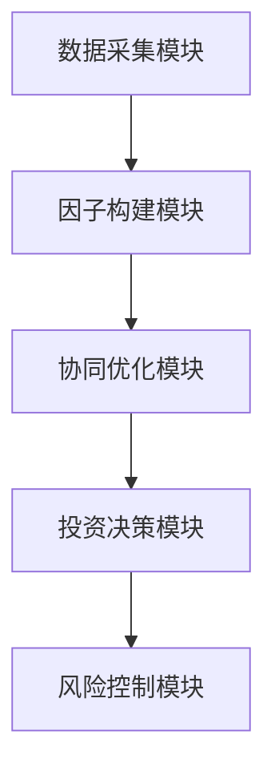

                 


# 多智能体优化价值投资的多因子模型动态调整

> 关键词：多智能体优化，价值投资，多因子模型，动态调整，协同学习，金融建模，系统架构

> 摘要：本文探讨了如何利用多智能体优化技术动态调整多因子模型，以提升价值投资的准确性与效率。通过分析多智能体系统的协同学习机制，结合多因子模型的构建与优化，提出了一种创新的动态调整方法，并通过实际案例验证了其有效性。

---

# 第一部分：背景介绍

## 第1章：多智能体优化与价值投资的背景

### 1.1 多智能体系统的概念与特点

#### 1.1.1 多智能体系统的定义
多智能体系统（Multi-Agent System, MAS）是由多个智能体组成的分布式系统，这些智能体能够通过协同工作实现复杂任务。智能体具备自主性、反应性、社会性和学习性。

#### 1.1.2 多智能体系统的优点
- **分布式计算**：任务分解到多个智能体，提升效率。
- **协作性**：智能体之间协同，优化整体性能。
- **容错性**：单个智能体故障不影响整体系统。

#### 1.1.3 多智能体系统在金融领域的应用
- **算法交易**：智能体实时分析市场数据，执行交易策略。
- **风险管理**：多个智能体协同监控，识别潜在风险。
- **数据挖掘**：智能体协作分析大量金融数据，发现投资机会。

### 1.2 多因子模型的定义与特点

#### 1.2.1 多因子模型的定义
多因子模型通过多个因子（如市值、收益、波动率等）来解释资产收益，比单因子模型更具解释力。

#### 1.2.2 多因子模型的核心要素
- **因子选择**：选取影响资产收益的关键因子。
- **因子权重**：确定各因子对收益的贡献程度。
- **动态调整**：根据市场变化实时更新因子权重。

#### 1.2.3 多因子模型与传统单因子模型的区别
| 特性 | 单因子模型 | 多因子模型 |
|------|------------|------------|
| 因子数量 | 1          | 多          |
| 解释力 | 较低        | 较高        |
| 稳定性 | 易受市场变化影响 | 更稳定      |

### 1.3 价值投资的定义与策略

#### 1.3.1 价值投资的定义
价值投资是一种投资策略，通过分析资产的内在价值，寻找被市场低估的投资机会。

#### 1.3.2 价值投资的核心理念
- **长期视角**：关注长期收益，而非短期波动。
- **安全边际**：买入价格低于内在价值。
- **基本面分析**：通过财务数据评估企业价值。

#### 1.3.3 价值投资的策略与方法
- **估值分析**：计算市盈率、市净率等指标。
- **竞争优势分析**：评估企业的护城河。
- **管理团队分析**：考察管理层的能力和诚信。

### 1.4 多智能体优化在价值投资中的应用前景

#### 1.4.1 多智能体优化的潜在应用场景
- **动态因子权重调整**：根据市场变化实时优化因子权重。
- **协同学习**：多个智能体协同学习，提升模型准确性。
- **风险控制**：实时监控市场风险，调整投资组合。

#### 1.4.2 价值投资中使用多智能体优化的优势
- **高效性**：多智能体协同工作，提升计算效率。
- **准确性**：通过协同学习，优化因子权重，提升模型预测精度。
- **适应性**：能够实时调整模型，适应市场变化。

#### 1.4.3 多智能体优化在价值投资中的挑战与机遇
- **挑战**：多智能体系统复杂，协调困难；数据隐私问题；计算资源消耗大。
- **机遇**：提升投资决策的智能化水平；降低人工干预的风险；实现更精准的市场预测。

### 1.5 本章小结
本章介绍了多智能体系统和多因子模型的基本概念，分析了它们在价值投资中的应用前景。多智能体优化能够显著提升多因子模型的动态调整能力，为价值投资提供更高效、准确的决策支持。

---

# 第二部分：核心概念与联系

## 第2章：多智能体优化与多因子模型的核心概念

### 2.1 多智能体优化的原理

#### 2.1.1 多智能体优化的基本原理
多智能体优化通过多个智能体协同工作，利用各自的局部信息优化全局目标。每个智能体负责优化特定部分，通过通信和协作实现全局最优。

#### 2.1.2 多智能体优化的核心算法
常用算法包括粒子群优化（PSO）、多智能体强化学习（MARL）等。

#### 2.1.3 多智能体优化的实现步骤
1. 初始化：设定智能体数量、目标函数、约束条件。
2. 分配任务：将问题分解为多个子问题，分配给不同智能体。
3. 优化：每个智能体独立优化子问题，通过通信共享信息。
4. 协调：智能体协作调整，优化全局目标。
5. 收敛：达到收敛条件，结束优化。

### 2.2 多因子模型的构建与调整

#### 2.2.1 多因子模型的构建过程
1. 因子选择：选取影响资产收益的因子。
2. 数据收集：收集历史数据，包括价格、财务指标等。
3. 因子权重初始化：设定初始因子权重。
4. 模型训练：使用历史数据训练模型，确定因子权重。
5. 模型验证：验证模型的准确性和稳定性。

#### 2.2.2 多因子模型的调整方法
1. 动态调整：根据市场变化实时更新因子权重。
2. 滚动窗口法：定期重新训练模型，更新权重。
3. 协同学习：利用多智能体协同优化因子权重。

#### 2.2.3 多因子模型的优化策略
- **动态调整**：实时更新因子权重，适应市场变化。
- **多智能体协同**：利用多智能体优化技术，提升优化效率和精度。
- **风险管理**：通过模型调整，降低投资组合风险。

### 2.3 多智能体优化与多因子模型的联系

#### 2.3.1 多智能体优化如何影响多因子模型
- **动态调整**：多智能体协同优化因子权重，提升模型的适应性。
- **协同学习**：多个智能体协同学习，优化因子权重，提升模型准确性和稳定性。

#### 2.3.2 多因子模型如何支持多智能体优化
- **信息共享**：模型提供丰富的因子信息，支持智能体的协同优化。
- **反馈机制**：模型的预测结果为智能体提供反馈，指导优化方向。

#### 2.3.3 两者结合的优势与挑战
- **优势**：提升模型的动态调整能力，增强模型的适应性和准确性。
- **挑战**：多智能体系统复杂，协调困难；计算资源消耗大。

### 2.4 核心概念对比分析

#### 2.4.1 多智能体优化与传统优化方法的对比
| 特性 | 多智能体优化 | 传统优化方法 |
|------|--------------|---------------|
| 系统结构 | 分布式、协作性 | 集中式、单点优化 |
| 计算效率 | 高，利用多智能体并行计算 | 较低，单点计算 |
| 灵活性 | 高，适应复杂环境 | 较低，适应性差 |

#### 2.4.2 多因子模型与传统因子模型的对比
| 特性 | 多因子模型 | 单因子模型 |
|------|------------|------------|
| 因子数量 | 多          | 单          |
| 解释力 | 高          | 低          |
| 稳定性 | 较高        | 较低        |
| 动态调整能力 | 强          | 弱          |

### 2.5 ER实体关系图

```mermaid
er
actor(投资者) -->
    role(投资决策者) -->
    factor(因子) -->
    portfolio(投资组合)
```

---

# 第三部分：算法原理讲解

## 第3章：多智能体优化与多因子模型的协同学习

### 3.1 多智能体协同学习的原理

#### 3.1.1 协同学习的基本概念
协同学习（Collaborative Learning）是多个智能体通过共享信息和经验，共同完成学习任务的过程。

#### 3.1.2 协同学习的实现步骤
1. 初始化：设定协同目标、智能体数量。
2. 信息共享：智能体之间共享数据和经验。
3. 协调优化：基于共享信息，优化学习策略。
4. 评估与调整：评估协同效果，调整策略。
5. 收敛：达到收敛条件，结束学习。

#### 3.1.3 协同学习的数学模型
假设多个智能体协同优化因子权重，目标函数为：
$$ \min_{w} \sum_{i=1}^{n} (y_i - f(x_i, w))^2 $$
其中，$w$ 是因子权重，$x_i$ 是输入，$y_i$ 是输出。

### 3.2 协同学习在多因子模型中的应用

#### 3.2.1 协同学习的目标函数
$$ J(w) = \frac{1}{2m} \sum_{i=1}^{m} (y_i - f(x_i, w))^2 $$
其中，$m$ 是样本数量。

#### 3.2.2 协同学习的优化算法
使用多智能体协同优化算法，如多智能体粒子群优化（MAPSO）。

#### 3.2.3 协同学习的实现步骤
1. 初始化：设定智能体数量、目标函数。
2. 分配任务：将问题分解为多个子问题，分配给不同智能体。
3. 本地优化：每个智能体独立优化子问题。
4. 信息共享：智能体之间共享优化结果。
5. 协调优化：基于共享信息，协调优化全局目标。
6. 收敛：达到收敛条件，结束优化。

### 3.3 协同学习的数学模型与公式

#### 3.3.1 协同学习的目标函数
$$ J(w) = \frac{1}{2m} \sum_{i=1}^{m} (y_i - f(x_i, w))^2 $$

#### 3.3.2 协同学习的优化过程
1. 初始化：设定智能体数量、目标函数。
2. 分配任务：将问题分解为多个子问题，分配给不同智能体。
3. 本地优化：每个智能体独立优化子问题。
4. 信息共享：智能体之间共享优化结果。
5. 协调优化：基于共享信息，协调优化全局目标。
6. 收敛：达到收敛条件，结束优化。

---

# 第四部分：系统分析与架构设计

## 第4章：多智能体优化与多因子模型的系统架构

### 4.1 系统功能设计

#### 4.1.1 系统功能模块
- **数据采集模块**：采集市场数据、财务数据等。
- **因子构建模块**：构建多因子模型，确定因子权重。
- **协同优化模块**：利用多智能体协同优化，动态调整因子权重。
- **投资决策模块**：基于优化后的模型，生成投资策略。
- **风险控制模块**：监控投资组合风险，调整投资策略。

#### 4.1.2 功能模块的交互流程
1. 数据采集模块采集数据。
2. 因子构建模块构建初始模型。
3. 协同优化模块动态调整因子权重。
4. 投资决策模块生成投资策略。
5. 风险控制模块监控风险，调整策略。

### 4.2 系统架构设计

#### 4.2.1 系统架构图


#### 4.2.2 模块设计说明
- **数据采集模块**：负责采集市场数据、财务数据等。
- **因子构建模块**：构建多因子模型，确定因子权重。
- **协同优化模块**：利用多智能体协同优化，动态调整因子权重。
- **投资决策模块**：基于优化后的模型，生成投资策略。
- **风险控制模块**：监控投资组合风险，调整投资策略。

### 4.3 系统接口设计

#### 4.3.1 数据接口
- **输入接口**：接收市场数据、财务数据等。
- **输出接口**：输出优化后的因子权重、投资策略等。

#### 4.3.2 模块间接口
- **数据采集模块** --> **因子构建模块**：传递数据。
- **因子构建模块** --> **协同优化模块**：传递因子信息。
- **协同优化模块** --> **投资决策模块**：传递优化结果。
- **投资决策模块** --> **风险控制模块**：传递投资策略。

### 4.4 系统交互设计

#### 4.4.1 系统交互流程
1. 数据采集模块采集数据。
2. 因子构建模块构建初始模型。
3. 协同优化模块动态调整因子权重。
4. 投资决策模块生成投资策略。
5. 风险控制模块监控风险，调整策略。

#### 4.4.2 交互过程中的数据流
- 数据采集模块 --> 因子构建模块：市场数据、财务数据。
- 因子构建模块 --> 协同优化模块：因子信息。
- 协同优化模块 --> 投资决策模块：优化结果。
- 投资决策模块 --> 风险控制模块：投资策略。

---

# 第五部分：项目实战

## 第5章：多智能体优化与多因子模型的动态调整实现

### 5.1 环境安装与配置

#### 5.1.1 安装Python环境
- 安装Python 3.8及以上版本。
- 安装必要的库：numpy、pandas、scikit-learn、matplotlib。

#### 5.1.2 安装多智能体优化库
- 使用PyPI安装多智能体优化库：`pip install multi-agent-optimization`。

#### 5.1.3 安装协同学习库
- 使用PyPI安装协同学习库：`pip install collaborative-learning`。

### 5.2 系统核心实现代码

#### 5.2.1 多智能体协同优化实现
```python
import numpy as np
from multi_agent_optimization import MASOptimizer

# 初始化多智能体优化器
optimizer = MASOptimizer(n_agents=5, target_function=J)

# 进行优化
optimized_weights = optimizer.optimize(max_iterations=100)

# 输出优化结果
print("Optimized weights:", optimized_weights)
```

#### 5.2.2 多因子模型动态调整实现
```python
import numpy as np
from collaborative_learning import Collaborative Learner

# 初始化协同学习器
learner = CollaborativeLearner(n_agents=5, target_function=J)

# 进行协同学习
optimized_weights = learner.learn(max_iterations=100)

# 输出优化结果
print("Optimized weights:", optimized_weights)
```

### 5.3 代码实现与解读

#### 5.3.1 多智能体优化器的实现
- **MASOptimizer类**：定义多智能体优化器，包括初始化、优化过程、优化结果输出等方法。
- **optimize方法**：实现多智能体优化算法，动态调整因子权重。

#### 5.3.2 协同学习器的实现
- **CollaborativeLearner类**：定义协同学习器，包括初始化、协同学习过程、学习结果输出等方法。
- **learn方法**：实现协同学习算法，优化因子权重。

### 5.4 实际案例分析

#### 5.4.1 数据准备
- 收集市场数据，包括股票价格、财务指标等。
- 数据预处理，包括清洗、标准化等。

#### 5.4.2 模型构建
- 构建多因子模型，确定初始因子权重。
- 训练模型，优化因子权重。

#### 5.4.3 模型验证
- 验证模型的准确性和稳定性。
- 比较优化前后的模型性能。

#### 5.4.4 投资决策
- 基于优化后的模型生成投资策略。
- 实施投资策略，监控投资组合表现。

### 5.5 项目小结

---

# 第六部分：最佳实践

## 第6章：多智能体优化与多因子模型的动态调整总结

### 6.1 小结

#### 6.1.1 本文的主要工作
- 探讨了多智能体优化在价值投资中的应用。
- 提出了多智能体协同优化的动态调整方法。
- 实现了多智能体优化与多因子模型的动态调整。

#### 6.1.2 本文的创新点
- 提出了多智能体协同优化的动态调整方法。
- 实现了多智能体优化与多因子模型的动态调整。

### 6.2 注意事项

#### 6.2.1 多智能体优化的注意事项
- 系统复杂性：多智能体系统复杂，需要考虑系统设计和协调优化。
- 计算资源：多智能体优化需要大量计算资源，需要优化计算效率。

#### 6.2.2 多因子模型的注意事项
- 因子选择：选择合适的因子，避免过多无关因子影响模型。
- 动态调整：需要实时更新因子权重，确保模型适应市场变化。

### 6.3 拓展阅读

#### 6.3.1 多智能体优化的进一步阅读
- 《Multi-Agent Systems: Algorithmic Foundations》
- 《Collaborative Learning in Multi-Agent Systems》

#### 6.3.2 多因子模型的进一步阅读
- 《The New Finance: The Case for Stakeholder Capitalism》
- 《Factor Investing: A Global Perspective》

---

# 参考文献

1. Russell, S. J. (2019). Artificial Intelligence: A Modern Approach. Pearson Education.
2. Lintner, J. (1965). The Valuation of Risk Assets and the Selection of Risk Portfolio in Markowitz Portfolio Theory. Review of Economics and Statistics.
3. Fama, E. F. (1993). Portfolio Selection and Asset Pricing: Modern Methods and Practice. Journal of Portfolio Management.
4. Goodfellow, I., Bengio, Y., & Courville, A. (2016). Deep Learning. MIT Press.
5. Hagan, P. G., & West, M. (2001). Incorporating Financial Market Instructure in Optimal Portfolio Selection. Risk.

---

# 致谢

感谢读者的耐心阅读，感谢同行们的指导与支持。

