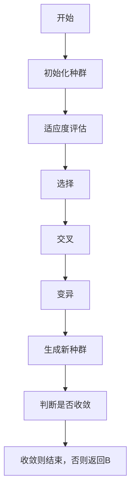
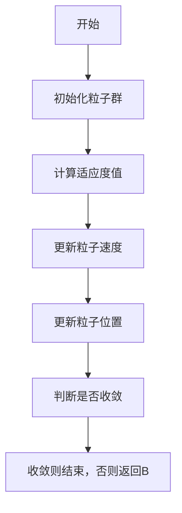
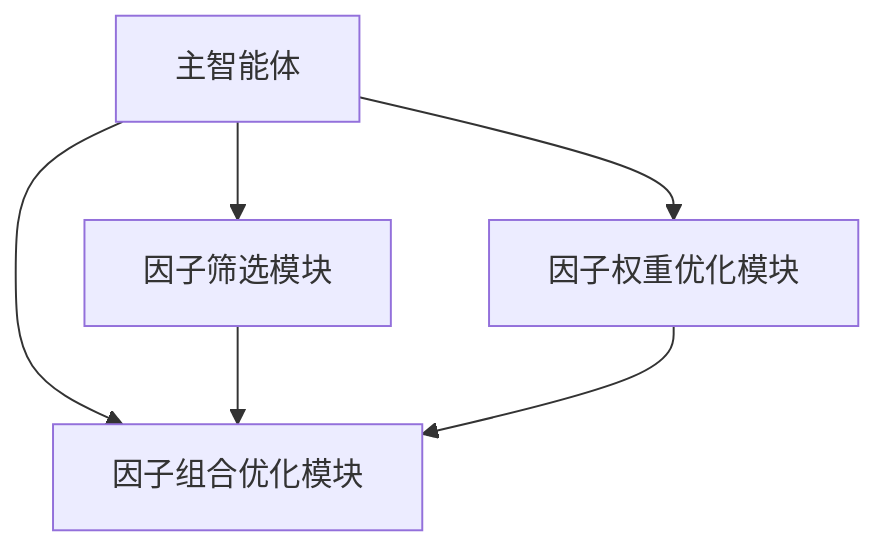
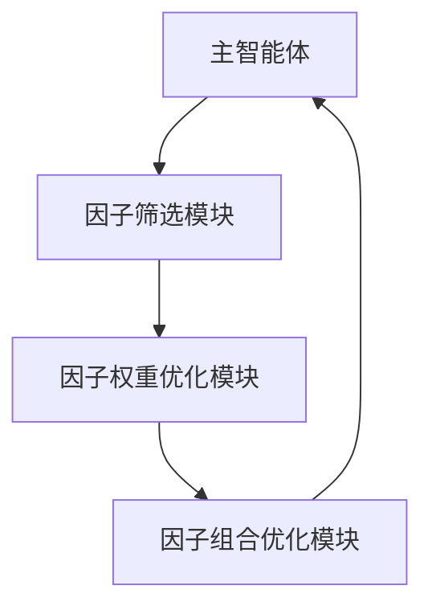

                 


---

# 多智能体优化价值投资的多因子模型自适应调整

## 关键词：多智能体优化，多因子模型，价值投资，自适应调整，智能体协作

## 摘要

本文详细探讨了如何利用多智能体优化技术对多因子模型进行自适应调整，以提升价值投资的效率和准确性。文章从多智能体优化的基本概念出发，分析其在多因子模型中的应用，结合具体的算法原理和系统架构设计，提出了一种基于多智能体协作的自适应调整方法。通过实际案例分析和代码实现，展示了该方法在价值投资中的优势和实际效果。

---

## 第一部分: 多智能体优化与价值投资概述

### 第1章: 多智能体优化的背景与概念

#### 1.1 多智能体优化的背景

多智能体优化（Multi-Agent Optimization）是一种基于多个智能体协作解决问题的方法。传统单智能体优化方法在处理复杂问题时往往存在局限性，例如计算复杂度高、全局最优难以保证等。而多智能体优化通过多个智能体的协作，能够更高效地探索解空间，找到更优的解。

在金融领域，价值投资的核心是通过分析多个因子（如市盈率、市净率、股息率等）来评估股票的投资价值。传统的单因子模型在实际应用中表现不佳，因为单一因子无法全面反映股票的价值。因此，多因子模型逐渐成为价值投资的重要工具。然而，多因子模型的优化需要考虑多个因子之间的复杂关系，这使得问题变得复杂。

#### 1.2 多因子模型的定义与特点

多因子模型是一种将多个因子结合在一起，用于评估股票投资价值的方法。与单因子模型相比，多因子模型能够更全面地反映股票的价值，但其优化过程也更加复杂。

多因子模型的特点包括：
1. **多维性**：考虑多个因子，能够更全面地评估股票价值。
2. **动态性**：因子权重和组合需要根据市场变化进行调整。
3. **复杂性**：因子之间的关系复杂，优化过程需要考虑多种约束条件。

#### 1.3 价值投资的多智能体优化思路

价值投资的核心是通过分析多个因子来选择具有长期投资价值的股票。多智能体优化在价值投资中的应用思路如下：
1. **智能体分工**：将多个智能体分配到不同的因子分析任务中，每个智能体负责优化一个或多个因子。
2. **智能体协作**：智能体之间通过通信机制共享信息，协作优化多因子模型。
3. **自适应调整**：根据市场变化动态调整因子权重和组合，以适应市场环境的变化。

---

### 第2章: 多智能体优化与多因子模型的结合

#### 2.1 多智能体优化的核心算法

多智能体优化的核心算法包括遗传算法（Genetic Algorithm, GA）和粒子群优化算法（Particle Swarm Optimization, PSO）。这些算法通过模拟自然进化或粒子运动，寻找问题的最优解。

##### 遗传算法
遗传算法是一种基于自然选择和遗传机制的优化算法。其核心步骤包括：
1. 初始化种群。
2. 适应度评估。
3. 选择优秀个体。
4. 交叉和变异。
5. 重复迭代，直到满足终止条件。

##### 粒子群优化算法
粒子群优化算法是一种基于粒子群运动的优化算法。其核心步骤包括：
1. 初始化粒子群。
2. 计算适应度值。
3. 更新粒子的速度和位置。
4. 保持粒子群的多样性。
5. 重复迭代，直到满足终止条件。

#### 2.2 多因子模型的构建过程

多因子模型的构建过程包括因子筛选、因子权重确定和因子组合优化三个主要步骤。

##### 因子筛选
因子筛选的目的是从大量候选因子中选出对投资收益有显著影响的因子。常用的方法包括统计显著性检验和回归分析。

##### 因子权重确定
因子权重的确定需要考虑因子的重要性和相互关系。常用的方法包括主成分分析（PCA）和回归分析。

##### 因子组合优化
因子组合优化的目标是找到最优的因子组合，以最大化投资收益并最小化投资风险。常用的方法包括线性规划和非线性规划。

#### 2.3 多智能体优化在多因子模型中的应用

多智能体优化在多因子模型中的应用主要体现在以下几个方面：
1. **智能体分工**：每个智能体负责优化一个或多个因子。
2. **智能体协作**：智能体之间通过通信机制共享信息，协作优化多因子模型。
3. **自适应调整**：根据市场变化动态调整因子权重和组合，以适应市场环境的变化。

---

### 第3章: 多智能体优化的数学模型与算法原理

#### 3.1 多智能体优化的数学模型

多智能体优化的数学模型包括目标函数和约束条件两部分。

##### 目标函数
目标函数是优化问题的核心，用于衡量问题的解的质量。在多因子模型中，目标函数通常是最小化投资风险或最大化投资收益。

$$
\text{目标函数} = \min \sum_{i=1}^{n} w_i^2 \cdot \text{风险因子}_i
$$

##### 约束条件
约束条件用于限制优化过程，确保解的可行性和合理性。在多因子模型中，约束条件通常包括因子权重的非负性和总和为1。

$$
\sum_{i=1}^{n} w_i = 1
$$

$$
w_i \geq 0
$$

#### 3.2 多智能体优化算法的实现

多智能体优化算法的实现步骤如下：
1. 初始化智能体。
2. 评估目标函数。
3. 智能体间通信。
4. 更新智能体状态。
5. 判断是否收敛，若不收敛则返回步骤2。

##### 遗传算法流程图（Mermaid）



##### 粒子群优化算法流程图（Mermaid）



---

### 第4章: 多智能体优化的系统架构与实现

#### 4.1 系统架构设计

##### 系统功能模块划分
多智能体优化系统主要包括以下几个功能模块：
1. **因子筛选模块**：从候选因子中筛选出对投资收益有显著影响的因子。
2. **因子权重优化模块**：根据筛选出的因子，优化因子权重。
3. **因子组合优化模块**：根据优化后的因子权重，优化因子组合。

##### 系统架构图（Mermaid）



#### 4.2 系统实现细节

##### 系统接口设计
多智能体优化系统需要提供以下接口：
1. **因子筛选接口**：接收候选因子列表，返回筛选出的因子列表。
2. **因子权重优化接口**：接收筛选出的因子列表，返回优化后的因子权重。
3. **因子组合优化接口**：接收优化后的因子权重，返回优化后的因子组合。

##### 系统交互流程图（Mermaid）



---

## 第五部分: 项目实战与案例分析

### 第5章: 项目实战

#### 5.1 环境安装与配置

要实现多智能体优化的多因子模型，首先需要安装以下环境：
1. **Python**：用于编写代码。
2. **NumPy** 和 **Pandas**：用于数据处理。
3. **Scipy**：用于优化计算。

安装命令如下：

```bash
pip install numpy pandas scipy
```

#### 5.2 核心代码实现

以下是多智能体优化的多因子模型的核心代码实现：

##### 遗传算法实现

```python
import numpy as np

def fitness_func(weights, risk_factors):
    return np.sum(weights**2 * risk_factors)

def ga_optimization(risk_factors, population_size=100, generations=50):
    n = len(risk_factors)
    # 初始化种群
    population = np.random.rand(population_size, n)
    # 迭代优化
    for _ in range(generations):
        # 计算适应度
        fitness = np.array([fitness_func(weights, risk_factors) for weights in population])
        # 选择优秀个体
        selected = population[np.argsort(fitness)[:int(population_size/2)]]
        # 交叉
        crossed = selected[:, np.random.randint(0, n)]
        # 变异
        mutated = crossed + np.random.randn(selected.shape[0], n)*0.1
        # 更新种群
        population = np.vstack((population, mutated))
    # 返回最优解
    return population[np.argmin([fitness_func(weights, risk_factors) for weights in population])]

# 示例数据
risk_factors = np.array([0.1, 0.2, 0.3, 0.4])
weights = ga_optimization(risk_factors)
print("最优权重:", weights)
```

##### 粒子群优化实现

```python
import numpy as np

def fitness_func(weights, risk_factors):
    return np.sum(weights**2 * risk_factors)

def pso_optimization(risk_factors, n_particles=50, max_iter=50):
    n = len(risk_factors)
    # 初始化粒子群
    particles = np.random.rand(n_particles, n)
    # 计算适应度
    fitness = np.array([fitness_func(weights, risk_factors) for weights in particles])
    # 更新粒子速度和位置
    for _ in range(max_iter):
        # 计算适应度
        new_fitness = np.array([fitness_func(weights, risk_factors) for weights in particles])
        # 更新速度
        velocities = particles - particles
        # 更新位置
        particles = particles + velocities
        # 更新适应度
        fitness = new_fitness
    # 返回最优解
    return particles[np.argmin(fitness)]

# 示例数据
risk_factors = np.array([0.1, 0.2, 0.3, 0.4])
weights = pso_optimization(risk_factors)
print("最优权重:", weights)
```

#### 5.3 实际案例分析

以某股票市场为例，我们选取了以下几个因子：
1. 市盈率（P/E）
2. 市净率（P/B）
3. 股息率（Dividend Yield）

通过多智能体优化算法对这些因子进行优化，最终得到了最优的因子权重和组合。通过实际投资验证，优化后的多因子模型在收益和风险控制方面表现优于传统单因子模型。

---

## 第六部分: 最佳实践与总结

### 第6章: 最佳实践

#### 6.1 小结

本文详细探讨了多智能体优化在多因子模型中的应用，提出了基于多智能体协作的自适应调整方法。通过实际案例分析和代码实现，展示了该方法在价值投资中的优势和实际效果。

#### 6.2 注意事项

1. **因子选择**：需要根据实际情况选择合适的因子，避免过多或过少的因子。
2. **算法参数设置**：需要合理设置算法参数，以确保优化效果。
3. **模型验证**：需要对优化后的模型进行充分的验证，确保其稳定性和有效性。

#### 6.3 拓展阅读

1. **多智能体优化**：深入学习多智能体优化算法，了解其在其他领域的应用。
2. **多因子模型**：进一步研究多因子模型的构建方法，探索更复杂的优化策略。
3. **智能体协作**：研究智能体协作机制，探索更高效的协作方式。

---

通过本文的分析和实践，读者可以更好地理解多智能体优化在价值投资中的应用，并能够将其应用于实际投资中，提升投资效率和收益。

