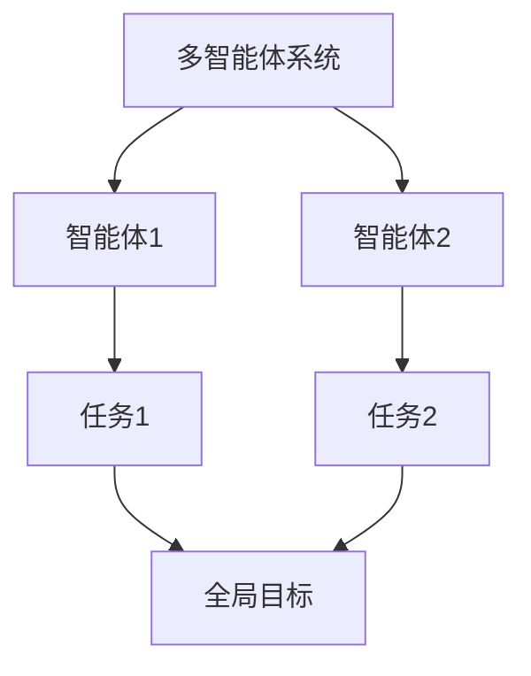
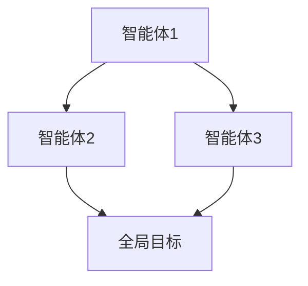
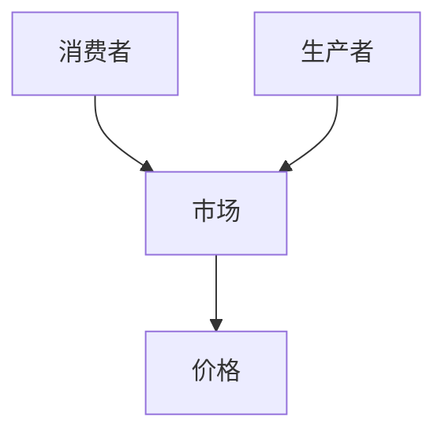
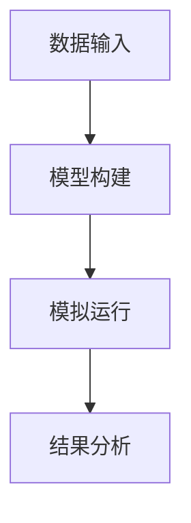
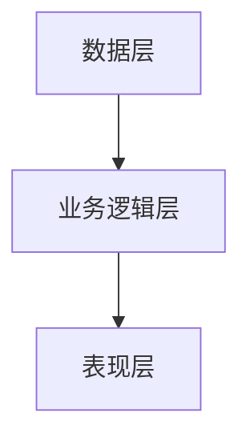
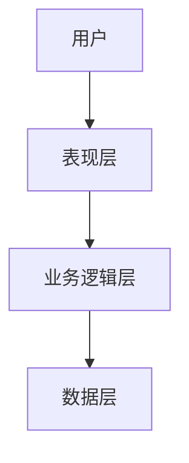

                 


# 多智能体在宏观经济分析中的应用

> 关键词：多智能体系统、宏观经济分析、经济建模、博弈论、系统架构、算法原理

> 摘要：本文深入探讨了多智能体系统在宏观经济分析中的应用，从基本概念到实际案例，系统地分析了多智能体系统在宏观经济建模、市场行为模拟、政策评估以及经济预测中的作用。通过结合理论与实践，本文展示了如何利用多智能体系统的优势来解决复杂的宏观经济问题，并提供了详细的算法原理、系统架构设计和实际项目案例。

---

## 第1章: 多智能体系统概述

### 1.1 多智能体系统的定义与特点
#### 1.1.1 多智能体系统的定义
多智能体系统（Multi-Agent System, MAS）是由多个相互作用的智能体组成的复杂系统，这些智能体通过局部信息和交互完成全局目标。与传统的单智能体系统相比，MAS具有分布式计算、自主性和协作性等特点。

#### 1.1.2 多智能体系统的核心特点
| 特性 | 描述 |
|------|------|
| 分布式 | 智能体独立运行，通过通信协作完成任务 |
| 自主性 | 每个智能体都有自主决策能力 |
| 协作性 | 智能体之间通过协作实现整体目标 |
| 动态性 | 系统状态随智能体交互动态变化 |

#### 1.1.3 多智能体系统与传统单智能体系统的区别


### 1.2 宏观经济分析的基础概念
#### 1.2.1 宏观经济的基本概念
宏观经济研究的是整个经济系统的运行规律，包括GDP、通货膨胀、失业率等宏观变量。

#### 1.2.2 宏观经济分析的主要方法
| 方法 | 描述 |
|------|------|
| 宏观经济学 | 研究整体经济行为和政策 |
| 微观经济学 | 研究个体行为对整体经济的影响 |
| 实证经济学 | 基于数据的实证分析 |

#### 1.2.3 宏观经济模型的分类与特点
```mermaid
graph TD
A[宏观经济模型] --> B[DSGE模型]
A --> C[计量经济学模型]
A --> D[ Agent-Based Model (ABM) ]
```

---

## 第2章: 多智能体系统在宏观经济分析中的应用背景

### 2.1 宏观经济分析的复杂性
#### 2.1.1 宏观经济系统的复杂性特征
| 特性 | 描述 |
|------|------|
| 非线性 | 系统行为难以用线性关系描述 |
| 不确定性 | 系统存在大量不确定因素 |
| 动态性 | 系统状态随时间变化 |

#### 2.1.2 宏观经济分析的传统方法及其局限性
- **局限性**：传统宏观经济模型（如DSGE模型）假设个体理性，忽视了个体异质性和行为多样性。

### 2.2 多智能体系统的优势
#### 2.2.1 多智能体系统在复杂系统建模中的优势
- **个体异质性**：能够模拟个体间的差异性行为。
- **动态演化**：能够捕捉系统动态变化过程。

#### 2.2.2 多智能体系统在宏观经济分析中的独特价值
- **微观基础**：基于个体行为建模，能够更好地反映经济系统的复杂性。

### 2.3 多智能体系统在宏观经济分析中的应用现状
#### 2.3.1 国内外研究现状
- 国内：以清华大学、北京大学为代表，研究集中在金融市场模拟和政策评估。
- 国外：以MIT、哈佛大学为代表，研究集中在经济政策模拟和经济预测。

#### 2.3.2 当前应用的主要领域与案例
| 领域 | 案例 |
|------|------|
| 金融市场 | 个体投资者行为模拟 |
| 政策评估 | 财政政策效果评估 |
| 经济预测 | 经济波动预测 |

---

## 第3章: 多智能体系统的核心概念与宏观经济分析的结合

### 3.1 多智能体系统的结构与行为机制
#### 3.1.1 多智能体系统的组成结构
| 组件 | 描述 |
|------|------|
| 智能体 | 系统的基本单元，具有自主决策能力 |
| 通信机制 | 智能体之间的信息交换方式 |
| 协调机制 | 智能体协作完成全局任务的方式 |

#### 3.1.2 多智能体系统的交互机制


#### 3.1.3 多智能体系统的动态演化特征
- **动态性**：系统状态随时间变化。
- **涌现性**：全局行为由局部交互产生。

### 3.2 宏观经济分析的核心要素
#### 3.2.1 宏观经济的主要变量
| 变量 | 描述 |
|------|------|
| GDP | 国内生产总值 |
| 通货膨胀率 | 货币购买力下降的速度 |
| 失业率 | 劳动力市场中未就业人口比例 |

#### 3.2.2 宏观经济模型的构建要素
- **个体行为**：个体的消费、投资行为。
- **市场机制**：价格机制、供求关系。
- **政策变量**：财政政策、货币政策。

---

## 第4章: 多智能体系统在宏观经济分析中的应用案例

### 4.1 市场行为模拟
#### 4.1.1 个体行为的建模方法
- **基于博弈论的建模**：假设个体理性，寻找纳什均衡。
- **基于Agent-Based Modeling (ABM)**：模拟个体异质性行为。

#### 4.1.2 市场供需关系的多智能体模拟


#### 4.1.3 市场波动的预测与分析
- **波动预测**：通过模拟个体行为预测市场价格波动。
- **波动分析**：分析波动的驱动因素。

### 4.2 宏观经济政策评估
#### 4.2.1 政策模拟的基本方法
- **情景分析**：模拟不同政策情景下的经济表现。
- **反事实分析**：评估政策的可能影响。

#### 4.2.2 政策效果的多智能体评估
- **政策效果**：评估政策对经济增长、就业的影响。
- **政策优化**：通过模拟找到最优政策组合。

### 4.3 经济预测与风险评估
#### 4.3.1 多智能体系统的预测优势
- **动态性**：能够捕捉系统动态变化。
- **复杂性**：能够处理复杂的经济关系。

#### 4.3.2 经济风险的多智能体评估方法
- **风险模拟**：模拟经济危机的爆发和传播。
- **风险缓解**：提出风险缓解策略。

---

## 第5章: 多智能体系统的算法原理与宏观经济模型

### 5.1 多智能体系统的算法基础
#### 5.1.1 多智能体系统的通信机制
- **基于消息传递**：智能体通过消息传递信息。
- **基于共享知识库**：智能体通过共享知识库协作。

#### 5.1.2 多智能体系统的博弈论模型
- **纳什均衡**：所有参与方都不想单方面改变策略的状态。
- **进化博弈论**：模拟策略随时间的动态变化。

### 5.2 多智能体系统的数学模型
#### 5.2.1 个体决策模型
$$ V(i) = \max_{a_i} \sum_{t=1}^T \beta^{t-1} u(a_i^t, s_i^t) $$
其中，$V(i)$ 是个体 $i$ 的效用函数，$a_i^t$ 是个体 $i$ 在时间 $t$ 的决策，$s_i^t$ 是个体 $i$ 在时间 $t$ 的状态。

#### 5.2.2 集体决策模型
$$ V(G) = \sum_{i=1}^n V(i) $$
其中，$V(G)$ 是整个系统的效用函数，$n$ 是智能体的数量。

---

## 第6章: 多智能体系统的系统架构设计

### 6.1 宏观经济分析系统的功能设计
#### 6.1.1 系统功能模块
| 模块 | 描述 |
|------|------|
| 数据输入 | 读取经济数据 |
| 模型构建 | 构建宏观经济模型 |
| 模拟运行 | 运行多智能体模拟 |
| 结果分析 | 分析模拟结果 |

#### 6.1.2 系统功能流程


### 6.2 系统架构设计
#### 6.2.1 系统架构图


#### 6.2.2 系统接口设计
- **数据接口**：提供数据输入和输出接口。
- **模型接口**：提供宏观经济模型的接口。

### 6.3 系统交互设计
#### 6.3.1 系统交互流程


---

## 第7章: 多智能体系统的项目实战

### 7.1 项目环境安装
- **工具安装**：安装Python、Pycharm等开发工具。
- **库安装**：安装numpy、pandas、matplotlib等库。

### 7.2 系统核心实现
#### 7.2.1 系统核心代码
```python
class Agent:
    def __init__(self, id):
        self.id = id
        self.state = 0
    def update(self, action):
        self.state += action
```

#### 7.2.2 系统功能实现
- **个体行为模拟**：模拟个体的消费和投资行为。
- **市场供需模拟**：模拟市场供需关系。

### 7.3 项目案例分析
#### 7.3.1 案例分析
- **案例背景**：模拟经济危机的爆发和传播。
- **模拟结果**：分析经济危机对不同经济变量的影响。

### 7.4 项目小结
- **项目总结**：通过项目实战，掌握了多智能体系统的核心实现方法。
- **经验总结**：在项目中需要注意的事项。

---

## 第8章: 总结与展望

### 8.1 总结
- **总结内容**：回顾全文，总结多智能体系统在宏观经济分析中的应用。
- **总结意义**：强调多智能体系统在宏观经济分析中的重要性。

### 8.2 展望
- **未来研究方向**：探讨未来多智能体系统在宏观经济分析中的发展方向。
- **研究意义**：强调研究的理论意义和实际意义。

---

## 参考文献
1. 理查德·塞勒.《行为经济学》
2. 威廉·维克里.《博弈论与经济行为》
3. 杰拉德·德布.《一般均衡理论》

---

通过以上结构，我们可以系统地分析多智能体系统在宏观经济分析中的应用，从理论到实践，从概念到代码，全面覆盖相关内容。

