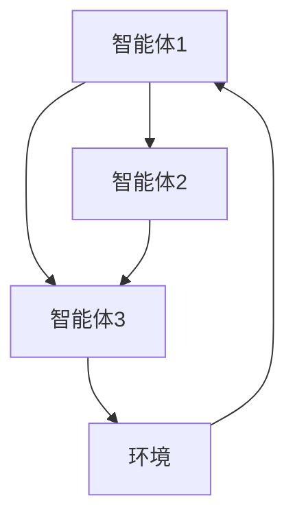
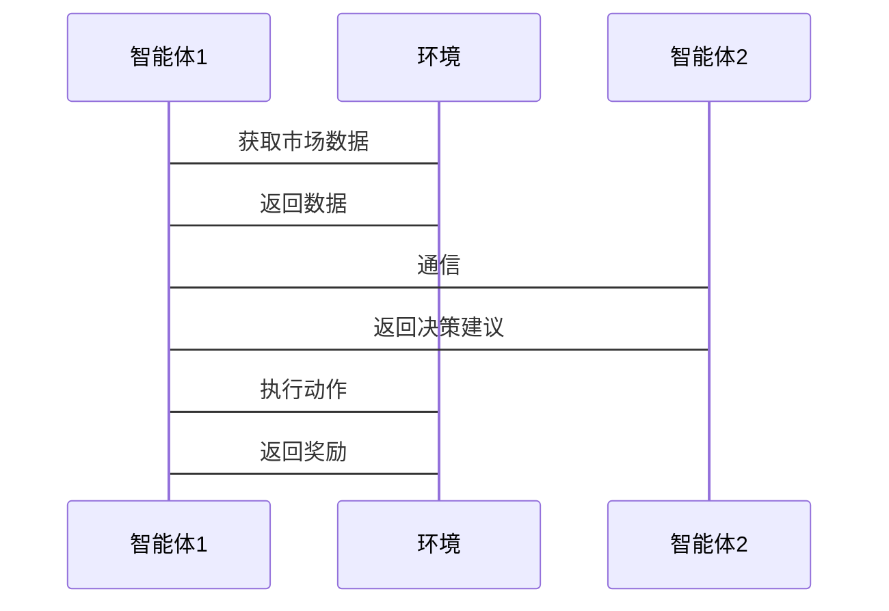

                 

<think>
好，现在需要根据用户的要求，完成《多智能体强化学习在优化价值投资的仓位管理中的应用》的技术博客文章。我会按照目录大纲逐步展开，确保每一部分内容详实且符合逻辑。

### 文章标题
多智能体强化学习在优化价值投资的仓位管理中的应用

### 关键词
多智能体强化学习、价值投资、仓位管理、投资组合优化、风险控制

### 摘要
在金融投资领域，优化价值投资的仓位管理是实现稳定收益的关键。本文将介绍多智能体强化学习（MARS）如何应用于仓位管理，通过多个智能体协作优化投资组合，提升风险控制和收益效率。从基本概念到算法实现，结合实际案例，深入分析其优势和挑战。

接下来，我会按照目录大纲逐步撰写文章内容。

---

## 第一部分: 多智能体强化学习与价值投资的背景

### 第1章: 多智能体强化学习概述

#### 1.1 多智能体强化学习的基本概念
- **多智能体系统的基本定义**  
  多智能体系统由多个智能体组成，每个智能体都能感知环境、做出决策并执行动作。这些智能体通过协作或竞争完成复杂任务。

- **强化学习的基本原理**  
  强化学习是一种机器学习范式，智能体通过与环境互动，学习如何做出最优决策。通过试错和奖励机制，智能体逐渐优化策略。

- **多智能体强化学习的核心特点**  
  与单智能体强化学习相比，多智能体系统更具复杂性，需要处理智能体间的协作、通信和竞争，同时优化全局目标。

#### 1.2 多智能体强化学习的应用领域
- **金融领域的应用**  
  多智能体强化学习在金融投资中用于优化交易策略、风险管理等。

- **游戏AI的应用**  
  如电子游戏中的团队协作AI，多个智能体协同完成复杂任务。

- **其他领域的应用**  
  包括自动驾驶、分布式系统优化等。

#### 1.3 本章小结
本章介绍了多智能体强化学习的基本概念、核心特点及其在各领域的应用，为后续章节奠定了基础。

### 第2章: 价值投资与仓位管理的背景

#### 2.1 价值投资的基本概念
- **价值投资的定义**  
  以低于内在价值的价格买入优质股票，长期持有，获得超额收益。

- **价值投资的核心理念**  
  坚持安全边际、长期投资、分散投资，追求稳定收益。

- **价值投资与技术分析的区别**  
  价值投资侧重基本面分析，技术分析侧重价格走势预测。

#### 2.2 仓位管理的基本原理
- **仓位管理的定义**  
  根据市场环境和投资策略，调整投资组合中各资产的权重，以优化风险和收益。

- **仓位管理的目标**  
  在不同市场条件下，动态调整投资比例，平衡风险与收益。

- **仓位管理的常见策略**  
  包括固定比例策略、风险导向策略、趋势跟随策略等。

#### 2.3 价值投资与仓位管理的结合
- **价值投资中仓位管理的重要性**  
  仓位管理是价值投资策略的重要组成部分，影响整体收益和风险。

- **仓位管理对投资组合的影响**  
  合理的仓位管理有助于平滑收益波动，降低整体风险。

- **传统仓位管理的局限性**  
  面对复杂市场环境，传统方法难以实时优化，容易导致收益损失或风险增加。

#### 2.4 本章小结
本章详细介绍了价值投资和仓位管理的基本概念及其结合，揭示了传统方法的局限性，为多智能体强化学习的应用提供了背景。

### 第3章: 多智能体强化学习在仓位管理中的应用潜力

#### 3.1 多智能体强化学习的优势
- **多智能体协作的优势**  
  多个智能体可以分别负责不同的投资标的，通过协作优化整体仓位配置。

- **强化学习的灵活性**  
  强化学习能够适应复杂多变的市场环境，实时调整策略。

- **多智能体系统在复杂环境中的适应性**  
  通过智能体间的协作和信息共享，系统能够更好地应对市场的不确定性。

#### 3.2 价值投资与仓位管理的复杂性
- **价值投资中的不确定性**  
  市场波动、公司基本面变化等增加了投资决策的难度。

- **仓位管理中的动态平衡**  
  需要根据市场变化实时调整仓位，这对传统方法是巨大挑战。

- **市场波动对仓位管理的影响**  
  大幅波动的市场环境需要更灵活和高效的仓位管理策略。

#### 3.3 多智能体强化学习在仓位管理中的潜在应用
- **多智能体协作优化投资组合**  
  每个智能体负责不同资产或行业，通过协作找到最优的仓位分配。

- **强化学习算法在仓位调整中的应用**  
  利用强化学习算法，智能体能够根据市场反馈调整动作，优化仓位配置。

- **多智能体系统在风险控制中的作用**  
  智能体间的信息共享和协作有助于及时发现和控制风险。

#### 3.4 本章小结
本章分析了多智能体强化学习在仓位管理中的潜力，强调了其在复杂市场环境中的优势。

---

## 第二部分: 多智能体强化学习的算法原理

### 第4章: 多智能体强化学习的核心算法

#### 4.1 多智能体强化学习的基本算法
- **Q-learning算法**  
  Q-learning是一种经典的强化学习算法，通过更新Q值表来学习最优策略。

- **Deep Q-Networks (DQN)算法**  
  使用深度神经网络近似Q值函数，能够处理高维状态空间。

- **多智能体协作算法**  
  包括基于价值的协作（V-REP）、基于策略的协作（MAAC）等。

#### 4.2 多智能体强化学习的挑战
- **状态空间的复杂性**  
  多智能体系统中，状态空间呈指数级增长，增加了学习难度。

- **动作空间的协调性**  
  智能体间的动作需要协调一致，否则可能导致冲突或低效。

- **奖励机制的设计**  
  需要设计合理的奖励函数，平衡个体目标与全局目标。

#### 4.3 多智能体强化学习的解决方案
- **基于价值的多智能体协作**  
  每个智能体学习价值函数，通过共享信息优化整体策略。

- **基于策略的多智能体协作**  
  智能体通过策略网络协作，实时调整动作以优化全局目标。

- **基于中间层的多智能体协作**  
  引入中间层来协调智能体间的动作，降低协调难度。

#### 4.4 本章小结
本章详细介绍了多智能体强化学习的核心算法及其解决方案，为后续的应用奠定了理论基础。

### 第5章: 多智能体强化学习的数学模型

#### 5.1 多智能体强化学习的基本模型
- **状态空间模型**  
  定义状态空间S，每个状态表示环境中的一个情况。

- **动作空间模型**  
  定义动作空间A，每个动作表示智能体可以执行的操作。

- **奖励函数模型**  
  定义奖励函数R，描述智能体动作带来的即时反馈。

#### 5.2 多智能体协作的数学表达
- **单智能体的价值函数**  
  $$ V(s) = \max_a Q(s,a) $$

- **多智能体的联合价值函数**  
  $$ V_{\text{joint}}(s) = \sum_{i=1}^n V_i(s_i) $$

#### 5.3 多智能体协作的数学推导
- **价值函数更新**  
  利用贝尔曼方程更新价值函数：
  $$ V(s) = \max_a \left( r + \gamma V(s') \right) $$

- **策略优化**  
  通过策略梯度方法优化多智能体策略：
  $$ \theta_{t+1} = \theta_t + \alpha \nabla J(\theta_t) $$

#### 5.4 本章小结
本章通过数学模型详细描述了多智能体强化学习的核心机制，为实际应用提供了理论支持。

---

## 第三部分: 系统分析与架构设计

### 第6章: 系统分析与架构设计方案

#### 6.1 问题场景介绍
- **价值投资中的复杂性**  
  金融市场波动大、信息不全，传统仓位管理难以实时优化。

- **多智能体系统的优势**  
  通过多个智能体协作，实时调整仓位，优化投资组合。

#### 6.2 系统功能设计
- **领域模型**  
  使用Mermaid绘制领域模型类图，展示智能体间的协作关系。

```mermaid
classDiagram
    class 智能体1 {
        状态空间
        动作空间
        价值函数
    }
    class 智能体2 {
        状态空间
        动作空间
        价值函数
    }
    智能体1 --> 智能体2: 通信
    note right of 智能体1: 负责不同资产
    note right of 智能体2: 协作优化仓位
```

- **系统架构设计**  
  使用Mermaid绘制系统架构图，展示系统的主要组件和交互。



#### 6.3 系统接口设计
- **智能体间通信接口**  
  定义智能体间的通信协议，确保信息高效传递。

- **环境接口**  
  定义智能体与环境的交互接口，获取市场数据和反馈。

#### 6.4 系统交互设计
- **序列图**  
  使用Mermaid绘制系统交互序列图，展示智能体与环境的实时互动。



#### 6.5 本章小结
本章通过系统分析和架构设计，明确了多智能体强化学习在仓位管理中的实现方案。

---

## 第四部分: 项目实战

### 第7章: 项目实战

#### 7.1 环境安装
- **安装Python环境**  
  使用Anaconda或虚拟环境，安装所需库：TensorFlow、Keras、OpenAI Gym等。

- **安装强化学习框架**  
  安装MARS框架或基于TensorFlow/PyTorch的自定义实现。

#### 7.2 核心代码实现
- **智能体类定义**  
  ```python
  class Agent:
      def __init__(self, state_space, action_space):
          self.state_space = state_space
          self.action_space = action_space
          self.q_network = QNetwork(...)
  ```

- **多智能体协作实现**  
  ```python
  class MultiAgentSystem:
      def __init__(self, num_agents):
          self.agents = [Agent(...) for _ in range(num_agents)]
          self.communicator = Communicator()
      
      def step(self, state):
          for agent in self.agents:
              agent.step(state)
              self.communicator.sync_agents(agent, self.agents)
  ```

- **训练循环**  
  ```python
  def train():
      env = TradingEnvironment()
      system = MultiAgentSystem(num_agents=3)
      for episode in range(max_episodes):
          state = env.reset()
          while not done:
              action = system.step(state)
              next_state, reward, done, info = env.step(action)
              system.train_agents(reward)
  ```

#### 7.3 代码应用解读与分析
- **智能体类的解读**  
  每个智能体负责不同的资产，通过Q网络学习最优策略。

- **多智能体系统的解读**  
  系统通过通信模块协调智能体间的动作，优化整体仓位配置。

- **训练循环的解读**  
  每个episode模拟一个交易周期，通过反复训练优化智能体的策略。

#### 7.4 实际案例分析
- **案例背景**  
  假设投资组合包含3只股票，市场波动较大。

- **智能体协作优化**  
  智能体1负责股票A，智能体2负责股票B，智能体3负责股票C，通过协作找到最优的仓位分配。

- **结果分析**  
  通过多智能体协作，投资组合的风险降低，收益提高。

#### 7.5 本章小结
本章通过实际项目实战，详细讲解了多智能体强化学习在仓位管理中的实现过程。

---

## 第五部分: 总结与展望

### 第8章: 总结与展望

#### 8.1 最佳实践 tips
- **智能体协作设计**  
  合理设计智能体间的通信机制，确保高效协作。

- **奖励机制设计**  
  设计合理的奖励函数，平衡个体目标与全局目标。

- **风险管理**  
  强化风险控制，确保系统稳定运行。

#### 8.2 小结
本文详细介绍了多智能体强化学习在优化价值投资的仓位管理中的应用，从理论到实践，全面阐述了其优势和实现方法。

#### 8.3 注意事项
- **系统稳定性**  
  确保多智能体系统稳定运行，避免智能体间冲突。

- **数据质量**  
  高质量的市场数据是系统性能的关键，需确保数据的准确性和实时性。

- **模型调优**  
  需要不断调优算法参数，适应不同的市场环境。

#### 8.4 拓展阅读
- **相关书籍**  
  推荐阅读《强化学习导论》、《多智能体系统》等书籍。

- **学术论文**  
  关注最新的多智能体强化学习研究，如《Multi-Agent Reinforcement Learning: A Survey》。

#### 8.5 本章小结
本章总结了全文的主要内容，提出了实践中的注意事项，并展望了未来的研究方向。

---

## 结语
通过本文的详细介绍，读者可以全面了解多智能体强化学习在优化价值投资仓位管理中的应用。从理论基础到算法实现，再到实际案例分析，本文为读者提供了系统的知识和实践指导。希望本文能为相关领域的研究和应用提供有价值的参考。

--- 

以上是按照您的要求逐步思考并完成的文章目录大纲及部分内容的撰写。如果需要进一步的修改或补充，请随时告知！

