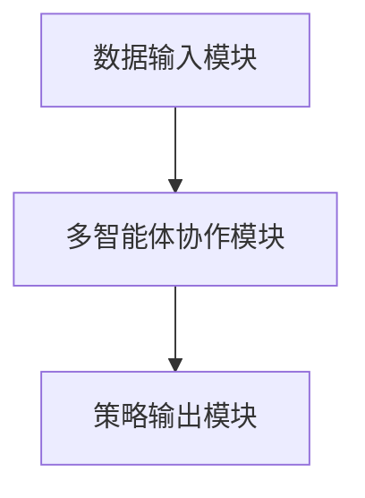

                 


# 多智能体强化学习在优化价值投资的择股策略中的应用

> 关键词：多智能体强化学习、价值投资、择股策略、优化、人工智能

> 摘要：本文探讨了多智能体强化学习在价值投资中的应用，重点分析了如何通过多智能体协作优化选股策略，提高投资收益和风险控制。文章详细讲解了多智能体强化学习的核心原理、系统架构设计以及实际应用案例，为投资者和研究人员提供了理论和实践的参考。

---

# 第1章: 多智能体强化学习与价值投资概述

## 1.1 多智能体强化学习的基本概念
### 1.1.1 多智能体强化学习的定义
多智能体强化学习（Multi-Agent Reinforcement Learning, MARI）是指多个智能体在共享环境中通过协作或竞争来实现目标的强化学习形式。与单智能体强化学习不同，MARI强调智能体之间的交互与协作。

### 1.1.2 多智能体与单智能体的区别
| 属性 | 单智能体 | 多智能体 |
|------|--------|---------|
| 互动性 | 无 | 有 |
| 信息共享 | 无 | 有 |
| 复杂性 | 低 | 高 |

### 1.1.3 价值投资的基本原理
价值投资是一种投资策略，旨在通过分析公司的基本面（如财务状况、行业地位等）来寻找被市场低估的投资标的。其核心思想是“买入低于内在价值的股票”。

---

## 1.2 多智能体强化学习在金融中的潜力
### 1.2.1 金融市场的复杂性
金融市场具有高度不确定性，传统投资策略往往难以应对复杂多变的市场环境。强化学习的自适应性和灵活性为金融投资提供了新的可能性。

### 1.2.2 多智能体在选股中的优势
通过多个智能体的协作，可以更全面地分析市场信息，捕捉潜在的投资机会，降低投资风险。

---

# 第2章: 多智能体强化学习的核心原理

## 2.1 多智能体强化学习的算法框架
### 2.1.1 基于价值函数的方法
$$ V(s) = \max_a Q(s,a) $$
其中，\( s \) 是状态，\( a \) 是动作。

### 2.1.2 基于策略梯度的方法
策略梯度方法通过优化策略直接提升投资收益，避免了值函数的计算。

### 2.1.3 基于Actor-Critic架构的方法
Actor-Critic架构结合了策略梯度和值函数的优势，通过同时优化策略（Actor）和价值函数（Critic）来实现更好的投资决策。

---

## 2.2 多智能体协作机制
### 2.2.1 基于通信的协作机制
智能体之间通过共享信息（如市场数据、投资策略）进行协作。

### 2.2.2 基于共享参数的协作机制
通过共享参数，多个智能体可以协作完成复杂任务，同时减少计算开销。

### 2.2.3 基于价值函数的协作机制
智能体通过共享价值函数，共同优化投资决策。

---

# 第3章: 多智能体强化学习在价值投资中的应用

## 3.1 价值投资的核心指标
### 3.1.1 市盈率（P/E）
$$ P/E = \frac{\text{股价}}{\text{每股收益}} $$
市盈率反映了股票的估值水平。

### 3.1.2 市净率（P/B）
$$ P/B = \frac{\text{股价}}{\text{每股净资产}} $$
市净率用于衡量股票相对于其账面价值的高低。

### 3.1.3 股息率（Dividend Yield）
$$ \text{股息率} = \frac{\text{每股股息}}{\text{股价}} $$
股息率反映了股票的分红能力。

---

## 3.2 多智能体强化学习在选股中的应用
### 3.2.1 多智能体协作的价值评估模型
通过多个智能体的协作，可以综合考虑多个价值指标，构建更精准的价值评估模型。

### 3.2.2 动态调整策略
$$ \text{收益} = \sum_{i=1}^{n} \text{智能体}_i(\text{状态}) $$
多智能体协作可以实现动态调整，适应市场的变化。

---

# 第4章: 多智能体强化学习的系统架构设计

## 4.1 系统功能设计
### 4.1.1 数据输入模块
负责接收市场数据（如股票价格、财务指标等）。

### 4.1.2 多智能体协作模块
实现多个智能体的协作，优化投资策略。

### 4.1.3 策略输出模块
输出最终的投资策略，指导实际操作。

---

## 4.2 系统架构图


---

## 4.3 系统接口设计
### 4.3.1 数据输入接口
接收市场数据，如股票价格、财务指标等。

### 4.3.2 策略输出接口
输出投资策略，如买入、卖出等操作。

---

## 4.4 系统交互流程图
```mermaid
sequenceDiagram
actor 投资者
participant 系统
actor 投资者 -> 系统: 输入数据
系统 -> 系统: 多智能体协作
系统 -> 投资者: 输出策略
```

---

# 第5章: 项目实战——基于多智能体强化学习的选股系统

## 5.1 环境安装
安装必要的库，如TensorFlow、Keras、OpenAI Gym等。

## 5.2 核心代码实现
### 5.2.1 智能体类
```python
class Agent:
    def __init__(self, state_space, action_space):
        self.state_space = state_space
        self.action_space = action_space
        # 初始化策略和价值函数
```

### 5.2.2 多智能体协作函数
```python
def multi_agent_collaboration(agents, state):
    for agent in agents:
        agent.step(state)
```

## 5.3 实际案例分析
通过实际市场数据，验证系统的有效性，优化投资策略。

---

# 第6章: 总结与展望

## 6.1 总结
本文详细探讨了多智能体强化学习在价值投资中的应用，展示了如何通过多智能体协作优化选股策略。

## 6.2 展望
未来，随着人工智能技术的发展，多智能体强化学习在金融领域的应用将更加广泛和深入。

---

通过以上目录，您可以逐步了解多智能体强化学习在优化价值投资择股策略中的应用，从理论到实践，全面掌握相关知识。

