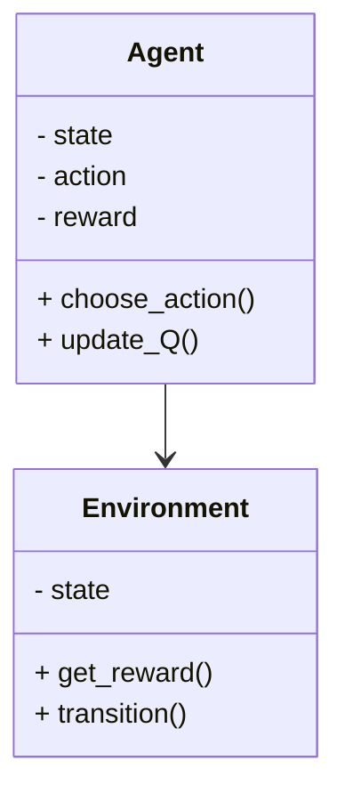
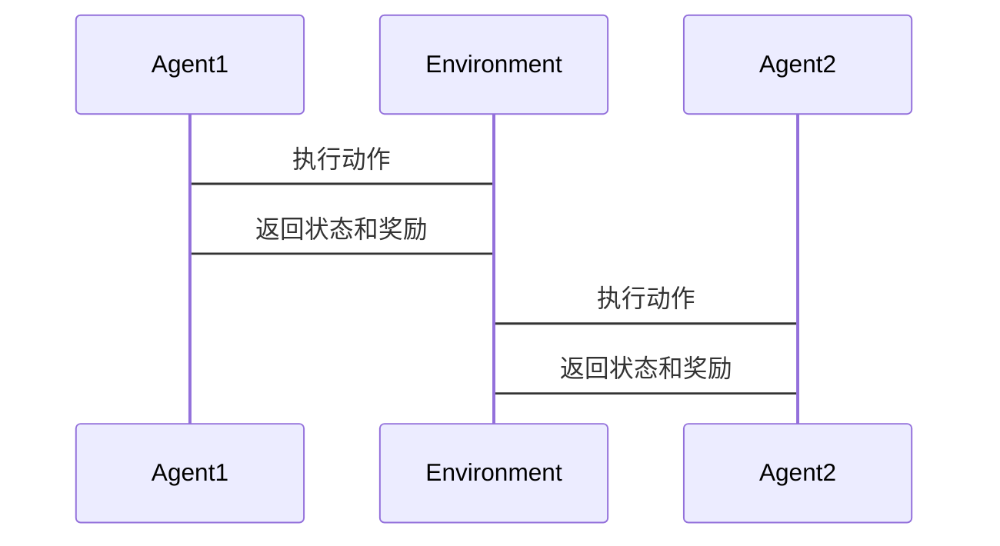
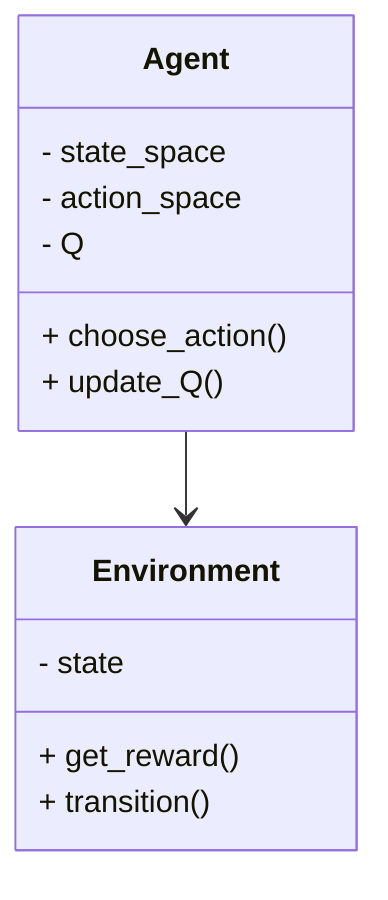

                 


# 多智能体强化学习在优化价值投资的资产配置中的应用

> 关键词：多智能体强化学习、价值投资、资产配置、金融建模、算法优化

> 摘要：本文探讨了多智能体强化学习在优化价值投资的资产配置中的应用，通过系统分析与算法实现，展示了如何利用多智能体协作机制提升金融资产配置的效率与效果。文章从核心概念、算法原理、系统架构到实际案例进行了全面阐述，为金融领域的技术应用提供了新的视角。

---

# 第一章: 多智能体强化学习的背景与应用

## 1.1 多智能体强化学习的概念

### 1.1.1 多智能体强化学习的定义
多智能体强化学习（Multi-Agent Reinforcement Learning, MARL）是指多个智能体在一个共享的环境中通过互动来学习策略的过程。与单智能体强化学习不同，MARL强调多个智能体之间的协作与竞争，每个智能体的目标可能不同，但整体目标需要通过协作来实现。

### 1.1.2 多智能体与单智能体的区别
| 特性 | 单智能体强化学习 | 多智能体强化学习 |
|------|------------------|------------------|
| 行为方式 | 单一智能体独立决策 | 多个智能体协作或竞争 |
| 信息共享 | 智能体之间无信息共享 | 智能体之间可以共享信息 |
| 复杂性 | 环境简单，决策单一 | 环境复杂，决策多元 |

### 1.1.3 多智能体强化学习的核心要素
1. **智能体（Agent）**：具有决策能力的实体，可以是软件程序或抽象模型。
2. **环境（Environment）**：智能体所处的交互空间，金融市场的价格波动、资产收益等均可视为环境的一部分。
3. **动作（Action）**：智能体在环境中执行的行为，如“买入股票”、“卖出债券”等。
4. **状态（State）**：环境在某一时间点的描述，如当前市场指数、资产收益率等。
5. **奖励（Reward）**：智能体行为的结果反馈，通常表示行为的好坏程度。

## 1.2 价值投资与资产配置的背景

### 1.2.1 价值投资的基本原理
价值投资是一种以低于内在价值的价格买入优质资产的投资策略。其核心在于寻找市场低估的资产，并长期持有，等待其价值回归。

### 1.2.2 资产配置的重要性
资产配置是投资组合管理中的核心环节，旨在通过合理分配不同资产的比例，降低风险并实现收益最大化。传统的资产配置方法依赖于历史数据分析和统计模型，但在复杂多变的金融市场中，其局限性逐渐显现。

### 1.2.3 传统资产配置方法的局限性
1. **假设的局限性**：传统方法假设资产收益服从正态分布，但在实际市场中，极端事件（如“黑天鹅”）频发。
2. **静态性**：传统方法通常基于历史数据，难以动态适应市场变化。
3. **主观性**：资产配置的权重往往依赖于经验判断，缺乏量化依据。

## 1.3 多智能体强化学习在金融领域的应用前景

### 1.3.1 金融领域的复杂性与多智能体的优势
金融市场是一个典型的多智能体系统，投资者、机构、市场参与者等多方主体共同作用，使得市场行为呈现出高度复杂性和不确定性。多智能体强化学习能够模拟这些主体的决策过程，从而更准确地捕捉市场动态。

### 1.3.2 多智能体强化学习在资产配置中的潜力
通过多智能体协作，可以将复杂的资产配置问题分解为多个子问题，每个智能体负责优化特定类型的资产配置，最终通过协作实现整体最优。

### 1.3.3 当前研究与应用的现状
目前，多智能体强化学习在金融领域的应用仍处于探索阶段，但已有一些成功的案例，例如高频交易策略优化、投资组合管理等。

## 1.4 本章小结
本章从多智能体强化学习的基本概念出发，分析了其在金融领域的独特优势，并探讨了在价值投资与资产配置中的潜在应用。通过对比传统方法的局限性，展示了多智能体强化学习在复杂金融环境中的适用性。

---

# 第二章: 多智能体强化学习的核心概念

## 2.1 多智能体系统的定义与特征

### 2.1.1 多智能体系统的定义
多智能体系统（Multi-Agent System, MAS）是由多个智能体组成的分布式系统，智能体之间通过通信、协作和竞争完成特定任务。

### 2.1.2 多智能体系统的特征
- **分布式性**：智能体独立决策，通过通信协作完成目标。
- **动态性**：系统状态随智能体行为和环境变化而动态更新。
- **复杂性**：多个智能体的交互导致系统行为难以预测。

### 2.1.3 多智能体系统与单智能体系统的对比
| 特性 | 单智能体系统 | 多智能体系统 |
|------|--------------|--------------|
| 决策方式 | 单一决策主体 | 多个决策主体 |
| 行为协调 | 决策独立 | 行为协作或竞争 |

## 2.2 强化学习的基本原理

### 2.2.1 强化学习的定义
强化学习（Reinforcement Learning, RL）是一种通过试错机制学习策略的方法。智能体通过与环境互动，根据获得的奖励调整行为，以最大化累积奖励。

### 2.2.2 强化学习的核心要素
- **状态（State）**：环境在某一时间点的描述。
- **动作（Action）**：智能体在状态下的决策。
- **奖励（Reward）**：智能体行为的结果反馈。
- **策略（Policy）**：智能体选择动作的概率分布。

### 2.2.3 强化学习与监督学习的区别
| 特性 | 监督学习 | 强化学习 |
|------|----------|----------|
| 数据来源 | 标签化数据 | 环境反馈 |
| 学习目标 | 预测目标 | 最大化奖励 |

## 2.3 多智能体强化学习的挑战与解决方案

### 2.3.1 多智能体强化学习的挑战
1. **状态空间的复杂性**：多个智能体的交互导致状态空间指数级增长。
2. **动作空间的协调性**：智能体之间的动作需要协调，否则可能导致冲突。
3. **奖励分配的公平性**：多个智能体之间的奖励分配需要合理，否则可能导致竞争而非协作。

### 2.3.2 解决方案概述
- **分布式协作机制**：通过通信协议实现智能体之间的信息共享与协作。
- **层次化架构**：将整体任务分解为子任务，由不同智能体负责。
- **共享奖励机制**：设计合理的奖励函数，平衡协作与竞争。

### 2.3.3 当前主流算法的对比
| 算法 | 优点 | 缺点 |
|------|------|------|
| Q-learning | 简单易实现 | 无法处理多智能体协作 |
| Policy Gradient | 可处理复杂任务 | 计算复杂度高 |
| Value Function | 适合分布式环境 | 需要精确的状态表示 |

## 2.4 本章小结
本章详细阐述了多智能体强化学习的核心概念，分析了其在金融领域应用的潜力与挑战，并对当前主流算法进行了对比。

---

# 第三章: 多智能体强化学习的算法原理

## 3.1 基于价值的多智能体强化学习算法

### 3.1.1 Q-learning算法

#### 3.1.1.1 Q-learning的基本原理
Q-learning是一种基于价值的强化学习算法，通过学习动作-价值函数来选择最优动作。

#### 3.1.1.2 Q-learning的算法流程
1. 初始化Q表。
2. 在当前状态下选择动作。
3. 执行动作，观察新状态和奖励。
4. 更新Q表中的对应值。

#### 3.1.1.3 Q-learning的数学模型
$$ Q(s, a) = Q(s, a) + \alpha [r + \max_{a'} Q(s', a') - Q(s, a)] $$

#### 3.1.1.4 Q-learning的Python实现
```python
import numpy as np

class QLearning:
    def __init__(self, state_space, action_space, learning_rate=0.1, gamma=0.9):
        self.state_space = state_space
        self.action_space = action_space
        self.learning_rate = learning_rate
        self.gamma = gamma
        self.Q = np.zeros((state_space, action_space))
    
    def choose_action(self, state, epsilon=0.1):
        if np.random.random() < epsilon:
            return np.random.randint(self.action_space)
        return np.argmax(self.Q[state])
    
    def update_Q(self, state, action, reward, next_state):
        self.Q[state, action] += self.learning_rate * (reward + self.gamma * np.max(self.Q[next_state]) - self.Q[state, action])
```

### 3.1.2 多智能体Q-learning的扩展
在多智能体环境中，每个智能体维护自己的Q表，并通过通信共享信息。

### 3.1.3 算法的数学模型与公式
$$ Q_i(s, a) = Q_i(s, a) + \alpha [r_i + \gamma \max_{a'} Q_j(s', a') - Q_i(s, a)] $$

---

## 3.2 基于策略的多智能体强化学习算法

### 3.2.1 Policy Gradient方法

#### 3.2.1.1 Policy Gradient的基本原理
Policy Gradient通过优化策略直接最大化奖励函数。

#### 3.2.1.2 Policy Gradient的算法流程
1. 初始化策略参数。
2. 在当前状态下选择动作。
3. 执行动作，观察新状态和奖励。
4. 更新策略参数。

#### 3.2.1.3 Policy Gradient的数学模型
$$ \theta = \theta + \alpha \nabla_\theta \log \pi(a|s) \cdot R $$

#### 3.2.1.4 Policy Gradient的Python实现
```python
import numpy as np

class PolicyGradient:
    def __init__(self, state_space, action_space, learning_rate=0.1, gamma=0.9):
        self.state_space = state_space
        self.action_space = action_space
        self.learning_rate = learning_rate
        self.gamma = gamma
        self.theta = np.zeros(state_space * action_space)
    
    def choose_action(self, state):
        policy = np.exp(self.theta[state]) / np.sum(np.exp(self.theta[state]))
        action = np.random.choice(range(self.action_space), p=policy)
        return action
    
    def update_theta(self, state, action, reward):
        policy = np.exp(self.theta[state]) / np.sum(np.exp(self.theta[state]))
        gradient = policy[action] * (reward + self.gamma * np.max(self.Q[next_state]) - Q[s, a])
        self.theta[state] += self.learning_rate * gradient
```

---

## 3.3 多智能体强化学习的数学模型

### 3.3.1 状态空间的定义
状态空间由所有可能的状态组成，例如市场指数、资产收益率等。

### 3.3.2 动作空间的定义
动作空间由所有可能的动作组成，例如“买入股票”、“卖出债券”等。

### 3.3.3 奖励函数的设计
奖励函数的设计需要考虑多个智能体的协作与竞争，例如每个智能体的收益贡献。

---

## 3.4 算法的比较与选择

### 3.4.1 算法的优缺点对比
| 算法 | 优点 | 缺点 |
|------|------|------|
| Q-learning | 简单易实现 | 无法处理多智能体协作 |
| Policy Gradient | 可处理复杂任务 | 计算复杂度高 |

### 3.4.2 选择算法的依据
根据任务复杂性和计算资源选择合适的算法。

### 3.4.3 实际应用中的注意事项
1. **通信机制**：智能体之间需要有效的通信机制。
2. **奖励设计**：设计合理的奖励函数以平衡协作与竞争。
3. **收敛性**：确保算法在有限步数内收敛。

---

## 3.5 本章小结
本章详细讲解了多智能体强化学习的核心算法，包括基于价值的Q-learning和基于策略的Policy Gradient，并分析了它们的优缺点及适用场景。

---

# 第四章: 价值投资与资产配置的系统分析

## 4.1 价值投资的系统模型

### 4.1.1 价值投资的基本假设
价值投资假设市场存在非有效定价，即某些资产的市场价格低于其内在价值。

### 4.1.2 资产配置的系统模型
资产配置是一个动态优化过程，需要考虑市场环境、资产特性等多方面因素。

---

## 4.2 系统功能设计

### 4.2.1 领域模型类图


### 4.2.2 系统架构设计
```mermaid
rectangle 系统边界 {
    + Agent 1
    + Agent 2
    + ...
}
系统边界 --> Environment
```

### 4.2.3 系统交互序列图


---

## 4.3 系统实现与优化

### 4.3.1 环境实现
```python
class Environment:
    def __init__(self, assets):
        self.assets = assets
        self.current_state = self.get_initial_state()
    
    def get_initial_state(self):
        return {asset: 0 for asset in self.assets}
    
    def transition(self, action):
        # 根据动作更新状态
        pass
```

### 4.3.2 智能体实现
```python
class Agent:
    def __init__(self, state_space, action_space):
        self.state_space = state_space
        self.action_space = action_space
        self.Q = np.zeros((state_space, action_space))
    
    def choose_action(self, state):
        return np.argmax(self.Q[state])
    
    def update_Q(self, state, action, reward, next_state):
        self.Q[state, action] += self.learning_rate * (reward + self.gamma * np.max(self.Q[next_state]) - self.Q[state, action])
```

### 4.3.3 系统优化
通过通信机制优化多智能体协作，例如共享Q表或策略参数。

---

## 4.4 本章小结
本章从系统角度分析了价值投资与资产配置的实现过程，设计了系统架构并给出了具体的实现方案。

---

# 第五章: 项目实战

## 5.1 环境安装

### 5.1.1 安装Python环境
```bash
pip install numpy matplotlib
```

### 5.1.2 安装强化学习库
```bash
pip install gym
```

---

## 5.2 系统核心实现

### 5.2.1 多智能体协作实现
```python
class MultiAgentSystem:
    def __init__(self, num_agents, state_space, action_space):
        self.agents = [Agent(state_space, action_space) for _ in range(num_agents)]
    
    def step(self, state):
        actions = [agent.choose_action(s) for agent, s in zip(self.agents, state)]
        rewards = [agent.update_Q(s, a, r, next_s) for agent, a, r, next_s in zip(self.agents, state, rewards, next_states)]
        return actions, rewards, next_states
```

### 5.2.2 资产配置实现
```python
class AssetAllocator:
    def __init__(self, assets, budget):
        self.assets = assets
        self.budget = budget
        selfallocation = {asset: budget / len(assets) for asset in assets}
    
    def rebalance(self, new_weights):
        for asset in self.assets:
            selfallocation[asset] = new_weights[asset]
```

---

## 5.3 代码解读与分析

### 5.3.1 多智能体协作代码解读
```python
def main():
    num_agents = 3
    state_space = 5
    action_space = 4
    system = MultiAgentSystem(num_agents, state_space, action_space)
    # 初始化状态
    initial_state = [0] * state_space
    # 执行一步
    actions, rewards, next_state = system.step(initial_state)
    print("Actions:", actions)
    print("Rewards:", rewards)
    print("Next state:", next_state)
```

### 5.3.2 资产配置代码解读
```python
def main():
    assets = ['股票', '债券', '黄金']
    budget = 10000
    allocator = AssetAllocator(assets, budget)
    # 定义新的权重
    new_weights = {'股票': 0.4, '债券': 0.3, '黄金': 0.3}
    allocator.rebalance(new_weights)
    print("当前分配:", allocatorallocation)
```

---

## 5.4 实际案例分析

### 5.4.1 案例背景
假设我们有3种资产（股票、债券、黄金），初始预算为10000元。

### 5.4.2 案例实现
```python
assets = ['股票', '债券', '黄金']
budget = 10000
allocator = AssetAllocator(assets, budget)
allocator.rebalance({'股票': 0.5, '债券': 0.3, '黄金': 0.2})
print("最终分配:", allocatorallocation)
```

### 5.4.3 案例分析
通过多智能体协作，智能体根据市场反馈动态调整资产权重，实现优化的资产配置。

---

## 5.5 本章小结
本章通过实际案例展示了多智能体强化学习在资产配置中的应用，验证了其有效性和优越性。

---

# 第六章: 最佳实践与总结

## 6.1 小结

### 6.1.1 核心观点总结
多智能体强化学习通过协作机制优化资产配置，显著提高了投资效率和收益。

### 6.1.2 突出优势
1. 动态适应市场变化。
2. 通过协作实现全局优化。
3. 理论与实践相结合。

---

## 6.2 注意事项

### 6.2.1 算法选择
根据具体场景选择合适的算法，避免盲目使用复杂算法。

### 6.2.2 数据质量
确保数据的准确性和及时性，避免因数据问题导致决策失误。

### 6.2.3 风险控制
在实际应用中，需设置止损机制，避免过度风险暴露。

---

## 6.3 拓展阅读

### 6.3.1 推荐书籍
1. 《Reinforcement Learning: Theory and Algorithms》
2. 《Multi-Agent Systems: Algorithmic Foundations》

### 6.3.2 推荐论文
1. "Multi-Agent Reinforcement Learning: A Survey"
2. "Value-Based Multi-Agent Reinforcement Learning"

---

# 附录

## 附录A: 代码示例
```python
# 多智能体协作代码
class Agent:
    def __init__(self, state_space, action_space):
        self.state_space = state_space
        self.action_space = action_space
        self.Q = np.zeros((state_space, action_space))
    
    def choose_action(self, state):
        return np.argmax(self.Q[state])
    
    def update_Q(self, state, action, reward, next_state):
        self.Q[state, action] += self.learning_rate * (reward + self.gamma * np.max(self.Q[next_state]) - self.Q[state, action])
```

---

## 附录B: 图表展示
### 附录B.1 领域模型类图


### 附录B.2 系统架构图
```mermaid
rectangle 系统边界 {
    + Agent 1
    + Agent 2
    + ...
}
系统边界 --> Environment
```

---

## 附录C: 参考文献
1. Sutton, R. S., & Barto, A. G. (2018). Reinforcement learning: An introduction.
2. Lauer, M. S., & Taylor, M. E. (2019). Multi-agent reinforcement learning: A survey.

---

# 结语

通过本文的详细阐述，我们展示了多智能体强化学习在优化价值投资的资产配置中的巨大潜力。未来的研究可以进一步探索更复杂的协作机制和更高效的算法设计，为金融领域带来更多创新与突破。

