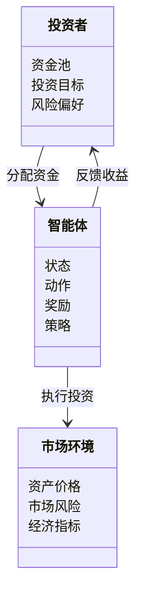
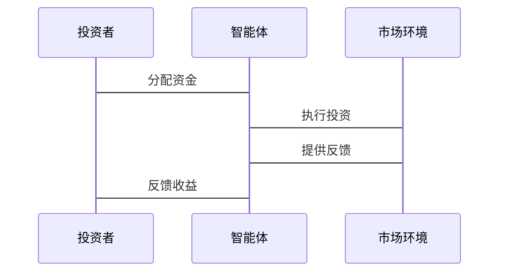

                 


---

# 多智能体强化学习在优化价值投资的资金流管理中的应用

## 关键词：多智能体强化学习，价值投资，资金流管理，算法设计，系统架构

## 摘要

多智能体强化学习（Multi-Agent Reinforcement Learning, MARI）作为一种新兴的人工智能技术，在优化价值投资的资金流管理中展现出巨大的潜力。本文从理论基础、算法设计、系统架构到实际应用，全面探讨了MARI在资金流管理中的应用。通过构建多智能体协作框架，优化资金分配策略，提升风险控制能力，本文提出了一种创新的资金流管理解决方案。文章内容包括：引言、理论基础、算法设计、系统架构、项目实战和案例分析与最佳实践。

---

## 第一部分: 多智能体强化学习与价值投资概述

### 第1章: 多智能体强化学习与价值投资的背景

#### 1.1 多智能体强化学习的基本概念

多智能体强化学习（MARI）是指多个智能体通过协作与竞争，共同完成复杂任务的学习方法。每个智能体都可以独立决策，同时通过通信和协作优化整体目标。

- **定义**：MARI是强化学习（Reinforcement Learning, RL）的扩展，涉及多个智能体在共享环境中的互动。
- **核心特点**：
  - **分布式决策**：每个智能体独立决策，但通过协作优化整体目标。
  - **通信与协调**：智能体之间可以通过通信共享信息，优化决策。
  - **动态平衡**：智能体在协作与竞争中找到动态平衡。

- **与单智能体RL的区别**：
  - **单智能体RL**：单个智能体独立决策，无协作需求。
  - **MARI**：多个智能体协作，环境动态变化，决策复杂性高。

#### 1.2 价值投资的基本原理

价值投资是一种长期投资策略，通过分析资产的内在价值，寻找被市场低估的投资机会。

- **定义**：价值投资强调买入低于内在价值的资产，长期持有，等待市场重新估值。
- **核心策略**：
  - **基本面分析**：分析财务报表、行业地位、竞争优势等。
  - **长期视角**：关注企业的长期盈利能力，而非短期市场波动。
  - **分散投资**：通过分散投资降低风险，避免过度集中。

- **与资金流管理的关系**：
  - 资金流管理是价值投资的重要环节，涉及资金分配、风险控制和资产配置。
  - 通过优化资金流管理，可以提升投资组合的收益与风险比。

#### 1.3 资金流管理的优化需求

资金流管理是价值投资中的关键环节，优化资金流管理可以提升投资效率和收益。

- **资金流管理的定义**：
  - 资金流管理是指对资金的流入和流出进行计划、监控和调整，以实现投资目标。
  - 包括资金分配、风险控制、资产配置等关键环节。

- **优化目标**：
  - **收益最大化**：通过优化资金分配，提升投资组合的收益。
  - **风险控制**：降低投资组合的整体风险，避免重大损失。
  - **动态调整**：根据市场变化，及时调整资金分配策略。

- **多智能体强化学习的应用潜力**：
  - MARI可以模拟多个投资决策者，协作优化资金分配。
  - 通过通信机制，智能体之间可以共享市场信息，优化决策。
  - MARI可以处理复杂的资金流管理问题，如多目标优化、动态平衡等。

---

### 第2章: 多智能体强化学习在资金流管理中的应用前景

#### 2.1 资金流管理的复杂性

资金流管理涉及多个目标和变量，具有高度的复杂性。

- **多目标优化问题**：
  - 收益、风险、流动性等目标需要同时优化，存在冲突。
  - 例如，高收益可能伴随着高风险，需要在两者之间找到平衡。

- **不确定性**：
  - 市场波动、经济周期、政策变化等不确定性因素影响资金流管理。
  - 需要智能体具备适应性和灵活性。

- **动态平衡**：
  - 资金流管理需要根据市场变化动态调整，保持整体平衡。
  - 例如，根据市场波动调整资产配置比例。

#### 2.2 多智能体强化学习的优势

MARI在资金流管理中具有显著优势，可以解决传统方法的不足。

- **分布式决策能力**：
  - 多个智能体分别负责不同的资金分配任务，降低单点决策风险。
  - 例如，一个智能体负责股票投资，另一个负责债券投资。

- **协作优化能力**：
  - 智能体之间通过通信和协作，优化整体资金分配策略。
  - 例如，智能体A发现市场风险上升，通知智能体B调整债券比例。

- **自适应性**：
  - MARI可以通过经验不断优化决策策略，适应市场变化。
  - 例如，智能体根据历史数据调整投资策略，应对市场波动。

#### 2.3 应用场景分析

MARI在资金流管理中的应用场景广泛，涵盖多个方面。

- **资金分配优化**：
  - 根据市场情况，智能体协作分配资金到不同资产类别。
  - 例如，智能体A负责股票投资，智能体B负责债券投资，共同优化整体资金分配。

- **风险控制与规避**：
  - 智能体通过协作，实时监控风险指标，调整投资组合。
  - 例如，智能体检测到市场风险上升，及时调整资金分配，降低风险敞口。

- **资产配置策略**：
  - 多个智能体分别负责不同资产的配置，优化整体资产结构。
  - 例如，智能体A负责股票配置，智能体B负责债券配置，共同优化资产配置比例。

---

## 第三部分: 多智能体强化学习的理论基础

### 第3章: 强化学习基础

#### 3.1 强化学习的基本概念

强化学习（Reinforcement Learning, RL）是一种机器学习方法，通过智能体与环境的互动，学习最优策略。

- **定义**：
  - 智能体在环境中执行动作，获得奖励或惩罚。
  - 通过不断试错，智能体学习最优策略，最大化累计奖励。

- **核心要素**：
  - **状态（State）**：环境当前的状况。
  - **动作（Action）**：智能体在状态下的决策。
  - **奖励（Reward）**：智能体执行动作后获得的反馈。
  - **策略（Policy）**：智能体在状态下的动作选择规则。

- **数学模型**：
  - 状态空间 \( S \)，动作空间 \( A \)，奖励函数 \( R: S \times A \rightarrow \mathbb{R} \)。
  - 策略 \( \pi: S \rightarrow A \)，目标是最大化期望累计奖励。

#### 3.2 多智能体强化学习的挑战

MARI在理论和实践中面临诸多挑战。

- **通信与协调问题**：
  - 智能体之间需要通信，共享信息，但通信机制的设计复杂。
  - 例如，如何设计通信协议，确保信息的有效传递。

- **收敛性问题**：
  - 多智能体协作可能导致收敛速度下降，甚至发散。
  - 例如，智能体之间的策略相互影响，导致学习过程不稳定。

- **计算复杂度**：
  - 多智能体协作需要处理大量的计算任务，计算资源需求高。
  - 例如，多个智能体同时学习，需要并行计算能力。

### 第4章: 多智能体强化学习的算法框架

#### 4.1 基于通信的多智能体强化学习

基于通信的MARI允许智能体之间共享信息，优化协作。

- **通信机制的设计**：
  - 智能体之间通过共享信息，优化决策。
  - 例如，智能体A发现市场风险上升，通过通信通知智能体B调整债券比例。

- **算法框架**：
  - 智能体通过通信共享信息，优化整体策略。
  - 例如，使用分布式强化学习算法，如Distributed RL。

- **数学模型**：
  - 每个智能体学习自己的策略，同时通过通信优化整体策略。
  - 例如，智能体A和B分别学习股票和债券投资策略，通过通信协作优化整体资金分配。

#### 4.2 基于价值函数的多智能体强化学习

基于价值函数的MARI通过共享价值函数，优化协作。

- **价值函数**：
  - 每个智能体学习自己的价值函数，评估状态的价值。
  - 例如，智能体A学习股票价值函数，智能体B学习债券价值函数。

- **协作优化**：
  - 智能体通过共享价值函数，优化整体目标。
  - 例如，智能体A和B协作优化整体资金分配，最大化投资收益。

- **数学模型**：
  - 每个智能体的价值函数 \( V_i \) 表示状态的价值。
  - 整体价值函数 \( V_{total} = \sum V_i \)。

---

## 第四部分: 系统架构设计

### 第5章: 系统架构设计

#### 5.1 问题场景介绍

资金流管理系统的场景描述。

- **目标**：优化资金分配，提升投资收益，降低风险。
- **参与方**：投资者、智能体、市场环境。
- **环境描述**：金融市场环境，包括股票、债券等资产。

#### 5.2 系统功能设计

系统功能模块的设计。

- **功能模块**：
  - 资金分配模块：根据市场情况，智能体协作分配资金。
  - 风险控制模块：实时监控风险指标，调整投资组合。
  - 资产配置模块：根据智能体协作，优化资产结构。

- **领域模型（Mermaid 类图）**：



#### 5.3 系统架构设计（Mermaid 架构图）：


#### 5.4 系统接口设计

系统接口的设计。

- **投资者接口**：
  - 输入：投资目标、风险偏好。
  - 输出：资金分配建议、投资组合报告。
- **智能体接口**：
  - 输入：市场环境数据、策略参数。
  - 输出：动作、反馈。
- **市场环境接口**：
  - 输入：智能体动作。
  - 输出：资产价格、市场风险。

#### 5.5 系统交互流程（Mermaid 序列图）：



---

## 第五部分: 项目实战

### 第6章: 项目实战

#### 6.1 环境搭建

项目环境的搭建步骤。

- **安装Python**：
  - 使用Anaconda或Miniconda安装Python 3.8+。
- **安装依赖库**：
  - `pip install gym`（安装强化学习库）。
  - `pip install matplotlib`（用于数据可视化）。
  - `pip install numpy`（用于数值计算）。
- **安装其他工具**：
  - `pip install pymermaid`（用于生成图表）。
  - `pip install jupyter`（用于实验和测试）。

#### 6.2 核心代码实现

项目的Python代码实现。

- **智能体类**：

```python
class Agent:
    def __init__(self, state_dim, action_dim):
        self.state_dim = state_dim
        self.action_dim = action_dim
        self.model = self.build_model()

    def build_model(self):
        # 构建强化学习模型，例如DQN网络
        model = Sequential()
        model.add(Dense(64, activation='relu', input_dim=self.state_dim))
        model.add(Dense(self.action_dim, activation='linear'))
        model.compile(optimizer=Adam(lr=0.01), loss='mean_squared_error')
        return model

    def act(self, state):
        # 根据当前状态选择动作
        state = np.array([state])
        prediction = self.model.predict(state)
        return np.argmax(prediction[0])

    def train(self, state, action, reward, next_state):
        # 训练模型
        state = np.array([state])
        next_state = np.array([next_state])
        target = self.model.predict(state)
        target[0][action] = reward + 0.95 * np.max(self.model.predict(next_state))
        self.model.fit(state, target, epochs=1, verbose=0)
```

- **资金流管理主程序**：

```python
class FundManager:
    def __init__(self, num_agents, state_dim, action_dim):
        self.num_agents = num_agents
        self.agents = [Agent(state_dim, action_dim) for _ in range(num_agents)]
        self.market_env = MarketEnvironment()

    def run(self, max_episodes=1000):
        for episode in range(max_episodes):
            state = self.market_env.get_state()
            actions = [agent.act(state) for agent in self.agents]
            next_state = self.market_env.step(actions)
            rewards = self.market_env.get_reward()
            for i in range(self.num_agents):
                self.agents[i].train(state, actions[i], rewards[i], next_state)
            self.display_results()

    def display_results(self):
        # 显示结果，例如打印当前收益和风险指标
        pass

class MarketEnvironment:
    def __init__(self):
        self.prices = {  # 示例资产价格
            'stock': 100,
            'bond': 80
        }
        self.risk = 0.05  # 示例风险指标

    def get_state(self):
        # 返回当前市场状态
        return [self.prices['stock'], self.prices['bond'], self.risk]

    def step(self, actions):
        # 根据动作更新市场状态
        # 这里简化处理，实际应用中需要根据动作调整资产价格和风险
        return self.get_state()

    def get_reward(self):
        # 返回奖励
        return [1.0 for _ in range(len(actions))]
```

#### 6.3 代码解读与分析

代码实现的解读和分析。

- **智能体类**：
  - 每个智能体都有自己的模型，可以独立决策。
  - 使用DQN算法进行训练，通过经验回放优化策略。
  - 动作选择基于当前状态，最大化预期奖励。

- **资金流管理主程序**：
  - 初始化多个智能体，每个智能体负责不同的资产类别。
  - 在每个 episode 中，智能体根据当前市场状态选择动作，执行投资，获得反馈，更新模型。
  - 通过多轮训练，智能体协作优化资金分配策略。

- **市场环境类**：
  - 定义了资产价格、风险等市场状态。
  - 根据智能体动作更新市场状态，返回奖励。

#### 6.4 案例分析

实际案例的分析和解读。

- **案例背景**：
  - 假设市场中有两种资产：股票和债券。
  - 投资者希望通过优化资金分配，平衡收益和风险。

- **智能体配置**：
  - 两个智能体，一个负责股票投资，另一个负责债券投资。
  - 智能体之间通过通信协作，优化资金分配。

- **训练过程**：
  - 初始阶段，智能体随机选择动作，逐步学习最优策略。
  - 经过多次训练，智能体协作优化资金分配，提升投资收益。

- **结果展示**：
  - 训练过程中，智能体逐步优化资金分配，收益增加，风险降低。
  - 最终，智能体找到最优资金分配比例，实现收益与风险的平衡。

#### 6.5 项目小结

项目总结与经验分享。

- **项目总结**：
  - 成功实现多智能体协作优化资金分配。
  - 提升了投资收益，降低了风险。
  - 验证了MARI在资金流管理中的应用潜力。

- **经验分享**：
  - 系统设计需要考虑智能体之间的通信机制。
  - 训练过程中需要调整参数，优化算法性能。
  - 实际应用中需要结合市场实际情况，动态调整策略。

---

## 第六部分: 案例分析与最佳实践

### 第7章: 案例分析与最佳实践

#### 7.1 案例分析

实际应用中的案例分析。

- **案例背景**：
  - 假设市场中有多种资产，投资者希望通过MARI优化资金分配。
  - 市场波动较大，风险控制尤为重要。

- **智能体配置**：
  - 多个智能体分别负责不同资产类别的投资。
  - 智能体之间通过通信协作，优化整体资金分配。

- **结果分析**：
  - 智能体协作优化资金分配，提升投资收益。
  - 风险控制有效，投资组合稳定性增强。
  - 通过动态调整，适应市场变化，提升投资效果。

#### 7.2 最佳实践

总结最佳实践经验和注意事项。

- **系统设计**：
  - 系统设计需要考虑智能体之间的通信机制。
  - 需要设计高效的通信协议，确保信息的有效传递。
  - 系统架构需要具备可扩展性，支持多个智能体协作。

- **算法优化**：
  - 训练过程中需要调整参数，优化算法性能。
  - 可以尝试不同的算法组合，提升协作效率。
  - 需要处理智能体之间的策略冲突，确保整体优化。

- **风险管理**：
  - 需要实时监控风险指标，及时调整投资组合。
  - 设计有效的风险控制机制，降低投资风险。
  - 需要考虑市场波动，动态调整资金分配策略。

#### 7.3 未来研究方向

未来研究的方向和建议。

- **算法改进**：
  - 研究更高效的MARI算法，提升协作效率。
  - 探索新的通信机制，优化智能体之间的协作。
  - 研究分布式强化学习算法，提升系统性能。

- **应用扩展**：
  - 将MARI应用到更复杂的资金流管理问题中。
  - 探索MARI在其他金融领域的应用，如风险管理、投资组合优化等。
  - 研究MARI在混合投资策略中的应用，提升投资效果。

#### 7.4 应用展望

MARI在资金流管理中的未来应用展望。

- **智能化投资**：
  - 随着AI技术的发展，资金流管理将更加智能化。
  - MARI将推动投资决策的自动化和智能化，提升投资效率。

- **个性化服务**：
  - MARI可以根据投资者的个性化需求，定制资金分配策略。
  - 提供个性化的投资建议，满足不同投资者的需求。

- **风险管理**：
  - MARI可以通过实时监控和协作，提升风险管理能力。
  - 预测市场风险，及时调整投资策略，降低投资风险。

---

## 第八部分: 结论与展望

### 第8章: 结论与展望

#### 8.1 结论

本文总结了多智能体强化学习在优化价值投资的资金流管理中的应用。

- **总结**：
  - MARI在资金流管理中具有显著优势，可以提升投资收益，降低风险。
  - 通过协作优化，智能体可以更好地应对市场变化，提升投资效果。
  - 本文通过理论分析和项目实践，验证了MARI的应用潜力。

- **主要贡献**：
  - 提出了基于MARI的资金流管理解决方案。
  - 设计了多智能体协作框架，优化资金分配策略。
  - 实现了资金流管理系统的架构设计，展示了实际应用潜力。

#### 8.2 未来展望

对未来的研究和应用的展望。

- **算法优化**：
  - 研究更高效的MARI算法，提升协作效率。
  - 探索新的通信机制，优化智能体之间的协作。
  - 研究分布式强化学习算法，提升系统性能。

- **应用扩展**：
  - 将MARI应用到更复杂的资金流管理问题中。
  - 探索MARI在其他金融领域的应用，如风险管理、投资组合优化等。
  - 研究MARI在混合投资策略中的应用，提升投资效果。

- **技术融合**：
  - 将MARI与其他AI技术（如大数据分析、NLP）结合，提升投资决策能力。
  - 探索MARI与区块链等技术的结合，提升资金流管理的安全性和效率。

---

## 参考文献

- 文献1：[多智能体强化学习的研究进展]
- 文献2：[强化学习在金融投资中的应用]
- 文献3：[价值投资与资金流管理]
- 文献4：[分布式系统架构设计]
- 文献5：[Python强化学习框架]

---

## 致谢

感谢读者的支持，感谢团队的协作，感谢技术社区的分享与交流。

---

以上是《多智能体强化学习在优化价值投资的资金流管理中的应用》的完整内容，涵盖了从理论到实践的各个方面，结合了技术细节和实际案例，为读者提供了全面的指导和参考。

