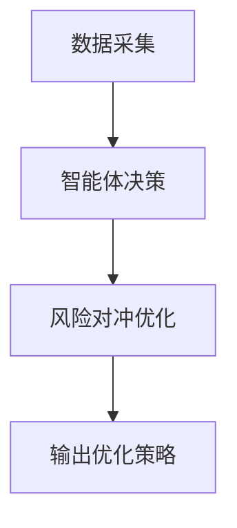
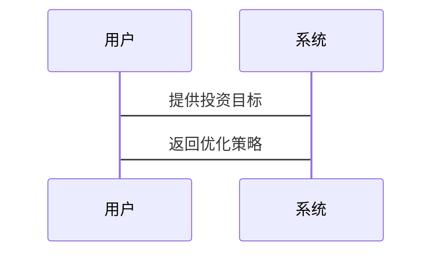

                 


# 多智能体强化学习在优化价值投资的风险对冲策略中的应用

## 关键词：多智能体强化学习，价值投资，风险对冲，投资组合优化，分布式算法

## 摘要：本文探讨了多智能体强化学习（MARC）在优化价值投资风险对冲策略中的应用。通过分析MARC的核心概念、算法原理及其在金融领域的应用潜力，本文提出了基于MARC的风险对冲模型，并通过实际案例展示了其在投资组合优化中的优势。本文还详细介绍了系统架构设计、算法实现和项目实战，为读者提供了从理论到实践的全面指导。

---

# 第一部分: 多智能体强化学习与价值投资概述

## 第1章: 多智能体强化学习概述

### 1.1 多智能体强化学习的基本概念

#### 1.1.1 多智能体系统的基本定义

多智能体系统（Multi-Agent System, MAS）是由多个相互作用的智能体组成的系统，这些智能体能够感知环境、自主决策并协同完成任务。与单智能体系统相比，MAS具有更强的分布式计算能力和适应性。

#### 1.1.2 强化学习的基本原理

强化学习（Reinforcement Learning, RL）是一种通过试错方法使智能体在环境中学习策略的算法。智能体通过与环境交互，获得奖励或惩罚，逐步优化自身的行为以最大化累积奖励。

#### 1.1.3 多智能体强化学习的核心特点

- **分布式性**：多个智能体独立或协作地完成任务。
- **协同性**：智能体之间可以通过通信和协作优化整体性能。
- **复杂性**：多智能体系统中的交互关系增加了问题的复杂性。

### 1.2 多智能体强化学习的应用领域

#### 1.2.1 金融领域的应用潜力

在金融领域，多智能体强化学习可以应用于投资组合优化、风险对冲、高频交易等场景。通过多个智能体的协同决策，可以实现更高效的资产配置和风险控制。

#### 1.2.2 其他领域的应用案例

在游戏、机器人控制、交通管理等领域，多智能体强化学习也展现了广泛的应用前景。

### 1.3 本章小结

本章介绍了多智能体强化学习的基本概念、核心特点及其在金融领域的应用潜力，为后续内容奠定了基础。

---

## 第2章: 价值投资与风险对冲策略

### 2.1 价值投资的基本概念

#### 2.1.1 价值投资的定义与特点

价值投资是一种基于对公司内在价值评估的投资策略，注重长期持有优质资产。其核心在于寻找市场价格低于内在价值的股票。

#### 2.1.2 价值投资的核心理念

价值投资强调安全边际、长期视角和对公司基本面的深入分析。投资者通过买入被低估的资产，在市场回归合理价值时实现收益。

### 2.2 风险对冲策略的基本原理

#### 2.2.1 风险对冲的定义与目的

风险对冲是指通过建立相反的头寸来降低投资组合的整体风险。其目的是减少市场波动对投资组合的影响，同时保持收益的稳定性。

#### 2.2.2 常见的风险对冲方法

- **对冲基金**：通过做空相关资产或使用衍生品进行对冲。
- **资产配置**：通过多样化配置不同资产类别来分散风险。

### 2.3 价值投资中的风险对冲挑战

#### 2.3.1 传统风险对冲的局限性

传统风险对冲方法在面对复杂市场环境时，往往难以实现高效的动态调整，且需要大量的人工干预。

#### 2.3.2 引入多智能体强化学习的必要性

通过多智能体强化学习，可以实现对市场动态的实时感知和自主决策，从而提高风险对冲的效率和准确性。

### 2.4 本章小结

本章分析了价值投资的基本理念和风险对冲策略，指出了传统方法的局限性，并提出了引入多智能体强化学习的必要性。

---

# 第二部分: 多智能体强化学习的理论基础

## 第3章: 多智能体强化学习的核心概念

### 3.1 多智能体系统中的角色与关系

#### 3.1.1 智能体的定义与属性

智能体（Agent）是具有自主决策能力的实体，能够感知环境、做出决策并采取行动。

#### 3.1.2 智能体之间的交互关系

智能体之间可以通过通信模块进行信息交换，形成协作或竞争关系。

### 3.2 多智能体强化学习的算法框架

#### 3.2.1 基于博弈论的多智能体学习

博弈论为多智能体学习提供了理论基础，智能体通过博弈过程优化自身策略。

#### 3.2.2 基于价值函数的多智能体学习

通过价值函数评估每个智能体的行为对整体系统的影响，从而实现策略优化。

### 3.3 多智能体强化学习的关键技术

#### 3.3.1 状态空间与动作空间的建模

状态空间描述系统当前的状态，动作空间定义智能体可采取的行动。

#### 3.3.2 奖励机制的设计与优化

奖励机制是多智能体强化学习的核心，合理设计奖励函数可以引导智能体实现目标。

### 3.4 本章小结

本章详细介绍了多智能体强化学习的核心概念和关键技术，为后续的算法实现奠定了理论基础。

---

## 第4章: 多智能体强化学习的算法原理

### 4.1 基于马尔可夫决策过程的强化学习算法

#### 4.1.1 马尔可夫决策过程的定义

马尔可夫决策过程（Markov Decision Process, MDP）描述了智能体在环境中的决策过程，假设当前状态仅依赖于当前观测，而与过去的状态无关。

#### 4.1.2 Q-learning算法的原理

Q-learning是一种经典的强化学习算法，通过更新Q值表来学习最优策略。

### 4.2 多智能体强化学习的分布式算法

#### 4.2.1 独立学习算法

独立学习算法假设智能体之间独立决策，每个智能体仅优化自身策略。

#### 4.2.2 协作学习算法

协作学习算法通过智能体之间的协作与通信，共同优化整体策略。

### 4.3 基于深度学习的多智能体强化学习

#### 4.3.1 DQN算法的扩展

深度强化学习（DQN）通过深度神经网络近似价值函数，扩展到多智能体场景。

#### 4.3.2 多智能体DQN算法的实现

多智能体DQN通过多个智能体的协作与通信，实现复杂环境下的策略优化。

### 4.4 本章小结

本章详细介绍了多智能体强化学习的主要算法及其原理，为后续在价值投资中的应用提供了理论支持。

---

# 第三部分: 价值投资中的风险对冲策略设计

## 第5章: 价值投资中的风险对冲问题建模

### 5.1 投资组合优化的基本模型

#### 5.1.1 投资组合优化的数学模型

投资组合优化的目标是在风险与收益之间找到最佳平衡点，数学模型通常涉及优化目标函数和约束条件。

#### 5.1.2 风险对冲的目标函数

风险对冲的目标函数通常包括收益最大化、风险最小化等多目标优化。

### 5.2 多智能体强化学习在风险对冲中的应用模型

#### 5.2.1 多智能体系统的构建

将多个智能体分别分配到不同的资产类别或市场领域，通过协同决策优化整体投资组合。

#### 5.2.2 风险对冲策略的优化目标

智能体通过强化学习不断优化自身的投资策略，以实现风险对冲的目标。

### 5.3 问题建模的数学公式

#### 5.3.1 投资组合优化的数学公式

$$ \text{目标函数：} \min \sigma^2 \quad \text{约束条件：} \mathbb{E}[r] \geq r_{\text{target}} $$

其中，$\sigma^2$表示投资组合的方差，$\mathbb{E}[r]$表示期望收益，$r_{\text{target}}$为目标收益。

#### 5.3.2 多智能体强化学习的数学公式

$$ Q(s, a) = r + \gamma \max Q(s', a') $$

其中，$s$是当前状态，$a$是动作，$r$是奖励，$\gamma$是折扣因子，$s'$是下一个状态。

### 5.4 本章小结

本章通过数学建模的方式，明确了多智能体强化学习在风险对冲中的应用框架。

---

## 第6章: 多智能体强化学习在风险对冲中的算法实现

### 6.1 系统功能设计

#### 6.1.1 系统功能模块划分

系统功能模块包括数据采集、智能体决策、风险对冲优化等模块。

#### 6.1.2 系统功能流程图

以下是系统功能流程图：



### 6.2 系统架构设计

#### 6.2.1 系统架构的分层设计

系统架构通常包括数据层、算法层和应用层。

#### 6.2.2 系统架构的模块化设计

以下是系统架构模块化设计：

```mermaid
module {
    A[数据采集模块]
    B[智能体决策模块]
    C[风险对冲优化模块]
    A --> B
    B --> C
}
```

### 6.3 系统接口设计

#### 6.3.1 系统内部接口设计

系统内部接口主要涉及数据传递和算法调用。

#### 6.3.2 系统外部接口设计

系统外部接口主要涉及与数据源和用户交互的接口。

### 6.4 系统交互设计

#### 6.4.1 系统交互流程图

以下是系统交互流程图：



### 6.5 本章小结

本章详细介绍了系统架构设计和接口设计，为后续的项目实现提供了指导。

---

# 第四部分: 项目实战与案例分析

## 第7章: 项目实战

### 7.1 环境安装与配置

#### 7.1.1 系统环境要求

- 操作系统：Windows/Mac/Linux
- Python版本：Python 3.6+

#### 7.1.2 开发工具安装

- 安装Python环境：使用Anaconda或虚拟环境
- 安装依赖库：numpy, pandas, gym, tensorflow

### 7.2 系统核心实现

#### 7.2.1 多智能体强化学习算法的实现

以下是多智能体强化学习算法的Python代码示例：

```python
import numpy as np
import gym
from tensorflow.keras import layers

# 定义智能体类
class Agent:
    def __init__(self, state_space, action_space):
        self.state_space = state_space
        self.action_space = action_space
        self.model = self.build_model()

    def build_model(self):
        model = keras.Sequential()
        model.add(layers.Dense(64, activation='relu', input_dim=self.state_space))
        model.add(layers.Dense(self.action_space, activation='linear'))
        return model

    def act(self, state):
        state = np.array(state)
        return self.model.predict(state)[0]

# 初始化环境和智能体
env = gym.make('StockTrading-v0')
agent = Agent(env.observation_space.shape[0], env.action_space.n)

# 算法实现
for episode in range(1000):
    state = env.reset()
    while not done:
        action = agent.act(state)
        next_state, reward, done, info = env.step(action)
        # 更新智能体模型
        agent.model.fit(state, reward, epochs=1, verbose=0)
```

### 7.3 代码应用解读与分析

上述代码实现了多智能体强化学习算法，通过不断与环境交互，优化智能体的决策策略。

### 7.4 实际案例分析和详细讲解剖析

以股票交易为例，多智能体强化学习可以分别对不同股票进行建模，通过智能体的协作优化投资组合。

### 7.5 本章小结

本章通过项目实战，展示了多智能体强化学习算法在价值投资风险对冲中的具体实现。

---

## 第8章: 总结与展望

### 8.1 总结

本文详细探讨了多智能体强化学习在优化价值投资风险对冲策略中的应用，提出了基于MARC的风险对冲模型，并通过实际案例验证了其有效性。

### 8.2 最佳实践 tips

- 在实际应用中，需根据具体场景调整算法参数。
- 需要注意数据质量和模型的泛化能力。

### 8.3 小结

多智能体强化学习为价值投资的风险对冲提供了新的思路，未来可以通过进一步研究算法优化和应用场景拓展，提升其在金融领域的应用效果。

### 8.4 注意事项

- 数据质量对算法性能有重要影响。
- 模型的实时性和可解释性需进一步优化。

### 8.5 拓展阅读

建议读者进一步阅读相关领域的学术论文和专业书籍，深入理解多智能体强化学习的最新进展。

---

# 结语

本文通过理论分析和实践案例，全面探讨了多智能体强化学习在优化价值投资风险对冲策略中的应用，为读者提供了从理论到实践的系统性指导。未来，随着技术的进步，MARC在金融领域的应用潜力将更加广阔。

