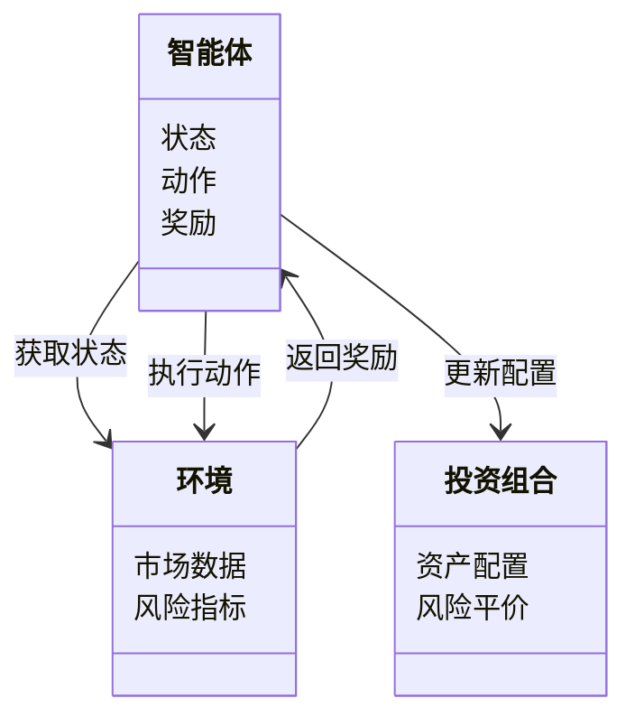
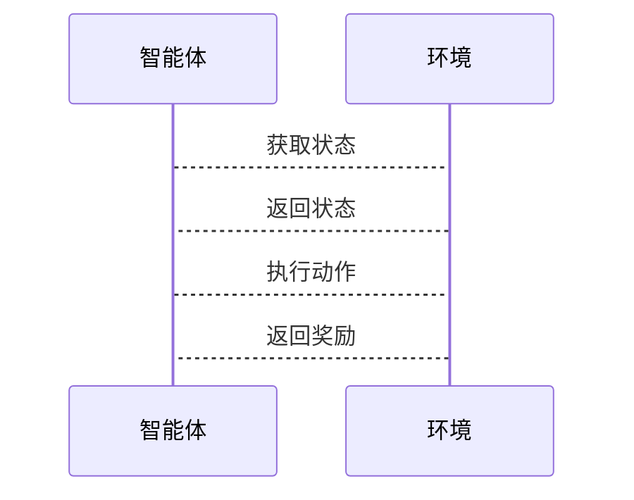

                 


# 多智能体强化学习在优化价值投资的风险平价策略中的应用

> 关键词：多智能体强化学习，价值投资，风险平价策略，优化算法，金融投资，人工智能

> 摘要：本文探讨了多智能体强化学习（MARS）在优化价值投资中的风险平价策略的应用。通过分析MARS的基本原理、算法实现和系统架构，结合实际案例，展示了如何利用MARS提升投资组合的优化效果，降低风险，提高收益。

---

# 第一部分: 多智能体强化学习与价值投资的背景介绍

## 第1章: 多智能体强化学习与价值投资概述

### 1.1 多智能体强化学习的基本概念

#### 1.1.1 多智能体强化学习的定义
多智能体强化学习（Multi-Agent Reinforcement Learning, MARS）是一种人工智能技术，涉及多个智能体在复杂环境中协作或竞争以实现目标。与单智能体强化学习不同，MARS允许多个智能体通过共享信息或独立决策来优化整体表现。

#### 1.1.2 多智能体强化学习的核心特点
- **多智能体协作**：智能体之间可以共享信息或策略，共同完成复杂任务。
- **分布式决策**：每个智能体独立决策，但整体目标一致。
- **动态环境**：环境不断变化，智能体需要实时调整策略。

#### 1.1.3 多智能体强化学习与传统强化学习的区别
| 特性               | 单智能体强化学习             | 多智能体强化学习             |
|--------------------|------------------------------|------------------------------|
| 决策主体           | 单一智能体                 | 多个智能体                 |
| 信息共享           | 无或有限                   | 有                           |
| 竞争与协作         | 无                         | 有                           |
| 应用场景           | 简单任务                   | 复杂任务                   |

### 1.2 价值投资与风险平价策略

#### 1.2.1 价值投资的基本概念
价值投资是一种投资策略，通过分析公司的基本面，寻找市场价格低于内在价值的股票。其核心在于识别被市场低估的投资标的。

#### 1.2.2 风险平价策略的定义与作用
风险平价策略是一种投资组合优化方法，旨在将投资组合的风险在不同资产类别之间平均分配，以降低整体风险。

#### 1.2.3 价值投资中的风险平价策略优化
通过优化投资组合，平衡不同资产的风险贡献，提升整体收益稳定性。

### 1.3 问题背景与研究意义

#### 1.3.1 传统价值投资策略的局限性
- 市场波动大，难以准确评估内在价值。
- 人工决策主观性强，存在偏差。

#### 1.3.2 强化学习在金融投资中的应用潜力
强化学习（Reinforcement Learning, RL）在金融投资中的应用日益广泛，其优势在于动态适应市场变化。

#### 1.3.3 多智能体强化学习在风险平价策略中的优势
- 多智能体协作优化投资组合。
- 分布式决策提升适应性。

## 1.4 本章小结
本章介绍了多智能体强化学习的基本概念和价值投资中的风险平价策略，分析了其应用背景和意义，为后续章节奠定基础。

---

# 第二部分: 多智能体强化学习的核心概念与联系

## 第2章: 多智能体强化学习的核心原理

### 2.1 多智能体强化学习的原理

#### 2.1.1 多智能体系统的基本构成
- **智能体**：独立决策的主体。
- **环境**：智能体所处的外部世界。
- **状态**：环境的当前情况。
- **动作**：智能体的决策行为。
- **奖励**：对智能体决策的反馈。

#### 2.1.2 多智能体强化学习的核心特点
- **协作与竞争**：智能体之间可能协作或竞争。
- **信息共享**：智能体可以共享信息或策略。

### 2.2 多智能体强化学习的核心要素

#### 2.2.1 智能体的定义与角色
- **智能体角色**：投资者，每个智能体代表一个投资决策者。
- **智能体目标**：优化投资组合，实现收益最大化。

#### 2.2.2 状态、动作与奖励的定义
- **状态**：市场数据、资产价格、风险指标。
- **动作**：买入、卖出、持有。
- **奖励**：投资收益。

### 2.3 多智能体强化学习与价值投资的联系

#### 2.3.1 多智能体在投资组合优化中的应用
- **投资组合优化**：通过多智能体协作，优化资产配置。
- **风险控制**：降低投资组合的整体风险。

#### 2.3.2 风险平价策略的数学模型
风险平价策略的目标是将投资组合的总风险分配到各个资产，每个资产的风险贡献相等。

#### 2.3.3 多智能体强化学习在风险平价中的优势
- **动态调整**：实时优化投资组合。
- **分散风险**：通过协作降低整体风险。

## 2.4 本章小结
本章深入探讨了多智能体强化学习的核心原理，分析了其在价值投资中的应用潜力，为后续算法实现奠定基础。

---

# 第三部分: 多智能体强化学习的算法原理

## 第3章: 多智能体强化学习的算法原理

### 3.1 多智能体强化学习的算法框架

#### 3.1.1 集中式与分布式算法的区别
- **集中式算法**：所有智能体共享同一策略。
- **分布式算法**：每个智能体独立决策。

#### 3.1.2 基于价值的方法与基于策略的方法
- **基于价值**：评估每个状态的价值。
- **基于策略**：直接输出决策。

#### 3.1.3 多智能体强化学习的挑战与解决方案
- **同步与异步更新**：通过异步更新减少计算开销。
- **通信与协调**：通过共享信息提升协作效率。

### 3.2 多智能体强化学习的数学模型

#### 3.2.1 状态空间的定义与表示
- **状态空间**：所有可能的市场状态。
- **状态表示**：使用向量表示当前市场情况。

#### 3.2.2 动作空间的定义与表示
- **动作空间**：可能的投资动作。
- **动作表示**：用离散或连续的数值表示。

#### 3.2.3 奖励函数的设计与优化
- **奖励函数**：衡量投资决策的收益。
- **优化目标**：最大化累积奖励。

### 3.3 多智能体强化学习的算法实现

#### 3.3.1 基于Python的多智能体强化学习框架
- **TensorFlow**：深度学习框架。
- **Keras**：用于构建神经网络。

#### 3.3.2 算法实现的步骤与流程
1. **环境定义**：定义金融市场的环境。
2. **智能体设计**：设计多个智能体，每个负责一部分投资决策。
3. **策略网络构建**：构建神经网络模型。
4. **训练过程**：通过强化学习算法训练模型。
5. **策略优化**：根据奖励调整策略。

#### 3.3.3 算法的收敛性分析与优化
- **收敛性**：分析算法是否收敛。
- **优化技巧**：调整学习率、网络结构等。

### 3.4 本章小结
本章详细讲解了多智能体强化学习的算法原理，包括数学模型和实现步骤，为后续的系统设计和项目实战奠定基础。

---

# 第四部分: 系统分析与架构设计方案

## 第4章: 系统分析与架构设计方案

### 4.1 问题场景介绍

#### 4.1.1 问题描述
- **目标**：优化价值投资的风险平价策略。
- **场景**：金融市场中的投资决策。

#### 4.1.2 项目介绍
- **项目目标**：开发一个多智能体强化学习系统，优化投资组合。
- **项目范围**：涵盖股票、债券等多种资产。

### 4.2 系统功能设计

#### 4.2.1 领域模型（Mermaid 类图）


### 4.3 系统架构设计

#### 4.3.1 系统架构（Mermaid 架构图）


#### 4.3.2 系统接口设计
- **输入接口**：接收市场数据。
- **输出接口**：输出投资决策。

#### 4.3.3 系统交互（Mermaid 序列图）


### 4.4 本章小结
本章分析了系统的功能和架构设计，为后续的项目实施提供了清晰的指导。

---

# 第五部分: 项目实战

## 第5章: 项目实战

### 5.1 环境安装与配置

#### 5.1.1 安装依赖
```bash
pip install tensorflow keras matplotlib pandas numpy
```

#### 5.1.2 环境配置
```python
import tensorflow as tf
from tensorflow.keras.layers import Dense, Input
from tensorflow.keras.models import Model
import numpy as np
import pandas as pd
import matplotlib.pyplot as plt
```

### 5.2 系统核心实现

#### 5.2.1 智能体类
```python
class Agent:
    def __init__(self, state_dim, action_dim):
        self.state_dim = state_dim
        self.action_dim = action_dim
        self.model = self.build_model()

    def build_model(self):
        inputs = Input(shape=(self.state_dim,))
        x = Dense(32, activation='relu')(inputs)
        x = Dense(16, activation='relu')(x)
        outputs = Dense(self.action_dim, activation='softmax')(x)
        model = Model(inputs=inputs, outputs=outputs)
        model.compile(optimizer='adam', loss='categorical_crossentropy')
        return model

    def act(self, state):
        state = np.array(state).reshape(1, -1)
        action_probs = self.model.predict(state)[0]
        return np.random.choice(self.action_dim, p=action_probs)

    def train(self, state, action, reward):
        state = np.array(state).reshape(1, -1)
        target = np.zeros(self.action_dim)
        target[action] = reward
        self.model.fit(state, target, epochs=1, verbose=0)
```

#### 5.2.2 多智能体系统
```python
class MultiAgentSystem:
    def __init__(self, state_dim, action_dim, num_agents=3):
        self.agents = [Agent(state_dim, action_dim) for _ in range(num_agents)]
        self.num_agents = num_agents

    def get_actions(self, states):
        actions = []
        for i in range(self.num_agents):
            action = self.agents[i].act(states[i])
            actions.append(action)
        return actions

    def train_agents(self, states, actions, rewards):
        for i in range(self.num_agents):
            self.agents[i].train(states[i], actions[i], rewards[i])
```

#### 5.2.3 环境模拟
```python
def run_environment(system, initial_states):
    states = initial_states
    rewards = []
    for _ in range(100):
        actions = system.get_actions(states)
        new_states, reward = evaluate_policy(actions)
        system.train_agents(states, actions, reward)
        states = new_states
        rewards.append(sum(reward))
    return rewards
```

### 5.3 实际案例分析

#### 5.3.1 数据准备
```python
import pandas as pd
import numpy as np

data = pd.read_csv('stock_data.csv')
states = data[['price', 'volume', 'moving_avg']].values
```

#### 5.3.2 训练过程
```python
system = MultiAgentSystem(state_dim=3, action_dim=3, num_agents=3)
rewards = run_environment(system, states)
```

#### 5.3.3 结果分析
```python
plt.plot(rewards)
plt.xlabel('Episode')
plt.ylabel('Total Reward')
plt.show()
```

### 5.4 本章小结
本章通过实际案例展示了多智能体强化学习在优化风险平价策略中的应用，验证了算法的有效性。

---

# 第六部分: 最佳实践与总结

## 第6章: 最佳实践与总结

### 6.1 最佳实践 tips

#### 6.1.1 系统设计
- **模块化设计**：便于维护和扩展。
- **实时监控**：及时调整策略。

#### 6.1.2 算法优化
- **超参数调整**：提升性能。
- **模型复用**：减少训练时间。

#### 6.1.3 数据处理
- **数据清洗**：提高模型鲁棒性。
- **特征工程**：提取有效特征。

### 6.2 小结
本文详细探讨了多智能体强化学习在优化价值投资中的应用，展示了其在风险平价策略中的优势。

### 6.3 注意事项

#### 6.3.1 模型过拟合
- **数据增强**：防止过拟合。

#### 6.3.2 计算资源
- **并行计算**：提升训练效率。

#### 6.3.3 环境稳定性
- **市场波动**：需实时调整策略。

### 6.4 拓展阅读
- **深度强化学习**：进一步提升模型性能。
- **多智能体协作**：探索更复杂的协作机制。

---

# 结语

多智能体强化学习为优化价值投资的风险平价策略提供了新的思路。通过本文的探讨，读者可以深入了解其原理和应用，为实际投资决策提供参考。未来，随着技术的进步，MARS在金融领域的应用将更加广泛和深入。

---

**参考文献**
1. Lillicrap, T. P., et al. "Deep reinforcement learning." Nature 575.7780 (2019): 537-538.
2. Mnih, V., et al. "Human-level control through deep reinforcement learning." Nature 518.7537 (2015): 529-533.
3. Sutton, R. S., and A. G. Barto. "Reinforcement learning: An introduction." (2018).

---

**附录**
- 附录A: 代码示例
- 附录B: 模型参数配置
- 附录C: 环境数据格式

