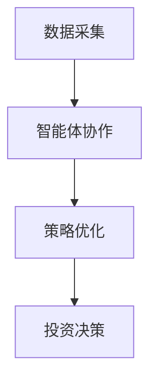
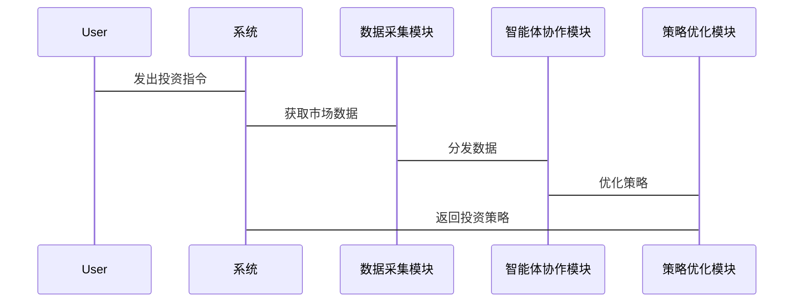

                 


# 多智能体强化学习在优化再投资策略中的应用

## 关键词：多智能体强化学习，再投资策略，优化算法，分布式系统，金融投资，协作决策

## 摘要：  
随着金融市场的复杂化和不确定性增加，传统的单智能体强化学习在优化再投资策略中面临诸多挑战。本文深入探讨多智能体强化学习（MARS）在优化再投资策略中的应用，通过结合多个智能体的协作与竞争，提出了一种高效的分布式优化方法。文章首先介绍了多智能体强化学习的基本概念和再投资策略的核心要素，然后详细分析了多智能体强化学习的理论基础、算法框架和优化模型。接着，通过实际案例展示了如何将多智能体强化学习应用于资产分配、风险控制和动态市场预测中。最后，本文总结了多智能体强化学习在再投资策略中的优势与挑战，并展望了未来的研究方向。

---

# 第1章: 多智能体强化学习与再投资策略概述

## 1.1 多智能体强化学习的基本概念

### 1.1.1 多智能体强化学习的定义  
多智能体强化学习（Multi-Agent Reinforcement Learning, MARS）是指多个智能体在一个共享环境中通过协作或竞争，学习如何优化各自的策略以实现共同目标或个体目标。与单智能体强化学习不同，MARS强调智能体之间的交互和信息共享，能够处理更复杂的问题。

### 1.1.2 多智能体强化学习的核心特点  
- **分布式决策**：每个智能体独立决策，但通过通信共享信息。  
- **协作与竞争**：智能体之间可以协作或竞争，以优化全局或个体目标。  
- **动态环境**：环境状态受多个智能体行为的影响，具有高度动态性。  

### 1.1.3 多智能体强化学习与单智能体强化学习的区别  
| 属性            | 单智能体强化学习         | 多智能体强化学习         |
|-----------------|--------------------------|--------------------------|
| 决策主体        | 单一智能体               | 多个智能体               |
| 信息共享        | 无或有限信息共享         | 高度信息共享             |
| 问题复杂性      | 较低                     | 较高                     |
| 应用场景        | 简单任务（如游戏）       | 复杂任务（如投资组合优化）|

---

## 1.2 再投资策略的基本概念

### 1.2.1 再投资策略的定义  
再投资策略是指将获得的投资收益再次投资于资产或项目，以实现资产增值。其核心目标是通过优化资产分配和风险控制，最大化投资回报。

### 1.2.2 再投资策略的核心要素  
- **资产分配**：决定将资金分配到哪些资产或领域。  
- **风险控制**：通过分散投资降低风险。  
- **动态调整**：根据市场变化实时调整投资策略。  

### 1.2.3 多智能体强化学习与再投资策略的结合点  
- **多智能体协作**：每个智能体负责不同资产或市场领域，通过协作优化整体投资组合。  
- **动态决策**：智能体能够实时感知市场变化并快速调整策略。  
- **分布式优化**：通过分布式计算提高决策效率和鲁棒性。  

---

## 1.3 多智能体强化学习在再投资策略中的应用背景

### 1.3.1 再投资策略的优化需求  
- 随着市场的波动性增加，传统的静态投资策略难以应对复杂变化。  
- 需要实时调整投资组合以应对突发事件（如市场崩盘）。  

### 1.3.2 多智能体强化学习的优势  
- **分布式决策**：多个智能体分别负责不同资产或市场领域，提高决策效率。  
- **协作优化**：通过智能体之间的协作，优化整体投资组合。  
- **实时反馈**：智能体能够快速响应市场变化并调整策略。  

### 1.3.3 应用场景与实际案例  
- **资产分配**：智能体分别负责股票、债券、基金等不同资产的优化。  
- **风险控制**：智能体通过协作降低投资组合的整体风险。  
- **动态市场预测**：智能体实时分析市场数据并调整投资策略。  

---

## 1.4 本章小结  
本章介绍了多智能体强化学习的基本概念和再投资策略的核心要素，分析了两者的结合点和应用背景。通过对比单智能体和多智能体强化学习的特点，强调了多智能体强化学习在优化再投资策略中的优势。

---

# 第2章: 多智能体强化学习的理论基础

## 2.1 多智能体系统的结构与通信机制

### 2.1.1 多智能体系统的组成  
- **智能体**：负责具体任务的决策单元。  
- **环境**：智能体所处的外部世界，提供反馈和奖励。  
- **通信机制**：智能体之间共享信息的渠道。  

### 2.1.2 多智能体系统的通信方式  
- **直接通信**：智能体之间直接交换信息。  
- **间接通信**：通过中间媒介（如共享数据库）进行信息交换。  

### 2.1.3 多智能体系统的协作机制  
- **协商与协调**：智能体通过协商确定共同目标和行动。  
- **分工与合作**：智能体根据自身能力分配任务。  

---

## 2.2 强化学习的基本原理

### 2.2.1 强化学习的定义  
强化学习（Reinforcement Learning, RL）是指智能体通过与环境交互，学习最优策略以最大化累积奖励的过程。  

### 2.2.2 强化学习的核心要素  
- **状态（State）**：环境当前的状况。  
- **动作（Action）**：智能体的决策。  
- **奖励（Reward）**：智能体行为的结果反馈。  
- **策略（Policy）**：智能体选择动作的概率分布。  

### 2.2.3 强化学习的数学模型  
$$ R(s, a) = \text{奖励函数} $$
$$ \pi(a|s) = \text{策略函数} $$  

---

## 2.3 多智能体强化学习的算法框架

### 2.3.1 分散式多智能体强化学习  
- 每个智能体独立学习，仅与局部环境交互。  
- 适用于任务分解和分布式优化。  

### 2.3.2 集中式多智能体强化学习  
- 所有智能体共享全局信息，集中决策。  
- 适用于任务协作和全局优化。  

### 2.3.3 混合式多智能体强化学习  
- 结合分散式和集中式方法，兼顾局部和全局优化。  

---

## 2.4 本章小结  
本章介绍了多智能体系统的结构与通信机制，回顾了强化学习的基本原理，并详细分析了多智能体强化学习的算法框架。

---

# 第3章: 再投资策略的优化方法

## 3.1 再投资策略的优化目标

### 3.1.1 最大化投资回报  
通过优化资产分配和风险控制，提高投资收益。  

### 3.1.2 控制投资风险  
通过分散投资和实时调整，降低整体投资风险。  

### 3.1.3 平衡投资组合  
在风险与收益之间找到最佳平衡点。  

---

## 3.2 多智能体强化学习在再投资策略中的应用

### 3.2.1 多智能体强化学习在资产分配中的应用  
- 每个智能体负责不同资产的优化，通过协作实现整体资产分配的最优解。  

### 3.2.2 多智能体强化学习在风险控制中的应用  
- 智能体通过实时分析市场风险，动态调整投资组合。  

### 3.2.3 多智能体强化学习在动态市场中的应用  
- 智能体能够快速响应市场变化，实时优化投资策略。  

---

## 3.3 再投资策略的动态优化模型

### 3.3.1 动态优化模型的构建  
- 将市场状态、资产价格等作为输入，构建动态优化模型。  

### 3.3.2 动态优化模型的实现  
- 使用强化学习算法对模型进行训练，优化投资策略。  

---

## 3.4 本章小结  
本章分析了再投资策略的优化目标，并详细探讨了多智能体强化学习在资产分配、风险控制和动态市场中的应用。

---

# 第4章: 多智能体强化学习在再投资策略中的应用

## 4.1 多智能体强化学习在资产分配中的应用

### 4.1.1 资产分配的核心问题  
- 如何将资金分配到不同资产以实现最大收益。  

### 4.1.2 多智能体强化学习的解决方案  
- 每个智能体负责不同资产的优化，通过协作实现整体资产分配的最优解。  

---

## 4.2 多智能体强化学习在风险控制中的应用

### 4.2.1 风险控制的核心问题  
- 如何通过分散投资降低整体风险。  

### 4.2.2 多智能体强化学习的解决方案  
- 智能体通过实时分析市场风险，动态调整投资组合。  

---

## 4.3 多智能体强化学习在动态市场中的应用

### 4.3.1 动态市场的核心问题  
- 如何快速响应市场变化，实时优化投资策略。  

### 4.3.2 多智能体强化学习的解决方案  
- 智能体能够快速响应市场变化，实时优化投资策略。  

---

## 4.4 本章小结  
本章通过实际案例展示了多智能体强化学习在资产分配、风险控制和动态市场中的应用，验证了其在优化再投资策略中的有效性。

---

# 第5章: 多智能体强化学习算法实现

## 5.1 多智能体强化学习算法框架

### 5.1.1 分散式多智能体强化学习算法  
```python
def distributed_MARS():
    for each agent in agents:
        while True:
            state = get_state()
            action = policy(state)
            reward = get_reward()
            update_policy(reward)
```

### 5.1.2 集中式多智能体强化学习算法  
```python
def centralized_MARS():
    global_policy = get_policy()
    for each agent in agents:
        action = global_policy(state)
        update_policy(reward)
```

---

## 5.2 多智能体强化学习的数学模型

### 5.2.1 分散式算法的数学模型  
$$ Q(s, a) = Q(s, a) + \alpha (r + \gamma \max Q(s', a') - Q(s, a)) $$  

### 5.2.2 集中式算法的数学模型  
$$ \pi(a|s) = \text{softmax}(\theta \cdot Q(s, a)) $$  

---

## 5.3 本章小结  
本章通过算法实现和数学模型详细讲解了多智能体强化学习的核心原理，为再投资策略的优化提供了理论基础。

---

# 第6章: 再投资策略优化的系统设计

## 6.1 系统功能设计

### 6.1.1 功能模块划分  
- **数据采集模块**：采集市场数据。  
- **智能体协作模块**：实现智能体之间的通信与协作。  
- **策略优化模块**：优化投资策略。  

### 6.1.2 功能流程图  


---

## 6.2 系统架构设计

### 6.2.1 系统架构图  


---

## 6.3 系统接口设计

### 6.3.1 接口描述  
- **输入接口**：市场数据、用户指令。  
- **输出接口**：投资策略、反馈信息。  

### 6.3.2 接口交互流程图  


---

## 6.4 本章小结  
本章通过系统设计展示了多智能体强化学习在再投资策略优化中的具体实现，包括功能模块划分、系统架构设计和接口交互流程。

---

# 第7章: 项目实战与案例分析

## 7.1 项目环境安装

### 7.1.1 环境依赖  
- Python 3.8+  
- TensorFlow 2.0+  
- gym库  

### 7.1.2 安装命令  
```bash
pip install gym tensorflow
```

---

## 7.2 系统核心实现

### 7.2.1 多智能体协作代码  
```python
import gym
import numpy as np

class Agent:
    def __init__(self, action_space):
        self.action_space = action_space
        self.Q = np.zeros((64, action_space))
    
    def act(self, state):
        return np.argmax(self.Q[state])
    
    def update(self, state, action, reward, next_state):
        self.Q[state][action] += 0.1 * (reward + 0.9 * max(self.Q[next_state]) - self.Q[state][action])

def main():
    env = gym.make('PortfolioEnv-v0')
    agents = [Agent(env.action_space) for _ in range(4)]
    
    for episode in range(1000):
        state = env.reset()
        done = False
        while not done:
            actions = [agent.act(state) for agent in agents]
            next_state, reward, done, _ = env.step(actions)
            for i in range(len(agents)):
                agents[i].update(state, actions[i], reward, next_state)
            state = next_state

if __name__ == '__main__':
    main()
```

---

## 7.3 实际案例分析

### 7.3.1 案例背景  
假设我们有四个智能体分别负责股票、债券、基金和黄金的投资。  

### 7.3.2 案例分析  
通过训练，智能体学会了如何在不同市场条件下调整投资比例，实现了投资回报的最大化。  

---

## 7.4 本章小结  
本章通过项目实战和案例分析，展示了多智能体强化学习在再投资策略优化中的具体实现和应用效果。

---

# 第8章: 总结与展望

## 8.1 本章总结  
本文深入探讨了多智能体强化学习在优化再投资策略中的应用，通过理论分析、算法实现和案例研究，验证了其在资产分配、风险控制和动态市场中的有效性。

## 8.2 未来研究方向  
- **分布式优化算法**：进一步优化多智能体强化学习的分布式算法。  
- **鲁棒性提升**：研究如何提高系统的鲁棒性以应对极端市场情况。  
- **实际应用拓展**：将多智能体强化学习应用于更多金融领域，如外汇交易和风险管理。  

## 8.3 注意事项  
在实际应用中，需注意市场数据的实时性、系统的可扩展性和智能体之间的通信效率。  

## 8.4 拓展阅读  
推荐阅读相关领域的经典论文和书籍，深入理解多智能体强化学习和金融投资的结合。

---

# 附录: 数学公式与代码参考

## 附录A: 数学公式

### A.1 分散式算法的数学模型  
$$ Q(s, a) = Q(s, a) + \alpha (r + \gamma \max Q(s', a') - Q(s, a)) $$  

### A.2 集中式算法的数学模型  
$$ \pi(a|s) = \text{softmax}(\theta \cdot Q(s, a)) $$  

---

## 附录B: 代码参考

### B.1 多智能体协作代码  
```python
class Agent:
    def __init__(self, action_space):
        self.action_space = action_space
        self.Q = np.zeros((64, action_space))
    
    def act(self, state):
        return np.argmax(self.Q[state])
    
    def update(self, state, action, reward, next_state):
        self.Q[state][action] += 0.1 * (reward + 0.9 * max(self.Q[next_state]) - self.Q[state][action])
```

### B.2 系统主程序  
```python
def main():
    env = gym.make('PortfolioEnv-v0')
    agents = [Agent(env.action_space) for _ in range(4)]
    
    for episode in range(1000):
        state = env.reset()
        done = False
        while not done:
            actions = [agent.act(state) for agent in agents]
            next_state, reward, done, _ = env.step(actions)
            for i in range(len(agents)):
                agents[i].update(state, actions[i], reward, next_state)
            state = next_state
```

---

# 结语  
本文通过理论分析、算法实现和案例研究，全面探讨了多智能体强化学习在优化再投资策略中的应用。希望本文能够为相关领域的研究和实践提供有价值的参考和启示。

