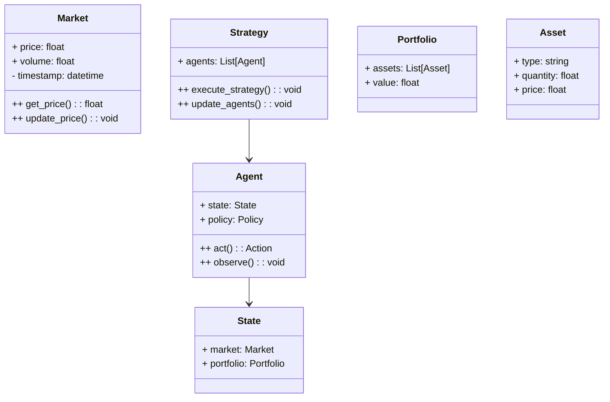
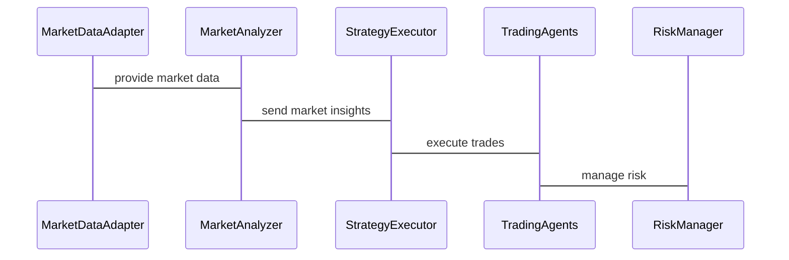

                 


# 多智能体强化学习在优化止损和止盈策略中的应用

**关键词**：多智能体强化学习、止损策略、止盈策略、金融交易、算法优化

**摘要**：本文探讨了多智能体强化学习在优化金融交易中的止损和止盈策略中的应用。通过分析多智能体系统的核心概念、算法原理及其在金融交易中的应用，提出了一种基于多智能体强化学习的优化方法，并通过实际案例展示了其在止损和止盈策略中的有效性。本文还详细介绍了系统架构设计、项目实战和算法实现，为读者提供了全面的技术指导。

---

## 第1章 多智能体强化学习概述

### 1.1 多智能体强化学习的基本概念

#### 1.1.1 多智能体系统的基本定义
多智能体系统（Multi-Agent System, MAS）是由多个智能体（Agent）组成的系统，这些智能体能够通过协作完成复杂的任务。每个智能体都有自己的目标、状态和决策机制，能够感知环境并采取行动。

#### 1.1.2 强化学习的基本原理
强化学习（Reinforcement Learning, RL）是一种机器学习方法，通过智能体与环境的交互，学习最优策略。智能体通过执行动作获得奖励或惩罚，从而优化其决策过程。

#### 1.1.3 多智能体强化学习的核心特征
多智能体强化学习（Multi-Agent Reinforcement Learning, MARL）结合了多智能体系统和强化学习，允许多个智能体在协作或竞争的环境中共同优化目标。其核心特征包括协作性、分布式决策和动态环境。

### 1.2 金融交易中的止损与止盈策略

#### 1.2.1 什么是止损和止盈
- **止损**：在投资中，止损是指在价格下跌到一定程度时，卖出资产以避免更大的损失。
- **止盈**：止盈是指在价格上涨到一定程度时，卖出资产以锁定利润。

#### 1.2.2 止损止盈策略的重要性
- 控制风险：通过设定止损点，投资者可以限制最大损失。
- 锁定收益：通过设定止盈点，投资者可以在价格达到预期时及时退出。

#### 1.2.3 传统止损止盈策略的局限性
- **静态性**：传统策略通常基于固定的阈值，无法适应市场变化。
- **缺乏动态调整**：无法根据市场波动实时优化策略。

### 1.3 多智能体强化学习在金融交易中的应用前景

#### 1.3.1 金融交易中的复杂决策问题
金融交易涉及多个因素，如市场波动、交易成本、信息延迟等，这些问题使得传统的静态策略难以应对。

#### 1.3.2 多智能体强化学习的优势
- **动态适应性**：多智能体强化学习能够实时调整策略，适应市场变化。
- **协作优化**：通过多个智能体的协作，可以实现更优的决策。

#### 1.3.3 应用场景与潜在价值
- **高频交易**：通过多个智能体协作，优化交易时机和价格。
- **风险控制**：通过智能体实时监控市场，动态调整止损止盈点。

---

## 第2章 多智能体强化学习的核心概念与联系

### 2.1 多智能体系统的核心要素

#### 2.1.1 智能体的定义与特征
- **智能体**：能够感知环境并采取行动的实体。
- **自主性**：智能体能够自主决策。
- **反应性**：智能体能够根据环境变化调整行为。

#### 2.1.2 智能体之间的交互关系
- **协作**：智能体之间通过协作完成共同目标。
- **竞争**：智能体之间可能存在竞争关系，如博弈论中的对抗。

#### 2.1.3 环境与智能体的协同演化
- **环境**：智能体所处的外部世界，如金融市场。
- **协同演化**：智能体与环境相互作用，共同进化。

### 2.2 强化学习的基本原理

#### 2.2.1 强化学习的三要素
- **状态（State）**：智能体所处的环境状况。
- **动作（Action）**：智能体采取的行为。
- **奖励（Reward）**：智能体行为的结果，用于指导优化决策。

#### 2.2.2 状态、动作、奖励的关系
- **状态**：市场当前的价格走势。
- **动作**：买入或卖出某只股票。
- **奖励**：交易后的收益或损失。

#### 2.2.3 Q-learning算法简介
Q-learning是一种经典的强化学习算法，通过更新Q值函数来学习最优策略。

### 2.3 多智能体强化学习的挑战与解决方案

#### 2.3.1 多智能体协作中的协调问题
- **协调困难**：多个智能体需要协调动作，避免冲突。
- **通信与协作**：智能体之间需要通过某种方式通信，以实现协作。

#### 2.3.2 竞争与合作的平衡
- **竞争**：多个智能体在市场中竞争，可能导致资源分配不均。
- **合作**：通过合作实现共同目标。

#### 2.3.3 基于价值函数的协作方法
- **价值函数**：评估每个智能体的贡献，优化协作策略。

---

## 第3章 多智能体强化学习的数学模型与算法原理

### 3.1 多智能体强化学习的数学模型

#### 3.1.1 单智能体强化学习的数学模型
- **Q值函数**：$Q(s, a)$ 表示在状态$s$下采取动作$a$的期望收益。
- **更新规则**：$Q(s, a) = Q(s, a) + \alpha (r + \gamma \max Q(s', a') - Q(s, a))$。

#### 3.1.2 多智能体强化学习的扩展模型
- **联合Q值函数**：考虑多个智能体的协作，扩展Q值函数。
- **联合动作空间**：多个智能体共同决策，形成联合动作空间。

#### 3.1.3 状态空间与动作空间的建模
- **状态空间**：金融市场中的价格、成交量、市场情绪等。
- **动作空间**：买入、卖出或持有。

### 3.2 基于Q-learning的多智能体协作算法

#### 3.2.1 Q-learning算法的改进
- **分布式Q-learning**：每个智能体独立学习，通过协作优化策略。
- **联合Q更新**：考虑多个智能体的协作，同步更新Q值。

#### 3.2.2 多智能体协作的Q值更新策略
- **协作奖励**：奖励不仅来自个人收益，还来自团队协作。
- **联合更新**：$Q_{i}(s, a) = Q_{i}(s, a) + \alpha (r_i + \gamma \max Q_{j}(s', a') - Q_{i}(s, a))$。

#### 3.2.3 算法的收敛性分析
- **收敛性**：在一定条件下，分布式Q-learning算法能够收敛到纳什均衡。

### 3.3 基于DQN的多智能体强化学习

#### 3.3.1 DQN算法的基本原理
- **深度Q网络（DQN）**：使用神经网络近似Q值函数。
- **经验回放**：通过回放历史经验，减少相关样本偏差。

#### 3.3.2 多智能体DQN的实现细节
- **分布式DQN**：多个智能体分别维护自己的Q网络，通过协作更新。
- **同步与异步更新**：根据系统设计，选择同步或异步更新策略。

#### 3.3.3 算法的训练流程与优化
- **训练流程**：
  1. 每个智能体与环境交互，收集经验。
  2. 将经验存储在经验回放池中。
  3. 采样经验，更新Q网络。
  4. 重复上述步骤，直到收敛。

---

## 第4章 系统分析与架构设计方案

### 4.1 问题场景介绍

#### 4.1.1 金融交易中的止损止盈问题
- **动态市场**：金融市场的价格波动频繁，传统静态策略难以应对。
- **多因素影响**：市场受多种因素影响，如政策、经济指标等。

#### 4.1.2 多智能体协作的优化目标
- **实时优化**：根据市场变化，实时调整止损和止盈点。
- **协作决策**：多个智能体协作，优化整体收益。

#### 4.1.3 系统设计的约束条件
- **实时性**：系统需要快速响应市场变化。
- **稳定性**：系统需要稳定运行，避免故障。

### 4.2 项目介绍

#### 4.2.1 项目目标
- **优化止损止盈策略**：通过多智能体强化学习，优化止损和止盈点。
- **提高交易收益**：通过智能协作，提高整体交易收益。

#### 4.2.2 项目范围
- **金融市场的实时数据**：包括股票价格、成交量等。
- **交易规则**：包括止损和止盈的触发条件。

### 4.3 系统功能设计

#### 4.3.1 领域模型类图


#### 4.3.2 系统架构设计


#### 4.3.3 系统接口设计



---

## 第5章 项目实战

### 5.1 环境安装与配置

#### 5.1.1 安装依赖
- **Python**：3.8+
- **库依赖**：TensorFlow、Keras、Pandas、NumPy、Matplotlib。

#### 5.1.2 环境配置
```bash
pip install numpy pandas tensorflow matplotlib
```

### 5.2 系统核心实现源代码

#### 5.2.1 交易智能体代码

```python
class TradingAgent:
    def __init__(self, state_space, action_space):
        self.state_space = state_space
        self.action_space = action_space
        self.q_network = self.build_model()
        self.target_network = self.build_model()

    def build_model(self):
        model = tf.keras.Sequential()
        model.add(tf.keras.layers.Dense(64, activation='relu', input_dim=state_space))
        model.add(tf.keras.layers.Dense(action_space, activation='linear'))
        return model

    def act(self, state):
        if np.random.random() < 0.1:
            return np.random.randint(0, self.action_space)
        predicted_q = self.q_network.predict(state)
        return np.argmax(predicted_q[0])

    def observe(self, state, action, reward, next_state):
        # Experience replay
        self.memory.append((state, action, reward, next_state))

    def replay(self, batch_size):
        mini_batch = random.sample(self.memory, batch_size)
        for state, action, reward, next_state in mini_batch:
            target = self.target_network.predict(next_state)[0]
            target_q = reward + gamma * np.max(target)
            self.q_network.fit(state, [target_q], epochs=1, verbose=0)
```

#### 5.2.2 策略优化代码

```python
class StrategyOptimizer:
    def __init__(self, agents):
        self.agents = agents
        self.max_iterations = 1000
        self.learning_rate = 0.01

    def optimize(self):
        for i in range(self.max_iterations):
            for agent in self.agents:
                agent.replay(32)
            if i % 10 == 0:
                print(f"Iteration {i}: Evaluating strategy...")
                self.evaluate_strategy()

    def evaluate_strategy(self):
        # Evaluate the current strategy by backtesting
        pass
```

### 5.3 代码应用解读与分析

#### 5.3.1 交易智能体的实现细节
- **状态空间**：包括市场数据和交易组合。
- **动作空间**：包括买入、卖出或持有。

#### 5.3.2 策略优化的实现细节
- **批量训练**：通过经验回放，优化策略。
- **评估策略**：定期评估当前策略的有效性。

### 5.4 实际案例分析

#### 5.4.1 数据准备
- **历史数据**：获取某股票的历史价格数据。
- **市场数据**：包括开盘价、收盘价、最高价、最低价、成交量等。

#### 5.4.2 策略实施
- **训练阶段**：通过历史数据训练智能体。
- **测试阶段**：在真实市场中测试策略。

### 5.5 项目小结

#### 5.5.1 项目总结
- **实现目标**：通过多智能体强化学习，优化止损和止盈策略。
- **实际效果**：提高交易收益，降低风险。

#### 5.5.2 经验与教训
- **挑战**：市场波动大，策略需要频繁调整。
- **改进方向**：引入更多市场数据，如情绪指标，提高策略的有效性。

---

## 第6章 总结与展望

### 6.1 最佳实践 tips

#### 6.1.1 系统设计
- **模块化设计**：确保系统的可扩展性和可维护性。
- **实时性优化**：使用高效的数据结构和算法，确保实时响应。

#### 6.1.2 算法优化
- **经验回放**：通过经验回放，减少相关样本偏差。
- **多智能体协作**：通过协作机制，提高策略优化效果。

### 6.2 小结

#### 6.2.1 核心内容回顾
- **多智能体强化学习**：在金融交易中的应用前景广阔。
- **止损和止盈策略**：通过智能体协作，优化交易决策。

#### 6.2.2 本文贡献
- **理论贡献**：提出了一种基于多智能体强化学习的优化方法。
- **实践贡献**：提供了一个可实现的系统架构和代码示例。

### 6.3 注意事项

#### 6.3.1 风险提示
- **市场风险**：金融市场波动大，策略可能失效。
- **模型风险**：模型假设可能与实际市场不符。

#### 6.3.2 实施建议
- **数据质量**：确保数据的准确性和完整性。
- **系统稳定性**：确保系统的稳定运行，避免重大损失。

### 6.4 拓展阅读

#### 6.4.1 推荐书籍
- 《Reinforcement Learning: Theory and Algorithms》
- 《Multi-Agent Systems: Complexity and Control》

#### 6.4.2 推荐论文
- "Multi-Agent Reinforcement Learning: A Survey"
- "Deep Multi-Agent Reinforcement Learning for Financial Trading"

---

通过以上步骤，我们可以看到，多智能体强化学习在优化止损和止盈策略中的应用具有广阔的前景。通过合理设计系统架构、优化算法和策略，我们可以显著提高交易收益，降低风险。未来，随着技术的发展，多智能体强化学习在金融领域的应用将更加广泛和深入。

---

**结语**：本文通过详细分析多智能体强化学习在优化止损和止盈策略中的应用，为读者提供了一个全面的技术指导。希望本文能够为相关领域的研究和实践提供有价值的参考。

