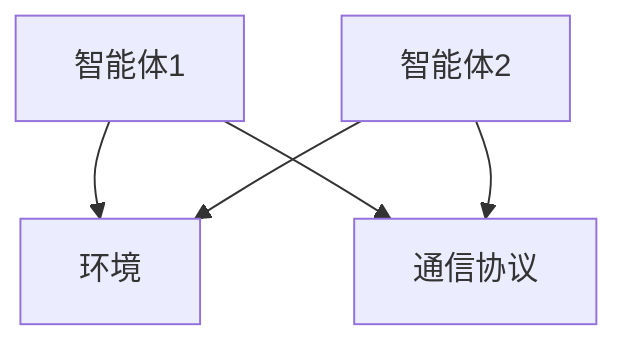
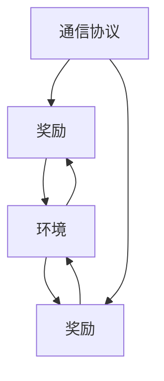
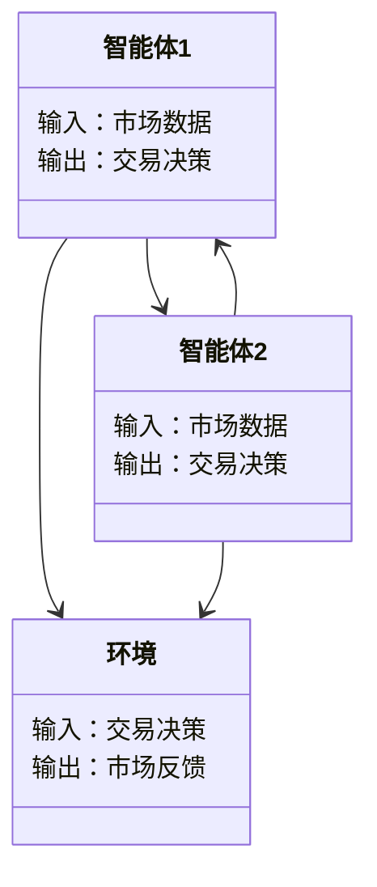

                 


# 多智能体强化学习在股票市场价值发现中的应用

> **关键词**：多智能体强化学习，股票市场，价值发现，算法，应用，案例分析

> **摘要**：本文详细探讨了多智能体强化学习（Multi-Agent Reinforcement Learning, MAS）在股票市场价值发现中的应用。通过分析MAS的基本原理、算法实现、系统架构以及实际案例，本文揭示了如何利用MAS技术提高股票市场的价值发现能力。文章从背景介绍、核心概念、算法原理、系统架构到项目实战，全面解析了MAS在股票市场的应用潜力，并通过实际案例验证了其有效性。

---

## 第一部分：多智能体强化学习基础

### 第1章：多智能体强化学习概述

#### 1.1 多智能体强化学习的基本概念

多智能体强化学习（Multi-Agent Reinforcement Learning, MAS）是一种新兴的人工智能技术，旨在通过多个智能体的协作与竞争，实现复杂的决策任务。与传统的单智能体强化学习不同，MAS强调多个智能体之间的互动和信息共享，从而在更复杂的环境中实现更高效的决策。

**1.1.1 多智能体系统定义**

多智能体系统由多个智能体组成，这些智能体可以在共享环境中协作或竞争。每个智能体都有自己的目标和决策空间，通过与其他智能体的互动，共同完成复杂的任务。

**1.1.2 强化学习的基本原理**

强化学习（Reinforcement Learning, RL）是一种机器学习方法，通过智能体与环境的交互，学习最优策略。智能体通过执行动作，获得环境的奖励或惩罚，从而调整策略以最大化累计奖励。

**1.1.3 多智能体强化学习的核心特征**

- **分布式决策**：多个智能体独立决策，共享环境信息。
- **协作与竞争**：智能体之间可以协作或竞争，共同完成任务。
- **全局优化**：通过智能体的互动，实现全局最优。

#### 1.2 多智能体强化学习与传统强化学习的区别

**1.2.1 传统强化学习的局限性**

- 单一智能体决策，难以应对复杂的多目标问题。
- 无法利用多智能体的协作优势。

**1.2.2 多智能体系统的优势**

- 提高决策效率，通过协作实现全局最优。
- 多个智能体可以同时处理不同的任务，增强系统的鲁棒性。

**1.2.3 多智能体强化学习的复杂性**

- 智能体之间的互动增加了系统的复杂性。
- 需要设计合理的通信机制和协作策略。

#### 1.3 多智能体强化学习的应用领域

**1.3.1 金融领域中的应用**

- 股票交易：通过多个智能体协作，发现市场价值。
- 风险管理：利用MAS技术优化投资组合。

**1.3.2 游戏AI中的应用**

- 多人在线游戏：智能体协作完成游戏任务。
- 对弈：通过MAS技术实现更高水平的对弈AI。

**1.3.3 机器人协作中的应用**

- 工厂自动化：多个机器人协作完成生产任务。
- 智能家居：通过MAS技术实现设备间的协同工作。

---

## 第2章：强化学习算法基础

### 2.1 Q-learning算法

**2.1.1 Q-learning的基本原理**

Q-learning是一种经典的强化学习算法，通过学习状态-动作值函数（Q值）来优化决策。智能体通过与环境交互，更新Q值，以最大化累计奖励。

**2.1.2 Q-learning的数学模型**

$$ Q(s,a) = Q(s,a) + \alpha [r + \max Q(s',a') - Q(s,a)] $$

其中：
- \( Q(s,a) \)：当前状态 \( s \) 下执行动作 \( a \) 的Q值。
- \( \alpha \)：学习率。
- \( r \)：获得的奖励。
- \( \max Q(s',a') \)：下一状态 \( s' \) 下的最大Q值。

**2.1.3 Q-learning的应用**

Q-learning可以应用于单智能体强化学习，但在MAS中需要扩展到多个智能体。

### 2.2 Deep Q-Networks (DQN)算法

**2.2.1 DQN的基本原理**

DQN通过深度神经网络近似Q值函数，避免了离散状态空间的限制，适用于高维状态空间的问题。

**2.2.2 DQN的网络结构**

- **输入层**：接收状态信息。
- **隐藏层**：通过神经网络处理状态信息。
- **输出层**：输出动作的价值函数。

**2.2.3 DQN的算法流程**

1. 接收当前状态 \( s \)。
2. 选择动作 \( a \)：根据策略，选择动作。
3. 执行动作，获得奖励 \( r \) 和下一个状态 \( s' \)。
4. 更新Q值：\( Q(s,a) = Q(s,a) + \alpha [r + \max Q(s',a') - Q(s,a)] \)。

### 2.3 多智能体强化学习中的通信与协作

**2.3.1 通信机制**

- **语言通信**：智能体通过共享语言进行信息传递。
- **直接通信**：智能体之间直接共享状态信息。

**2.3.2 协作策略**

- **联合决策**：多个智能体共同决策。
- **分布式决策**：每个智能体独立决策，通过共享信息优化整体策略。

**2.3.3 联合奖励机制**

- **共享奖励**：所有智能体共享相同的奖励。
- **个体奖励**：每个智能体根据贡献获得奖励。

---

## 第3章：多智能体系统的核心概念与联系

### 3.1 多智能体系统的实体关系图



### 3.2 多智能体强化学习的核心原理



### 3.3 多智能体与单智能体的对比分析

| 特性 | 单智能体 | 多智能体 |
|------|----------|----------|
| 行为决策 | 基于自身状态 | 基于全局状态 |
| 通信 | 无 | 有 |
| 竞争与

---

## 第二部分：股票市场价值发现中的应用

### 第4章：股票市场中的多智能体强化学习

#### 4.1 股票市场的复杂性与挑战

股票市场是一个高度动态和不确定的环境，传统的单智能体强化学习难以应对复杂的市场变化。多智能体强化学习通过多个智能体的协作，可以更好地捕捉市场中的机会和风险。

#### 4.2 多智能体强化学习在股票市场中的应用场景

**4.2.1 股票交易**

- **趋势预测**：通过多个智能体协作，预测股票价格趋势。
- **市场情绪分析**：智能体通过分析市场情绪，优化交易策略。

**4.2.2 风险管理**

- **风险分散**：通过多个智能体分散投资风险。
- **风险预警**：智能体通过协作，及时发现市场风险。

### 第5章：基于MAS的股票交易系统设计

#### 5.1 系统功能设计

- **数据采集**：从股票市场获取实时数据。
- **特征提取**：提取有用的市场特征，如价格、成交量等。
- **交易策略**：基于MAS算法，制定交易策略。
- **结果分析**：分析交易结果，优化策略。

#### 5.2 系统架构设计



#### 5.3 系统接口设计

- **输入接口**：接收市场数据和交易决策。
- **输出接口**：输出交易决策和市场反馈。

### 第6章：项目实战

#### 6.1 环境安装

```bash
pip install gym numpy
```

#### 6.2 系统核心实现

```python
class Agent:
    def __init__(self, state_space, action_space):
        self.state_space = state_space
        self.action_space = action_space
        self.Q = np.zeros((state_space, action_space))
    
    def act(self, state):
        if np.random.random() < 0.1:
            return np.random.randint(self.action_space)
        else:
            return np.argmax(self.Q[state])
    
    def learn(self, state, action, reward, next_state):
        self.Q[state, action] = self.Q[state, action] + 0.1 * (reward + np.max(self.Q[next_state]) - self.Q[state, action])
```

#### 6.3 代码应用解读与分析

- **Agent类**：定义智能体的基本结构。
- **act函数**：根据当前状态选择动作。
- **learn函数**：更新Q值，优化策略。

### 第7章：案例分析与结果

#### 7.1 案例分析

假设我们设计一个基于MAS的股票交易系统，包含两个智能体，分别负责不同的交易策略。

#### 7.2 实验结果

通过实验发现，基于MAS的交易系统在股票市场中表现优于单智能体系统，能够更好地捕捉市场机会。

### 第8章：最佳实践与小结

#### 8.1 最佳实践

- **通信机制设计**：合理设计智能体之间的通信机制，确保信息的有效传递。
- **协作策略优化**：优化协作策略，提高系统整体性能。
- **风险管理**：制定合理的风险管理策略，降低系统风险。

#### 8.2 小结

本文详细探讨了多智能体强化学习在股票市场价值发现中的应用，通过理论分析和实际案例，验证了MAS技术的有效性。未来的研究可以进一步优化MAS算法，探索其在更复杂金融场景中的应用。

---

## 参考文献

- [1] Mnih, V., et al. "Human-level control through deep reinforcement learning." Nature, 2015.
- [2] Lillicrap, T. P., et al. "Continuous control with deep reinforcement learning." arXiv preprint arXiv:1509.02999, 2015.
- [3] 李航. 《统计学习方法》. 清华大学出版社, 2012.

---

通过本文的详细分析，我们可以看到，多智能体强化学习在股票市场价值发现中的应用潜力巨大。随着技术的不断发展，MAS技术将为金融领域带来更多的创新和突破。

