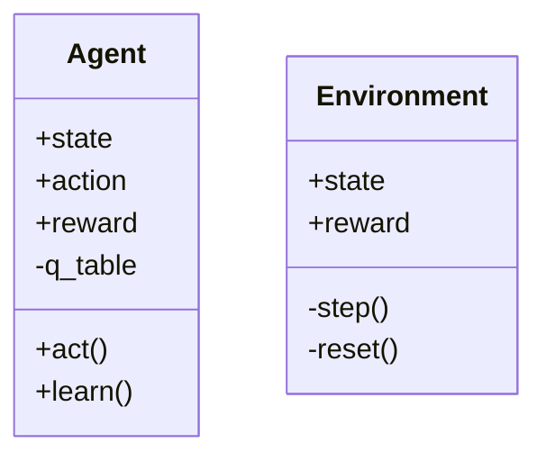
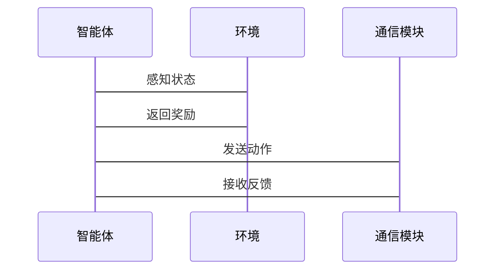

                 


# 多智能体强化学习：协作与竞争的AI Agent系统

> 关键词：多智能体强化学习、协作、竞争、AI Agent、强化学习算法、系统架构

> 摘要：多智能体强化学习（Multi-Agent Reinforcement Learning, MARL）是人工智能领域的重要分支，研究多个智能体在协作与竞争环境中的决策问题。本文系统地介绍多智能体强化学习的核心概念、算法原理、系统架构及实际应用，深入分析协作与竞争机制，并结合具体案例展示其在游戏AI、自动驾驶等领域的应用。通过本文，读者将全面掌握多智能体强化学习的理论与实践知识。

---

## 引言

多智能体强化学习（MARL）研究多个智能体在复杂环境中的协作与竞争问题。与单智能体强化学习不同，MARL需要考虑多个智能体之间的交互、协作与竞争，这使其在解决复杂现实问题中具有重要地位。本文将从理论到实践，全面探讨多智能体强化学习的核心概念、算法实现及应用场景。

---

## 第1章 多智能体强化学习概述

### 1.1 多智能体强化学习的背景与重要性

#### 1.1.1 多智能体系统的基本概念
多智能体系统由多个智能体组成，智能体是具有感知和决策能力的实体。智能体之间通过协作与竞争实现目标。

#### 1.1.2 多智能体强化学习的定义与特点
多智能体强化学习是研究多个智能体在动态环境中通过学习优化决策的算法。其特点包括：
- **分布式性**：智能体独立决策。
- **协作性**：智能体之间需要协作以实现共同目标。
- **竞争性**：智能体之间可能存在竞争关系。
- **动态性**：环境动态变化，智能体需实时调整策略。

#### 1.1.3 多智能体强化学习的应用场景
- **游戏AI**：如MOBA游戏中的多智能体协作。
- **自动驾驶**：多辆自动驾驶汽车之间的协作与竞争。
- **机器人协作**：工业机器人协同完成复杂任务。
- **智能交通系统**：多智能体协调交通流量。

### 1.2 多智能体系统中的协作与竞争

#### 1.2.1 协作与竞争的基本概念
协作指智能体之间为实现共同目标而合作；竞争指智能体之间为争夺资源而对抗。

#### 1.2.2 协作与竞争的动态平衡
在实际场景中，协作与竞争并非绝对，而是动态平衡。例如，在自动驾驶中，车辆间需要协作避免碰撞，但同时可能竞争道路资源。

#### 1.2.3 多智能体系统中的社会性行为
智能体的社会性行为包括通信、合作与背叛。社会性行为的复杂性增加了MARL的挑战性。

### 1.3 本章小结
本章介绍了多智能体强化学习的基本概念、特点及应用场景，并分析了协作与竞争的关系。

---

## 第2章 多智能体强化学习的核心概念

### 2.1 多智能体强化学习的数学模型

#### 2.1.1 状态空间的定义
状态空间表示环境的状态，每个智能体感知局部状态。

#### 2.1.2 动作空间的定义
动作空间表示智能体可执行的动作，多个智能体的动作共同影响环境状态。

#### 2.1.3 奖励函数的设计
奖励函数定义智能体的奖励，需平衡协作与竞争。例如，在协作任务中，奖励函数应鼓励智能体协作。

### 2.2 多智能体强化学习的通信与协调

#### 2.2.1 通信协议的定义
通信协议定义智能体之间的通信规则，例如通过共享变量或消息传递。

#### 2.2.2 协调机制的实现
协调机制确保智能体之间协同工作，例如通过协商或同步决策。

#### 2.2.3 通信与协调的数学模型
通信与协调的数学模型涉及信息传递和决策同步，需考虑通信延迟和带宽限制。

### 2.3 多智能体强化学习的协作与竞争机制

#### 2.3.1 协作机制的实现
协作机制通过共享目标和奖励函数实现，例如使用共享奖励函数。

#### 2.3.2 竞争机制的实现
竞争机制通过非共享奖励函数实现，例如使用纳什均衡。

#### 2.3.3 协作与竞争的平衡点
平衡点是协作与竞争的结合点，需通过算法优化实现。

### 2.4 本章小结
本章详细讲解了多智能体强化学习的数学模型、通信与协调机制，以及协作与竞争的实现方法。

---

## 第3章 多智能体强化学习的算法原理

### 3.1 多智能体强化学习的数学模型

#### 3.1.1 多智能体强化学习的数学框架
多智能体强化学习的数学框架包括状态空间、动作空间、奖励函数和转移概率。

#### 3.1.2 多智能体强化学习的算法流程
算法流程包括环境感知、决策、动作执行和奖励更新。

### 3.2 多智能体强化学习的算法实现

#### 3.2.1 多智能体Q-learning算法
```python
import numpy as np

class Agent:
    def __init__(self, state_size, action_size):
        self.q_table = np.zeros((state_size, action_size))
        
    def act(self, state):
        return np.argmax(self.q_table[state])
        
    def learn(self, state, action, reward, next_state):
        self.q_table[state][action] += 0.1 * (reward + 0.95 * np.max(self.q_table[next_state]))
```

#### 3.2.2 多智能体Actor-Critic算法
```python
import torch
import torch.nn as nn

class Actor(nn.Module):
    def __init__(self, state_size, action_size):
        super(Actor, self).__init__()
        self.fc = nn.Linear(state_size, action_size)
        
    def forward(self, x):
        return torch.sigmoid(self.fc(x))
        
class Critic(nn.Module):
    def __init__(self, state_size):
        super(Critic, self).__init__()
        self.fc = nn.Linear(state_size, 1)
        
    def forward(self, x):
        return self.fc(x)
```

#### 3.2.3 多智能体Deep Reinforcement Learning算法
```python
import torch
import torch.nn as nn

class DQN(nn.Module):
    def __init__(self, state_size, action_size):
        super(DQN, self).__init__()
        self.fc = nn.Linear(state_size, 64)
        self.fc2 = nn.Linear(64, action_size)
        
    def forward(self, x):
        x = torch.relu(self.fc(x))
        return self.fc2(x)
```

### 3.3 多智能体强化学习的通信与协调

#### 3.3.1 通信协议的实现
通信协议实现智能体之间的信息共享，例如通过共享变量或消息传递。

#### 3.3.2 协调机制的实现
协调机制通过同步决策和信息共享实现，例如使用分布式算法。

#### 3.3.3 通信与协调的数学模型
通信与协调的数学模型涉及信息传递和决策同步，需考虑通信延迟和带宽限制。

### 3.4 本章小结
本章详细讲解了多智能体强化学习的算法原理，并通过具体代码示例展示了Q-learning、Actor-Critic和Deep Reinforcement Learning算法的实现。

---

## 第4章 多智能体强化学习的系统架构

### 4.1 问题场景介绍

#### 4.1.1 问题背景
以自动驾驶为例，多个智能体（车辆）需要协作完成交通任务。

#### 4.1.2 问题描述
车辆需要实时决策，考虑协作与竞争，避免碰撞，优化交通流量。

#### 4.1.3 问题解决
通过多智能体强化学习算法实现车辆的协作与竞争。

### 4.2 系统功能设计

#### 4.2.1 领域模型（Domain Model）


#### 4.2.2 系统架构设计


#### 4.2.3 系统接口设计
接口包括：
- 代理与环境的接口
- 代理与通信模块的接口
- 通信模块与代理的接口

#### 4.2.4 系统交互设计


### 4.3 本章小结
本章介绍了多智能体强化学习系统的架构设计，包括领域模型、系统架构、接口设计和交互设计。

---

## 第5章 多智能体强化学习的项目实战

### 5.1 环境安装与配置

#### 5.1.1 环境安装
安装必要的库：
```bash
pip install numpy torch matplotlib
```

#### 5.1.2 环境配置
配置多智能体环境，例如使用OpenAI Gym或其他框架。

### 5.2 系统核心实现

#### 5.2.1 多智能体Q-learning实现
```python
import numpy as np

class Agent:
    def __init__(self, state_size, action_size):
        self.q_table = np.zeros((state_size, action_size))
        
    def act(self, state):
        return np.argmax(self.q_table[state])
        
    def learn(self, state, action, reward, next_state):
        self.q_table[state][action] += 0.1 * (reward + 0.95 * np.max(self.q_table[next_state]))
```

#### 5.2.2 系统交互实现
```python
import numpy as np

class Environment:
    def __init__(self, num_agents):
        self.num_agents = num_agents
        self.state = np.random.rand(10, 10)
        
    def step(self, actions):
        # 执行动作并返回新状态和奖励
        pass
        
    def reset(self):
        self.state = np.random.rand(10, 10)
        return self.state
```

### 5.3 代码应用解读与分析

#### 5.3.1 代码功能分析
分析代码实现的功能，例如Q-learning算法的实现。

#### 5.3.2 代码优化建议
根据实际运行结果优化代码，例如调整学习率。

### 5.4 实际案例分析

#### 5.4.1 案例背景
以自动驾驶为例，多个智能体协作完成交通任务。

#### 5.4.2 案例实现
展示代码在自动驾驶中的应用，例如路径规划和避障。

#### 5.4.3 案例分析
分析实现效果，讨论优化方向。

### 5.5 本章小结
本章通过实际案例展示了多智能体强化学习的项目实现过程，包括环境配置、算法实现和案例分析。

---

## 第6章 多智能体强化学习的未来展望

### 6.1 当前挑战与解决方案

#### 6.1.1 智能体协作的通信效率
如何提高通信效率是当前的挑战，解决方案包括优化通信协议和减少信息量。

#### 6.1.2 智能体竞争的安全性
如何确保智能体竞争的安全性是另一个挑战，解决方案包括设计安全的奖励函数和机制。

#### 6.1.3 智能体系统的可扩展性
如何提高系统的可扩展性是未来的研究方向，解决方案包括分布式算法和边缘计算。

### 6.2 未来发展方向

#### 6.2.1 分布式多智能体强化学习
研究分布式算法，提高系统的可扩展性和容错性。

#### 6.2.2 多智能体强化学习的自适应性
研究自适应算法，使系统能够自动调整策略以应对动态环境。

#### 6.2.3 多智能体强化学习的伦理问题
研究智能体行为的伦理问题，确保系统的社会接受性。

### 6.3 本章小结
本章展望了多智能体强化学习的未来发展方向，讨论了当前的挑战和解决方案。

---

## 结论

多智能体强化学习是人工智能领域的重要研究方向，其在协作与竞争环境中的决策问题具有广泛的应用场景。通过本文的系统介绍，读者可以全面掌握多智能体强化学习的核心概念、算法原理、系统架构及实际应用。未来，随着技术的进步，多智能体强化学习将在更多领域发挥重要作用。

---

## 最佳实践 Tips

1. **理论与实践结合**：在学习理论的同时，通过实际项目加深理解。
2. **选择合适的算法**：根据具体场景选择适合的算法，如Q-learning或Actor-Critic。
3. **优化通信机制**：在实际应用中，优化通信协议以提高效率。
4. **关注伦理问题**：在设计智能体时，考虑其行为的伦理影响。

---

## 参考文献

（此处可列出相关的学术论文、书籍和技术文档。）

---

通过本文的系统介绍，读者可以全面掌握多智能体强化学习的核心概念、算法原理、系统架构及实际应用，为实际项目提供理论支持和实践指导。

