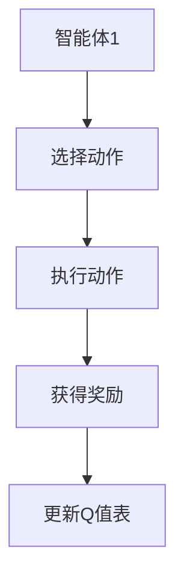

                 


# 多智能体强化学习：复杂环境下的AI Agent协作

> **关键词**：多智能体强化学习、AI Agent、协作、复杂环境、算法原理、系统设计、项目实战

> **摘要**：多智能体强化学习是一种研究多个智能体在复杂环境中协作的理论与方法，旨在通过多个智能体的协作实现更高效的决策和行动。本文从多智能体强化学习的基本概念、核心算法、系统设计、项目实战等方面进行详细分析，帮助读者全面理解这一领域的核心思想和应用技巧。

---

# 第1章: 多智能体强化学习概述

## 1.1 多智能体强化学习的背景与问题背景

### 1.1.1 从单智能体到多智能体的演进

- **单智能体强化学习**：单个智能体在环境中通过试错学习，优化自身策略以最大化累计奖励。
- **多智能体强化学习的必要性**：
  - 单一智能体的能力有限，复杂任务需要多个智能体协作完成。
  - 多智能体协作可以提高整体效率，如分布式任务处理、资源优化配置等。
- **多智能体协作的典型场景**：
  - 机器人协作：多机器人协同完成任务，如物流搬运、环境监测。
  - 自动驾驶：多辆自动驾驶车辆协同行驶，避免碰撞，提高交通效率。
  - 游戏AI：多个AI角色协同完成游戏任务，如MOBA游戏中的团队协作。

### 1.1.2 多智能体强化学习的核心问题

- **智能体之间的通信与协作**：
  - 如何实现智能体之间的信息共享和策略同步？
  - 如何设计有效的通信机制，减少信息冗余，提高协作效率？
- **任务分配与分工**：
  - 在多智能体系统中，如何动态分配任务，确保每个智能体都能发挥其优势？
  - 如何处理任务冲突和资源竞争问题？
- **全局与局部目标的平衡**：
  - 多智能体协作需要考虑全局目标的优化，同时也要照顾到每个智能体的局部利益。
  - 如何设计奖励机制，平衡全局与局部目标？

### 1.1.3 多智能体与单智能体的区别

| **特性**        | **单智能体**                          | **多智能体**                          |
|-----------------|--------------------------------------|--------------------------------------|
| 决策主体        | 单一智能体独立决策                  | 多个智能体协作决策                  |
| 信息共享        | 智能体无法与其他智能体共享信息      | 智能体之间可以共享信息，协作完成任务 |
| 竞争与协作      | 主要关注单智能体的最优策略          | 竞争与协作并存，需要平衡个体与整体利益 |
| 应用场景        | 适合简单环境中的单点决策问题        | 适合复杂环境中的多点协作问题        |

## 1.2 多智能体强化学习的定义与特点

### 1.2.1 多智能体强化学习的定义

- **定义**：多智能体强化学习（Multi-Agent Reinforcement Learning, MARL）是研究多个智能体在共享环境中协作或竞争，以实现共同目标或个体目标的强化学习框架。
- **核心特点**：
  - **分布式性**：多个智能体分布在网络中，各自独立决策。
  - **协作性**：智能体之间需要通过通信和协作完成任务。
  - **动态性**：环境和任务可能是动态变化的，智能体需要实时调整策略。

### 1.2.2 多智能体协作的核心要素

- **智能体模型**：
  - 每个智能体都有自己的状态、动作和策略。
- **协作机制**：
  - 如何通过通信、协商等方式实现协作。
- **环境模型**：
  - 环境的状态、动作空间以及奖励机制需要被建模。

## 1.3 多智能体强化学习的应用场景

### 1.3.1 机器人协作

- **物流搬运**：多台机器人协同完成货物的搬运和分拣。
- **环境监测**：多个机器人协同完成环境数据的采集和分析。

### 1.3.2 自动驾驶

- **交通管理**：多辆自动驾驶车辆协同行驶，避免碰撞，提高交通效率。
- **车队管理**：自动驾驶卡车组成车队，降低能耗，提高运输效率。

### 1.3.3 游戏AI

- **多人在线游戏**：多个AI角色协同完成任务，如MOBA游戏中的团队协作。
- **游戏训练**：通过多智能体协作，训练AI在复杂游戏中的决策能力。

## 1.4 本章小结

- 本章介绍了多智能体强化学习的背景、核心问题、定义和特点，以及其在机器人协作、自动驾驶和游戏AI中的典型应用。
- 多智能体强化学习的目标是通过多个智能体的协作，实现复杂环境下的高效决策和任务完成。

---

# 第2章: 多智能体强化学习的核心概念

## 2.1 多智能体系统模型

### 2.1.1 智能体的定义与属性

- **智能体（Agent）**：
  - 智能体是具有感知和行动能力的实体，能够在环境中独立决策。
  - 每个智能体都有自己的状态空间、动作空间和策略。

### 2.1.2 多智能体系统的组成

- **智能体层**：
  - 多个智能体协同工作，完成任务。
- **环境层**：
  - 包含智能体所处的物理或虚拟环境，环境的状态会动态变化。
- **交互层**：
  - 智能体与环境之间的交互，包括感知和行动。

### 2.1.3 智能体之间的关系

- **协作关系**：
  - 智能体之间通过协作完成共同目标。
- **竞争关系**：
  - 智能体之间可能存在竞争，如博弈场景。

## 2.2 多智能体协作机制

### 2.2.1 基于通信的协作

- **通信机制**：
  - 智能体之间通过共享信息实现协作。
  - 通信可以是同步的（如通过消息传递）或异步的（如通过共享内存）。

### 2.2.2 基于状态的协作

- **状态共享**：
  - 智能体共享彼此的状态信息，以便更好地协调行动。
  - 例如，在机器人协作中，每个机器人共享自身的状态信息，如位置、速度等。

### 2.2.3 基于任务分配的协作

- **任务分配**：
  - 根据环境的状态和任务需求，动态分配任务给不同的智能体。
  - 例如，在自动驾驶中，根据交通状况动态分配车道使用。

## 2.3 多智能体强化学习的核心原理

### 2.3.1 状态空间与动作空间

- **状态空间**：
  - 每个智能体的当前状态，包括环境提供的信息和智能体自身的状态。
- **动作空间**：
  - 每个智能体可以执行的动作，如移动、加速、减速等。

### 2.3.2 奖励机制

- **全局奖励**：
  - 奖励基于整个系统的整体表现，如完成任务的时间、效率等。
- **局部奖励**：
  - 奖励基于单个智能体的表现，如完成任务的具体动作是否正确。

### 2.3.3 协作策略

- **联合策略**：
  - 所有智能体共同制定一个协作策略，如通过协商决定行动方案。
- **独立策略**：
  - 每个智能体独立制定策略，通过通信和协作实现整体目标。

## 2.4 本章小结

- 本章详细介绍了多智能体强化学习的核心概念，包括智能体模型、协作机制和核心原理。
- 强调了智能体之间的协作与通信在多智能体系统中的重要性。

---

# 第3章: 多智能体强化学习的算法原理

## 3.1 分布式Q学习

### 3.1.1 分布式Q学习的原理

- **分布式Q学习**：
  - 每个智能体维护自己的Q值表，通过与环境和其他智能体的交互更新Q值。
  - Q值表反映了智能体在特定状态下采取某个动作所能获得的预期奖励。

### 3.1.2 分布式Q学习的优缺点

- **优点**：
  - 分布式架构，适合大规模多智能体系统。
  - 计算效率高，每个智能体独立更新Q值。
- **缺点**：
  - 协调困难，智能体之间的策略可能不一致。
  - 需要设计有效的通信机制，避免信息冗余。

### 3.1.3 分布式Q学习的实现

- **实现步骤**：
  1. 初始化每个智能体的Q值表。
  2. 每个智能体根据当前状态选择动作。
  3. 执行动作，获得奖励。
  4. 更新Q值表，基于当前奖励和未来预期奖励。

### 3.1.4 分布式Q学习的流程图



### 3.1.5 分布式Q学习的Python代码示例

```python
import random

class Agent:
    def __init__(self, state_space, action_space):
        self.state_space = state_space
        self.action_space = action_space
        self.Q = {s: {a: 0 for a in action_space} for s in state_space}
    
    def choose_action(self, state):
        # 随机选择一个动作
        return random.choice(self.action_space)
    
    def update_Q(self, state, action, reward):
        # 更新Q值表
        self.Q[state][action] = reward + max(self.Q[state][a] for a in self.action_space)

# 初始化智能体
agent = Agent(state_space, action_space)

# 执行动作
state = current_state
action = agent.choose_action(state)
next_state = execute_action(state, action)
reward = get_reward(next_state)

# 更新Q值表
agent.update_Q(state, action, reward)
```

## 3.2 价值分解方法

### 3.2.1 价值分解的原理

- **价值分解**：
  - 将整体价值分解为多个部分，每个部分由不同的智能体负责。
  - 每个智能体专注于优化自己的部分，从而实现整体价值的优化。

### 3.2.2 价值分解的实现步骤

- **步骤1**：
  - 定义整体价值函数。
- **步骤2**：
  - 将整体价值分解为多个子价值函数。
- **步骤3**：
  - 每个智能体负责优化自己的子价值函数。

### 3.2.3 价值分解的优缺点

- **优点**：
  - 分工明确，适合大规模多智能体系统。
  - 计算效率高，每个智能体独立优化子价值函数。
- **缺点**：
  - 分解复杂，需要设计有效的分解方法。
  - 子价值函数之间可能存在冲突，需要协调。

### 3.2.4 价值分解的Python代码示例

```python
def value_decomposition(global_value):
    # 分解全局价值为多个子价值函数
    sub_values = []
    for agent in agents:
        sub_values.append(agent.decompose_value(global_value))
    # 返回分解后的子价值函数
    return sub_values
```

## 3.3 联合策略方法

### 3.3.1 联合策略的原理

- **联合策略**：
  - 所有智能体共同制定一个协作策略，确保每个智能体的行动一致。
  - 通过协商和通信，实现策略的同步。

### 3.3.2 联合策略的实现步骤

- **步骤1**：
  - 智能体之间建立通信机制，共享信息。
- **步骤2**：
  - 智能体协商确定共同的协作策略。
- **步骤3**：
  - 执行协作策略，完成任务。

### 3.3.3 联合策略的优缺点

- **优点**：
  - 策略一致性高，协作性强。
  - 适用于任务明确的协作场景。
- **缺点**：
  - 通信开销大，需要高效的通信机制。
  - 协商过程可能复杂，增加计算开销。

### 3.3.4 联合策略的Python代码示例

```python
def joint_strategy(agents, environment):
    # 建立通信机制
    communication_channel = []
    for agent in agents:
        # 智能体接收环境信息
        state = environment.get_state(agent)
        # 智能体发送动作到通信通道
        action = agent.decide_action(state)
        communication_channel.append(action)
    # 执行动作
    environment.execute_actions(communication_channel)
```

## 3.4 本章小结

- 本章详细介绍了多智能体强化学习的三种核心算法：分布式Q学习、价值分解方法和联合策略方法。
- 每种算法都有其优缺点，适用于不同的应用场景。
- 强调了通信机制和策略同步在算法实现中的重要性。

---

# 第4章: 多智能体强化学习的数学模型

## 4.1 状态空间与动作空间

### 4.1.1 状态空间的定义

- **状态空间**：
  - 描述智能体所处环境的所有可能状态。
  - 状态空间可以是连续的或离散的。

### 4.1.2 动作空间的定义

- **动作空间**：
  - 描述智能体在每个状态下可以执行的所有动作。
  - 动作空间可以是连续的或离散的。

### 4.1.3 状态转移概率

- **状态转移概率**：
  - 给定当前状态和动作，智能体转移到下一个状态的概率。

## 4.2 奖励机制与价值函数

### 4.2.1 奖励机制的数学表达

- **奖励函数**：
  - $r(s, a) = \text{奖励值}$，其中$s$是当前状态，$a$是采取的动作。

### 4.2.2 价值函数的数学表达

- **价值函数**：
  - $Q(s, a) = \mathbb{E}[r(s, a) + \gamma \max_{a'} Q(s', a')]$
  - 其中$\gamma$是折扣因子。

## 4.3 策略与策略评估

### 4.3.1 策略的数学表达

- **策略**：
  - $\pi(a|s)$：在状态$s$下采取动作$a$的概率。

### 4.3.2 策略评估的数学表达

- **策略评估**：
  - 使用贝尔曼方程，计算每个状态-动作对的期望值。

## 4.4 联合策略的数学模型

### 4.4.1 联合策略的数学表达

- **联合策略**：
  - 所有智能体的策略共同作用，实现协作目标。

### 4.4.2 联合策略的优化目标

- **优化目标**：
  - 最大化整体奖励，平衡个体与全局利益。

## 4.5 本章小结

- 本章详细介绍了多智能体强化学习的数学模型，包括状态空间、动作空间、奖励机制和价值函数。
- 通过数学公式，明确了策略的评估与优化过程。

---

# 第5章: 多智能体强化学习的系统分析与架构设计

## 5.1 问题场景介绍

### 5.1.1 多智能体系统场景

- **场景描述**：
  - 例如，多个智能体协作完成物流搬运任务。
- **系统目标**：
  - 高效完成任务，最小化时间成本和资源消耗。

### 5.1.2 系统需求

- **需求分析**：
  - 动态任务分配。
  - 实时通信与协作。
  - 高效的决策与行动。

## 5.2 系统功能设计

### 5.2.1 领域模型设计

- **领域模型**：
  - 使用mermaid类图描述系统的领域模型。
  - 类图展示了智能体、环境和任务之间的关系。

### 5.2.2 系统架构设计

- **系统架构**：
  - 使用mermaid架构图展示系统的整体架构。
  - 包括智能体层、环境层和交互层。

## 5.3 系统接口设计

### 5.3.1 智能体接口

- **智能体接口**：
  - 提供感知和行动的接口。
  - 例如，获取环境状态、执行动作等。

### 5.3.2 通信接口

- **通信接口**：
  - 智能体之间通过通信接口共享信息。
  - 支持同步或异步通信。

## 5.4 系统交互流程

### 5.4.1 交互流程图

- **交互流程**：
  - 使用mermaid序列图展示系统的交互流程。
  - 描述智能体与环境之间的交互过程。

## 5.5 本章小结

- 本章详细介绍了多智能体系统的分析与架构设计。
- 包括问题场景、系统功能设计、系统架构设计和交互流程设计。

---

# 第6章: 多智能体强化学习的项目实战

## 6.1 环境搭建

### 6.1.1 环境安装

- **环境需求**：
  - 安装Python、相关库（如numpy、gym、tensorflow）。
- **环境配置**：
  - 配置多智能体协作的模拟环境。

### 6.1.2 环境配置

- **配置步骤**：
  1. 安装必要的库。
  2. 配置多智能体协作的模拟环境。
  3. 启动环境并测试基本功能。

## 6.2 系统核心实现

### 6.2.1 智能体实现

- **智能体代码**：
  - 实现分布式Q学习、价值分解或联合策略方法。

### 6.2.2 通信机制实现

- **通信机制代码**：
  - 实现智能体之间的通信，共享信息和策略。

## 6.3 代码应用解读与分析

### 6.3.1 分布式Q学习实现

- **代码解读**：
  - 初始化智能体的Q值表。
  - 智能体选择动作并执行。
  - 更新Q值表，基于当前奖励和未来预期奖励。

### 6.3.2 价值分解实现

- **代码解读**：
  - 分解全局价值为多个子价值函数。
  - 每个智能体优化自己的子价值函数。
  - 组合子价值函数，得到整体价值。

## 6.4 案例分析

### 6.4.1 多智能体协作案例

- **案例描述**：
  - 例如，多个智能体协作完成物流搬运任务。
- **案例分析**：
  - 通过代码实现，展示多智能体协作的过程。
  - 分析协作效果，优化算法参数。

## 6.5 本章小结

- 本章通过实际案例，展示了多智能体强化学习的项目实战。
- 包括环境搭建、系统实现、代码解读和案例分析。

---

# 第7章: 多智能体强化学习的高级主题

## 7.1 联邦学习与边缘计算

### 7.1.1 联邦学习的原理

- **联邦学习**：
  - 多个智能体在不共享数据的情况下，协同训练模型。
  - 适用于数据隐私保护的需求。

### 7.1.2 边缘计算的原理

- **边缘计算**：
  - 智能体在边缘设备上进行计算，减少中心服务器的负担。
  - 适用于实时性和响应速度要求高的场景。

## 7.2 多智能体强化学习的挑战

### 7.2.1 通信开销

- **通信开销**：
  - 智能体之间通信的数据量大，增加计算开销。
  - 如何减少通信开销，提高协作效率。

### 7.2.2 竞争与协作平衡

- **竞争与协作**：
  - 多智能体系统中，如何平衡竞争与协作，实现最优任务分配。
  - 需要设计有效的奖励机制和任务分配策略。

## 7.3 未来研究方向

### 7.3.1 新型算法研究

- **新型算法**：
  - 研究更高效的多智能体强化学习算法，如基于图神经网络的协作方法。

### 7.3.2 应用场景拓展

- **应用场景**：
  - 探索多智能体强化学习在更多领域的应用，如智能交通、智能医疗等。

## 7.4 本章小结

- 本章探讨了多智能体强化学习的高级主题，包括联邦学习、边缘计算和未来研究方向。
- 强调了多智能体强化学习在实际应用中的挑战和未来发展的潜力。

---

# 第8章: 多智能体强化学习的最佳实践与小结

## 8.1 最佳实践 tips

### 8.1.1 通信机制设计

- **通信机制**：
  - 设计高效的通信机制，减少信息冗余，提高协作效率。
  - 例如，使用压缩技术或选择性通信策略。

### 8.1.2 算法优化技巧

- **算法优化**：
  - 通过参数调节、算法改进等方式，提高多智能体协作的效率和效果。

## 8.2 项目小结

### 8.2.1 全书内容回顾

- 从基础概念到高级算法，全面覆盖多智能体强化学习的核心内容。

### 8.2.2 重点知识总结

- 多智能体强化学习的核心思想是通过多个智能体的协作，实现复杂环境下的高效决策和任务完成。

## 8.3 注意事项

### 8.3.1 通信开销

- 注意智能体之间的通信开销，避免影响协作效率。
- 优化通信机制，减少数据传输量。

### 8.3.2 竞争与协作平衡

- 注意平衡智能体之间的竞争与协作，确保任务分配的合理性。
- 设计有效的奖励机制和任务分配策略。

## 8.4 未来学习方向

### 8.4.1 高级算法

- 深入研究基于图神经网络的多智能体强化学习算法。
- 探索更高效的协作机制和通信方式。

### 8.4.2 实际应用

- 关注多智能体强化学习在更多领域的应用，如智能交通、智能医疗等。

## 8.5 本章小结

- 本章总结了多智能体强化学习的最佳实践和学习小结。
- 强调了通信机制设计和算法优化的重要性，为读者提供了未来学习的方向。

---

# 参考文献

（此处列出相关文献和参考资料）

---

通过以上章节的详细分析和讲解，读者可以全面理解多智能体强化学习的核心思想和实际应用。从基础概念到高级算法，从系统设计到项目实战，再到未来研究方向，全书内容涵盖了多智能体强化学习的各个方面，帮助读者从理论到实践，逐步掌握这一领域的知识和技能。

